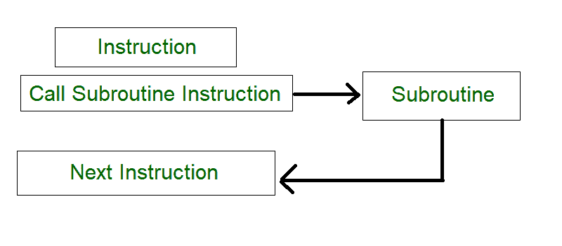
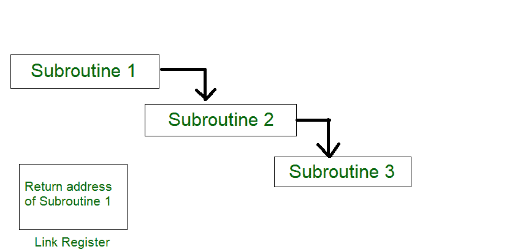
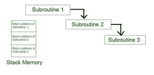
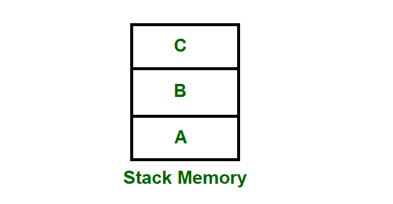

# 子程序、子程序嵌套和堆栈内存

> 原文:[https://www . geesforgeks . org/subroutine-subroutine-nesting-and-stack-memory/](https://www.geeksforgeeks.org/subroutine-subroutine-nesting-and-stack-memory/)

**1。子程序–**
在程序中重复使用的一组指令可以称为子程序。该指令只有一个副本存储在内存中。当需要子程序时，它可以在特定程序的执行过程中被多次调用。一条*调用子程序指令*调用子程序。返回子程序时要小心，因为子程序可以从内存以外的地方调用。

电脑的内容必须由调用子程序指令保存，才能正确返回调用程序。

**图–**程序中子程序的过程

子程序链接方法是计算机调用和返回子程序的一种方式。子程序链接最简单的方法是将返回地址保存在一个特定的位置，比如寄存器，它可以被称为链接寄存器调用子程序。

**2。子程序嵌套–**
子程序嵌套是一种常见的编程实践，其中一个子程序调用另一个子程序。

**图–**子程序调用另一个子程序

从上图中，假设当子程序 1 调用子程序 2 时，子程序 2 的返回地址应该保存在某个地方。因此，如果链接寄存器存储子程序 1 的返回地址，这将被子程序 2 的返回地址所破坏/覆盖。因为最后调用的子程序是第一个返回的子程序(后进先出格式)。所以栈数据结构是存储子程序返回地址最有效的方法。

**图–**子程序的返回地址存储在堆栈存储器中

**3。堆栈内存–**
堆栈是一种基本的数据结构，可以在内存中的任何地方实现。它可以用来存储程序执行过程中可能需要的变量。在堆栈中，第一个放入的数据将是最后一个从堆栈中取出的数据。因此，最后添加的数据将是堆栈中第一个出来的数据(后进先出)。

**图–**具有数据 A、B & C 的堆栈内存

因此，从上图中，首先添加 A，然后添加 B & C。当移除第一个 C 时，移除 B & A