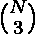

# 数组中大小为 3 的子序列，其和可被 m 整除

> 原文:[https://www . geeksforgeeks . org/subsers-size-three-array-what-sum-除尽-m/](https://www.geeksforgeeks.org/subsequences-size-three-array-whose-sum-divisible-m/)

给定一个大小为 N (1 < =N < =10 )的数组 A[] (1 <=A < =10 )，求其和可被 M 整除的长度为 3 的子序列个数(1 < =M < =10 )。

**示例:**

```
Input  : A[] = {1, 2, 4, 3}
           M = 3 
Output : 2
Explanation : We can choose two such 
subsequence of length 3 such that its 
sum is divisible by 3 -> {1, 2, 3} ans 
{2, 4, 3} 
```

**蛮力方法:**我们使用 3 个嵌套循环遍历所有长度为 3 的子序列，以计数所有满足给定条件的子序列。
这里蛮力解将在 O(N  )
中起作用

## C++

```
// Brute Force Implementation (Time Complexity :
// O(N^3)) C++ program to find count of subsequences of size
// three divisible by M.
#include <bits/stdc++.h>

using namespace std;

int coutSubSeq(int A[], int N, int M)
{
    int sum = 0;
    int ans = 0;

    // Three nested loop to find all the sub
    // sequences of length three in the given
    // array A[].
    for (int i = 0; i < N; i++) {
        for (int j = i + 1; j < N; j++) {
            for (int k = j + 1; k < N; k++) {
                sum = A[i] + A[j] + A[k];

                // checking if the sum of the chosen
                // three number is divisible by m.
                if (sum % M == 0)
                    ans++;
            }
        }
    }
    return ans;
}

// Driver code
int main()
{
    int M = 3;
    int A[] = { 1, 2, 4, 3 };
    int N = sizeof(A)/sizeof(A[0]);
    cout << coutSubSeq(A, N, M);
    return 0;
}
```

## Java 语言(一种计算机语言，尤用于创建网站)

```
// Java program to find count of
// subsequences of size three
// divisible by M.
import java.io.*;

class GFG {

    static int coutSubSeq(int A[], int N,
                                   int M)
    {
        int sum = 0;
        int ans = 0;

        // Three nested loop to find all the
        // sub sequences of length three in
        // the given array A[].
        for (int i = 0; i < N; i++) {
            for (int j = i + 1; j < N; j++) {
                for (int k = j + 1; k < N; k++) {
                    sum = A[i] + A[j] + A[k];

                    // checking if the sum of the
                    // chosen three number is
                    // divisible by m.
                    if (sum % M == 0)
                        ans++;
                }
            }
        }
        return ans;
    }

    // Driver code
    public static void main(String args[])
    {
        int M = 3;
        int A[] = { 1, 2, 4, 3 };
        int N = A.length;
        System.out.println(coutSubSeq(A, N, M));
    }
}

/*This code is contributed by Nikita Tiwari*/
```

## 计算机编程语言

```
# Python program to find count of
# subsequences of size three
# divisible by M.

def coutSubSeq(A, N,M) :
    sum = 0
    ans = 0

    # Three nested loop to find all the
    # sub sequences of length three in
    # the given array A[].
    for i in range(0, N) :
        for j in range(i + 1, N) :
            for k in range(j + 1, N) :
                sum = A[i] + A[j] + A[k]

                # checking if the sum of
                # the chosen three number
                # is divisible by m.
                if (sum % M == 0) :
                    ans = ans + 1
    return ans

# Driver code
M = 3
A = [ 1, 2, 4, 3 ]
N = len(A)
print coutSubSeq(A, N, M)

# This code is contributed by Nikita Tiwari.
```

## C#

```
// C# program to find count of subsequences
// of size three divisible by M.
using System;

class GFG {

    static int coutSubSeq(int[] A, int N, int M)
    {
        int sum = 0;
        int ans = 0;

        // Three nested loop to find all the
        // sub sequences of length three in
        // the given array A[].
        for (int i = 0; i < N; i++) {
            for (int j = i + 1; j < N; j++) {
                for (int k = j + 1; k < N; k++)
                {
                    sum = A[i] + A[j] + A[k];

                    // checking if the sum of
                    // the chosen three number
                    // is divisible by m.
                    if (sum % M == 0)
                        ans++;
                }
            }
        }
        return ans;
    }

    // Driver code
    public static void Main()
    {
        int M = 3;
        int []A = { 1, 2, 4, 3 };
        int N = A.Length;
        Console.WriteLine(coutSubSeq(A, N, M));
    }
}

// This code is contributed by anuj_67.
```

## 服务器端编程语言（Professional Hypertext Preprocessor 的缩写）

```
<?php
// Brute Force Implementation (Time Complexity :
// O(N^3)) PHP program to find count of subsequences of size
// three divisible by M.

function coutSubSeq($A, $N, $M)
{
    $sum = 0;
    $ans = 0;

    // Three nested loop to find all the sub
    // sequences of length three in the given
    // array A[].
    for ( $i = 0; $i <$N; $i++) {
        for ( $j = $i + 1; $j < $N; $j++) {
            for ( $k = $j + 1; $k < $N; $k++) {
                $sum = $A[$i] + $A[$j] + $A[$k];

                // checking if the sum of the
                // chosen three number is
                // divisible by m.
                if ($sum % $M == 0)
                    $ans++;
            }
        }
    }

    return $ans;
}

// Driver code
    $M = 3;
    $A = array( 1, 2, 4, 3 );
    $N = count($A);
    echo coutSubSeq($A, $N, $M);

// This code is contributed by anuj_67.
?>
```

## java 描述语言

```
<script>

// Javascript program to find count of
// subsequences of size three
// divisible by M.

    function coutSubSeq(A, N, M)
    {
        let sum = 0;
        let ans = 0;

        // Three nested loop to find all the
        // sub sequences of length three in
        // the given array A[].
        for (let i = 0; i < N; i++) {
            for (let j = i + 1; j < N; j++) {
                for (let k = j + 1; k < N; k++) {
                    sum = A[i] + A[j] + A[k];

                    // checking if the sum of the
                    // chosen three number is
                    // divisible by m.
                    if (sum % M == 0)
                        ans++;
                }
            }
        }
        return ans;
    }

// Driver code

        let M = 3;
        let A = [ 1, 2, 4, 3 ];
        let N = A.length;
        document.write(coutSubSeq(A, N, M));

</script>
```

输出:

```
2
```

**第二种方法(对小 M 有效):**上面的实现需要很多时间。所以我们需要一个更好的方法来解决这个问题。这里我们将使用索引映射(散列技术)来解决这个问题。由于我们需要检查所选的三个数字的和是否能被 M 整除，所以我们将每个值存储在模 M 下。我们使用频率数组来存储使用索引映射技术的每个元素的出现次数。
可能出现三种情况:
首先，如果一个数的三次可以被 M 整除，那么我们将加上来回答，其中 N 是该数的频率。
其次，如果某个数 A 加和数 B 的两倍可以被 M 整除，那么我们将在答案中加上![{{Freq[A]}\choose{2}}    ](img/652abd742b8353f2df0272b6656aca84.png "Rendered by QuickLaTeX.com")* Freq【B】。
第三，如果所有的数 A，B，C 加起来就是 S，S 可以被 M 整除，那么我们将把 Freq[A] * Freq[B] * Freq[C]加到答案上。
通过这种方法，我们可以解决在给定时间内可执行的 O(M )中的问题。

## C++

```
// O(M^2) time complexity C++ program to find
// count of subsequences of size three
// divisible by M.
#include <iostream>

using namespace std;

int countSubSeq(int A[], int N, int M)
{
    int ans = 0;

    // Storing frequencies of all remainders
    // when divided by M.
    int h[M] = { 0 };
    for (int i = 0; i < N; i++) {
        A[i] = A[i] % M;
        h[A[i]]++;
    }

    for (int i = 0; i < M; i++) {
        for (int j = i; j < M; j++) {

            // including i and j in the sum rem
            // calculate the remainder required
            // to make the sum divisible by M
            int rem = (M - (i + j) % M) % M;

            // if the required number is less than
            // j, we skip as we have already calculated
            // for that value before. As j here starts
            // with i and rem is less than j.
            if (rem < j)
                continue;

            // if satisfies the first case.
            if (i == j && rem == j)
                ans += h[i] * (h[i] - 1) * (h[i] - 2) / 6;

            // if satisfies the second case
            else if (i == j)
                ans += h[i] * (h[i] - 1) * h[rem] / 2;

            else if (i == rem)
                ans += h[i] * (h[i] - 1) * h[j] / 2;
            else if (rem == j)
                ans += h[j] * (h[j] - 1) * h[i] / 2;

            // if satisfies the third case
            else
                ans = ans + h[i] * h[j] * h[rem];
        }
    }
    return ans;
}

// Driver code
int main()
{  
    int M = 3;
    int A[] = { 1, 2, 4, 3 };
    int N = sizeof(A)/sizeof(A[0]);
    cout << countSubSeq(A, N, M);
    return 0;
}
```

## Java 语言(一种计算机语言，尤用于创建网站)

```
// Java program to find count of
// subsequences of size three
// divisible by M.
import java.io.*;
import java.util.Arrays;

class GFG {

    static int countSubSeq(int A[], int N, int M)
    {
        int ans = 0;

        // Storing frequencies of all
        // remainders when divided by M.
        int h[] = new int[M];
        Arrays.fill(h,0);
        for (int i = 0; i < N; i++) {
            A[i] = A[i] % M;
            h[A[i]]++;
        }

        for (int i = 0; i < M; i++) {
            for (int j = i; j < M; j++) {

                // including i and j in the sum
                // rem calculate the remainder
                // required to make the sum
                // divisible by M
                int rem = (M - (i + j) % M) % M;

                // if the required number is
                // less than j, we skip as we
                // have already calculated for
                // that value before. As j here
                // starts with i and rem is
                // less than j.
                if (rem < j)
                    continue;

                // if satisfies the first case.
                if (i == j && rem == j)
                    ans += h[i] * (h[i] - 1) *
                           (h[i] - 2) / 6;

                // if satisfies the second case
                else if (i == j)
                    ans += h[i] * (h[i] - 1) *
                           h[rem] / 2;

                else if (i == rem)
                    ans += h[i] * (h[i] - 1) *
                           h[j] / 2;
                else if (rem == j)
                    ans += h[j] * (h[j] - 1) *
                           h[i] / 2;

                // if satisfies the third case
                else
                    ans = ans + h[i] * h[j] *
                          h[rem];
            }
        }
        return ans;
    }

    // Driver code
    public static void main(String args[])
    {
        int M = 3;
        int A[] = { 1, 2, 4, 3 };
        int N = A.length;
        System.out.println(countSubSeq(A, N, M));
    }
}

/*This code is contributed by Nikita Tiwari*/
```

## 计算机编程语言

```
# Python program to find count of
# subsequences of size three
# divisible by M.

def countSubSeq(A, N, M) :
    ans = 0

    # Storing frequencies of all
    # remainders when divided by M.
    h = [0] * M
    for i in range(0,N) :
        A[i] = A[i] % M
        h[A[i]] = h[A[i]] + 1

    for i in range(0,M) :
        for j in range(i,M) :

            # including i and j in the sum
            # rem calculate the remainder
            # required to make the sum
            # divisible by M
            rem = (M - (i + j) % M) % M

            # if the required number is
            # less than j, we skip as we
            # have already calculated for
            # that value before. As j here
            # starts with i and rem is
            # less than j.
            if (rem < j) :
                continue

            # if satisfies the first case.
            if (i == j and rem == j) :
                ans = ans + h[i] * (h[i] - 1) * (h[i] - 2) / 6

            # if satisfies the second case
            elif (i == j) :
                ans = ans +( h[i] * (h[i] - 1) * h[rem] / 2)

            elif (i == rem) :
                ans = ans + h[i] * (h[i] - 1) * h[j] / 2
            elif (rem == j) :
                ans = ans + h[j] * (h[j] - 1) * h[i] / 2

            # if satisfies the third case
            else :
                ans = ans + h[i] * h[j] * h[rem]

        return ans

# Driver code
M = 3;
A = [ 1, 2, 4, 3 ]
N = len(A)
print(countSubSeq(A, N, M))

# This code is contributed by Nikita Tiwari.
```

## C#

```
// C# program to find count of subsequences of
// size three divisible by M.
using System;

class GFG {

    static int countSubSeq(int []A, int N, int M)
    {
        int ans = 0;

        // Storing frequencies of all
        // remainders when divided by M.
        int []h = new int[M];

        for (int i = 0; i < N; i++) {
            A[i] = A[i] % M;
            h[A[i]]++;
        }

        for (int i = 0; i < M; i++) {
            for (int j = i; j < M; j++) {

                // including i and j in the sum
                // rem calculate the remainder
                // required to make the sum
                // divisible by M
                int rem = (M - (i + j) % M) % M;

                // if the required number is
                // less than j, we skip as we
                // have already calculated for
                // that value before. As j here
                // starts with i and rem is
                // less than j.
                if (rem < j)
                    continue;

                // if satisfies the first case.
                if (i == j && rem == j)
                    ans += h[i] * (h[i] - 1) *
                                (h[i] - 2) / 6;

                // if satisfies the second case
                else if (i == j)
                    ans += h[i] * (h[i] - 1) *
                                    h[rem] / 2;

                else if (i == rem)
                    ans += h[i] * (h[i] - 1) *
                                     h[j] / 2;
                else if (rem == j)
                    ans += h[j] * (h[j] - 1) *
                                     h[i] / 2;

                // if satisfies the third case
                else
                    ans = ans + h[i] * h[j] *
                                      h[rem];
            }
        }
        return ans;
    }

    // Driver code
    public static void Main()
    {
        int M = 3;
        int []A = { 1, 2, 4, 3 };
        int N = A.Length;
        Console.WriteLine(countSubSeq(A, N, M));
    }
}

// This code is contributed by anuj_67.
```

## 服务器端编程语言（Professional Hypertext Preprocessor 的缩写）

```
<?php
// O(M^2) time complexity PHP program to find
// count of subsequences of size three
// divisible by M.

function countSubSeq($A, $N, $M)
{
    $ans = 0;

    // Storing frequencies of all remainders
    // when divided by M.
    $h = array_fill(0, $M, 0);
    for ($i = 0; $i < $N; $i++)
    {
        $A[$i] = $A[$i] % $M;
        $h[$A[$i]]++;
    }

    for ($i = 0; $i < $M; $i++)
    {
        for ($j = $i; $j < $M; $j++)
        {

            // including i and j in the sum rem
            // calculate the remainder required
            // to make the sum divisible by M
            $rem = ($M - ($i + $j) % $M) % $M;

            // if the required number is less than
            // j, we skip as we have already calculated
            // for that value before. As j here starts
            // with i and rem is less than j.
            if ($rem < $j)
                continue;

            // if satisfies the first case.
            if ($i == $j && $rem == $j)
                $ans += $h[$i] * ($h[$i] - 1) *
                                 ($h[$i] - 2) / 6;

            // if satisfies the second case
            else if ($i == $j)
                $ans += $h[$i] * ($h[$i] - 1) *
                                  $h[$rem] / 2;

            else if ($i == $rem)
                $ans += $h[$i] * ($h[$i] - 1) *
                                  $h[$j] / 2;
            else if ($rem == $j)
                $ans += $h[$j] * ($h[$j] - 1) *
                                  $h[$i] / 2;

            // if satisfies the third case
            else
                $ans = $ans + $h[$i] *
                              $h[$j] * $h[$rem];
        }
    }
    return $ans;
}

// Driver code
$M = 3;
$A = array( 1, 2, 4, 3 );
$N = count($A);
echo countSubSeq($A, $N, $M);

// This code is contributed by mits
?>
```

## java 描述语言

```
<script>

// javascript program to find count of
// subsequences of size three
// divisible by M.

   function countSubSeq(A , N , M)
    {
        var ans = 0;

        // Storing frequencies of all
    // remainders when divided by M.
    var h = Array.from({length: M}, (_, i) => 0);
    for (var i = 0; i < N; i++) {
        A[i] = A[i] % M;
        h[A[i]]++;
    }

    for (var i = 0; i < M; i++) {
        for (var j = i; j < M; j++) {

            // including i and j in the sum
            // rem calculate the remainder
            // required to make the sum
            // divisible by M
            var rem = (M - (i + j) % M) % M;

            // if the required number is
            // less than j, we skip as we
            // have already calculated for
            // that value before. As j here
            // starts with i and rem is
            // less than j.
            if (rem < j)
                continue;

            // if satisfies the first case.
            if (i == j && rem == j)
                ans += h[i] * (h[i] - 1) *
                       (h[i] - 2) / 6;

            // if satisfies the second case
            else if (i == j)
                ans += h[i] * (h[i] - 1) *
                       h[rem] / 2;

            else if (i == rem)
                ans += h[i] * (h[i] - 1) *
                       h[j] / 2;
            else if (rem == j)
                ans += h[j] * (h[j] - 1) *
                       h[i] / 2;

            // if satisfies the third case
            else
                ans = ans + h[i] * h[j] *
                      h[rem];
        }
    }
    return ans;
}

// Driver code
   var M = 3;
   var A = [ 1, 2, 4, 3 ];
   var N = A.length;
   document.write(countSubSeq(A, N, M));

// This code contributed by Princi Singh
</script>
```

**输出:**

```
2
```