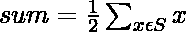

# 子集等式为 NP 完全

> 原文:[https://www . geesforgeks . org/subset-equality-is-NP-complete/](https://www.geeksforgeeks.org/subset-equality-is-np-complete/)

**<u>子集相等问题</u> :** 给定一组非负整数值 **S** ，问题是识别该组 **S** 是否划分为两组 **X** 和 **Y** ，使得 **X** 中的整数和等于 **Y** 中的整数和。

**<u>解释</u> :**
问题的一个实例是指定给问题的输入。**子集相等问题**的一个例子是集合 **S** 。由于 [NP-Complete 问题](https://www.geeksforgeeks.org/np-completeness-set-1/)是同时存在于 **NP** 和 **NP-hard** 中的问题，因此问题是 NP-Complete 的证明由两部分组成:

> 1.  The problem itself lies in **NP class** .
> 2.  All other problems in NP class can be reduced to that by polynomial time. (b can be reduced to c by polynomial time and expressed as b ≤ p c )

如果**第二个条件**仅被满足，那么问题被称为 **NP-Hard** 。

但是不可能把每一个 NP 问题都化为另一个 NP 问题来一直展示它的 NP 完全性。因此，要证明一个问题是 NP-Complete，那么证明这个问题是在 **NP** 中，任何 **NP-Complete 问题**都可以简化为这个问题，即如果 B 是 NP-Complete，B ≤ P C 那么对于 NP 中的 C，那么 C 就是 NP-Complete。因此，使用以下两个命题可以得出**子集等式问题**是 NP-完全的结论:

1.  **子集相等在 NP** 中
2.  **子集相等为 NP-Hard**

这两个命题可以证明为**子集等式问题**是**子集和问题**的特例，其中 **S** 中的子集 **X** 和 **Y** 的每个划分之和可以设置为:

由于子集和是 **NP-Complete** ，子集等式问题也变成了 **NP-Complete** 。