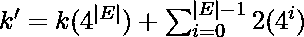
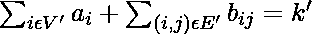
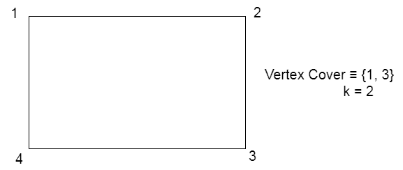
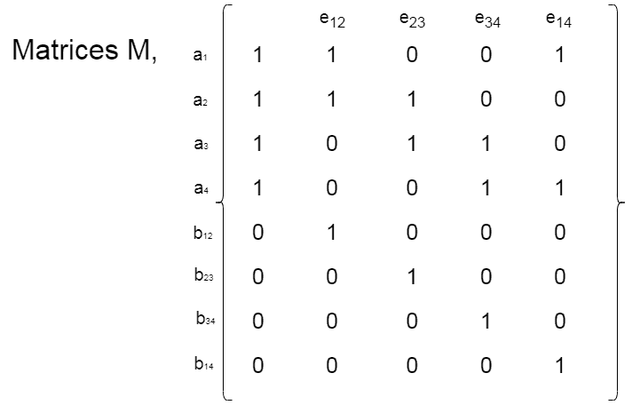
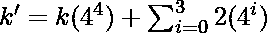
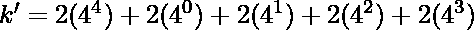
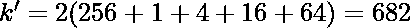

# 子集和为 NP 完全

> 原文:[https://www.geeksforgeeks.org/subset-sum-is-np-complete/](https://www.geeksforgeeks.org/subset-sum-is-np-complete/)

**先决条件:**[NP-完全性](https://www.geeksforgeeks.org/np-completeness-set-1/)[子集和问题](https://www.geeksforgeeks.org/subset-sum-problem-dp-25/)

**<u>子集和问题:</u>** 给定 **N** 非负整数 **a 1 …a N** 和目标和 **K** ，任务是决定是否存在和等于 **K** 的子集。

**<u>解释:</u>** 问题的一个实例是指定给问题的输入。子集和问题的一个例子是集合 **S = {a 1 ，…，a N }** 和整数 **K** 。由于 [NP-complete](https://www.geeksforgeeks.org/np-completeness-set-1/) 问题是同时存在于 **NP** 和 **NP-hard** 中的问题，因此问题是 NP-complete 这一说法的证明由两部分组成:

> 1.  The problem itself lies in NP class.
> 2.  All other problems in NP class can be reduced to that by polynomial time. (b can be reduced to c by polynomial time and expressed as b ≤ p c )

如果**第二个条件**仅被满足，那么问题被称为 **NP-Hard** 。

但是不可能把每一个 NP 问题都化为另一个 NP 问题来一直展示它的 NP 完全性。这就是为什么如果我们想证明一个问题是 NP-Complete，我们只需要证明这个问题是 NP 中的问题，并且任何 NP-Complete 问题都可以简化为 NP，那么我们就完成了，即如果 B 是 NP-Complete，并且 B≤P C 代表 NP 中的 C，那么 C 就是 NP-Complete。因此，我们可以使用以下两个命题来验证**子集和问题**是 NP 完全的:

**<u>Subset Sum 在 NP 中:</u>**
如果有问题在 NP 中，那么给一个证书，这是问题的一个解决方案和问题的一个实例(整数**的一个集合**S**a1…一个 N** 和一个整数 **K** )我们将能够在多项式时间内识别(解决方案是否正确)证书。这可以通过检查子集**S’**中的整数之和是否等于 **K** 来实现。

**<u>子集和是 NP-Hard:</u>**
为了证明子集和是 NP-Hard，从一个已知的 NP-Hard 问题到这个问题进行约简。
进行约简，由此 [**顶点覆盖问题**](https://www.geeksforgeeks.org/proof-that-vertex-cover-is-np-complete/) 可以约简为**子集和问题**。让我们假设一个图 G(V，E)，其中 V = {1，2，…，N}。现在，对于每个顶点 I， **a i =i** 。对于每个边(I，j)，我们定义了一个名为 **b ij** 的组件。
我们将以矩阵格式表示整数，其中每一行都用对应整数值|E|+1 位数的 4 进制表示来表示。
矩阵具有以下特性:

1.  第一列包含整数值 1 表示**aIT3，0 表示**bijT7。****
2.  从矩阵右侧开始的每个 E 列代表每个边的一个数字。**aIT3、**ajT7、**bijT11】的列(I，j)=1，否则等于 0。******
3.  我们定义一个常数 k '这样，

    > 

现在，以下主张成立:

*   Let us consider a subset of vertices and edges to (V’, E’) respectively, such that

    > 

    **bijT3 每列最多只能包含 1 个。此外，k '参数在不到|E|的所有低有效数字中都有一个 2。这些数字我们永远不能随身携带。现在，每列中这些数字加起来最多是三个 1。这意味着对于每条边(I，j)，V '必须包含 I 或 j。因此，V '成为顶点覆盖。**

*   假设有一个大小为 k 的顶点覆盖，我们将选择整数**aIT3，这样我位于 V '中，而所有的**bijT7】这样 I 或 j 都位于 V '中。在以基数 4 表示的所有这些整数的和(我们从矩阵中选择的)上，我们得到整数的和= k’。因此，选择的整数构成了和= k '的整数子集。因此，子集和成立。****

让我们考虑下面的例子，
给定的是一个顶点覆盖 V = {1，3}和 k = 2

现在，一个 1 = 1，一个 2 = 2，一个 3 = 3，一个 4 = 4

矩阵可以通过以下方式构建:

> => 
> 
> => 
> 
> => 

现在，为了证明 k 的值‘让我们选择**aIT3，这样我就躺在 V’中，我们选择 a 1 和 a 3 和 **b ij** 这样我或者 j 躺在 V’中，也就是说我们选择 **b ij** 这样我或者 j 躺在 V’中，也就是说我们选择 b 12 【T17 在 base 4 表示中，我们有以下值:**

a 1 = 321，a 3 = 276，b 12 = 64，b 23 = 16，b 14 = 1，b 34 = 4

这些值是使用矩阵计算的。对这些值求和，我们得到，

k' = 321 + 276 + 64 + 16 + 1 + 4 = 682。

因此，可以计算和验证 k '值。

因此 **子集和问题** 是 NP 完全的。