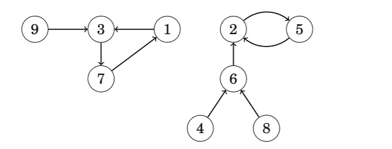
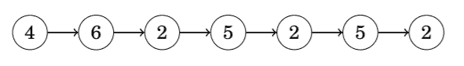
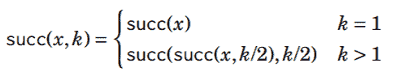
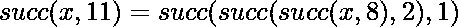
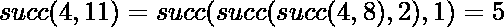

# 后续图形

> 原文:[https://www.geeksforgeeks.org/successor-graph/](https://www.geeksforgeeks.org/successor-graph/)

一个**后继[图](https://www.geeksforgeeks.org/graph-data-structure-and-algorithms/)** 是一个**有向图**，其中每个顶点都有一个外倾角，即每个节点恰好有一条边开始。后继图由一个或多个组成部分组成，每个组成部分包含一个循环和一些通向循环的路径。

**后继图**有时被称为**函数图**。原因是任何**后续图形**对应于定义图形边缘的函数。函数的参数是图的一个节点，函数给出该节点的后继节点。例如功能

<figure class="table">

| *x* | one | Two | three | four | five | six | seven | eight | nine |
| --- | --- | --- | --- | --- | --- | --- | --- | --- | --- |
| succ( *x* | three | five | seven | six | Two | Two | one | six | three |

上述函数定义了下图:

由于后继图的每个节点都有一个唯一的后继，因此还可以定义一个函数 **succ(x，k)** ，当遍历从**节点 x** 开始并向前行走 **k 步**时，给出该节点。例如，在上图中**成功(4，6) = 2** ，因为从**节点 4** 步行 **6 步**即可到达节点 2:

计算**成功(** ***x，k*** **)** 值的简单方法是从节点 ***x*** 开始，向前走 ***k*** 步，这需要 *O(k)* 时间。但是，使用预处理， **succ(** ***x，k*** **)** 的任何值只能在 *O(logk)* 时间内计算。

这个想法是预先计算**such(*****x，k*** **)** 其中 ***k*** 是 2 的幂，最多 ***u*** ，其中 ***u*** 是我们曾经走过的最大步数。这可以有效地完成，因为我们可以使用以下递归:

预先计算这些值需要 *O(n*log u)* 时间，因为 *O(log u)* 值是为每个节点计算的。在上图中，第一个值如下:

<figure class="table">

| *x* | one | Two | three | four | five | six | seven | eight | nine |
| --- | --- | --- | --- | --- | --- | --- | --- | --- | --- |
| succ( *x* ，1) | three | five | seven | six | Two | Two | one | six | three |
| succ( *x* ，2) | seven | Two | one | Two | five | five | three | Two | seven |
| succ( *x* ，4) | three | Two | seven | Two | five | five | one | Two | three |
| succ( *x* ，8) | seven | Two | one | Two | five | five | three | Two | seven |
| … |   |   |   |   |   |   |   |   |   |

此后， **succ(** ***x，k*** **)** 的任何值都可以通过将步数 ***k*** 表示为二的幂之和来计算。
例如，如果我们要计算 ***succ(x，11)*** 的值，我们首先形成表示 11 = 8 + 2 + 1。用那个

例如，在上图中

这样的表示总是由 *O(log k)* 部分组成，因此计算 **succ(** ***x，k*** **)的值需要 *O(log k)* 时间。**

</figure>

</figure>