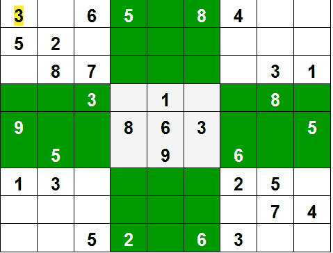

# 数独|回溯-7

> 原文:[https://www.geeksforgeeks.org/sudoku-backtracking-7/](https://www.geeksforgeeks.org/sudoku-backtracking-7/)

给定部分填充的 9×9 2D 阵列“网格[9][9]”，目标是将数字(从 1 到 9)分配给空单元格，以便大小为 3×3 的每一行、每一列和每一子网格都恰好包含 1 到 9 的数字的一个实例。



**示例:**

```
Input:
grid = { {3, 0, 6, 5, 0, 8, 4, 0, 0}, 
         {5, 2, 0, 0, 0, 0, 0, 0, 0}, 
         {0, 8, 7, 0, 0, 0, 0, 3, 1}, 
         {0, 0, 3, 0, 1, 0, 0, 8, 0}, 
         {9, 0, 0, 8, 6, 3, 0, 0, 5}, 
         {0, 5, 0, 0, 9, 0, 6, 0, 0}, 
         {1, 3, 0, 0, 0, 0, 2, 5, 0}, 
         {0, 0, 0, 0, 0, 0, 0, 7, 4}, 
         {0, 0, 5, 2, 0, 6, 3, 0, 0} }
Output:
          3 1 6 5 7 8 4 9 2
          5 2 9 1 3 4 7 6 8
          4 8 7 6 2 9 5 3 1
          2 6 3 4 1 5 9 8 7
          9 7 4 8 6 3 1 2 5
          8 5 1 7 9 2 6 4 3
          1 3 8 9 4 7 2 5 6
          6 9 2 3 5 1 8 7 4
          7 4 5 2 8 6 3 1 9
Explanation: Each row, column and 3*3 box of 
the output matrix contains unique numbers.

Input:    
grid = { { 3, 1, 6, 5, 7, 8, 4, 9, 2 },
         { 5, 2, 9, 1, 3, 4, 7, 6, 8 },
         { 4, 8, 7, 6, 2, 9, 5, 3, 1 },
         { 2, 6, 3, 0, 1, 5, 9, 8, 7 },
         { 9, 7, 4, 8, 6, 0, 1, 2, 5 },
         { 8, 5, 1, 7, 9, 2, 6, 4, 3 },
         { 1, 3, 8, 0, 4, 7, 2, 0, 6 },
         { 6, 9, 2, 3, 5, 1, 8, 7, 4 },
         { 7, 4, 5, 0, 8, 6, 3, 1, 0 } };
Output:
           3 1 6 5 7 8 4 9 2 
           5 2 9 1 3 4 7 6 8 
           4 8 7 6 2 9 5 3 1 
           2 6 3 4 1 5 9 8 7 
           9 7 4 8 6 3 1 2 5 
           8 5 1 7 9 2 6 4 3 
           1 3 8 9 4 7 2 5 6 
           6 9 2 3 5 1 8 7 4 
           7 4 5 2 8 6 3 1 9 
Explanation: Each row, column and 3*3 box of 
the output matrix contains unique numbers.
```

**<u>方法 1</u> :** 简单。
**方法:**天真的方法是生成从 1 到 9 的所有可能的数字配置来填充空单元格。逐个尝试每个配置，直到找到正确的配置，即对于每个未分配的位置，用 1 到 9 的数字填充该位置。填写完所有未分配的位置后，检查矩阵是否安全。如果安全打印在其他情况下再次出现。

**算法:**

1.  创建一个函数，检查给定的矩阵是否是有效的数独。为行、列和框保留 Hashmap。如果任意数字在 hashMap 中的频率大于 1，则返回 false，否则返回 true
2.  创建一个递归函数，该函数接受一个网格和当前的行和列索引。
3.  检查一些基本情况。如果索引位于矩阵的末尾，即 i=N-1 和 j=N，则检查网格是否安全，如果安全，则打印网格并返回 true，否则返回 false。另一种基本情况是当列的值为 N 时，即 j = N，然后移动到下一行，即 i++和 j = 0。
4.  如果当前索引未赋值，则从 1 到 9 填充该元素，并用下一个元素的索引(即 j+1)对所有 9 种情况重复。如果递归调用返回 true，则中断循环并返回 true。
5.  如果当前的索引被赋值，那么用下一个元素的索引调用递归函数，即 j+1

## C++

```
#include <iostream>

using namespace std;

// N is the size of the 2D matrix   N*N
#define N 9

/* A utility function to print grid */
void print(int arr[N][N])
{
    for (int i = 0; i < N; i++)
    {
        for (int j = 0; j < N; j++)
            cout << arr[i][j] << " ";
        cout << endl;
    }
}

// Checks whether it will be
// legal to assign num to the
// given row, col
bool isSafe(int grid[N][N], int row,
                       int col, int num)
{

    // Check if we find the same num
    // in the similar row , we
    // return false
    for (int x = 0; x <= 8; x++)
        if (grid[row][x] == num)
            return false;

    // Check if we find the same num in
    // the similar column , we
    // return false
    for (int x = 0; x <= 8; x++)
        if (grid[x][col] == num)
            return false;

    // Check if we find the same num in
    // the particular 3*3 matrix,
    // we return false
    int startRow = row - row % 3,
            startCol = col - col % 3;

    for (int i = 0; i < 3; i++)
        for (int j = 0; j < 3; j++)
            if (grid[i + startRow][j +
                            startCol] == num)
                return false;

    return true;
}

/* Takes a partially filled-in grid and attempts
to assign values to all unassigned locations in
such a way to meet the requirements for
Sudoku solution (non-duplication across rows,
columns, and boxes) */
bool solveSudoku(int grid[N][N], int row, int col)
{
    // Check if we have reached the 8th
    // row and 9th column (0
    // indexed matrix) , we are
    // returning true to avoid
    // further backtracking
    if (row == N - 1 && col == N)
        return true;

    // Check if column value  becomes 9 ,
    // we move to next row and
    //  column start from 0
    if (col == N) {
        row++;
        col = 0;
    }

    // Check if the current position of
    // the grid already contains
    // value >0, we iterate for next column
    if (grid[row][col] > 0)
        return solveSudoku(grid, row, col + 1);

    for (int num = 1; num <= N; num++)
    {

        // Check if it is safe to place
        // the num (1-9)  in the
        // given row ,col  ->we
        // move to next column
        if (isSafe(grid, row, col, num))
        {

           /* Assigning the num in
              the current (row,col)
              position of the grid
              and assuming our assigned
              num in the position
              is correct     */
            grid[row][col] = num;

            //  Checking for next possibility with next
            //  column
            if (solveSudoku(grid, row, col + 1))
                return true;
        }

        // Removing the assigned num ,
        // since our assumption
        // was wrong , and we go for
        // next assumption with
        // diff num value
        grid[row][col] = 0;
    }
    return false;
}

// Driver Code
int main()
{
    // 0 means unassigned cells
    int grid[N][N] = { { 3, 0, 6, 5, 0, 8, 4, 0, 0 },
                       { 5, 2, 0, 0, 0, 0, 0, 0, 0 },
                       { 0, 8, 7, 0, 0, 0, 0, 3, 1 },
                       { 0, 0, 3, 0, 1, 0, 0, 8, 0 },
                       { 9, 0, 0, 8, 6, 3, 0, 0, 5 },
                       { 0, 5, 0, 0, 9, 0, 6, 0, 0 },
                       { 1, 3, 0, 0, 0, 0, 2, 5, 0 },
                       { 0, 0, 0, 0, 0, 0, 0, 7, 4 },
                       { 0, 0, 5, 2, 0, 6, 3, 0, 0 } };

    if (solveSudoku(grid, 0, 0))
        print(grid);
    else
        cout << "no solution  exists " << endl;

    return 0;
    // This is code is contributed by Pradeep Mondal P
}
```

## C

```
#include <stdio.h>
#include <stdlib.h>

// N is the size of the 2D matrix   N*N
#define N 9

/* A utility function to print grid */
void print(int arr[N][N])
{
     for (int i = 0; i < N; i++)
      {
         for (int j = 0; j < N; j++)
            printf("%d ",arr[i][j]);
         printf("\n");
       }
}

// Checks whether it will be legal 
// to assign num to the
// given row, col
int isSafe(int grid[N][N], int row,
                       int col, int num)
{

    // Check if we find the same num
    // in the similar row , we return 0
    for (int x = 0; x <= 8; x++)
        if (grid[row][x] == num)
            return 0;

    // Check if we find the same num in the
    // similar column , we return 0
    for (int x = 0; x <= 8; x++)
        if (grid[x][col] == num)
            return 0;

    // Check if we find the same num in the
    // particular 3*3 matrix, we return 0
    int startRow = row - row % 3,
                 startCol = col - col % 3;

    for (int i = 0; i < 3; i++)
        for (int j = 0; j < 3; j++)
            if (grid[i + startRow][j +
                          startCol] == num)
                return 0;

    return 1;
}

/* Takes a partially filled-in grid and attempts
to assign values to all unassigned locations in
such a way to meet the requirements for
Sudoku solution (non-duplication across rows,
columns, and boxes) */
int solveSudoku(int grid[N][N], int row, int col)
{

    // Check if we have reached the 8th row
    // and 9th column (0
    // indexed matrix) , we are
    // returning true to avoid
    // further backtracking
    if (row == N - 1 && col == N)
        return 1;

    //  Check if column value  becomes 9 ,
    //  we move to next row and
    //  column start from 0
    if (col == N)
    {
        row++;
        col = 0;
    }

    // Check if the current position
    // of the grid already contains
    // value >0, we iterate for next column
    if (grid[row][col] > 0)
        return solveSudoku(grid, row, col + 1);

    for (int num = 1; num <= N; num++)
    {

        // Check if it is safe to place
        // the num (1-9)  in the
        // given row ,col  ->we move to next column
        if (isSafe(grid, row, col, num)==1)
        {
            /* assigning the num in the
               current (row,col)
               position of the grid
               and assuming our assigned num
               in the position
               is correct     */
            grid[row][col] = num;

            //  Checking for next possibility with next
            //  column
            if (solveSudoku(grid, row, col + 1)==1)
                return 1;
        }

        // Removing the assigned num ,
        // since our assumption
        // was wrong , and we go for next
        // assumption with
        // diff num value
        grid[row][col] = 0;
    }
    return 0;
}

int main()
{
    // 0 means unassigned cells
    int grid[N][N] = { { 3, 0, 6, 5, 0, 8, 4, 0, 0 },
                       { 5, 2, 0, 0, 0, 0, 0, 0, 0 },
                       { 0, 8, 7, 0, 0, 0, 0, 3, 1 },
                       { 0, 0, 3, 0, 1, 0, 0, 8, 0 },
                       { 9, 0, 0, 8, 6, 3, 0, 0, 5 },
                       { 0, 5, 0, 0, 9, 0, 6, 0, 0 },
                       { 1, 3, 0, 0, 0, 0, 2, 5, 0 },
                       { 0, 0, 0, 0, 0, 0, 0, 7, 4 },
                       { 0, 0, 5, 2, 0, 6, 3, 0, 0 } };

    if (solveSudoku(grid, 0, 0)==1)
        print(grid);
    else
        printf("No solution exists");

    return 0;
    // This is code is contributed by Pradeep Mondal P
}
```

## Java 语言(一种计算机语言，尤用于创建网站)

```
// Java program for above approach
public class Sudoku {

    // N is the size of the 2D matrix   N*N
    static int N = 9;

    /* Takes a partially filled-in grid and attempts
    to assign values to all unassigned locations in
    such a way to meet the requirements for
    Sudoku solution (non-duplication across rows,
    columns, and boxes) */
    static boolean solveSudoku(int grid[][], int row,
                               int col)
    {

        /*if we have reached the 8th
           row and 9th column (0
           indexed matrix) ,
           we are returning true to avoid further
           backtracking       */
        if (row == N - 1 && col == N)
            return true;

        // Check if column value  becomes 9 ,
        // we move to next row
        // and column start from 0
        if (col == N) {
            row++;
            col = 0;
        }

        // Check if the current position
        // of the grid already
        // contains value >0, we iterate
        // for next column
        if (grid[row][col] != 0)
            return solveSudoku(grid, row, col + 1);

        for (int num = 1; num < 10; num++) {

            // Check if it is safe to place
            // the num (1-9)  in the
            // given row ,col ->we move to next column
            if (isSafe(grid, row, col, num)) {

                /*  assigning the num in the current
                (row,col)  position of the grid and
                assuming our assigned num in the position
                is correct */
                grid[row][col] = num;

                // Checking for next
                // possibility with next column
                if (solveSudoku(grid, row, col + 1))
                    return true;
            }
            /* removing the assigned num , since our
               assumption was wrong , and we go for next
               assumption with diff num value   */
            grid[row][col] = 0;
        }
        return false;
    }

    /* A utility function to print grid */
    static void print(int[][] grid)
    {
        for (int i = 0; i < N; i++) {
            for (int j = 0; j < N; j++)
                System.out.print(grid[i][j] + " ");
            System.out.println();
        }
    }

    // Check whether it will be legal
    // to assign num to the
    // given row, col
    static boolean isSafe(int[][] grid, int row, int col,
                          int num)
    {

        // Check if we find the same num
        // in the similar row , we
        // return false
        for (int x = 0; x <= 8; x++)
            if (grid[row][x] == num)
                return false;

        // Check if we find the same num
        // in the similar column ,
        // we return false
        for (int x = 0; x <= 8; x++)
            if (grid[x][col] == num)
                return false;

        // Check if we find the same num
        // in the particular 3*3
        // matrix, we return false
        int startRow = row - row % 3, startCol
                                      = col - col % 3;
        for (int i = 0; i < 3; i++)
            for (int j = 0; j < 3; j++)
                if (grid[i + startRow][j + startCol] == num)
                    return false;

        return true;
    }

    // Driver Code
    public static void main(String[] args)
    {
        int grid[][] = { { 3, 0, 6, 5, 0, 8, 4, 0, 0 },
                         { 5, 2, 0, 0, 0, 0, 0, 0, 0 },
                         { 0, 8, 7, 0, 0, 0, 0, 3, 1 },
                         { 0, 0, 3, 0, 1, 0, 0, 8, 0 },
                         { 9, 0, 0, 8, 6, 3, 0, 0, 5 },
                         { 0, 5, 0, 0, 9, 0, 6, 0, 0 },
                         { 1, 3, 0, 0, 0, 0, 2, 5, 0 },
                         { 0, 0, 0, 0, 0, 0, 0, 7, 4 },
                         { 0, 0, 5, 2, 0, 6, 3, 0, 0 } };

        if (solveSudoku(grid, 0, 0))
            print(grid);
        else
            System.out.println("No Solution exists");
    }
    // This is code is contributed by Pradeep Mondal P
}
```

## 蟒蛇 3

```
# N is the size of the 2D matrix   N*N
N = 9

# A utility function to print grid
def printing(arr):
    for i in range(N):
        for j in range(N):
            print(arr[i][j], end = " ")
        print()

# Checks whether it will be
# legal to assign num to the
# given row, col
def isSafe(grid, row, col, num):

    # Check if we find the same num
    # in the similar row , we
    # return false
    for x in range(9):
        if grid[row][x] == num:
            return False

    # Check if we find the same num in
    # the similar column , we
    # return false
    for x in range(9):
        if grid[x][col] == num:
            return False

    # Check if we find the same num in
    # the particular 3*3 matrix,
    # we return false
    startRow = row - row % 3
    startCol = col - col % 3
    for i in range(3):
        for j in range(3):
            if grid[i + startRow][j + startCol] == num:
                return False
    return True

# Takes a partially filled-in grid and attempts
# to assign values to all unassigned locations in
# such a way to meet the requirements for
# Sudoku solution (non-duplication across rows,
# columns, and boxes) */
def solveSudoku(grid, row, col):

    # Check if we have reached the 8th
    # row and 9th column (0
    # indexed matrix) , we are
    # returning true to avoid
    # further backtracking
    if (row == N - 1 and col == N):
        return True

    # Check if column value  becomes 9 ,
    # we move to next row and
    # column start from 0
    if col == N:
        row += 1
        col = 0

    # Check if the current position of
    # the grid already contains
    # value >0, we iterate for next column
    if grid[row][col] > 0:
        return solveSudoku(grid, row, col + 1)
    for num in range(1, N + 1, 1):

        # Check if it is safe to place
        # the num (1-9)  in the
        # given row ,col  ->we
        # move to next column
        if isSafe(grid, row, col, num):

            # Assigning the num in
            # the current (row,col)
            # position of the grid
            # and assuming our assigned
            # num in the position
            # is correct
            grid[row][col] = num

            # Checking for next possibility with next
            # column
            if solveSudoku(grid, row, col + 1):
                return True

        # Removing the assigned num ,
        # since our assumption
        # was wrong , and we go for
        # next assumption with
        # diff num value
        grid[row][col] = 0
    return False

# Driver Code

# 0 means unassigned cells
grid = [[3, 0, 6, 5, 0, 8, 4, 0, 0],
        [5, 2, 0, 0, 0, 0, 0, 0, 0],
        [0, 8, 7, 0, 0, 0, 0, 3, 1],
        [0, 0, 3, 0, 1, 0, 0, 8, 0],
        [9, 0, 0, 8, 6, 3, 0, 0, 5],
        [0, 5, 0, 0, 9, 0, 6, 0, 0],
        [1, 3, 0, 0, 0, 0, 2, 5, 0],
        [0, 0, 0, 0, 0, 0, 0, 7, 4],
        [0, 0, 5, 2, 0, 6, 3, 0, 0]]

if (solveSudoku(grid, 0, 0)):
    printing(grid)
else:
    print("no solution  exists ")

    # This code is contributed by sudhanshgupta2019a
```

## C#

```
// C# program for above approach
using System;
class GFG {

  // N is the size of the 2D matrix   N*N
  static int N = 9;

  /* Takes a partially filled-in grid and attempts
    to assign values to all unassigned locations in
    such a way to meet the requirements for
    Sudoku solution (non-duplication across rows,
    columns, and boxes) */
  static bool solveSudoku(int[,] grid, int row,
                          int col)
  {

    /*if we have reached the 8th
           row and 9th column (0
           indexed matrix) ,
           we are returning true to avoid further
           backtracking       */
    if (row == N - 1 && col == N)
      return true;

    // Check if column value  becomes 9 ,
    // we move to next row
    // and column start from 0
    if (col == N) {
      row++;
      col = 0;
    }

    // Check if the current position
    // of the grid already
    // contains value >0, we iterate
    // for next column
    if (grid[row,col] != 0)
      return solveSudoku(grid, row, col + 1);

    for (int num = 1; num < 10; num++) {

      // Check if it is safe to place
      // the num (1-9)  in the
      // given row ,col ->we move to next column
      if (isSafe(grid, row, col, num)) {

        /*  assigning the num in the current
                (row,col)  position of the grid and
                assuming our assigned num in the position
                is correct */
        grid[row,col] = num;

        // Checking for next
        // possibility with next column
        if (solveSudoku(grid, row, col + 1))
          return true;
      }
      /* removing the assigned num , since our
               assumption was wrong , and we go for next
               assumption with diff num value   */
      grid[row,col] = 0;
    }
    return false;
  }

  /* A utility function to print grid */
  static void print(int[,] grid)
  {
    for (int i = 0; i < N; i++) {
      for (int j = 0; j < N; j++)
        Console.Write(grid[i,j] + " ");
      Console.WriteLine();
    }
  }

  // Check whether it will be legal
  // to assign num to the
  // given row, col
  static bool isSafe(int[,] grid, int row, int col,
                     int num)
  {

    // Check if we find the same num
    // in the similar row , we
    // return false
    for (int x = 0; x <= 8; x++)
      if (grid[row,x] == num)
        return false;

    // Check if we find the same num
    // in the similar column ,
    // we return false
    for (int x = 0; x <= 8; x++)
      if (grid[x,col] == num)
        return false;

    // Check if we find the same num
    // in the particular 3*3
    // matrix, we return false
    int startRow = row - row % 3, startCol
      = col - col % 3;
    for (int i = 0; i < 3; i++)
      for (int j = 0; j < 3; j++)
        if (grid[i + startRow,j + startCol] == num)
          return false;

    return true;
  }

  // Driver code
  static void Main() {
    int[,] grid = { { 3, 0, 6, 5, 0, 8, 4, 0, 0 },
                   { 5, 2, 0, 0, 0, 0, 0, 0, 0 },
                   { 0, 8, 7, 0, 0, 0, 0, 3, 1 },
                   { 0, 0, 3, 0, 1, 0, 0, 8, 0 },
                   { 9, 0, 0, 8, 6, 3, 0, 0, 5 },
                   { 0, 5, 0, 0, 9, 0, 6, 0, 0 },
                   { 1, 3, 0, 0, 0, 0, 2, 5, 0 },
                   { 0, 0, 0, 0, 0, 0, 0, 7, 4 },
                   { 0, 0, 5, 2, 0, 6, 3, 0, 0 } };

    if (solveSudoku(grid, 0, 0))
      print(grid);
    else
      Console.WriteLine("No Solution exists");
  }
}

// This code is contributed by divyesh072019.
```

## java 描述语言

```
<script>

// Javascript program for above approach

// N is the size of the 2D matrix   N*N
let N = 9;

/* Takes a partially filled-in grid and attempts
    to assign values to all unassigned locations in
    such a way to meet the requirements for
    Sudoku solution (non-duplication across rows,
    columns, and boxes) */
function solveSudoku(grid, row, col)
{

    /* If we have reached the 8th
       row and 9th column (0
       indexed matrix) ,
       we are returning true to avoid further
       backtracking       */
    if (row == N - 1 && col == N)
        return true;

    // Check if column value  becomes 9 ,
    // we move to next row
    // and column start from 0
    if (col == N)
    {
        row++;
        col = 0;
    }

    // Check if the current position
    // of the grid already
    // contains value >0, we iterate
    // for next column
    if (grid[row][col] != 0)
        return solveSudoku(grid, row, col + 1);

    for(let num = 1; num < 10; num++)
    {

        // Check if it is safe to place
        // the num (1-9)  in the given
        // row ,col ->we move to next column
        if (isSafe(grid, row, col, num))
        {

            /*  assigning the num in the current
            (row,col)  position of the grid and
            assuming our assigned num in the position
            is correct */
            grid[row][col] = num;

            // Checking for next
            // possibility with next column
            if (solveSudoku(grid, row, col + 1))
                return true;
        }

        /* removing the assigned num , since our
           assumption was wrong , and we go for next
           assumption with diff num value   */
        grid[row][col] = 0;
    }
    return false;
}

/* A utility function to print grid */
function print(grid)
{
    for(let i = 0; i < N; i++)
    {
        for(let j = 0; j < N; j++)
            document.write(grid[i][j] + " ");

        document.write("<br>");
    }
}

// Check whether it will be legal
// to assign num to the
// given row, col
function isSafe(grid, row, col, num)
{

    // Check if we find the same num
    // in the similar row , we
    // return false
    for(let x = 0; x <= 8; x++)
        if (grid[row][x] == num)
            return false;

    // Check if we find the same num
    // in the similar column ,
    // we return false
    for(let x = 0; x <= 8; x++)
        if (grid[x][col] == num)
            return false;

    // Check if we find the same num
    // in the particular 3*3
    // matrix, we return false
    let startRow = row - row % 3,
        startCol = col - col % 3;

    for(let i = 0; i < 3; i++)
        for(let j = 0; j < 3; j++)
            if (grid[i + startRow][j + startCol] == num)
                return false;

    return true;
}

// Driver Code
let grid = [ [ 3, 0, 6, 5, 0, 8, 4, 0, 0 ],
             [ 5, 2, 0, 0, 0, 0, 0, 0, 0 ],
             [ 0, 8, 7, 0, 0, 0, 0, 3, 1 ],
             [ 0, 0, 3, 0, 1, 0, 0, 8, 0 ],
             [ 9, 0, 0, 8, 6, 3, 0, 0, 5 ],
             [ 0, 5, 0, 0, 9, 0, 6, 0, 0 ],
             [ 1, 3, 0, 0, 0, 0, 2, 5, 0 ],
             [ 0, 0, 0, 0, 0, 0, 0, 7, 4 ],
             [ 0, 0, 5, 2, 0, 6, 3, 0, 0 ] ]

if (solveSudoku(grid, 0, 0))
    print(grid)
else
    document.write("no solution  exists ")

// This code is contributed by rag2127

</script>
```

**Output**

```
3 1 6 5 7 8 4 9 2 
5 2 9 1 3 4 7 6 8 
4 8 7 6 2 9 5 3 1 
2 6 3 4 1 5 9 8 7 
9 7 4 8 6 3 1 2 5 
8 5 1 7 9 2 6 4 3 
1 3 8 9 4 7 2 5 6 
6 9 2 3 5 1 8 7 4 
7 4 5 2 8 6 3 1 9
```

**复杂度分析:**

*   **时间复杂度:** O(9^(n*n)).
    对于每个未分配的索引，有 9 个可能的选项，因此时间复杂度为 O(9^(n*n)).
*   **空间复杂度:** O(n*n)。
    要存储输出数组，需要一个矩阵。

**<u>方法二:</u>** 回溯。
**进场:**
和所有其他[回溯问题](https://www.geeksforgeeks.org/archives/tag/backtracking)一样，数独可以通过给空单元格一个个赋值来解决。分配号码前，检查分配是否安全。检查当前行、当前列和当前 3X3 子网格中是否存在相同的数字。检查安全后，分配数字，并递归检查这个分配是否导致解决方案。如果赋值没有导致解决方案，那么尝试当前空单元格的下一个数字。如果数字(1 到 9)都没有得出解决方案，则返回 false 并打印不存在解决方案。

**算法:**

1.  创建一个函数，在分配当前索引后检查网格是否变得不安全。为行、列和框保留 Hashmap。如果任意数字在 hashMap 中的频率大于 1，则返回 false，否则返回 truehashMap 可以通过使用循环来避免。
2.  创建一个接受网格的递归函数。
3.  检查任何未分配的位置。如果存在，则分配一个从 1 到 9 的数字，检查将该数字分配给当前索引是否会使网格不安全，如果安全，则递归调用从 0 到 9 的所有安全情况的函数。如果任何递归调用返回 true，则结束循环并返回 true。如果没有递归调用返回真，则返回假。
4.  如果没有未分配的位置，则返回 true。

## C++

```
// A Backtracking program in
// C++ to solve Sudoku problem
#include <bits/stdc++.h>
using namespace std;

// UNASSIGNED is used for empty
// cells in sudoku grid
#define UNASSIGNED 0

// N is used for the size of Sudoku grid.
// Size will be NxN
#define N 9

// This function finds an entry in grid
// that is still unassigned
bool FindUnassignedLocation(int grid[N][N],
                            int& row, int& col);

// Checks whether it will be legal
// to assign num to the given row, col
bool isSafe(int grid[N][N], int row,
            int col, int num);

/* Takes a partially filled-in grid and attempts
to assign values to all unassigned locations in
such a way to meet the requirements for
Sudoku solution (non-duplication across rows,
columns, and boxes) */
bool SolveSudoku(int grid[N][N])
{
    int row, col;

    // If there is no unassigned location,
    // we are done
    if (!FindUnassignedLocation(grid, row, col))
        // success!
        return true;

    // Consider digits 1 to 9
    for (int num = 1; num <= 9; num++)
    {

        // Check if looks promising
        if (isSafe(grid, row, col, num))
        {

            // Make tentative assignment
            grid[row][col] = num;

            // Return, if success
            if (SolveSudoku(grid))
                return true;

            // Failure, unmake & try again
            grid[row][col] = UNASSIGNED;
        }
    }

    // This triggers backtracking
    return false;
}

/* Searches the grid to find an entry that is
still unassigned. If found, the reference
parameters row, col will be set the location
that is unassigned, and true is returned.
If no unassigned entries remain, false is returned. */
bool FindUnassignedLocation(int grid[N][N],
                            int& row, int& col)
{
    for (row = 0; row < N; row++)
        for (col = 0; col < N; col++)
            if (grid[row][col] == UNASSIGNED)
                return true;
    return false;
}

/* Returns a boolean which indicates whether
an assigned entry in the specified row matches
the given number. */
bool UsedInRow(int grid[N][N], int row, int num)
{
    for (int col = 0; col < N; col++)
        if (grid[row][col] == num)
            return true;
    return false;
}

/* Returns a boolean which indicates whether
an assigned entry in the specified column
matches the given number. */
bool UsedInCol(int grid[N][N], int col, int num)
{
    for (int row = 0; row < N; row++)
        if (grid[row][col] == num)
            return true;
    return false;
}

/* Returns a boolean which indicates whether
an assigned entry within the specified 3x3 box
matches the given number. */
bool UsedInBox(int grid[N][N], int boxStartRow,
               int boxStartCol, int num)
{
    for (int row = 0; row < 3; row++)
        for (int col = 0; col < 3; col++)
            if (grid[row + boxStartRow]
                    [col + boxStartCol] ==
                                       num)
                return true;
    return false;
}

/* Returns a boolean which indicates whether
it will be legal to assign num to the given
row, col location. */
bool isSafe(int grid[N][N], int row,
            int col, int num)
{
    /* Check if 'num' is not already placed in
    current row, current column
    and current 3x3 box */
    return !UsedInRow(grid, row, num)
           && !UsedInCol(grid, col, num)
           && !UsedInBox(grid, row - row % 3,
                         col - col % 3, num)
           && grid[row][col] == UNASSIGNED;
}

/* A utility function to print grid */
void printGrid(int grid[N][N])
{
    for (int row = 0; row < N; row++)
    {
        for (int col = 0; col < N; col++)
            cout << grid[row][col] << " ";
        cout << endl;
    }
}

// Driver Code
int main()
{
    // 0 means unassigned cells
    int grid[N][N] = { { 3, 0, 6, 5, 0, 8, 4, 0, 0 },
                       { 5, 2, 0, 0, 0, 0, 0, 0, 0 },
                       { 0, 8, 7, 0, 0, 0, 0, 3, 1 },
                       { 0, 0, 3, 0, 1, 0, 0, 8, 0 },
                       { 9, 0, 0, 8, 6, 3, 0, 0, 5 },
                       { 0, 5, 0, 0, 9, 0, 6, 0, 0 },
                       { 1, 3, 0, 0, 0, 0, 2, 5, 0 },
                       { 0, 0, 0, 0, 0, 0, 0, 7, 4 },
                       { 0, 0, 5, 2, 0, 6, 3, 0, 0 } };
    if (SolveSudoku(grid) == true)
        printGrid(grid);
    else
        cout << "No solution exists";

    return 0;
}

// This is code is contributed by rathbhupendra
```

## C

```
// A Backtracking program  in C
// to solve Sudoku problem
#include <stdio.h>

// UNASSIGNED is used for empty
// cells in sudoku grid
#define UNASSIGNED 0

// N is used for the size of
// Sudoku grid. The size will be NxN
#define N 9

// This function finds an entry
// in grid that is still unassigned
bool FindUnassignedLocation(int grid[N][N],
                            int& row, int& col);

// Checks whether it will be legal
// to assign num to the given row, col
bool isSafe(int grid[N][N], int row,
            int col, int num);

/* Takes a partially filled-in grid
   and attempts to assign values to
   all unassigned locations in such
   a way to meet the requirements
  for Sudoku solution (non-duplication
  across rows, columns, and boxes) */
bool SolveSudoku(int grid[N][N])
{
    int row, col;

    // Check If there is no unassigned
    // location, we are done
    if (!FindUnassignedLocation(grid, row, col))
        return true; // success!

    //Cconsider digits 1 to 9
    for (int num = 1; num <= 9; num++)
    {

        // Check if looks promising
        if (isSafe(grid, row, col, num))
        {

            // Make tentative assignment
            grid[row][col] = num;

            // Return, if success, yay!
            if (SolveSudoku(grid))
                return true;

            // Failure, unmake & try again
            grid[row][col] = UNASSIGNED;
        }
    }

    // This triggers backtracking
    return false;
}

/* Searches the grid to find an entry
   that is still unassigned. If
   found, the reference parameters row,
   col will be set the location
   that is unassigned, and true is
   returned. If no unassigned entries
   remain, false is returned. */
bool FindUnassignedLocation(
    int grid[N][N], int& row, int& col)
{
    for (row = 0; row < N; row++)
        for (col = 0; col < N; col++)
            if (grid[row][col] == UNASSIGNED)
                return true;
    return false;
}

/* Returns a boolean which indicates
   whether an assigned entry
   in the specified row matches the
   given number. */
bool UsedInRow(
    int grid[N][N], int row, int num)
{
    for (int col = 0; col < N; col++)
        if (grid[row][col] == num)
            return true;
    return false;
}

/* Returns a boolean which indicates
   whether an assigned entry
   in the specified column matches
   the given number. */
bool UsedInCol(
    int grid[N][N], int col, int num)
{
    for (int row = 0; row < N; row++)
        if (grid[row][col] == num)
            return true;
    return false;
}

/* Returns a boolean which indicates
   whether an assigned entry
   within the specified 3x3 box
   matches the given number. */
bool UsedInBox(
    int grid[N][N], int boxStartRow,
    int boxStartCol, int num)
{
    for (int row = 0; row < 3; row++)
        for (int col = 0; col < 3; col++)
            if (
                grid[row + boxStartRow]
                  [col + boxStartCol] ==
                                   num)
                return true;
    return false;
}

/* Returns a boolean which indicates
whether it will be legal to assign
   num to the given row, col location. */
bool isSafe(
    int grid[N][N], int row,
    int col, int num)
{

    /* Check if 'num' is not already placed
       in current row, current column and
       current 3x3 box */
    return !UsedInRow(grid, row, num)
           && !UsedInCol(grid, col, num)
           && !UsedInBox(grid, row - row % 3,
                         col - col % 3, num)
           && grid[row][col] == UNASSIGNED;
}

/* A utility function to print grid  */
void printGrid(int grid[N][N])
{
    for (int row = 0; row < N; row++) {
        for (int col = 0; col < N; col++)
            printf("%2d", grid[row][col]);
        printf("\n");
    }
}

/* Driver Program to test above functions */
int main()
{
    // 0 means unassigned cells
    int grid[N][N] = { { 3, 0, 6, 5, 0, 8, 4, 0, 0 },
                       { 5, 2, 0, 0, 0, 0, 0, 0, 0 },
                       { 0, 8, 7, 0, 0, 0, 0, 3, 1 },
                       { 0, 0, 3, 0, 1, 0, 0, 8, 0 },
                       { 9, 0, 0, 8, 6, 3, 0, 0, 5 },
                       { 0, 5, 0, 0, 9, 0, 6, 0, 0 },
                       { 1, 3, 0, 0, 0, 0, 2, 5, 0 },
                       { 0, 0, 0, 0, 0, 0, 0, 7, 4 },
                       { 0, 0, 5, 2, 0, 6, 3, 0, 0 } };
    if (SolveSudoku(grid) == true)
        printGrid(grid);
    else
        printf("No solution exists");

    return 0;
}
```

## Java 语言(一种计算机语言，尤用于创建网站)

```
/* A Backtracking program in
Java to solve Sudoku problem */
class GFG
{
    public static boolean isSafe(int[][] board,
                                 int row, int col,
                                 int num)
    {
        // Row has the unique (row-clash)
        for (int d = 0; d < board.length; d++)
        {

            // Check if the number we are trying to
            // place is already present in
            // that row, return false;
            if (board[row][d] == num) {
                return false;
            }
        }

        // Column has the unique numbers (column-clash)
        for (int r = 0; r < board.length; r++)
        {

            // Check if the number
            // we are trying to
            // place is already present in
            // that column, return false;
            if (board[r][col] == num)
            {
                return false;
            }
        }

        // Corresponding square has
        // unique number (box-clash)
        int sqrt = (int)Math.sqrt(board.length);
        int boxRowStart = row - row % sqrt;
        int boxColStart = col - col % sqrt;

        for (int r = boxRowStart;
             r < boxRowStart + sqrt; r++)
        {
            for (int d = boxColStart;
                 d < boxColStart + sqrt; d++)
            {
                if (board[r][d] == num)
                {
                    return false;
                }
            }
        }

        // if there is no clash, it's safe
        return true;
    }

    public static boolean solveSudoku(
        int[][] board, int n)
    {
        int row = -1;
        int col = -1;
        boolean isEmpty = true;
        for (int i = 0; i < n; i++)
        {
            for (int j = 0; j < n; j++)
            {
                if (board[i][j] == 0)
                {
                    row = i;
                    col = j;

                    // We still have some remaining
                    // missing values in Sudoku
                    isEmpty = false;
                    break;
                }
            }
            if (!isEmpty) {
                break;
            }
        }

        // No empty space left
        if (isEmpty)
        {
            return true;
        }

        // Else for each-row backtrack
        for (int num = 1; num <= n; num++)
        {
            if (isSafe(board, row, col, num))
            {
                board[row][col] = num;
                if (solveSudoku(board, n))
                {
                    // print(board, n);
                    return true;
                }
                else
                {
                    // replace it
                    board[row][col] = 0;
                }
            }
        }
        return false;
    }

    public static void print(
        int[][] board, int N)
    {

        // We got the answer, just print it
        for (int r = 0; r < N; r++)
        {
            for (int d = 0; d < N; d++)
            {
                System.out.print(board[r][d]);
                System.out.print(" ");
            }
            System.out.print("\n");

            if ((r + 1) % (int)Math.sqrt(N) == 0)
            {
                System.out.print("");
            }
        }
    }

    // Driver Code
    public static void main(String args[])
    {

        int[][] board = new int[][] {
            { 3, 0, 6, 5, 0, 8, 4, 0, 0 },
            { 5, 2, 0, 0, 0, 0, 0, 0, 0 },
            { 0, 8, 7, 0, 0, 0, 0, 3, 1 },
            { 0, 0, 3, 0, 1, 0, 0, 8, 0 },
            { 9, 0, 0, 8, 6, 3, 0, 0, 5 },
            { 0, 5, 0, 0, 9, 0, 6, 0, 0 },
            { 1, 3, 0, 0, 0, 0, 2, 5, 0 },
            { 0, 0, 0, 0, 0, 0, 0, 7, 4 },
            { 0, 0, 5, 2, 0, 6, 3, 0, 0 }
        };
        int N = board.length;

        if (solveSudoku(board, N))
        {
            // print solution
            print(board, N);
        }
        else {
            System.out.println("No solution");
        }
    }
}

// This code is contributed
// by MohanDas
```

## 计算机编程语言

```
# A Backtracking program
# in Python to solve Sudoku problem

# A Utility Function to print the Grid
def print_grid(arr):
    for i in range(9):
        for j in range(9):
            print arr[i][j],
        print ('n')

# Function to Find the entry in
# the Grid that is still  not used
# Searches the grid to find an
# entry that is still unassigned. If
# found, the reference parameters
# row, col will be set the location
# that is unassigned, and true is
# returned. If no unassigned entries
# remains, false is returned.
# 'l' is a list  variable that has
# been passed from the solve_sudoku function
# to keep track of incrementation
# of Rows and Columns
def find_empty_location(arr, l):
    for row in range(9):
        for col in range(9):
            if(arr[row][col]== 0):
                l[0]= row
                l[1]= col
                return True
    return False

# Returns a boolean which indicates
# whether any assigned entry
# in the specified row matches
# the given number.
def used_in_row(arr, row, num):
    for i in range(9):
        if(arr[row][i] == num):
            return True
    return False

# Returns a boolean which indicates
# whether any assigned entry
# in the specified column matches
# the given number.
def used_in_col(arr, col, num):
    for i in range(9):
        if(arr[i][col] == num):
            return True
    return False

# Returns a boolean which indicates
# whether any assigned entry
# within the specified 3x3 box
# matches the given number
def used_in_box(arr, row, col, num):
    for i in range(3):
        for j in range(3):
            if(arr[i + row][j + col] == num):
                return True
    return False

# Checks whether it will be legal
# to assign num to the given row, col
# Returns a boolean which indicates
# whether it will be legal to assign
# num to the given row, col location.
def check_location_is_safe(arr, row, col, num):

    # Check if 'num' is not already
    # placed in current row,
    # current column and current 3x3 box
    return not used_in_row(arr, row, num) and
           not used_in_col(arr, col, num) and
           not used_in_box(arr, row - row % 3,
                           col - col % 3, num)

# Takes a partially filled-in grid
# and attempts to assign values to
# all unassigned locations in such a
# way to meet the requirements
# for Sudoku solution (non-duplication
# across rows, columns, and boxes)
def solve_sudoku(arr):

    # 'l' is a list variable that keeps the
    # record of row and col in
    # find_empty_location Function   
    l =[0, 0]

    # If there is no unassigned
    # location, we are done   
    if(not find_empty_location(arr, l)):
        return True

    # Assigning list values to row and col
    # that we got from the above Function
    row = l[0]
    col = l[1]

    # consider digits 1 to 9
    for num in range(1, 10):

        # if looks promising
        if(check_location_is_safe(arr,
                          row, col, num)):

            # make tentative assignment
            arr[row][col]= num

            # return, if success,
            # ya !
            if(solve_sudoku(arr)):
                return True

            # failure, unmake & try again
            arr[row][col] = 0

    # this triggers backtracking       
    return False

# Driver main function to test above functions
if __name__=="__main__":

    # creating a 2D array for the grid
    grid =[[0 for x in range(9)]for y in range(9)]

    # assigning values to the grid
    grid =[[3, 0, 6, 5, 0, 8, 4, 0, 0],
          [5, 2, 0, 0, 0, 0, 0, 0, 0],
          [0, 8, 7, 0, 0, 0, 0, 3, 1],
          [0, 0, 3, 0, 1, 0, 0, 8, 0],
          [9, 0, 0, 8, 6, 3, 0, 0, 5],
          [0, 5, 0, 0, 9, 0, 6, 0, 0],
          [1, 3, 0, 0, 0, 0, 2, 5, 0],
          [0, 0, 0, 0, 0, 0, 0, 7, 4],
          [0, 0, 5, 2, 0, 6, 3, 0, 0]]

    # if success print the grid
    if(solve_sudoku(grid)):
        print_grid(grid)
    else:
        print "No solution exists"

# The above code has been contributed by Harshit Sidhwa.
```

## C#

```
/* A Backtracking program in
C# to solve Sudoku problem */
using System;

class GFG
{

    public static bool isSafe(int[, ] board,
                              int row, int col,
                              int num)
    {

        // Row has the unique (row-clash)
        for (int d = 0; d < board.GetLength(0); d++)
        {

            // Check if the number
            // we are trying to
            // place is already present in
            // that row, return false;
            if (board[row, d] == num)
            {
                return false;
            }
        }

        // Column has the unique numbers (column-clash)
        for (int r = 0; r < board.GetLength(0); r++)
        {

            // Check if the number
            // we are trying to
            // place is already present in
            // that column, return false;
            if (board[r, col] == num)
            {
                return false;
            }
        }

        // corresponding square has
        // unique number (box-clash)
        int sqrt = (int)Math.Sqrt(board.GetLength(0));
        int boxRowStart = row - row % sqrt;
        int boxColStart = col - col % sqrt;

        for (int r = boxRowStart;
             r < boxRowStart + sqrt; r++)
        {
            for (int d = boxColStart;
                 d < boxColStart + sqrt; d++)
            {
                if (board[r, d] == num)
                {
                    return false;
                }
            }
        }

        // if there is no clash, it's safe
        return true;
    }

    public static bool solveSudoku(int[, ] board,
                                           int n)
    {
        int row = -1;
        int col = -1;
        bool isEmpty = true;
        for (int i = 0; i < n; i++)
        {
            for (int j = 0; j < n; j++)
            {
                if (board[i, j] == 0)
                {
                    row = i;
                    col = j;

                    // We still have some remaining
                    // missing values in Sudoku
                    isEmpty = false;
                    break;
                }
            }
            if (!isEmpty)
            {
                break;
            }
        }

        // no empty space left
        if (isEmpty)
        {
            return true;
        }

        // else for each-row backtrack
        for (int num = 1; num <= n; num++)
        {
            if (isSafe(board, row, col, num))
            {
                board[row, col] = num;
                if (solveSudoku(board, n))
                {

                    // Print(board, n);
                    return true;
                }
                else
                {

                    // Replace it
                    board[row, col] = 0;
                }
            }
        }
        return false;
    }

    public static void print(int[, ] board, int N)
    {

        // We got the answer, just print it
        for (int r = 0; r < N; r++)
        {
            for (int d = 0; d < N; d++)
            {
                Console.Write(board[r, d]);
                Console.Write(" ");
            }
            Console.Write("\n");

            if ((r + 1) % (int)Math.Sqrt(N) == 0)
            {
                Console.Write("");
            }
        }
    }

    // Driver Code
    public static void Main(String[] args)
    {

        int[, ] board = new int[, ] {
            { 3, 0, 6, 5, 0, 8, 4, 0, 0 },
            { 5, 2, 0, 0, 0, 0, 0, 0, 0 },
            { 0, 8, 7, 0, 0, 0, 0, 3, 1 },
            { 0, 0, 3, 0, 1, 0, 0, 8, 0 },
            { 9, 0, 0, 8, 6, 3, 0, 0, 5 },
            { 0, 5, 0, 0, 9, 0, 6, 0, 0 },
            { 1, 3, 0, 0, 0, 0, 2, 5, 0 },
            { 0, 0, 0, 0, 0, 0, 0, 7, 4 },
            { 0, 0, 5, 2, 0, 6, 3, 0, 0 }
        };
        int N = board.GetLength(0);

        if (solveSudoku(board, N))
        {

            // print solution
            print(board, N);
        }
        else {
            Console.Write("No solution");
        }
    }
}

// This code has been contributed by 29AjayKumar
```

## java 描述语言

```
<script>

/* A Backtracking program in
Javascript to solve Sudoku problem */

function isSafe(board, row, col, num)
{

    // Row has the unique (row-clash)
    for(let d = 0; d < board.length; d++)
    {

        // Check if the number we are trying to
        // place is already present in
        // that row, return false;
        if (board[row][d] == num)
        {
            return false;
        }
    }

    // Column has the unique numbers (column-clash)
    for(let r = 0; r < board.length; r++)
    {

        // Check if the number
        // we are trying to
        // place is already present in
        // that column, return false;
        if (board[r][col] == num)
        {
            return false;
        }
    }

    // Corresponding square has
    // unique number (box-clash)
    let sqrt = Math.floor(Math.sqrt(board.length));
    let boxRowStart = row - row % sqrt;
    let boxColStart = col - col % sqrt;

    for(let r = boxRowStart;
            r < boxRowStart + sqrt; r++)
    {
        for(let d = boxColStart;
                d < boxColStart + sqrt; d++)
        {
            if (board[r][d] == num)
            {
                return false;
            }
        }
    }

    // If there is no clash, it's safe
    return true;
}

function solveSudoku(board, n)
{
    let row = -1;
    let col = -1;
    let isEmpty = true;
    for(let i = 0; i < n; i++)
    {
        for(let j = 0; j < n; j++)
        {
            if (board[i][j] == 0)
            {
                row = i;
                col = j;

                // We still have some remaining
                // missing values in Sudoku
                isEmpty = false;
                break;
            }
        }
        if (!isEmpty)
        {
            break;
        }
    }

    // No empty space left
    if (isEmpty)
    {
        return true;
    }

    // Else for each-row backtrack
    for(let num = 1; num <= n; num++)
    {
        if (isSafe(board, row, col, num))
        {
            board[row][col] = num;
            if (solveSudoku(board, n))
            {

                // print(board, n);
                return true;
            }
            else
            {

                // Replace it
                board[row][col] = 0;
            }
        }
    }
    return false;
}

function print(board, N)
{

    // We got the answer, just print it
    for(let r = 0; r < N; r++)
    {
        for(let d = 0; d < N; d++)
        {
            document.write(board[r][d]);
            document.write(" ");
        }
        document.write("<br>");

        if ((r + 1) % Math.floor(Math.sqrt(N)) == 0)
        {
            document.write("");
        }
    }
}

// Driver Code
let board = [ [ 3, 0, 6, 5, 0, 8, 4, 0, 0 ],
              [ 5, 2, 0, 0, 0, 0, 0, 0, 0 ],
              [ 0, 8, 7, 0, 0, 0, 0, 3, 1 ],
              [ 0, 0, 3, 0, 1, 0, 0, 8, 0 ],
              [ 9, 0, 0, 8, 6, 3, 0, 0, 5 ],
              [ 0, 5, 0, 0, 9, 0, 6, 0, 0 ],
              [ 1, 3, 0, 0, 0, 0, 2, 5, 0 ],
              [ 0, 0, 0, 0, 0, 0, 0, 7, 4 ],
              [ 0, 0, 5, 2, 0, 6, 3, 0, 0 ] ];

let N = board.length;

if (solveSudoku(board, N))
{

    // Print solution
    print(board, N);
}
else
{
    document.write("No solution");
}

// This code is contributed by avanitrachhadiya2155

</script>
```

**Output**

```
3 1 6 5 7 8 4 9 2 
5 2 9 1 3 4 7 6 8 
4 8 7 6 2 9 5 3 1 
2 6 3 4 1 5 9 8 7 
9 7 4 8 6 3 1 2 5 
8 5 1 7 9 2 6 4 3 
1 3 8 9 4 7 2 5 6 
6 9 2 3 5 1 8 7 4 
7 4 5 2 8 6 3 1 9
```

**复杂度分析:**

*   **时间复杂度:** O(9^(n*n)).
    对于每个未分配的索引，有 9 个可能的选项，因此时间复杂度为 O(9^(n*n)).时间复杂度保持不变，但会有一些早期修剪，因此花费的时间会比原始算法少得多，但上限时间复杂度保持不变。
*   **空间复杂度:** O(n*n)。
    要存储输出数组，需要一个矩阵。

**参考文献:**
[http://see . Stanford . edu/materials/icspaccs 106 b/H19-recback examples . pdf](http://see.stanford.edu/materials/icspacs106b/H19-RecBacktrackExamples.pdf)
如果发现有不正确的地方，或者想分享更多关于上述话题的信息，请写评论。