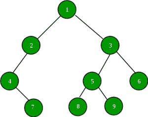

# 二叉树中最大和最小元素的和与积

> 原文:[https://www . geesforgeks . org/二叉树中最大和最小元素的和与积/](https://www.geeksforgeeks.org/sum-and-product-of-maximum-and-minimum-element-in-binary-tree/)

给定一棵二叉树。任务是找出其中最大和最小元素的和与积。
比如下面二叉树中最大和最小元素之和为 10，乘积为 9。



这个想法是遍历树，找到树中的最大和最小元素，并打印它们的乘积和总和。
要在二叉树中找到最大元素，递归遍历树并返回以下三个最大值:

1.  当前节点的数据。
2.  节点左子树中的最大值。
3.  节点右子树中的最大值。

同样，我们可以通过比较三个值来找到二叉树中的最小元素。
下面的程序说明了上述方法:

## C++

```
// CPP program to find sum and product of
// maximum and minimum in a Binary Tree
#include<bits/stdc++.h>
#include<iostream>
using namespace std;

// A tree node
class Node
{
    public:
    int data;
    Node *left, *right;

    /* Constructor that allocates
    a new node with the given data
    and NULL left and right pointers. */
    Node(int data)
    {
        this->data = data;
        this->left = NULL;
        this->right = NULL;
    }
};

// Function to return minimum value
// in a given Binary Tree
int findMin(Node* root)
{
    // Base case
    if (root == NULL)
        return INT_MAX;

    // Return minimum of 3 values:
    // 1) Root's data 2) Max in Left Subtree
    // 3) Max in right subtree
    int res = root->data;
    int lres = findMin(root->left);
    int rres = findMin(root->right);
    if (lres < res)
        res = lres;
    if (rres < res)
        res = rres;
    return res;
}

// Function to returns maximum value
// in a given Binary Tree
int findMax(Node* root)
{
    // Base case
    if (root == NULL)
        return INT_MIN;

    // Return maximum of 3 values:
    // 1) Root's data 2) Max in Left Subtree
    // 3) Max in right subtree
    int res = root->data;
    int lres = findMax(root->left);
    int rres = findMax(root->right);

    if (lres > res)
        res = lres;
    if (rres > res)
        res = rres;
    return res;
}

// Function to find sum of max and min
// elements in the Binary Tree
int findSum(int max , int min)
{
    return max + min;
}

// Function to find product of max and min
// elements in the Binary Tree
int findProduct(int max, int min)
{
    return max*min;
}

// Driver Code
int main()
{
    // Create Binary Tree
    Node* NewRoot = NULL;
    Node* root = new Node(2);
    root->left = new Node(7);
    root->right = new Node(5);
    root->left->right = new Node(6);
    root->left->right->left = new Node(1);
    root->left->right->right = new Node(11);
    root->right->right = new Node(9);
    root->right->right->left = new Node(4);

    int max = findMax(root);
    int min = findMin(root);

    cout << "Sum of Maximum and Minimum element is " <<
           findSum(max,min);
    cout << "\nProduct of Maximum and Minimum element is " <<
            findProduct(max,min);
    return 0;
}

// This code is contributed by rathbhupendra
```

## C

```
// C program to find sum and product of
// maximum and minimum in a Binary Tree
#include <limits.h>
#include <stdio.h>
#include <stdlib.h>

// A tree node
struct Node {
    int data;
    struct Node *left, *right;
};

// A utility function to create a new node
struct Node* newNode(int data)
{
    struct Node* node = (struct Node*)
        malloc(sizeof(struct Node));
    node->data = data;
    node->left = node->right = NULL;
    return (node);
}

// Function to return minimum value
// in a given Binary Tree
int findMin(struct Node* root)
{
    // Base case
    if (root == NULL)
        return INT_MAX;

    // Return minimum of 3 values:
    // 1) Root's data 2) Max in Left Subtree
    // 3) Max in right subtree
    int res = root->data;
    int lres = findMin(root->left);
    int rres = findMin(root->right);
    if (lres < res)
        res = lres;
    if (rres < res)
        res = rres;
    return res;
}

// Function to returns maximum value
// in a given Binary Tree
int findMax(struct Node* root)
{
    // Base case
    if (root == NULL)
        return INT_MIN;

    // Return maximum of 3 values:
    // 1) Root's data 2) Max in Left Subtree
    // 3) Max in right subtree
    int res = root->data;
    int lres = findMax(root->left);
    int rres = findMax(root->right);

    if (lres > res)
        res = lres;
    if (rres > res)
        res = rres;
    return res;
}

// Function to find sum of max and min
// elements in the Binary Tree
int findSum(int max , int min)
{
    return max + min;
}

// Function to find product of max and min
// elements in the Binary Tree
int findProduct(int max, int min)
{
    return max*min;
}

// Driver Code
int main(void)
{  
    // Create Binary Tree
    struct Node* NewRoot = NULL;
    struct Node* root = newNode(2);
    root->left = newNode(7);
    root->right = newNode(5);
    root->left->right = newNode(6);
    root->left->right->left = newNode(1);
    root->left->right->right = newNode(11);
    root->right->right = newNode(9);
    root->right->right->left = newNode(4);

    int max = findMax(root);
    int min = findMin(root);

    printf("Sum of Maximum and Minimum element is %d",
                                           findSum(max,min));
    printf("\nProduct of Maximum and Minimum element is %d",
                                        findProduct(max,min));

    return 0;
}
```

## Java 语言(一种计算机语言，尤用于创建网站)

```
// JAVA program to find sum and product of
// maximum and minimum in a Binary Tree
import java.util.*;

class GFG
{

// A tree node
static class Node
{
    public int data;
    Node left, right;

    /* Constructor that allocates
    a new node with the given data
    and null left and right pointers. */
    Node(int data)
    {
        this.data = data;
        this.left = null;
        this.right = null;
    }
};

// Function to return minimum value
// in a given Binary Tree
static int findMin(Node root)
{
    // Base case
    if (root == null)
        return Integer.MAX_VALUE;

    // Return minimum of 3 values:
    // 1) Root's data 2) Max in Left Subtree
    // 3) Max in right subtree
    int res = root.data;
    int lres = findMin(root.left);
    int rres = findMin(root.right);
    if (lres < res)
        res = lres;
    if (rres < res)
        res = rres;
    return res;
}

// Function to returns maximum value
// in a given Binary Tree
static int findMax(Node root)
{
    // Base case
    if (root == null)
        return Integer.MIN_VALUE;

    // Return maximum of 3 values:
    // 1) Root's data 2) Max in Left Subtree
    // 3) Max in right subtree
    int res = root.data;
    int lres = findMax(root.left);
    int rres = findMax(root.right);

    if (lres > res)
        res = lres;
    if (rres > res)
        res = rres;
    return res;
}

// Function to find sum of max and min
// elements in the Binary Tree
static int findSum(int max , int min)
{
    return max + min;
}

// Function to find product of max and min
// elements in the Binary Tree
static int findProduct(int max, int min)
{
    return max * min;
}

// Driver Code
public static void main(String[] args)
{
    // Create Binary Tree

    Node root = new Node(2);
    root.left = new Node(7);
    root.right = new Node(5);
    root.left.right = new Node(6);
    root.left.right.left = new Node(1);
    root.left.right.right = new Node(11);
    root.right.right = new Node(9);
    root.right.right.left = new Node(4);

    int max = findMax(root);
    int min = findMin(root);

    System.out.print("Sum of Maximum and Minimum element is " +
        findSum(max, min));
    System.out.print("\nProduct of Maximum and Minimum element is " +
            findProduct(max, min));
}
}

// This code is contributed by 29AjayKumar
```

## 蟒蛇 3

```
# Python program to find sum and product of
# maximum and minimum in a Binary Tree

_MIN=-2147483648
_MAX=2147483648

# Helper function that allocates a new
# node with the given data and None left
# and right poers.                                    
class newNode:

    # Constructor to create a new node
    def __init__(self, data):
        self.data = data
        self.left = None
        self.right = None

# Function to return minimum value
# in a given Binary Tree
def findMin(root):

    # Base case
    if (root == None):
        return _MAX

    # Return minimum of 3 values:
    # 1) Root's data 2) Max in Left Subtree
    # 3) Max in right subtree
    res = root.data
    lres = findMin(root.left)
    rres = findMin(root.right)
    if (lres < res):
        res = lres
    if (rres < res):
        res = rres
    return res

# Function to returns maximum value
# in a given Binary Tree
def findMax( root):

    # Base case
    if (root == None):
        return _MIN

    """ Return maximum of 3 values:
    1) Root's data 2) Max in Left Subtree
    3) Max in right subtree"""
    res = root.data
    lres = findMax(root.left)
    rres = findMax(root.right)

    if (lres > res):
        res = lres
    if (rres > res):
        res = rres
    return res

# Function to find sum of max and min
# elements in the Binary Tree
def findSum( max , min):

    return max + min

# Function to find product of max and min
# elements in the Binary Tree
def findProduct( max, min):

    return max*min

# Driver Code
if __name__ == '__main__':
    """ Create binary Tree """
    root = newNode(2)
    root.left = newNode(7)
    root.right = newNode(5)
    root.left.right = newNode(6)
    root.left.right.left = newNode(1)
    root.left.right.right = newNode(11)
    root.right.right = newNode(9)
    root.right.right.left = newNode(4)
    max = findMax(root);
    min = findMin(root);

    print("Sum of Maximum and " +
            "Minimum element is ",
                findSum(max,min))

    print("Product of Maximum and" +
            "Minimum element is",
            findProduct(max,min))

# This code is contributed
# Shubham Singh(SHUBHAMSINGH10)
```

## C#

```
// C# program to find sum and product of
// maximum and minimum in a Binary Tree
using System;

class GFG
{

// A tree node
class Node
{
    public int data;
    public Node left, right;

    /* Constructor that allocates
    a new node with the given data
    and null left and right pointers. */
    public Node(int data)
    {
        this.data = data;
        this.left = null;
        this.right = null;
    }
};

// Function to return minimum value
// in a given Binary Tree
static int findMin(Node root)
{
    // Base case
    if (root == null)
        return int.MaxValue;

    // Return minimum of 3 values:
    // 1) Root's data 2) Max in Left Subtree
    // 3) Max in right subtree
    int res = root.data;
    int lres = findMin(root.left);
    int rres = findMin(root.right);
    if (lres < res)
        res = lres;
    if (rres < res)
        res = rres;
    return res;
}

// Function to returns maximum value
// in a given Binary Tree
static int findMax(Node root)
{
    // Base case
    if (root == null)
        return int.MinValue;

    // Return maximum of 3 values:
    // 1) Root's data 2) Max in Left Subtree
    // 3) Max in right subtree
    int res = root.data;
    int lres = findMax(root.left);
    int rres = findMax(root.right);

    if (lres > res)
        res = lres;
    if (rres > res)
        res = rres;
    return res;
}

// Function to find sum of max and min
// elements in the Binary Tree
static int findSum(int max , int min)
{
    return max + min;
}

// Function to find product of max and min
// elements in the Binary Tree
static int findProduct(int max, int min)
{
    return max * min;
}

// Driver Code
public static void Main(String[] args)
{
    // Create Binary Tree
    Node root = new Node(2);
    root.left = new Node(7);
    root.right = new Node(5);
    root.left.right = new Node(6);
    root.left.right.left = new Node(1);
    root.left.right.right = new Node(11);
    root.right.right = new Node(9);
    root.right.right.left = new Node(4);

    int max = findMax(root);
    int min = findMin(root);

    Console.Write("Sum of Maximum and " +
                  "Minimum element is " +
                      findSum(max, min));
    Console.Write("\nProduct of Maximum and " +
                        "Minimum element is " +
                        findProduct(max, min));
}
}

// This code is contributed by Rajput-Ji
```

## java 描述语言

```
<script>
// javascript program to find sum and product of
// maximum and minimum in a Binary Tree

    // A tree node
    class Node {
        constructor(val) {
            this.data = val;
            this.left = null;
            this.right = null;
        }
    }

    /*
     * Constructor that allocates a new node with the given data and null left and
     * right pointers.
     */

    // Function to return minimum value
    // in a given Binary Tree
    function findMin(root) {
        // Base case
        if (root == null)
            return Number.MAX_VALUE;

        // Return minimum of 3 values:
        // 1) Root's data 2) Max in Left Subtree
        // 3) Max in right subtree
        var res = root.data;
        var lres = findMin(root.left);
        var rres = findMin(root.right);
        if (lres < res)
            res = lres;
        if (rres < res)
            res = rres;
        return res;
    }

    // Function to returns maximum value
    // in a given Binary Tree
    function findMax(root) {
        // Base case
        if (root == null)
            return Number.MIN_VALUE;

        // Return maximum of 3 values:
        // 1) Root's data 2) Max in Left Subtree
        // 3) Max in right subtree
        var res = root.data;
        var lres = findMax(root.left);
        var rres = findMax(root.right);

        if (lres > res)
            res = lres;
        if (rres > res)
            res = rres;
        return res;
    }

    // Function to find sum of max and min
    // elements in the Binary Tree
    function findSum(max , min) {
        return max + min;
    }

    // Function to find product of max and min
    // elements in the Binary Tree
    function findProduct(max , min) {
        return max * min;
    }

    // Driver Code

        // Create Binary Tree

        var root = new Node(2);
        root.left = new Node(7);
        root.right = new Node(5);
        root.left.right = new Node(6);
        root.left.right.left = new Node(1);
        root.left.right.right = new Node(11);
        root.right.right = new Node(9);
        root.right.right.left = new Node(4);

        var max = findMax(root);
        var min = findMin(root);

        document.write("Sum of Maximum and Minimum element is "
        + findSum(max, min));
        document.write("<br/>Product of Maximum and Minimum element is "
        + findProduct(max, min));

// This code contributed by Rajput-Ji
</script>
```

**Output:** 

```
Sum of Maximum and Minimum element is 12
Product of Maximum and Minimum element is 11
```