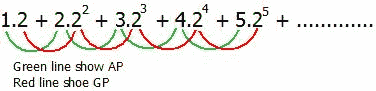

# 算术几何序列之和

> 原文:[https://www . geesforgeks . org/sum-算术-几何-序列/](https://www.geeksforgeeks.org/sum-arithmetic-geometric-sequence/)

在数学中，一个 [**算术-几何序列**](https://en.wikipedia.org/wiki/Arithmetico%E2%80%93geometric_sequence) 是一个几何级数与一个算术级数的相应项逐项相乘的结果。



是一个算术几何序列。
给定 a(AP 的第一项)、n(项数)、d(公差)、b(GP 的第一项)、r(GP 的公比)的值。任务是求 AGP 的前 n 项之和。
示例:

```
Input : First term of AP, a = 1, 
        Common difference of AP, d = 1, 
        First term of GP, b = 2, 
        Common ratio of GP r = 2,
        Number of terms, n = 3
Output : 34
Explanation
Sum = 1*2 + 2*22 + 3*23
    = 2 + 8 + 24
    = 34
```

算术几何序列的第 n 项是算术序列的第 n 项和几何序列的第 n 项的乘积。算术–几何序列出现在各种应用中，例如概率论中期望值的计算。例如[计算预期的试验次数直到成功](https://www.geeksforgeeks.org/expected-number-of-trials-before-success/)。
AGP 的第 n 个术语表示为:**t<sub>n</sub>=【a+(n–1)* d】*(b * r<sup>n-1</sup>)**
**方法 1:(蛮力)**
想法是找到 AGP 的每个术语并找到总和。
以下是本办法的实施情况:

## C++

```
// CPP Program to find the sum of first n terms.
#include<bits/stdc++.h>
using namespace std;

// Return the sum of first n term of AGP
int sumofNterm(int a, int d, int b, int r, int n)
{     
    // finding the each term of AGP and adding
    // it to sum.
    int sum = 0;
    for (int i = 1; i <= n ; i++)   
        sum += ((a + (i -1) * d) * (b * pow(r, i - 1))); 
    return sum;
}

// Driven Program
int main()
{
    int a = 1, d = 1, b = 2, r = 2, n = 3;
    cout << sumofNterm(a, d, b, r, n) << endl;
    return 0;
}
```

## Java 语言(一种计算机语言，尤用于创建网站)

```
// Java Program to find the sum of first n terms.
import java.io.*;

class GFG {

    // Return the sum of first n term of AGP
    static int sumofNterm(int a, int d, int b, int r, int n)
    {     
        // finding the each term of AGP and adding
        // it to sum.
        int sum = 0;
        for (int i = 1; i <= n ; i++)   
            sum += ((a + (i -1) * d) * (b * Math.pow(r, i - 1))); 
        return sum;
    }

    // Driven Program
    public static void main(String args[])
    {
        int a = 1, d = 1, b = 2, r = 2, n = 3;
        System.out.println(sumofNterm(a, d, b, r, n));

    }
}

// This code is contributed by Nikita Tiwari.
```

## 蟒蛇 3

```
# Python3 code to find the
# sum of first n terms.
import math

# Return the sum of first
# n term of AGP
def sumofNterm( a , d , b ,
                    r , n ):
    # finding the each term
    # of AGP and adding it to sum.
    sum = 0
    for i in range(1,n+1):
        sum += ((a + (i -1) * d) *
            (b * math.pow(r, i - 1)))
    return int(sum)

# Driven Code
a = 1
d = 1
b = 2
r = 2
n = 3
print(sumofNterm(a, d, b, r, n))

# This code is contributed by "Sharad_Bhardwaj".
```

## C#

```
// C# Program to find the sum of first n terms.
using System;

class GFG {

    // Return the sum of first n term of AGP
    static int sumofNterm(int a, int d, int b, int r, int n)
    {
        // Finding the each term of AGP
        // and adding it to sum.
        int sum = 0;
        for (int i = 1; i <= n ; i++)
            sum += (int)((a + (i -1) * d) *
                         (b * Math.Pow(r, i - 1)));
        return sum;
    }

    // Driver Code
    public static void Main()
    {
        int a = 1, d = 1, b = 2, r = 2, n = 3;
        Console.Write(sumofNterm(a, d, b, r, n));
    }
}

// This code is contributed by vt_m.
```

## 服务器端编程语言（Professional Hypertext Preprocessor 的缩写）

```
<?php
// PHP program to find the
// sum of first n terms.

// Return the sum of first
// n term of AGP
function sumofNterm($a, $d, $b, $r, $n)
{

    // finding the each term
    // of AGP and adding
    // it to sum.
    $sum = 0;
    for ($i = 1; $i <= $n ; $i++)
        $sum += (($a + ($i -1) * $d) *
                 ($b * pow($r, $i - 1)));
    return $sum;
}

// Driver Code
$a = 1; $d = 1; $b = 2; $r = 2; $n = 3;
echo(sumofNterm($a, $d, $b, $r, $n));

// This code is contributed by Ajit.
?>
```

## java 描述语言

```
<script>
// javascript  program to find the
// sum of first n terms.

// Return the sum of first
// n term of AGP
function sumofNterm(a, d, b, r, n)
{

    // finding the each term
    // of AGP and adding
    // it to sum.
    let sum = 0;
    for (let i = 1; i <= n ; i++)
        sum += ((a + (i -1) * d) *
                (b * Math.pow(r, i - 1)));
    return sum;
}

// Driver Code
let a = 1;
let d = 1;
let b = 2;
let r = 2;
let n = 3;
document.write(sumofNterm(a, d, b, r, n));

// This code is contributed by sravan kumar (vignan)
</script>
```

输出:

```
34
```

**方法二:(使用公式)**


证明，

```
Series,
Sn = ab + (a+d)br + (a+2d)br2 + ..... + (a + (n-1)d)brn-1

Multiplying Sn by r,
rSn = abr + (a+d)br2 + (a+2d)br3 + ..... + (a + (n-1)d)brn

Subtract rSn from Sn,
(1 - r)Sn = [a + (a + d)r + (a + 2d)r2 + ...... + [a + (n-1)d]rn-1] 
           - [ar + (a + d)r2 + (a + 2d)r3 + ...... + [a + (n-1)d]rn]
          = b[a + d(r + r2 + r3 + ...... + rn-1) 
            - [a + (n-1)d]rn]
          (Using sum of geometric series Sn  = a(1 - rn-1)/(1-r))
          = b[a + dr(1 - rn-1)/(1-r) - [a + (n-1)d]rn]
```

以下是该方法的实现:

## 卡片打印处理机（Card Print Processor 的缩写）

```
// CPP Program to find the sum of first n terms.
#include<bits/stdc++.h>
using namespace std;

// Return the sum of first n term of AGP
int sumofNterm(int a, int d, int b, int r, int n)
{
    int ans = 0;   
    ans += a;   
    ans += ((d * r * (1 - pow(r, n-1)))/(1-r));   
    ans -= (a + (n-1)*d)*pow(r, n);   
    return (ans*b)/(1-r);
}

// Driven Program
int main()
{
    int a = 1, d = 1, b = 2, r = 2, n = 3;
    cout << sumofNterm(a, d, b, r, n) << endl;
    return 0;
}
```

## Java 语言(一种计算机语言，尤用于创建网站)

```
// Java Program to find the sum of first n terms.

import java.io.*;
import java.math.*;

class GFG {

    // Return the sum of first n term of AGP
    static int sumofNterm(int a, int d, int b, int r, int n)
    {
        int ans = 0;   
        ans += a;   
        ans += ((d * r * (1 - (int)(Math.pow(r, n-1))))/(1-r));   
        ans -= (a + (n-1)*d)*(int)(Math.pow(r, n));   
        return (ans*b)/(1-r);
    }

    // Driven Program
    public static void main(String args[])
    {
        int a = 1, d = 1, b = 2, r = 2, n = 3;
        System.out.println(sumofNterm(a, d, b, r, n));

    }
}

// This code is contributed by Nikita Tiwari.
```

## 蟒蛇 3

```
# Python3 code to find
# the sum of first n terms.
import math

# Return the sum of
# first n term of AGP
def sumofNterm( a , d , b ,
                    r , n ):

    ans = 0
    ans += a

    ans += ((d * r * (1 - math.pow(r, n-1))
                                )/(1-r))

    ans -= (a + (n-1)*d)*math.pow(r, n)

    return int((ans*b)/(1-r))

# Driven Code
a = 1
d = 1
b = 2
r = 2
n = 3
print(sumofNterm(a, d, b, r, n) )

# This code is contributed by "Sharad_Bhardwaj".
```

## C#

```
// C# Program to find the sum of first n terms.
using System;

class GFG {

    // Return the sum of first n term of AGP
    static int sumofNterm(int a, int d, int b, int r, int n)
    {
        int ans = 0;
        ans += a;
        ans += ((d * r * (1 - (int)(Math.Pow(r, n-1))))
                                               / (1-r));
        ans -= (a + (n-1) * d) *
                (int)(Math.Pow(r, n));

        return (ans * b) / (1 - r);
    }

    // Driver Code
    public static void Main()
    {
        int a = 1, d = 1, b = 2, r = 2, n = 3;
        Console.Write(sumofNterm(a, d, b, r, n));
    }
}

// This code is contributed by vt_m.
```

## 服务器端编程语言（Professional Hypertext Preprocessor 的缩写）

```
<?php
// PHP program to find the
// sum of first n terms.

// Return the sum of first
// n term of AGP
function sumofNterm($a, $d, $b, $r, $n)
{

    // finding the each term
    // of AGP and adding
    // it to sum.
    $sum = 0;
    for ($i = 1; $i <= $n ; $i++)
        $sum += (($a + ($i -1) * $d) *
                 ($b * pow($r, $i - 1)));
    return $sum;
}

// Driver Code
$a = 1; $d = 1; $b = 2; $r = 2; $n = 3;
echo(sumofNterm($a, $d, $b, $r, $n));

// This code is contributed by Ajit.
?>
```

## java 描述语言

```
<script>

// JavaScript Program to find the sum of first n terms.

    // Return the sum of first n term of AGP
    function sumofNterm(a, d, b, r, n)
    {
        let ans = 0;   
        ans += a;   
        ans += ((d * r * (1 - (Math.pow(r, n-1))))/(1-r));   
        ans -= (a + (n-1)*d)*(Math.pow(r, n));   
        return (ans*b)/(1-r);
    }

// Driver code   

        let a = 1, d = 1, b = 2, r = 2, n = 3;
        document.write(sumofNterm(a, d, b, r, n)); 

</script>
```

**输出:**

```
34
```