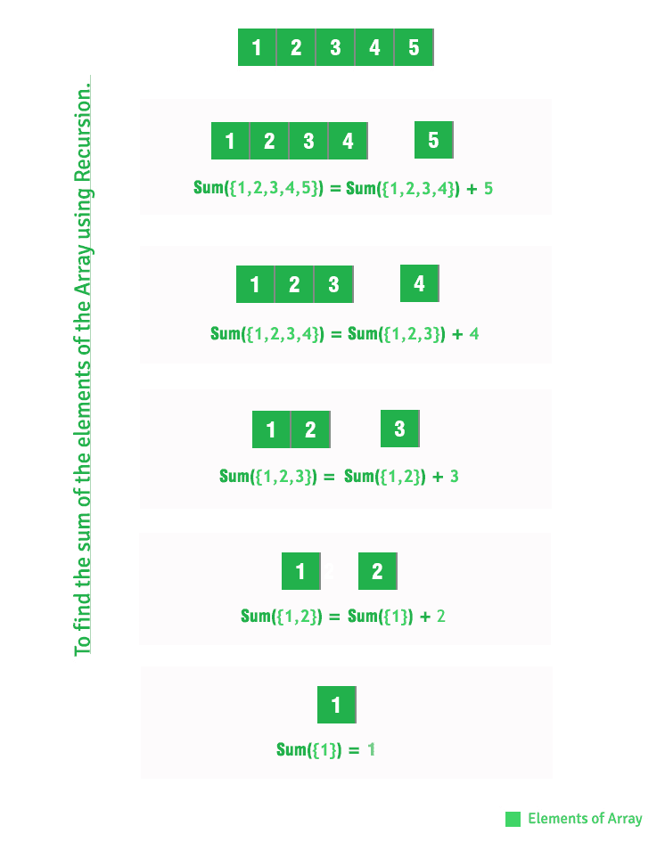

# 使用递归对数组元素求和

> 原文:[https://www . geesforgeks . org/sum-array-elements-use-recursion/](https://www.geeksforgeeks.org/sum-array-elements-using-recursion/)

给定一个整数数组，用递归求数组元素的和。
**例:**

```
Input : A[] = {1, 2, 3}
Output : 6
1 + 2 + 3 = 6

Input : A[] = {15, 12, 13, 10}
Output : 50
```

我们已经在下面的帖子中讨论了迭代解。
[给定数组中元素的和](https://www.geeksforgeeks.org/program-find-sum-elements-given-array/)
本文讨论递归解。

## C++

```
// C++ program to find sum of array
// elements using recursion.
#include <stdio.h>

// Return sum of elements in A[0..N-1]
// using recursion.
int findSum(int A[], int N)
{
    if (N <= 0)
        return 0;
    return (findSum(A, N - 1) + A[N - 1]);
}

// Driver code
int main()
{
    int A[] = { 1, 2, 3, 4, 5 };
    int N = sizeof(A) / sizeof(A[0]);
    printf("%dn", findSum(A, N));
    return 0;
}
```

## Java 语言(一种计算机语言，尤用于创建网站)

```
// Java program to find sum of array
// elements using recursion.

class Test {
    static int arr[] = { 1, 2, 3, 4, 5 };

    // Return sum of elements in A[0..N-1]
    // using recursion.
    static int findSum(int A[], int N)
    {
        if (N <= 0)
            return 0;
        return (findSum(A, N - 1) + A[N - 1]);
    }

    // Driver method
    public static void main(String[] args)
    {
        System.out.println(findSum(arr, arr.length));
    }
}
```

## 计算机编程语言

```
# Python program to find sum of array
# elements using recursion.

 # Return sum of elements in A[0..N-1]
 # using recursion.
  def _findSum(arr, N):
     if len(arr)== 1:
        return arr[0]
     else:
        return arr[0]+_findSum(arr[1:], N)

# driver code
arr =[]
# input values to list
arr = [1, 2, 3, 4, 5]

# calculating length of array
N = len(arr)

ans =_findSum(arr,N)
print (ans)

# This code is contributed by Khare Ishita
```

## C#

```
// C# program to find sum of array
// elements using recursion.
using System;

class Test {

    static int []arr = {1, 2, 3, 4, 5};

    // Return sum of elements in
    // A[0..N-1] using recursion.
    static int findSum(int []A, int N)
    {
        if (N <= 0)
            return 0;
        return (findSum(A, N - 1) + A[N - 1]);
    }

    // Driver Code
    public static void Main()
    {
        Console.Write(findSum(arr, arr.Length));
    }
}

// This code is contributed by Nitin Mittal.
```

## 服务器端编程语言（Professional Hypertext Preprocessor 的缩写）

```
<?php
// PHP program to find sum
// of array elements using
// recursion.

// Return sum of elements
// in A[0..N-1] using recursion.
function findSum($A, $N)
{
    if ($N <= 0)
        return 0;
    return (findSum($A, $N - 1) +
                    $A[$N - 1]);
}

// Driver code
$A = array(1, 2, 3, 4, 5);
$N = sizeof($A);
echo findSum($A, $N);

// This code is contributed
// by ihritik
?>
```

## java 描述语言

```
<script>

// JavaScript program to find sum of array
// elements using recursion.

// Return sum of elements in A[0..N-1]
// using recursion.
function findSum(A, N) {
    if (N <= 0)
        return 0;
    return (findSum(A, N - 1) + A[N - 1]);
}

// Driver code

let A = [1, 2, 3, 4, 5];
let N = A.length;
document.write(findSum(A, N));

</script>
```

**输出:**

```
15
```

**以上递归解是如何工作的？**



本文由 [**普拉哈尔·阿格沃尔**](http://prakhar.info) 供稿。如果你喜欢 GeeksforGeeks 并想投稿，你也可以使用[write.geeksforgeeks.org](https://write.geeksforgeeks.org)写一篇文章或者把你的文章邮寄到 review-team@geeksforgeeks.org。看到你的文章出现在极客博客主页上，帮助其他极客。
如果发现有不正确的地方，或者想分享更多关于上述话题的信息，请写评论。