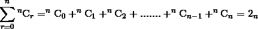

# 二项式系数之和

> 原文:[https://www.geeksforgeeks.org/sum-binomial-coefficients/](https://www.geeksforgeeks.org/sum-binomial-coefficients/)

给定一个正整数 **n** ，任务是求二项式系数之和即
**<sup>n</sup>C<sub>0</sub>+<sup>n</sup>C<sub>1</sub>+<sup>n</sup>C<sub>2</sub>+……。+<sup>n</sup>C<sub>n-1</sub>+<sup>n</sup>C<sub>n</sub>**
**例:**

```
Input : n = 4
Output : 16
4C0 + 4C1 + 4C2 + 4C3 + 4C4
= 1 + 4 + 6 + 4 + 1
= 16

Input : n = 5
Output : 32
```

**方法一(蛮力):**
思路是[评估每个二项式系数项](https://www.geeksforgeeks.org/dynamic-programming-set-9-binomial-coefficient/)即 <sup>n</sup> C <sub>r</sub> ，其中 0 < = r < = n，计算所有项之和。
以下是本办法的实施:

## C++

```
// CPP Program to find the sum of Binomial
// Coefficient.
#include <bits/stdc++.h>
using namespace std;

// Returns value of Binomial Coefficient Sum
int binomialCoeffSum(int n)
{
    int C[n + 1][n + 1];

    // Calculate value of Binomial Coefficient
    // in bottom up manner
    for (int i = 0; i <= n; i++) {
        for (int j = 0; j <= min(i, n); j++) {
            // Base Cases
            if (j == 0 || j == i)
                C[i][j] = 1;

            // Calculate value using previously
            // stored values
            else
                C[i][j] = C[i - 1][j - 1] + C[i - 1][j];
        }
    }

    // Calculating the sum.
    int sum = 0;
    for (int i = 0; i <= n; i++)
        sum += C[n][i];

    return sum;
}

/* Driver program to test above function*/
int main()
{
    int n = 4;
    printf("%d", binomialCoeffSum(n));
    return 0;
}
```

## Java 语言(一种计算机语言，尤用于创建网站)

```
// Java Program to find the sum
// of Binomial Coefficient.

class GFG {

    // Returns value of Binomial
    // Coefficient Sum
    static int binomialCoeffSum(int n)
    {
        int C[][] = new int[n + 1][n + 1];

        // Calculate value of Binomial
        // Coefficient in bottom up manner
        for (int i = 0; i <= n; i++)
        {
            for (int j = 0; j <= Math.min(i, n); j++)
            {
                // Base Cases
                if (j == 0 || j == i)
                    C[i][j] = 1;

                // Calculate value using previously
                // stored values
                else
                    C[i][j] = C[i - 1][j - 1] +
                              C[i - 1][j];

            }
        }

        // Calculating the sum.
        int sum = 0;
        for (int i = 0; i <= n; i++)
            sum += C[n][i];

        return sum;
    }

    /* Driver program to test above function*/
    public static void main(String[] args)
    {
        int n = 4;
        System.out.println(binomialCoeffSum(n));
    }
}

// This code is contributed by prerna saini.
```

## 蟒蛇 3

```
# Python  Program to find the sum
# of Binomial Coefficient.

import math   

# Returns value of Binomial
# Coefficient Sum
def binomialCoeffSum( n):

        C = [[0]*(n+2) for i in range(0,n+2)]

        # Calculate value of Binomial
        # Coefficient in bottom up manner
        for i in range(0,n+1):
            for j in range(0, min(i, n)+1):

                # Base Cases
                if (j == 0 or j == i):
                    C[i][j] = 1

                # Calculate value using previously
                # stored values
                else:
                    C[i][j] = C[i - 1][j - 1] + C[i - 1][j]

        # Calculating the sum.
        sum = 0
        for i in range(0,n+1):
            sum += C[n][i]

        return sum

# Driver program to test above function
n = 4
print(binomialCoeffSum(n))

# This code is contributed by Gitanjali.
```

## C#

```
// C# program to find the sum
// of Binomial Coefficient.
using System;

class GFG {

    // Returns value of Binomial
    // Coefficient Sum
    static int binomialCoeffSum(int n)
    {
        int[, ] C = new int[n + 1, n + 1];

        // Calculate value of Binomial
        // Coefficient in bottom up manner
        for (int i = 0; i <= n; i++)
        {
            for (int j = 0; j <= Math.Min(i, n); j++)
            {
                // Base Cases
                if (j == 0 || j == i)
                    C[i, j] = 1;

                // Calculate value using previously
                // stored values
                else
                    C[i, j] = C[i - 1, j - 1] + C[i - 1, j];
            }
        }

        // Calculating the sum.
        int sum = 0;
        for (int i = 0; i <= n; i++)
            sum += C[n, i];

        return sum;
    }

    /* Driver program to test above function*/
    public static void Main()
    {
        int n = 4;
        Console.WriteLine(binomialCoeffSum(n));
    }
}

// This code is contributed by vt_m.
```

## 服务器端编程语言（Professional Hypertext Preprocessor 的缩写）

```
<?php
// PHP Program to find the
// sum of Binomial Coefficient.
// Returns value of Binomial
// Coefficient Sum

function binomialCoeffSum($n)
{
    $C[$n + 1][$n + 1] = array(0);

    // Calculate value of
    // Binomial Coefficient
    // in bottom up manner
    for ($i = 0; $i <= $n; $i++)
    {
        for ($j = 0;
             $j <= min($i, $n); $j++)
        {
            // Base Cases
            if ($j == 0 || $j == $i)
                $C[$i][$j] = 1;

            // Calculate value
            // using previously
            // stored values
            else
                $C[$i][$j] = $C[$i - 1][$j - 1] +
                             $C[$i - 1][$j];
        }
    }

    // Calculating the sum.
    $sum = 0;
    for ($i = 0; $i <= $n; $i++)
        $sum += $C[$n][$i];

    return $sum;
}

// Driver Code
$n = 4;
echo binomialCoeffSum($n);

// This code is contributed by ajit
?>
```

## java 描述语言

```
<script>

// JavaScript Program to find the sum
// of Binomial Coefficient.

    // Returns value of Binomial
    // Coefficient Sum
    function binomialCoeffSum(n)
    {
        let C = new Array(n + 1);

        // Loop to create 2D array using 1D array
        for (var i = 0; i < C.length; i++) {
            C[i] = new Array(2);
        }

        // Calculate value of Binomial
        // Coefficient in bottom up manner
        for (let i = 0; i <= n; i++)
        {
            for (let j = 0; j <= Math.min(i, n); j++)
            {
                // Base Cases
                if (j == 0 || j == i)
                    C[i][j] = 1;

                // Calculate value using previously
                // stored values
                else
                    C[i][j] = C[i - 1][j - 1] +
                              C[i - 1][j];

            }
        }

        // Calculating the sum.
        let sum = 0;
        for (let i = 0; i <= n; i++)
            sum += C[n][i];

        return sum;
    }

// Driver code

        let n = 4;
        document.write(binomialCoeffSum(n));

</script>
```

**输出:**

```
16
```

**方法 2(使用公式):**



这可以从两个方面证明。
首次证明:利用归纳法原理。

> 基本步，n = 0
> LHS =<sup>0</sup>C<sub>0</sub>=(0！)/(0!* 0!) = 1/1 = 1.
> RHS= 2 <sup>0</sup> = 1。
> LHS = RHS
> 对于感应步骤:
> 让 k 为整数，使得 k > 0，对于所有 r，0 < = r < = k，其中 r 属于整数，
> 公式成立。
> 因此，
> <sup>k</sup>C<sub>0</sub>+<sup>k</sup>C<sub>1</sub>+<sup>k</sup>C<sub>2</sub>+……。+<sup>k</sup>C<sub>k-1</sub>+<sup>k</sup>C<sub>k</sub>= 2<sup>k</sup>T36】现在，我们要证明对于 n = k + 1，
> T38】k+1C<sub>0</sub>+<sup>k+1</sup>C<sub>1</sub>+<sup>k+1</sup>+<sup>k+1</sup>C<sub>k</sub>+<sup>k+1</sup>C<sub>k+1</sub>= 2<sup>k+1</sup>T60】LHS =<sup>k+1</sup>C<sub>0</sub>+<sup>k+1</sup>C<sub>1</sub>+<sup>k+1【+<sup>k+1</sup>C<sub>k</sub>+<sup>k+1</sup>C<sub>k+1</sub>T81】(使用 <sup>n</sup> C <sub>0</sub> = 0 和<sup>n+1</sup>C<sub>r</sub>=<sup>n</sup>C<sub>r</sub>+
> = 1+<sup>k</sup>C<sub>0</sub>+<sup>k</sup>C<sub>1</sub>+<sup>k</sup>C<sub>1</sub>+<sup>k</sup>C<sub>2</sub>+……+<sup>k</sup>C<sub>k-1</sub>+ <sup><sup>k</sup>C<sub>1</sub>+……+<sup>k</sup>C<sub>k-1</sub>+<sup>k</sup>C<sub>k-1</sub>+<sup>k</sup>C<sub>k</sub>+<sup>k</sup>C<sub>k</sub>T156</sup></sup>

第二个证明:利用二项式定理展开

> 二项式扩张状态，
> (x + y) <sup>n</sup>=<sup>n</sup>c<sub>0</sub>x<sup>n</sup>y<sup>0</sup>+<sup>n</sup>c <sub>y<sup>n</sup>t43【放 x = 1， y = 1
> (1 + 1) <sup>n</sup>=<sup>【n】</sup>【c】<sub>【0】</sub>【1】【1】<sup>【0】</sup>+<sup>【c】 <sub>1 <sup>【2】<sup>【n89】=<sup>【n91】<sub>【0】</sub>+<sup>【n96】 <sup>+<sup>n</sup>c<sub>n-1</sub>+<sup>n</sup>c<sub>n</sub></sup></sup></sup></sup></sup></sub></sup></sub>

以下是该方法的实现:

## C++

```
// CPP Program to find sum of Binomial
// Coefficient.
#include <bits/stdc++.h>
using namespace std;

// Returns value of Binomial Coefficient Sum
// which is 2 raised to power n.
int binomialCoeffSum(int n)
{
    return (1 << n);
}

/* Driver program to test above function*/
int main()
{
    int n = 4;
    printf("%d", binomialCoeffSum(n));
    return 0;
}
```

## Java 语言(一种计算机语言，尤用于创建网站)

```
// Java Program to find sum
// of Binomial Coefficient.
import java.io.*;

class GFG
{
    // Returns value of Binomial
    // Coefficient Sum which is
    // 2 raised to power n.
    static int binomialCoeffSum(int n)
    {
        return (1 << n);
    }

    // Driver Code
    public static void main (String[] args)
    {
        int n = 4;
        System.out.println(binomialCoeffSum(n));
    }
}

// This code is contributed
// by akt_mit.
```

## 蟒蛇 3

```
# Python  Program to find the sum
# of Binomial Coefficient.

import math    
# Returns value of Binomial
# Coefficient Sum
def binomialCoeffSum( n):

    return (1 << n);

# Driver program to test
# above function
n = 4
print(binomialCoeffSum(n))

# This code is contributed
# by Gitanjali.
```

## C#

```
// C# Program to find sum of
// Binomial Coefficient.
using System;

class GFG {

    // Returns value of Binomial Coefficient Sum
    // which is 2 raised to power n.
    static int binomialCoeffSum(int n)
    {
        return (1 << n);
    }

    /* Driver program to test above function*/
    static public void Main()
    {
        int n = 4;
        Console.WriteLine(binomialCoeffSum(n));
    }
}

// This code is contributed by vt_m.
```

## 服务器端编程语言（Professional Hypertext Preprocessor 的缩写）

```
<?php
// PHP Program to find sum
// of Binomial Coefficient.

// Returns value of Binomial
// Coefficient Sum which is
// 2 raised to power n.
function binomialCoeffSum($n)
{
    return (1 << $n);
}

// Driver Code
$n = 4;
echo binomialCoeffSum($n);

// This code is contributed
// by akt_mit
?>
```

## java 描述语言

```
<script>
    // Javascript Program to find sum of Binomial Coefficient.

    // Returns value of Binomial Coefficient Sum
    // which is 2 raised to power n.
    function binomialCoeffSum(n)
    {
        return (1 << n);
    }

    let n = 4;
      document.write(binomialCoeffSum(n));

</script>
```

**输出:**

```
16
```