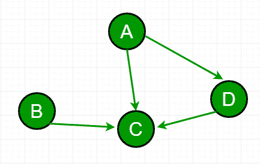

# 图中依赖关系的总和

> 原文:[https://www.geeksforgeeks.org/sum-dependencies-graph/](https://www.geeksforgeeks.org/sum-dependencies-graph/)

给定一个有 n 个节点的有向连通图。如果从 u 到 v 有一条边，那么 u 依赖于 v。我们的任务是找出每个节点的依赖之和。



**例:**
对于图中的图形，
A 依赖 C，D 即 2
B 依赖 C 即 1
D 依赖 C 即 1
C 不依赖。
遂答- > 0 + 1 + 1 + 2 = 4
问于: [Flipkart 面试](https://www.geeksforgeeks.org/flipkart-interview-set-11/)

想法是检查邻接表，找出每个顶点有多少条边，并返回边的总数。

## C++

```
// C++ program to find the sum of dependencies
#include <bits/stdc++.h>
using namespace std;

// To add an edge
void addEdge(vector <int> adj[], int u,int v)
{
    adj[u].push_back(v);
}

// find the sum of all dependencies
int findSum(vector<int> adj[], int V)
{
    int sum = 0;

    // just find the size at each vector's index
    for (int u = 0; u < V; u++)
        sum += adj[u].size();

    return sum;
}

// Driver code
int main()
{
    int V = 4;
    vector<int >adj[V];
    addEdge(adj, 0, 2);
    addEdge(adj, 0, 3);
    addEdge(adj, 1, 3);
    addEdge(adj, 2, 3);

    cout << "Sum of dependencies is "
         << findSum(adj, V);
    return 0;
}
```

## Java 语言(一种计算机语言，尤用于创建网站)

```
// Java program to find the sum of dependencies

import java.util.Vector;

class Test
{
    // To add an edge
    static void addEdge(Vector <Integer> adj[], int u,int v)
    {
        adj[u].addElement((v));
    }

    // find the sum of all dependencies
    static int findSum(Vector<Integer> adj[], int V)
    {
        int sum = 0;

        // just find the size at each vector's index
        for (int u = 0; u < V; u++)
            sum += adj[u].size();

        return sum;
    }

    // Driver method
    public static void main(String[] args) 
    {
        int V = 4;
          @SuppressWarnings("unchecked")
        Vector<Integer> adj[] = new Vector[V];

        for (int i = 0; i < adj.length; i++) {
            adj[i] = new Vector<>();
        }

        addEdge(adj, 0, 2);
        addEdge(adj, 0, 3);
        addEdge(adj, 1, 3);
        addEdge(adj, 2, 3);

        System.out.println("Sum of dependencies is " +
                            findSum(adj, V));
    }
}
// This code is contributed by Gaurav Miglani
```

## 蟒蛇 3

```
# Python3 program to find the sum 
# of dependencies

# To add an edge
def addEdge(adj, u, v):

    adj[u].append(v)

# Find the sum of all dependencies
def findSum(adj, V):

    sum = 0

    # Just find the size at each 
    # vector's index
    for u in range(V):
        sum += len(adj[u])

    return sum

# Driver code
if __name__=='__main__':

    V = 4
    adj = [[] for i in range(V)]

    addEdge(adj, 0, 2)
    addEdge(adj, 0, 3)
    addEdge(adj, 1, 3)
    addEdge(adj, 2, 3)

    print("Sum of dependencies is",
          findSum(adj, V))

# This code is contributed by rutvik_56
```

## C#

```
// C# program to find the sum of dependencies
using System;
using System.Collections;

class GFG{

// To add an edge
static void addEdge(ArrayList []adj, int u,
                                     int v)
{
    adj[u].Add(v);
}

// Find the sum of all dependencies
static int findSum(ArrayList []adj, int V)
{
    int sum = 0;

    // Just find the size at each 
    // vector's index
    for(int u = 0; u < V; u++)
        sum += adj[u].Count;

    return sum;
}

// Driver code
public static void Main(string[] args) 
{
    int V = 4;

    ArrayList []adj = new ArrayList[V];

    for(int i = 0; i < V; i++)
    {
        adj[i] = new ArrayList();
    }

    addEdge(adj, 0, 2);
    addEdge(adj, 0, 3);
    addEdge(adj, 1, 3);
    addEdge(adj, 2, 3);

    Console.Write("Sum of dependencies is " +
                  findSum(adj, V));
}
}

// This code is contributed by pratham76
```

**输出:**

```
Sum of dependencies is 4
```

时间复杂度:O(V)，其中 V 是图中的顶点数。

本文由 [**萨希尔·查布拉(akku)**](https://www.facebook.com/sahil.chhabra.965) 供稿。如果你喜欢 GeeksforGeeks 并想投稿，你也可以使用[contribute.geeksforgeeks.org](http://www.contribute.geeksforgeeks.org)写一篇文章或者把你的文章邮寄到 contribute@geeksforgeeks.org。看到你的文章出现在极客博客主页上，帮助其他极客。
如果发现有不正确的地方，或者想分享更多关于上述话题的信息，请写评论。