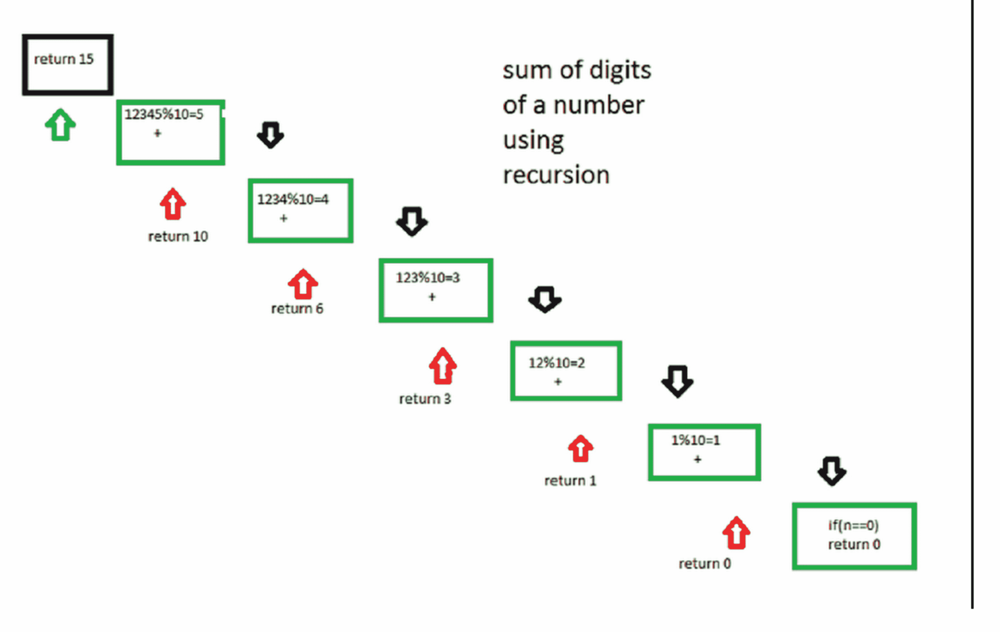

# 用递归求一个数的位数的和

> 原文:[https://www . geesforgeks . org/sum-digital-number-use-recursion/](https://www.geeksforgeeks.org/sum-digit-number-using-recursion/)

给定一个数，我们需要用递归求其位数的和。
示例:

```
Input : 12345
Output : 15

Input : 45632
Output :20

```

更好地理解算法工作原理的逐步过程。
设数字为 12345。
步骤 1- > 12345 % 10 等于-太 5 +(发送 12345/10 到下一步)
步骤 2- > 1234 % 10 等于-太 4 +(发送 1234/10 到下一步)
步骤 3- > 123 % 10 等于-太 3 +(发送 123/10 到下一步)
步骤 4- > 12 % 10
第 5 步- > 1 % 10 等于-太 1 +(发送 1/10 到下一步)
第 6 步- > 0 算法停止
下图将说明递归的过程



## C++

```
// Recursive C++ program to find sum of digits
// of a number
#include <bits/stdc++.h>
using namespace std;

// Function to check sum of digit using recursion
int sum_of_digit(int n)
{
    if (n == 0)
    return 0;
    return (n % 10 + sum_of_digit(n / 10));
}

// Driven code
int main()
{
    int num = 12345;
    int result = sum_of_digit(num);
    cout << "Sum of digits in "<< num
       <<" is "<<result << endl;
    return 0;
}

// THis code is contributed by
// SHUBHAMSINGH10
```

## C

```
// Recursive C program to find sum of digits
// of a number
#include <stdio.h>

// Function to check sum of digit using recursion
int sum_of_digit(int n)
{
    if (n == 0)
       return 0;
    return (n % 10 + sum_of_digit(n / 10));
}

// Driven Program to check above
int main()
{
    int num = 12345;
    int result = sum_of_digit(num);
    printf("Sum of digits in %d is %d\n", num, result);
    return 0;
}
```

## Java 语言(一种计算机语言，尤用于创建网站)

```
// Recursive java program to
// find sum of digits of a number
import java.io.*;

class sum_of_digits
{
    // Function to check sum
    // of digit using recursion
    static int sum_of_digit(int n)
    {
        if (n == 0)
            return 0;
        return (n % 10 + sum_of_digit(n / 10));
    }

    // Driven Program to check above
    public static void main(String args[])
    {
        int num = 12345;
        int result = sum_of_digit(num);
        System.out.println("Sum of digits in " +
                           num + " is " + result);
    }
}

// This code is contributed by Anshika Goyal.
```

## 蟒蛇 3

```
# Recursive Python3 program to
# find sum of digits of a number

# Function to check sum of
# digit using recursion
def sum_of_digit( n ):
    if n == 0:
        return 0
    return (n % 10 + sum_of_digit(int(n / 10)))

# Driven code to check above
num = 12345
result = sum_of_digit(num)
print("Sum of digits in",num,"is", result)

# This code is contributed by "Sharad_Bhardwaj".
```

## C#

```
// Recursive C# program to
// find sum of digits of a number
using System;

class GFG {

    // Function to check sum
    // of digit using recursion
    static int sum_of_digit(int n)
    {
        if (n == 0)
            return 0;

        return (n % 10 + sum_of_digit(n / 10));
    }

    // Driven Program to check above
    public static void Main()
    {
        int num = 12345;
        int result = sum_of_digit(num);
        Console.WriteLine("Sum of digits in " +
                           num + " is " + result);
    }
}

// This code is contributed by Anant Agarwal.
```

## 服务器端编程语言（Professional Hypertext Preprocessor 的缩写）

```
<?php
// Recursive PHP program
// to find sum of digits
// of a number

// Function to check sum of
// digit using recursion
function sum_of_digit($n)
{
    if ($n == 0)
        return 0;
    return ($n % 10 +
            sum_of_digit($n / 10));
}

// Driven Code
$num = 12345;
$result = sum_of_digit($num);
echo("Sum of digits in " . $num . " is " . $result);

// This code is contributed by Ajit.
?>
```

## java 描述语言

```
<script>

// Recursive Javascript program to find sum of digits
// of a number

// Function to check sum of digit using recursion
function sum_of_digit(n)
{
    if (n == 0)
    return 0;
    return (n % 10 + sum_of_digit(parseInt(n / 10)));
}

// Driven code
var num = 12345;
var result = sum_of_digit(num);
document.write( "Sum of digits in "+ num
   +" is "+result );

</script>
```

**输出:**

```
Sum of digits in 12345 is 15
```