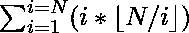

# 从 1 到 n 的所有除数之和

> 原文:[https://www.geeksforgeeks.org/sum-divisors-1-n/](https://www.geeksforgeeks.org/sum-divisors-1-n/)

```
Given a positive integer n. Find the value of 
```


其中函数 F(i)对于数 I 的定义为所有除数的和' **i** 。

**示例:**

```
Input: 4
Output: 15
Explanation
F(1) = 1
F(2) = 1 + 2 = 3
F(3) = 1 + 3 = 4
F(4) = 1 + 2 + 4 = 7
ans = F(1) + F(2) + F(3) + F(4)
    = 1 + 3 + 4 + 7
    = 15
Input: 5
Output: 21
```

**天真的方法**是遍历每一个数(1 到 n)，找到所有除数，并不断用那个除数更新和。看这个了解更多。

## C++

```
// C++ program to find sum of all
// divisor of number up to 'n'
#include<bits/stdc++.h>
using namespace std;

// Utility function to find sum of
// all divisor of number up to 'n'
int divisorSum(int n)
{
    int sum = 0;

    for(int i = 1; i <= n; ++i)
    {

        // Find all divisors of i and add them
        for(int j = 1; j * j <= i; ++j)
        {
            if (i % j == 0)
            {
                if (i / j == j)
                    sum += j;
                else
                    sum += j + i / j;
            }
        }
    }
    return sum;
}

// Driver code
int main()
{
    int n = 4;
    cout << " " << divisorSum(n) << endl;

    n = 5;
    cout << " " << divisorSum(n);

    return 0;
}
```

## Java 语言(一种计算机语言，尤用于创建网站)

```
// JAVA program to find sum of all
// divisor of number up to 'n'
import java.io.*;

class GFG {

    // Utility function to find sum of
    // all divisor of number up to 'n'
    static int divisorSum(int n)
    {
        int sum = 0;

        for (int i = 1; i <= n; ++i) {

            // Find all divisors of i
            // and add them
            for (int j = 1; j * j <= i; ++j) {
                if (i % j == 0) {
                    if (i / j == j)
                        sum += j;
                    else
                        sum += j + i / j;
                }
            }
        }
        return sum;
    }

    // Driver code
    public static void main(String args[])
    {
        int n = 4;
        System.out.println(divisorSum(n));
        n = 5;
        System.out.println(divisorSum(n));
    }
}

/*This code is contributed by Nikita tiwari.*/
```

## 蟒蛇 3

```
# Python3 code to find sum of all
# divisor of number up to 'n'

# Utility function to find sum of
# all divisor of number up to 'n'
def divisorSum( n ):
    sum = 0

    for i in range(1, n + 1):

        # Find all divisors of i
        # and add them
        j = 1
        while j * j <= i:
            if i % j == 0:
                if i / j == j:
                    sum += j
                else:
                    sum += j + i / j
            j = j + 1
    return int(sum)

# Driver code
n = 4
print( divisorSum(n))
n = 5
print( divisorSum(n))

# This code is contributed by "Sharad_Bhardwaj".
```

## C#

```
// C# program to find sum of all
// divisor of number up to 'n'
using System;

class GFG {

    // Utility function to find sum of
    // all divisor of number up to 'n'
    static int divisorSum(int n)
    {
        int sum = 0;

        for (int i = 1; i <= n; ++i) {

            // Find all divisors of i
            // and add them
            for (int j = 1; j * j <= i; ++j) {
                if (i % j == 0) {
                    if (i / j == j)
                        sum += j;
                    else
                        sum += j + i / j;
                }
            }
        }
        return sum;
    }

    // Driver code
    public static void Main()
    {
        int n = 4;
        Console.WriteLine(divisorSum(n));
        n = 5;
        Console.WriteLine(divisorSum(n));
    }
}

/*This code is contributed by vt_m.*/
```

## 服务器端编程语言（Professional Hypertext Preprocessor 的缩写）

```
<?php
// PHP program to find sum of all
// divisor of number up to 'n'

// Utility function to find sum of
// all divisor of number up to 'n'

function divisorSum($n)
{
    $sum = 0;

    for ($i = 1; $i <= $n; ++$i)
    {

        // Find all divisors of i
        // and add them
        for ($j = 1; $j * $j <= $i; ++$j)
        {
            if ($i % $j == 0)
            {
                if ($i / $j == $j)
                    $sum += $j;
                else
                    $sum += $j + $i / $j;
            }
        }
    }
    return $sum;
}

// Driver code
$n = 4;
echo "\n", divisorSum($n), "\n";
$n = 5;
echo divisorSum($n), "\n";

// This code is contributed by aj_36
?>
```

## java 描述语言

```
<script>
// Javascript program to find sum of all
// divisor of number up to 'n'

// Utility function to find sum of
// all divisor of number up to 'n'

function divisorSum(n)
{
    let sum = 0;

    for (let i = 1; i <= n; ++i)
    {

        // Find all divisors of i
        // and add them
        for (let j = 1; j * j <= i; ++j)
        {
            if (i % j == 0)
            {
                if (i / j == j)
                    sum += j;
                else
                    sum += j + i / j;
            }
        }
    }
    return sum;
}

// Driver code
let n = 4;
document.write(divisorSum(n) + "<br>");
n = 5;
document.write(divisorSum(n) + "<br>");

// This code is contributed by _saurabh_jaiswal
</script>
```

**输出:**

```
15
21
```

**时间复杂度:**O(n√(n))
T3】辅助空间: O(1)

**有效的方法**是观察功能并关联模式。对于给定的数字 n，从 1 到 n 的每一个数字都贡献它的存在，直到小于 n 的最高倍数。例如，

```
Let n = 6,
=> F(1) + F(2) + F(3) + F(4) + F(5) + F(6)
=> 1 will occurs 6 times in F(1), F(2),
   F(3), F(4), F(5) and F(6)
=> 2 will occurs 3 times in F(2), F(4) and
   F(6)
=> 3 will occur 2 times in F(3) and F(6)
=> 4 will occur 1 times in F(4)
=> 5 will occur 1 times in F(5)
=> 6 will occur 1 times in F(6)
```

从上面的观察可以很容易地观察到，数 **i** 只以小于或等于 **n** 的倍数出现。因此，我们只需要找到倍数的计数，然后将其与 **i** 相乘，以获得最终总和的全部贡献。取 **(n / i)** 的楼层，然后与 **i** 相乘求和，即可在 **O(1)** 时间轻松完成。

## C++

```
// C++ program to find sum of all
// divisor of number up to 'n'
#include<bits/stdc++.h>
using namespace std;

// Utility function to find sum of
// all divisor of number up to 'n'
int divisorSum(int n)
{
    int sum = 0;
    for (int i = 1; i <= n; ++i)
        sum += (n / i) * i;
    return sum;
}

// Driver code
int main()
{
    int n = 4;
    cout <<" "<< divisorSum(n)<<endl;
    n = 5;
    cout <<" "<< divisorSum(n)<< endl;
    return 0;
}

// This code is contributed by shivanisinghss2110
```

## C

```
// C program to find sum of all
// divisor of number up to 'n'
#include <stdio.h>

// Utility function to find sum of
// all divisor of number up to 'n'
int divisorSum(int n)
{
    int sum = 0;
    for (int i = 1; i <= n; ++i)
        sum += (n / i) * i;
    return sum;
}

// Driver code
int main()
{
    int n = 4;
    printf("%d\n", divisorSum(n));
    n = 5;
    printf("%d", divisorSum(n));
    return 0;
}
```

## Java 语言(一种计算机语言，尤用于创建网站)

```
// Java program to find sum of all
// divisor of number up to 'n'
import java.io.*;

class GFG {

    // Utility function to find sum of
    // all divisor of number up to 'n'
    static int divisorSum(int n)
    {
        int sum = 0;
        for (int i = 1; i <= n; ++i)
            sum += (n / i) * i;
        return sum;
    }

    // Driver code
    public static void main(String args[])
    {
        int n = 4;
        System.out.println(divisorSum(n));
        n = 5;
        System.out.println(divisorSum(n));
    }
}

/*This code is contributed by Nikita Tiwari.*/
```

## 蟒蛇 3

```
# Python3 code to find sum of all
# divisor of number up to 'n'

# Utility function to find sum of
# all divisor of number up to 'n'
def divisorSum( n ):
    sum = 0
    for i in range(1, n + 1):
        sum += int(n / i) * i
    return int(sum)

# Driver code
n = 4
print( divisorSum(n))
n = 5
print( divisorSum(n))

# This code is contributed by "Sharad_Bhardwaj".
```

## C#

```
// C# program to find sum of all
// divisor of number up to 'n'
using System;

class GFG {

    // Utility function to find sum of
    // all divisor of number up to 'n'
    static int divisorSum(int n)
    {
        int sum = 0;
        for (int i = 1; i <= n; ++i)
            sum += (n / i) * i;
        return sum;
    }

    // Driver code
    public static void Main()
    {
        int n = 4;
        Console.WriteLine(divisorSum(n));
        n = 5;
        Console.WriteLine(divisorSum(n));
    }
}

/*This code is contributed by vt_m.*/
```

## 服务器端编程语言（Professional Hypertext Preprocessor 的缩写）

```
<?php
// PHP program to find sum of all
// divisor of number up to 'n'

// Utility function to find sum of
// all divisor of number up to 'n'
function divisorSum( $n)
{
    $sum = 0;
    for ( $i = 1; $i <= $n; ++$i)
        $sum += floor($n / $i) * $i;
    return $sum;
}

// Driver code
$n = 4;
echo divisorSum($n),"\n";
$n = 5;
echo divisorSum($n),"\n";

// This code is contributed by anuj_67.
?>
```

## java 描述语言

```
// Javascript program to find sum of all
// divisor of number up to 'n'

// Utility function to find sum of
// all divisor of number up to 'n'
function divisorSum(n)
{
    let sum = 0;
    for (let i = 1; i <= n; ++i)
        sum += Math.floor(n / i) * i;
    return sum;
}

// Driver code
let n = 4;
document.write(divisorSum(n) + "<br>");
n = 5;
document.write(divisorSum(n) + "<br>");

// This code is contributed by _saurabh_jaiswal.
```

**输出:**

```
15
21
```

**时间复杂度:**O(n)
T3】辅助空间: O(1)

**更高效的解决方案:**

我们需要计算



为了在 **O(sqrt(N))** 中评估上述表达式，我们使用了**调和引理。**

考虑整数除法上的调和序列:{N/1，N/2，N/3，…..，不适用

引理陈述上述序列是非递增的，最多有 **2*sqrt(N)** 个不同的元素。

考虑地板(N/i) = k。因此，k <= N/i < k+1\. From this we get largest = floor(N/k). Therefore, we can find a range of values of i for which floor(N/i) is constant. And using The Harmonic Lemma we know that will be at most 2*sqrt(N) terms, thus we can calculate it programmatically in **O(sqrt(N))** 复杂性。考虑下面的例子以获得更好的说明。

## C++

```
// C++ program to calculate sum of divisors
// of numbers from 1 to N in O(sqrt(N)) complexity
#include <iostream>
using namespace std;

#define ll long long
#define mod 1000000007

/*
Function to calculate x^y using
Modular exponentiation
Refer to https://www.geeksforgeeks.org/
modular-exponentiation-power-in-modular-arithmetic/
*/
ll power(ll x, ll y, ll p)
{

    // re x^y if p not specified
    // else (x^y)%p
    ll res = 1;
    x = x % p;
    while (y > 0)
    {
        if (y & 1)
            res = (res * x) % p;
        y = y >> 1;
        x = (x * x) % p;
    }
    return (res + p) % p;
}

// Function to find modular
// inverse of a under modulo m
// Assumption: m is prime
ll modinv(ll x)
{
    return power(x, mod - 2, mod);
}

// Function to calculate sum from 1 to n
ll sum(ll n)
{
    // sum 1 to n = (n*(n+1))/2
    ll retval = ((((n % mod) * ((n + 1) %
        mod)) % mod) * modinv(2)) % mod;
    return retval;
}

ll divisorSum(ll n)
{
    ll l = 1;
    ll ans = 0;

    while (l <= n)
    {
        ll k = n / l;
        ll r = n / k;
        k %= mod;

        // For i=l to i=r, floor(n/i) will be k
        ans += ((sum(r) - sum(l - 1) %
                        mod) * k) % mod;

        // Since values can be very large
        // we need to take mod at every step
        ans %= mod;
        l = r + 1;
    }
    ans = ans % mod;
      // ans can be negative
      // for example n = 831367 ans would be -534577982
    if (ans < 0){
        return ans+mod;
    }else{
        return ans;
    }
}

/* Driver program to test above function */
int main()
{
    int n = 5;
    cout << "The sum of divisors of all \
                numbers from 1 to " << n << " is: " \
                            << divisorSum(n) << '\n';

    n = 14;
    cout << "The sum of divisors of all \
                numbers from 1 to " << n << " is: " \
                            << divisorSum(n) << '\n';
}
```

## Java 语言(一种计算机语言，尤用于创建网站)

```
// Java program to calculate
// sum of divisors of numbers
// from 1 to N in O(sqrt(N))
// complexity
import java.util.*;
class Main{

static int mod = 1000000007;

/*
Function to calculate x^y using 
Modular exponentiation
Refer to https://www.geeksforgeeks.org/
modular-exponentiation-power-in-
modular-arithmetic/
*/
public static long power(long x,
                         long y,
                         long p)
{
  // re x^y if p not specified 
  // else (x^y)%p
  long res = 1;
  x = x % p;

  while (y > 0)
  {
    if ((y & 1) != 0)
      res = (res * x) % p;
    y = y >> 1;
    x = (x * x) % p;
  }
  return (res + p) % p;
}

// Function to find modular 
// inverse of a under modulo m
// Assumption: m is prime
public static long modinv(long x)
{
  return power(x, mod - 2, mod);
}

// Function to calculate sum
// from 1 to n
public static long sum(long n)
{
  // sum 1 to n = (n*(n+1))/2
  long retval = ((((n % mod) * ((n + 1) %
                    mod)) % mod) * modinv(2)) %
                    mod;
  return retval;
}

public static long divisorSum(long n)
{
  long l = 1;
  long ans = 0;

  while (l <= n)
  {
    long k = n / l;
    long r = n / k;
    k %= mod;

    // For i=l to i=r,
    // floor(n/i) will be k
    ans += ((sum(r) - sum(l - 1) %
             mod) * k) % mod;

    // Since values can be very
    // large we need to take mod
    // at every step
    ans %= mod;
    l = r + 1;
  }
  ans = ans % mod;
  return ans;
}

// Driver code   
public static void main(String[] args)
{
  int n = 5;
  System.out.println("The sum of divisors of" +
                     " all numbers from 1 to " +
                     n + " is: " + divisorSum(n));

  n = 14;
  System.out.println("The sum of divisors of all" +
                     " numbers from 1 to " + n +
                     " is: " + divisorSum(n));
}
}

// This code is contributed by divyeshrabadiya07
```

## 蟒蛇 3

```
# Python program to calculate
# sum of divisors of numbers
# from 1 to N in O(sqrt(N))
# complexity
mod = 1000000007;

# Function to calculate x^y using Modular exponentiation Refer to
# https:#www.geeksforgeeks.org/ modular-exponentiation-power-in-
# modular-arithmetic/
def power(x, y, p):

    # re x^y if p not specified
    # else (x^y)%p
    res = 1;
    x = x % p;

    while (y > 0):
        if ((y & 1) != 0):
            res = (res * x) % p;
        y = y >> 1;
        x = (x * x) % p;

    return (res + p) % p;

# Function to find modular
# inverse of a under modulo m
# Assumption: m is prime
def modinv(x):
    return power(x, mod - 2, mod);

# Function to calculate sum
# from 1 to n
def sum(n):

    # sum 1 to n = (n*(n+1))/2
    retval = ((((n % mod) * ((n + 1) % mod)) % mod) * modinv(2)) % mod;
    return retval;

def divisorSum(n):
    l = 1;
    ans = 0;

    while (l <= n):
        k = n // l;
        r = n // k;
        k %= mod;

        # For i=l to i=r,
        # floor(n/i) will be k
        ans += ((sum(r) - sum(l - 1) % mod) * k) % mod;

        # Since values can be very
        # large we need to take mod
        # at every step
        ans %= mod;
        l = r + 1;

    ans = ans % mod;
    return ans;

# Driver code
if __name__ == '__main__':
    n = 5;
    print("The sum of divisors of all numbers from 1 to " , n , " is: " ,int( divisorSum(n)));

    n = 14;
    print("The sum of divisors of all numbers from 1 to ", n ," is: " , int(divisorSum(n)));

# This code contributed by aashish1995 Write
```

## C#

```
// C# program to calculate
// sum of divisors of numbers
// from 1 to N in O(sqrt(N))
// complexity
using System;

class GFG{

static int mod = 1000000007;

/*
Function to calculate x^y using 
Modular exponentiation
Refer to https://www.geeksforgeeks.org/
modular-exponentiation-power-in-
modular-arithmetic/
*/
static long power(long x, long y, long p)
{

    // re x^y if p not specified 
    // else (x^y)%p
    long res = 1;
    x = x % p;

    while (y > 0)
    {
        if ((y & 1) != 0)
            res = (res * x) % p;

        y = y >> 1;
        x = (x * x) % p;
    }
    return (res + p) % p;
}

// Function to find modular 
// inverse of a under modulo m
// Assumption: m is prime
static long modinv(long x)
{
    return power(x, mod - 2, mod);
}

// Function to calculate sum
// from 1 to n
static long sum(long n)
{

    // sum 1 to n = (n*(n+1))/2
    long retval = ((((n % mod) * ((n + 1) %
                  mod)) % mod) * modinv(2)) %
                  mod;
    return retval;
}

static long divisorSum(long n)
{
    long l = 1;
    long ans = 0;

    while (l <= n)
    {
        long k = n / l;
        long r = n / k;
        k %= mod;

        // For i=l to i=r,
        // floor(n/i) will be k
        ans += ((sum(r) - sum(l - 1) %
                   mod) * k) % mod;

        // Since values can be very
        // large we need to take mod
        // at every step
        ans %= mod;
        l = r + 1;
    }
    ans = ans % mod;
    return ans;
}

// Driver code
static void Main()
{
    int n = 5;
    Console.WriteLine("The sum of divisors of" +
                      " all numbers from 1 to " +
                      n + " is: " + divisorSum(n));

    n = 14;
    Console.WriteLine("The sum of divisors of all" +
                      " numbers from 1 to " + n +
                      " is: " + divisorSum(n));
}
}

// This code is contributed by divyesh072019
```

## java 描述语言

```
<script>

// Javascript program to calculate
// sum of divisors of numbers
// from 1 to N in O(sqrt(N))
// complexity

var mod = 10007;

/*
Function to calculate x^y using 
Modular exponentiation
Refer to https://www.geeksforgeeks.org/
modular-exponentiation-power-in-
modular-arithmetic/
*/
function power(x, y, p)
{
  // re x^y if p not specified 
  // else (x^y)%p
  var res = 1;
  x = x % p;

  while (y > 0)
  {
    if ((y & 1) != 0)
      res = (res * x) % p;
    y = y >> 1;
    x = (x * x) % p;
  }
  return (res + p) % p;
}

// Function to find modular 
// inverse of a under modulo m
// Assumption: m is prime
function modinv(x)
{
  return power(x, mod - 2, mod);
}

// Function to calculate sum
// from 1 to n
function sum(n)
{
  // sum 1 to n = (n*(n+1))/2
  var retval = Math.floor((((n % mod) * ((n + 1) %
                    mod)) % mod) * modinv(2)) %
                    mod;
  return retval;
}

function divisorSum(n)
{
  var l = 1;
  var ans = 0;

  while (l <= n)
  {
    var k = n / l;
    var r = n / k;
    k %= mod;

    // For i=l to i=r,
    // floor(n/i) will be k
    ans += Math.floor((sum(r) - sum(l - 1) %
             mod) * k) % mod;

    // Since values can be very
    // large we need to take mod
    // at every step
    ans %= mod;
    l = r + 1;
  }
  ans = ans % mod;
  return ans;
}

// Driver code   
  var n = 5;
  document.write("The sum of divisors of" +
                     " all numbers from 1 to " +
                     n + " is: " + divisorSum(n) +"<br>");

  n = 14;
  document.write("The sum of divisors of all" +
                     " numbers from 1 to " + n +
                     " is: " + divisorSum(n));

// This code is contributed by shivanisinghss2110
</script>
```

**输出:**

```
The sum of divisors of all numbers from 1 to 5 is: 21
The sum of divisors of all numbers from 1 to 14 is: 165
```

**时间复杂度:** O(sqrt(N))

**辅助空间:** O(1)

**另一种 sqrt(n)方法:**

在下面的文章中，无论在哪里使用除法，它都意味着整数除法。

让我们从一个假设 n = 20 的例子开始，现在让我们看看从 1 到 20 的每个数字是如何作为其他数字的因子出现的。

```
 1 : 1 * 1, 1 * 2, 1 * 3, 1 * 4..., 1 * (20 / 1)
 2 : 2 * 1, 2 * 2, 2 * 3, 2 * 4,..., 2 * (20 / 2)
 3 : 3 * 1, 3 * 2, 3 * 3, 3 * 4...., 3 * (20 / 3)
```

我们的目标是将每次出现的数字作为其他数字的因子相加。例如，3 显示为(3 * 1)、(3 * 2)、(3 * 3)…、(3 * (20 / 3))的因子。现在，让我们从 1 开始，在每次出现的总和中加上 1，我们将把所有出现的数字加上 1，我们将对 2 做同样的事情，当我们达到 3 时，我们已经在出现 1 和 2 的总和中加上了 3，所以现在我们将只在出现大于 2 的数字时加上 3，即 3，4，5， 6 我们还将把出现的数字加上 3，这样我们也将加上 4、5 和 6(注意这里我们不会因为 3 * 3 而两次加上 3)。 类似地，当我们达到 4 时，当它出现在 1、2 和 3 中时，我们已经添加了 4，所以我们将仅当它出现在数字> =本身时添加它，并将出现在 4 中的数字相加。

最后，我们可以说，当我们在一个数字 I 时，我们已经处理了从 1 到 I–1 的数字，因此我们在每次它与数字 1 到 I–1 一起出现时都添加了 I，所以这次我们只需要在每次它与数字> = i 一起出现时添加 I，我们还必须添加所有与 I 一起出现的数字，它们是> I。

因此，对于每一个数字 I，我们都想在总和中加上下列项

```
t1 : (add i each time it appears with numbers >= itself) -> i * (num / i - (i - 1)) 

(recall i will appear with numbers 1 to num / i 
and we have already added i each time it appeared with a numbers less than itself)

t2 : (add numbers that appear with i) -> (i + 1) + (i + 2) ... + (num / i) 
(numbers 1 to num / i will appear with i but 
we have already processed numbers 1 to i - 1 and added them 
when they appeared with i so now we only have to add the numbers 
that appear with i and are greater than i, 
here we will not add i itself because when i appears with itself 
it should be added only once and we have added it once in t1)

we need to calculate t2 in O(1) time, here's how to do that
t2 = (i + 1) + (i + 2) + (i + 3) + ... + (num / i)
add and subtract 1 + 2 + 3 ... + i
=> t2 = 1 + 2 + 3 + ... + i + (i + 1) + (i + 2) + ... + (num / i) - (1 + 2 + 3 + ... + i)
=> t2 = (1 + 2 + 3 + .. + (num / i)) - (1 + 2 + 3 .. + i)
=> t2 = ((num / i) * (num / i + 1)) / 2 - (i * (i + 1)) / 2 
```

最后，让我们看看大于 sqrt(num)的数字。这些数字只会以小于 sqrt(num)的数字出现。假设 x 是一个大于 sqrt(num)的数

```
we have,
x > sqrt(num)
multiply sqrt(num) on both sides
=> x * sqrt(num) > sqrt(num) * sqrt(num)
=> x * sqrt(num) > num
```

我们想在 x 每次出现的时候加上它，从上面的证明中我们看到 x 乘以 num 的根本身大于 num，因此 x 只会在数字小于 num 的根的时候出现，所以如果我们处理从 1 到 sqrt(num)的所有数字，我们会在 x 每次出现的时候加上。例如，假设 n = 100，现在考虑 11，11 * 10 > 100，因此 11 只出现在 1 到 9 之间，即作为 11，22，33，…，99 的因子。对于大于 10 的其余数字也是如此，它们只出现在小于 10 的数字中，因此我们只需要处理 1 到 10 之间的数字，将大于 10 的数字相加就可以得到 n = 100。

最后，我们的解决方案是这样的

```
for each i in 1 to sqrt(num) //no need to visit numbers greater than the root
    add t1 and t2 to the sum
```

下面是 c++代码

## C++

```
#include <bits/stdc++.h>
using namespace std;
long long sum_all_divisors(long long num)
{
    long long sum = 0;
    for (long long i = 1; i <= sqrt(num); i++) {
        long long t1 = i * (num / i - i + 1); // adding i every time it appears with numbers greater than or equal to itself
        long long t2 = (((num / i) * (num / i + 1)) / 2) - ((i * (i + 1)) / 2); // adding numbers that appear with i and are greater than i
        sum += t1 + t2;
    }
    return sum;
}
int main()
{
    int n;
    long long sum = sum_all_divisors(n);
    cout << sum << '\n';
    return 0;
}
```

## Java 语言(一种计算机语言，尤用于创建网站)

```
import java.io.*;

class GFG {

public static int sum_all_divisors(int num)
{
    int sum = 0;
    for (int i = 1; i <= Math.sqrt(num); i++) {
        int t1 = i * (num / i - i + 1); // adding i every time it appears with numbers greater than or equal to itself
        int t2 = (((num / i) * (num / i + 1)) / 2) - ((i * (i + 1)) / 2); // adding numbers that appear with i and are greater than i
        sum += t1 + t2;
    }
    return sum;
}

// Driver code 
public static void main (String[] args)
{
    int n = 1;
    int sum = sum_all_divisors(n);
    System.out.println(sum);
}
}

// This code is contributed by shivanisinghss2110
```

## 蟒蛇 3

```
import math
def sum_all_divisors(num):

    sum = 0;
    for i in range(1,math.floor(math.sqrt(num))+1):
        t1 = i * (num / i - i + 1) # adding i every time it appears with numbers greater than or equal to itself
        t2 = (((num / i) * (num / i + 1)) / 2) - ((i * (i + 1)) / 2) # adding numbers that appear with i and are greater than i
        sum += t1 + t2;

    return sum;

n = 1
sum = sum_all_divisors(n)
print(sum)

# This code is contributed by shivanisinghss2110
```

## C#

```
using System;

class GFG {

public static int sum_all_divisors(int num)
{
    int sum = 0;
    for (int i = 1; i <= Math.Sqrt(num); i++) {
        int t1 = i * (num / i - i + 1); // adding i every time it appears with numbers greater than or equal to itself
        int t2 = (((num / i) * (num / i + 1)) / 2) - ((i * (i + 1)) / 2); // adding numbers that appear with i and are greater than i
        sum += t1 + t2;
    }
    return sum;
}

// Driver code 
public static void Main (String[] args)
{
    int n = 1;
    int sum = sum_all_divisors(n);
    Console.Write(sum);
}
}

// This code is contributed by shivanisinghss2110
```

## java 描述语言

```
<script>
function sum_all_divisors(num)
{
    var sum = 0;
    for (var i = 1; i <= Math.sqrt(num); i++) {
        var t1 = i * (num / i - i + 1); // adding i every time it appears with numbers greater than or equal to itself
        var t2 = (((num / i) * (num / i + 1)) / 2) - ((i * (i + 1)) / 2); // adding numbers that appear with i and are greater than i
        sum += t1 + t2;
    }
    return sum;
}

    var n;
    var sum = sum_all_divisors(n);
    document.write( sum );

// This code is contributed by shivanisinghss2110
</script>
```

**时间复杂度:** O(sqrt(N))

**辅助空间:** O(1)