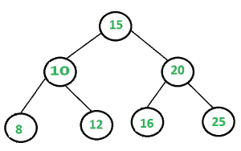

# 二叉树中所有节点的和

> 原文:[https://www.geeksforgeeks.org/sum-nodes-binary-tree/](https://www.geeksforgeeks.org/sum-nodes-binary-tree/)

给出求二叉树中所有元素之和的算法。



在上面的二叉树中 sum = 106。

其思想是递归地调用左子树和、右子树和，并将它们的值添加到当前节点的数据中。

## C++

```
/* Program to print sum of all the elements of a binary tree */
#include <bits/stdc++.h>
using namespace std;

struct Node {
    int key;
    Node* left, *right;
};

/* utility that allocates a new Node with the given key  */
Node* newNode(int key)
{
    Node* node = new Node;
    node->key = key;
    node->left = node->right = NULL;
    return (node);
}

/* Function to find sum of all the elements*/
int addBT(Node* root)
{
    if (root == NULL)
        return 0;
    return (root->key + addBT(root->left) + addBT(root->right));
}

/* Driver program to test above functions*/
int main()
{
    Node* root = newNode(1);
    root->left = newNode(2);
    root->right = newNode(3);
    root->left->left = newNode(4);
    root->left->right = newNode(5);
    root->right->left = newNode(6);
    root->right->right = newNode(7);
    root->right->left->right = newNode(8);

    int sum = addBT(root);
    cout << "Sum of all the elements is: " << sum << endl;

    return 0;
}
```

## Java 语言(一种计算机语言，尤用于创建网站)

```
// Java Program to print sum of
// all the elements of a binary tree
class GFG
{
static class Node
{
    int key;
    Node left, right;
}

/* utility that allocates a new
   Node with the given key */
static Node newNode(int key)
{
    Node node = new Node();
    node.key = key;
    node.left = node.right = null;
    return (node);
}

/* Function to find sum
   of all the elements*/
static int addBT(Node root)
{
    if (root == null)
        return 0;
    return (root.key + addBT(root.left) +
                       addBT(root.right));
}

// Driver Code
public static void main(String args[])
{
    Node root = newNode(1);
    root.left = newNode(2);
    root.right = newNode(3);
    root.left.left = newNode(4);
    root.left.right = newNode(5);
    root.right.left = newNode(6);
    root.right.right = newNode(7);
    root.right.left.right = newNode(8);

    int sum = addBT(root);
    System.out.println("Sum of all the elements is: " + sum);
}
}

// This code is contributed by Arnab Kundu
```

## 蟒蛇 3

```
# Python3 Program to print sum of all
# the elements of a binary tree

# Binary Tree Node

""" utility that allocates a new Node
with the given key """
class newNode:

    # Construct to create a new node
    def __init__(self, key):
        self.key = key
        self.left = None
        self.right = None

# Function to find sum of all the element
def addBT(root):
    if (root == None):
        return 0
    return (root.key + addBT(root.left) +
                       addBT(root.right))

# Driver Code
if __name__ == '__main__':
    root = newNode(1)
    root.left = newNode(2)
    root.right = newNode(3)
    root.left.left = newNode(4)
    root.left.right = newNode(5)
    root.right.left = newNode(6)
    root.right.right = newNode(7)
    root.right.left.right = newNode(8)

    sum = addBT(root)

    print("Sum of all the nodes is:", sum)

# This code is contributed by
# Shubham Singh(SHUBHAMSINGH10)
```

## C#

```
using System;

// C# Program to print sum of
// all the elements of a binary tree
public class GFG
{
public class Node
{
    public int key;
    public Node left, right;
}

/* utility that allocates a new 
   Node with the given key */
public static Node newNode(int key)
{
    Node node = new Node();
    node.key = key;
    node.left = node.right = null;
    return (node);
}

/* Function to find sum 
   of all the elements*/
public static int addBT(Node root)
{
    if (root == null)
    {
        return 0;
    }
    return (root.key + addBT(root.left) + addBT(root.right));
}

// Driver Code
public static void Main(string[] args)
{
    Node root = newNode(1);
    root.left = newNode(2);
    root.right = newNode(3);
    root.left.left = newNode(4);
    root.left.right = newNode(5);
    root.right.left = newNode(6);
    root.right.right = newNode(7);
    root.right.left.right = newNode(8);

    int sum = addBT(root);
    Console.WriteLine("Sum of all the elements is: " + sum);
}
}

// This code is contributed by Shrikant13
```

## java 描述语言

```
<script>
// Javascript Program to print sum of
// all the elements of a binary tree

class Node
{   
    constructor(key)
    {
        this.key=key;
        this.left=this.right=null;
    }
}

/* Function to find sum
   of all the elements*/
function addBT(root)
{
    if (root == null)
        return 0;
    return (root.key + addBT(root.left) +
                       addBT(root.right));
}

// Driver Code
let root = new Node(1);
root.left = new Node(2);
root.right = new Node(3);
root.left.left = new Node(4);
root.left.right = new Node(5);
root.right.left = new Node(6);
root.right.right = new Node(7);
root.right.left.right = new Node(8);

let sum = addBT(root);
document.write("Sum of all the elements is: " + sum);

// This code is contributed by avanitrachhadiya2155
</script>
```

**Output**

```
Sum of all the elements is: 36
```

**方法 2–**解决这个问题的另一种方法是使用**级顺序遍历。**每次从队列中删除节点时，将其添加到 sum 变量中。

## C++

```
#include <bits/stdc++.h>
#include <iostream>
using namespace std;

struct Node {
    int key;
    struct Node *left, *right;
};

// Utility function to create a new node
Node* newNode(int key)
{
    Node* temp = new Node;
    temp->key = key;
    temp->left = temp->right = NULL;
    return (temp);
}

/*Function to find sum of all elements*/
int sumBT(Node* root)
{
      //sum variable to track the sum of
      //all variables.
    int sum = 0;

    queue<Node*> q;

      //Pushing the first level.
    q.push(root);

      //Pushing elements at each level from
      //the tree.
    while (!q.empty()) {
        Node* temp = q.front();
        q.pop();

          //After popping each element from queue
          //add its data to the sum variable.
        sum += temp->key;

        if (temp->left) {
            q.push(temp->left);
        }
        if (temp->right) {
            q.push(temp->right);
        }
    }
    return sum;
}

// Driver program
int main()
{
    // Let us create Binary Tree shown in above example
    Node* root = newNode(1);
    root->left = newNode(2);
    root->right = newNode(3);
    root->left->left = newNode(4);
    root->left->right = newNode(5);
    root->right->left = newNode(6);
    root->right->right = newNode(7);
    root->right->left->right = newNode(8);

    cout << "Sum of all elements in the binary tree is: "
         << sumBT(root);
}

//This code is contributed by Sarthak Delori
```

**Output**

```
Sum of all elements in the binary tree is: 36
```

时间复杂度:O(n)
辅助空间:O(n)

本文由**普拉克里提·古普塔**供稿。如果你喜欢 GeeksforGeeks 并想投稿，你也可以使用[write.geeksforgeeks.org](https://write.geeksforgeeks.org)写一篇文章或者把你的文章邮寄到 review-team@geeksforgeeks.org。看到你的文章出现在极客博客主页上，帮助其他极客。
如果你发现任何不正确的地方，或者你想分享更多关于上面讨论的话题的信息，请写评论。