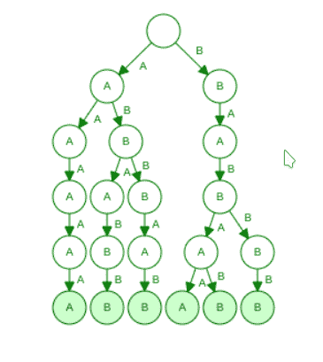

# 通过一次选择任意两个字符串对所有最大长度的 LCP 求和

> 原文:[https://www . geesforgeks . org/通过一次选择任意两个字符串来计算最大长度的所有 lcp 之和/](https://www.geeksforgeeks.org/sum-of-all-lcp-of-maximum-length-by-selecting-any-two-strings-at-a-time/)

给定一个字符串列表，任务是通过一次选择任意两个字符串来找到最大长度的所有 [LCP(最长公共前缀)](https://www.geeksforgeeks.org/longest-common-prefix-using-linked-list/)的总和。
**例:**

> **输入:** str[] = {babab，ababb，abbb，aaaaa，babba，babbb}
> **输出:** 6
> **解释:**
> 选择第 1 和第 5 个字符串=>LCP 的长度= 4，
> 选择第 2 和第 3 个字符串=>LCP 的长度= 2
> LCP 的总和= 4 + 2 = 6
> 
> 
> 
> **输入:**str =[“aa”、“aaaa”、“aaaaaa”、“aaabaaa”、“aaabaa”]
> **输出:** 7
> **说明:**
> 选择第 3(aaaaaaaa)和第 4 串(aaabaaa)=>LCP(AAAA)长度= 4，
> 选择第 2(AAAA)和第 5(aaabaaa)串=>LCP(AAA)长度= 3
> LCP 之和

**天真的方法:**

*   [按照字符串长度的降序排列字符串列表](https://www.geeksforgeeks.org/sort-array-strings-according-string-lengths/)
*   然后从列表中取出第一个字符串，找到列表中所有其他剩余字符串的[最长公共前缀](https://www.geeksforgeeks.org/longest-common-prefix-using-sorting/)，并将其存储在数组中
*   从数组中选择最大值，将其添加到变量答案中，并从列表中删除对应于该总和的字符串对
*   对所有下一个字符串重复上述过程，直到列表为空或到达最后一个字符串
*   可变答案具有最大长度的所有 LCP 的所需总和

**时间复杂度:** O(M*N <sup>2</sup> ，其中 M =最大字符串长度，N =字符串个数。
**高效方法:**
使用 [Trie 数据结构](https://www.geeksforgeeks.org/trie-insert-and-search/)可以获得高效的解决方案。为了找到字符串之间共有的字符数，我们将使用变量“被访问”来跟踪一个字符被访问的次数。
以下是步骤:

*   在 trie 中插入字符串列表，这样列表中的每个字符串都作为一个单独的 trie 节点插入。

*   对于所有最大长度的前缀，从 trie 中最深的节点开始计数。

*   使用 trie 上的深度优先搜索(DFS)遍历来计数来自最深节点的对。

*   如果被访问节点的值不止一个，这意味着在该节点之前有两个或更多具有公共前缀的字符串。

*   将该访问节点的值添加到变量计数中。

*   从当前和以前的节点中减少该访问节点的值，以便必须删除选择用于计算的那对单词。

*   对所有节点重复上述步骤，并返回 count 的值。

以下是上述方法的实现:

## C++

```
// C++ program to find Sum of all LCP
// of maximum length by selecting
// any two Strings at a time

#include <bits/stdc++.h>
using namespace std;

class TrieNode {
public:
    char val;

    // Using map to store the pointers
    // of children nodes for dynamic
    // implementation, for making the
    // program space efiicient
    map<char, TrieNode*> children;

    // Counts the number of times the node
    // is visited while making the trie
    int visited;

    // Initially visited value for all
    // nodes is zero
    TrieNode(char x)
    {
        val = x;
        visited = 0;
    }
};

class Trie {
public:
    TrieNode* head;

    // Head node of the trie is initialize
    // as '\0', after this all strings add
    Trie()
    {
        head = new TrieNode('\0');
    }

    // Function to insert the strings in
    // the trie
    void addWord(string s)
    {
        TrieNode* temp = head;
        const unsigned int n = s.size();

        for (int i = 0; i < n; i++) {

            // Inserting character-by-character
            char ch = s[i];

            // If the node of ch is not present in
            // map make a new node and add in map
            if (!temp->children[ch]) {
                temp->children[ch] = new TrieNode(ch);
            }
            temp = temp->children[ch];
            temp->visited++;
        }
    }

    // Recursive function to calculate the
    // answer argument is passed by reference
    int dfs(TrieNode* node, int& ans, int depth)
    {
        // To store changed visited values from
        // children of this node i.e. number of
        // nodes visited by its children
        int vis = 0;
        for (auto child : node->children) {
            vis += dfs(child.second, ans, depth + 1);
        }

        // Updating the visited variable, telling
        // number of nodes that have
        // already been visited by its children
        node->visited -= vis;
        int string_pair = 0;

        // If node->visited > 1, means more than
        // one string has prefix up till this node
        // common in them
        if (node->visited > 1) {

            // Number of string pair with current
            // node common in them
            string_pair = (node->visited / 2);
            ans += (depth * string_pair);

            // Updating visited variable of current node
            node->visited -= (2 * string_pair);
        }

        // Returning the total number of nodes
        // already visited that needs to be
        // updated to previous node
        return (2 * string_pair + vis);
    }

    // Function to run the dfs function for the
    // first time and give the answer variable
    int dfshelper()
    {

        // Stores the final answer
        // as sum of all depths
        int ans = 0;
        dfs(head, ans, 0);
        return ans;
    }
};

// Driver Function
int main()
{
    Trie T;
    string str[]
        = { "babab", "ababb", "abbab",
            "aaaaa", "babaa", "babbb" };

    int n = 6;
    for (int i = 0; i < n; i++) {
        T.addWord(str[i]);
    }
    int ans = T.dfshelper();
    cout << ans << endl;

    return 0;
}
```

## Java 语言(一种计算机语言，尤用于创建网站)

```
// Java program to find Sum of all LCP
// of maximum length by selecting
// any two Strings at a time
import java.util.*;

class GFG
{

static class TrieNode
{
    char val;

    // Using map to store the pointers
    // of children nodes for dynamic
    // implementation, for making the
    // program space efiicient
    HashMap<Character, TrieNode> children;

    // Counts the number of times the node
    // is visited while making the trie
    int visited;

    // Initially visited value for all
    // nodes is zero
    TrieNode(char x)
    {
        val = x;
        visited = 0;
        children = new HashMap<>();
    }
}

static class Trie
{

    TrieNode head;
    int ans;

    // Head node of the trie is initialize
    // as '\0', after this all Strings add
    Trie()
    {
        head = new TrieNode('\0');
        ans = 0;
    }

    // Function to insert the Strings in
    // the trie
    void addWord(String s)
    {
        TrieNode temp = head;
        int n = s.length();

        for (int i = 0; i < n; i++)
        {

            // Inserting character-by-character
            char ch = s.charAt(i);

            // If the node of ch is not present in
            // map make a new node and add in map
            if (temp.children.get(ch) == null)
            {
                temp.children.put(ch, new TrieNode(ch));
            }
            temp = temp.children.get(ch);
            temp.visited++;
        }
    }

    // Recursive function to calculate the
    // answer argument is passed by reference
    int dfs(TrieNode node, int depth)
    {
        // To store changed visited values from
        // children of this node i.e. number of
        // nodes visited by its children
        int vis = 0;
        Iterator hmIterator = node.children.entrySet().iterator();
        while (hmIterator.hasNext())
        {
            Map.Entry child = (Map.Entry)hmIterator.next();
            vis += dfs((TrieNode)child.getValue(), depth + 1);
        }

        // Updating the visited variable, telling
        // number of nodes that have
        // already been visited by its children
        node.visited -= vis;
        int String_pair = 0;

        // If node.visited > 1, means more than
        // one String has prefix up till this node
        // common in them
        if (node.visited > 1)
        {

            // Number of String pair with current
            // node common in them
            String_pair = (node.visited / 2);
            ans += (depth * String_pair);

            // Updating visited variable of current node
            node.visited -= (2 * String_pair);
        }

        // Returning the total number of nodes
        // already visited that needs to be
        // updated to previous node
        return (2 * String_pair + vis);
    }

    // Function to run the dfs function for the
    // first time and give the answer variable
    int dfshelper()
    {

        // Stores the final answer
        // as sum of all depths
        ans = 0;
        dfs(head, 0);
        return ans;
    }
}

// Driver code
public static void main(String args[])
{
    Trie T = new Trie();
    String str[]
        = { "babab", "ababb", "abbab",
            "aaaaa", "babaa", "babbb" };

    int n = 6;
    for (int i = 0; i < n; i++)
    {
        T.addWord(str[i]);
    }
    int ans = T.dfshelper();
    System.out.println( ans );
}
}
// This code is contributed by Arnab Kundu
```

## java 描述语言

```
<script>
// Javascript program to find Sum of all LCP
// of maximum length by selecting
// any two Strings at a time

class TrieNode
{
    // Initially visited value for all
    // nodes is zero
    constructor(x)
    {
        this.val = x;

        // Counts the number of times the node
    // is visited while making the trie
        this.visited = 0;

        // Using map to store the pointers
    // of children nodes for dynamic
    // implementation, for making the
    // program space efiicient
        this.children = new Map();
    }
}

class Trie
{
    // Head node of the trie is initialize
    // as '\0', after this all Strings add
    constructor()
    {
        this.head = new TrieNode('\0');
        this.ans = 0;
    }

    // Function to insert the Strings in
    // the trie
    addWord(s)
    {
        let temp = this.head;
        let n = s.length;

        for (let i = 0; i < n; i++)
        {

            // Inserting character-by-character
            let ch = s[i];

            // If the node of ch is not present in
            // map make a new node and add in map
            if (temp.children.get(ch) == null)
            {
                temp.children.set(ch, new TrieNode(ch));
            }
            temp = temp.children.get(ch);
            temp.visited++;
        }
    }

    // Recursive function to calculate the
    // answer argument is passed by reference
    dfs(node,depth)
    {
        // To store changed visited values from
        // children of this node i.e. number of
        // nodes visited by its children
        let vis = 0;

        for(let [key, value] of node.children.entries())
        {

            vis += this.dfs(value, depth + 1);
        }

        // Updating the visited variable, telling
        // number of nodes that have
        // already been visited by its children
        node.visited -= vis;
        let String_pair = 0;

        // If node.visited > 1, means more than
        // one String has prefix up till this node
        // common in them
        if (node.visited > 1)
        {

            // Number of String pair with current
            // node common in them
            String_pair = (node.visited / 2);
            this.ans += (depth * String_pair);

            // Updating visited variable of current node
            node.visited -= (2 * String_pair);
        }

        // Returning the total number of nodes
        // already visited that needs to be
        // updated to previous node
        return (2 * String_pair + vis);
    }

    // Function to run the dfs function for the
    // first time and give the answer variable
    dfshelper()
    {
        // Stores the final answer
        // as sum of all depths
        this.ans = 0;
        this.dfs(this.head, 0);
        return this.ans;
    }
}

// Driver code
let T = new Trie();
let str
= [ "babab", "ababb", "abbab",
   "aaaaa", "babaa", "babbb" ];

let n = 6;
for (let i = 0; i < n; i++)
{
    T.addWord(str[i]);
}
let ans = T.dfshelper();
document.write( ans );

// This code is contributed by unknown2108
</script>
```

**Output:** 

```
6
```

**时间复杂度:**
用于插入 trie 中的所有字符串: **O(MN)**
用于执行 trie 遍历: **O(26*M) ~ O(M)**
因此，整体时间复杂度: **O(M*N)** ，其中:

```
N = Number of strings
M = Length of the largest string
```

**辅助空间:** O(M)