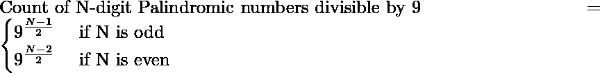
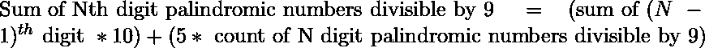

# 用数字 1 至 9 构成的所有可被 9 整除的 N 位回文数字的总和

> 原文:[https://www . geesforgeks . org/所有 n 位回文数字的总和-可被 9 整除-使用数字-1 到-9/](https://www.geeksforgeeks.org/sum-of-all-n-digit-palindromic-numbers-divisible-by-9-formed-using-digits-1-to-9/)

给定一个数字 **N** ，任务是找出所有能被 9 整除的 N 位回文数字(由 1 到 9 的数字组成)的和。

**示例:**

> **输入:** N = 1
> **输出:** 9
> **解释:**
> 只有 9 是 1 位数可被 9 整除的回文数
> 
> **输入:** N = 3
> **输出:** 4995
> **解释:**
> 可被 9 整除的三位数回文数字为–
> 171、252、333、414、585、666、747、828、999

**方法:**问题中的关键观察是[如果一个数能被 9 整除，那么这个数的位数之和也能被 9 整除](https://www.geeksforgeeks.org/check-large-number-divisible-9-not/)。另一个观察是，如果我们用 1 到 9 的数字来计算 N 位回文数字的数量，那么可以观察到

> 每个数字的出现=(N 位数字的计数/ 9)

因此，

1.  首先找出能被 9 整除的 N 位回文数的个数，如:
    
2.  那么如果 N 是 1 或 2，和将分别是简单的 9 和 99，因为它们是唯一的 1 和 2 位数的回文数字。
3.  If N > 2, then the sum for Nth digit palindromic numbers divisible by 9 is
    

    下面是上述方法的实现:

    ## C++

    ```
    // C++ implementation to find the sum
    // of all the N digit palindromic
    // numbers divisible by 9

    #include <bits/stdc++.h>

    using namespace std;

    // Function for finding count of
    // N digits palindrome which
    // are divisible by 9
    int countPalindrome(int n)
    {
        int count;

        // if N is odd
        if (n % 2 == 1) {
            count = pow(9, (n - 1) / 2);
        }
        // if N is even
        else {
            count = pow(9, (n - 2) / 2);
        }
        return count;
    }

    // Function for finding sum of N
    // digits palindrome which are
    // divisible by 9
    int sumPalindrome(int n)
    {
        // count the possible
        // number of palindrome
        int count = countPalindrome(n);

        int res = 0;

        if (n == 1)
            return 9;
        if (n == 2)
            return 99;

        for (int i = 0; i < n; i++) {
            res = res * 10 + count * 5;
        }

        return res;
    }

    // Driver Code
    int main()
    {
        int n = 3;
        cout << sumPalindrome(n);
        return 0;
    }
    ```

    ## Java 语言(一种计算机语言，尤用于创建网站)

    ```
    // Java implementation to find the sum
    // of all the N digit palindromic
    // numbers divisible by 9
    import java.util.*;

    class GFG{

    // Function for finding count of
    // N digits palindrome which
    // are divisible by 9
    static int countPalindrome(int n)
    {
        int count;

        // If N is odd
        if (n % 2 == 1)
        {
            count = (int)Math.pow(9, (n - 1) / 2);
        }

        // If N is even
        else
        {
            count = (int)Math.pow(9, (n - 2) / 2);
        }
        return count;
    }

    // Function for finding sum of N
    // digits palindrome which are
    // divisible by 9
    static int sumPalindrome(int n)
    {

        // Count the possible
        // number of palindrome
        int count = countPalindrome(n);

        int res = 0;

        if (n == 1)
            return 9;
        if (n == 2)
            return 99;

        for(int i = 0; i < n; i++)
        {
           res = res * 10 + count * 5;
        }

        return res;
    }

    // Driver Code
    public static void main(String[] args)
    {
        int n = 3;

        System.out.println(sumPalindrome(n));
    }
    }

    // This code is contributed by ANKITKUMAR34
    ```

    ## 蟒蛇 3

    ```
    # Python3 implementation to find the 
    # sum of all the N digit palindromic
    # numbers divisible by 9

    # Function for finding count of
    # N digits palindrome which
    # are divisible by 9
    def countPalindrome(n):

        count = 0

        # If N is odd
        if (n % 2 == 1):
            count = pow(9, (n - 1) // 2)

        # If N is even
        else:
            count = pow(9, (n - 2) // 2)

        return count

    # Function for finding sum of N
    # digits palindrome which are
    # divisible by 9
    def sumPalindrome(n):

        # Count the possible
        # number of palindrome
        count = countPalindrome(n)

        res = 0

        if (n == 1):
            return 9
        if (n == 2):
            return 99

        for i in range(n):
            res = res * 10 + count * 5

        return res

    # Driver Code
    n = 3

    print(sumPalindrome(n))

    # This code is contributed by ANKITKUMAR34
    ```

    ## C#

    ```
    // C# implementation to find the sum
    // of all the N digit palindromic
    // numbers divisible by 9
    using System;

    class GFG{

    // Function for finding count of
    // N digits palindrome which
    // are divisible by 9
    static int countPalindrome(int n)
    {
        int count;

        // If N is odd
        if (n % 2 == 1)
        {
            count = (int)Math.Pow(9, (n - 1) / 2);
        }

        // If N is even
        else
        {
            count = (int)Math.Pow(9, (n - 2) / 2);
        }
        return count;
    }

    // Function for finding sum of N
    // digits palindrome which are
    // divisible by 9
    static int sumPalindrome(int n)
    {

        // Count the possible
        // number of palindrome
        int count = countPalindrome(n);

        int res = 0;

        if (n == 1)
            return 9;
        if (n == 2)
            return 99;

        for(int i = 0; i < n; i++)
        {
           res = res * 10 + count * 5;
        }

        return res;
    }

    // Driver Code
    public static void Main(String[] args)
    {
        int n = 3;

        Console.WriteLine(sumPalindrome(n));
    }
    }

    // This code is contributed by Amit Katiyar
    ```

    **Output:**

    ```
    4995

    ```