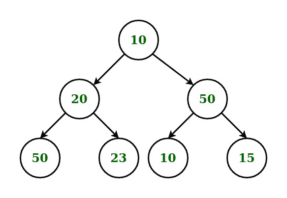
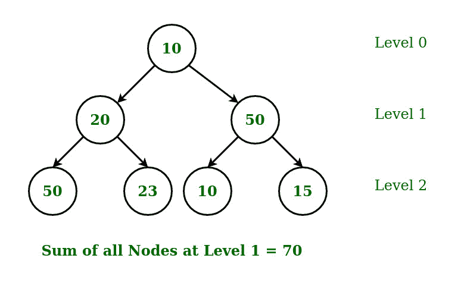
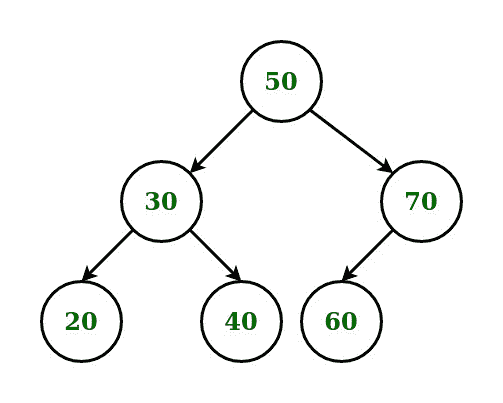

# 二叉树中第 k 层所有节点的和

> 原文:[https://www . geeksforgeeks . org/二进制树中第 k 层所有节点的总和/](https://www.geeksforgeeks.org/sum-of-all-nodes-at-kth-level-in-a-binary-tree/)

给定一个带有 **N** 节点的[二叉树](https://www.geeksforgeeks.org/binary-tree-data-structure/)和一个整数 **K** ，任务是找出存在于 **K <sup>第</sup>** 级的所有节点的和。
**举例:**

> **输入:**
> 
> 
> 
> K = 1
> **输出:** 70
> 
> 
> 
> **输入:**
> 
> 
> 
> K = 2
> **输出:** 120

**进场:**

*   使用[级顺序遍历](https://www.geeksforgeeks.org/level-order-tree-traversal/)和[队列](https://www.geeksforgeeks.org/queue-data-structure/)遍历[二叉树](https://www.geeksforgeeks.org/binary-tree-data-structure/)
*   在遍历过程中，将每个元素弹出队列，并将其子元素(如果可用)推入队列。
*   跟踪[二叉树](https://www.geeksforgeeks.org/binary-tree-data-structure/)的当前级别。
*   要跟踪当前级别，声明一个变量**级别**，并在从父级遍历子级时增加它。
*   当树的当前级别，即变量**级别**满足所需的 **K <sup>第</sup>T5】级别时，从队列中弹出元素并计算它们的总和。**

以下是上述方法的实现:

## C++

```
// C++ implementation of the approach

#include <bits/stdc++.h>
using namespace std;

// Binary tree node consists of data, a
// pointer to the left child and a
// pointer to the right child
struct node {
    int data;
    struct node* left;
    struct node* right;
};

// Function to create new Binary Tree node
struct node* newNode(int data)
{
    struct node* temp = new struct node;
    temp->data = data;
    temp->left = nullptr;
    temp->right = nullptr;
    return temp;
};

// Function to return the sum of all
// the nodes at Kth level using
// level order traversal
int sumOfNodesAtNthLevel(struct node* root,
                         int k)
{

    // If the current node is NULL
    if (root == nullptr)
        return 0;

    // Create Queue
    queue<struct node*> que;

    // Enqueue the root node
    que.push(root);

    // Level is used to track
    // the current level
    int level = 0;

    // To store the sum of nodes
    // at the Kth level
    int sum = 0;

    // flag is used to break out of
    // the loop after the sum of all
    // the nodes at Nth level is found
    int flag = 0;

    // Iterate the queue till its not empty
    while (!que.empty()) {

        // Calculate the number of nodes
        // in the current level
        int size = que.size();

        // Process each node of the current
        // level and enqueue their left
        // and right child to the queue
        while (size--) {
            struct node* ptr = que.front();
            que.pop();

            // If the current level matches the
            // required level then calculate the
            // sum of all the nodes at that level
            if (level == k) {

                // Flag initialized to 1
                // indicates that sum of the
                // required level is calculated
                flag = 1;

                // Calculating the sum of the nodes
                sum += ptr->data;
            }
            else {

                // Traverse to the left child
                if (ptr->left)
                    que.push(ptr->left);

                // Traverse to the right child
                if (ptr->right)
                    que.push(ptr->right);
            }
        }

        // Increment the variable level
        // by 1 for each level
        level++;

        // Break out from the loop after the sum
        // of nodes at K level is found
        if (flag == 1)
            break;
    }
    return sum;
}

// Driver code
int main()
{
    struct node* root = new struct node;

    // Tree Construction
    root = newNode(50);
    root->left = newNode(30);
    root->right = newNode(70);
    root->left->left = newNode(20);
    root->left->right = newNode(40);
    root->right->left = newNode(60);
    int level = 2;
    int result = sumOfNodesAtNthLevel(root, level);

    // Printing the result
    cout << result;

    return 0;
}
```

## Java 语言(一种计算机语言，尤用于创建网站)

```
// Java implementation of the approach
import java.util.*;

class GFG
{

// Binary tree node consists of data, a
// pointer to the left child and a
// pointer to the right child
static class node
{
    int data;
    node left;
    node right;
};

// Function to create new Binary Tree node
static node newNode(int data)
{
    node temp = new node();
    temp.data = data;
    temp.left = null;
    temp.right = null;
    return temp;
};

// Function to return the sum of all
// the nodes at Kth level using
// level order traversal
static int sumOfNodesAtNthLevel(node root,
                                int k)
{

    // If the current node is null
    if (root == null)
        return 0;

    // Create Queue
    Queue<node> que = new LinkedList<>();

    // Enqueue the root node
    que.add(root);

    // Level is used to track
    // the current level
    int level = 0;

    // To store the sum of nodes
    // at the Kth level
    int sum = 0;

    // flag is used to break out of
    // the loop after the sum of all
    // the nodes at Nth level is found
    int flag = 0;

    // Iterate the queue till its not empty
    while (!que.isEmpty())
    {

        // Calculate the number of nodes
        // in the current level
        int size = que.size();

        // Process each node of the current
        // level and enqueue their left
        // and right child to the queue
        while (size-- >0)
        {
            node ptr = que.peek();
            que.remove();

            // If the current level matches the
            // required level then calculate the
            // sum of all the nodes at that level
            if (level == k)
            {

                // Flag initialized to 1
                // indicates that sum of the
                // required level is calculated
                flag = 1;

                // Calculating the sum of the nodes
                sum += ptr.data;
            }
            else {

                // Traverse to the left child
                if (ptr.left != null)
                    que.add(ptr.left);

                // Traverse to the right child
                if (ptr.right != null)
                    que.add(ptr.right);
            }
        }

        // Increment the variable level
        // by 1 for each level
        level++;

        // Break out from the loop after the sum
        // of nodes at K level is found
        if (flag == 1)
            break;
    }
    return sum;
}

// Driver code
public static void main(String[] args)
{
    node root = new node();

    // Tree Construction
    root = newNode(50);
    root.left = newNode(30);
    root.right = newNode(70);
    root.left.left = newNode(20);
    root.left.right = newNode(40);
    root.right.left = newNode(60);
    int level = 2;
    int result = sumOfNodesAtNthLevel(root, level);

    // Printing the result
    System.out.print(result);
}
}

// This code is contributed by 29AjayKumar
```

## 蟒蛇 3

```
# Python3 implementation of the approach

# Binary tree node consists of data, a
# pointer to the left child and a
# pointer to the right child
class newNode :
    def __init__(self, data) :
        self.data = data;
        self.left = None;
        self.right = None;

# Function to return the sum of all
# the nodes at Kth level using
# level order traversal
def sumOfNodesAtNthLevel(root, k) :

    # If the current node is NULL
    if (root == None) :
        return 0;

    # Create Queue
    que = [];

    # Enqueue the root node
    que.append(root);

    # Level is used to track
    # the current level
    level = 0;

    # To store the sum of nodes
    # at the Kth level
    sum = 0;

    # flag is used to break out of
    # the loop after the sum of all
    # the nodes at Nth level is found
    flag = 0;

    # Iterate the queue till its not empty
    while (len(que) != 0) :

        # Calculate the number of nodes
        # in the current level
        size = len(que);

        # Process each node of the current
        # level and enqueue their left
        # and right child to the queue
        while (size != 0) :

            size -= 1;
            ptr = que[0];
            que.pop(0);

            # If the current level matches the
            # required level then calculate the
            # sum of all the nodes at that level
            if (level == k) :

                # Flag initialized to 1
                # indicates that sum of the
                # required level is calculated
                flag = 1;

                # Calculating the sum of the nodes
                sum += ptr.data;

            else :
                # Traverse to the left child
                if (ptr.left) :
                    que.append(ptr.left);

                # Traverse to the right child
                if (ptr.right) :
                    que.append(ptr.right);

        # Increment the variable level
        # by 1 for each level
        level += 1;

        # Break out from the loop after the sum
        # of nodes at K level is found
        if (flag == 1) :
            break;

    return sum;

# Driver code
if __name__ == "__main__" :

    # Tree Construction
    root = newNode(50);
    root.left = newNode(30);
    root.right = newNode(70);
    root.left.left = newNode(20);
    root.left.right = newNode(40);
    root.right.left = newNode(60);
    level = 2;
    result = sumOfNodesAtNthLevel(root, level);

    # Printing the result
    print(result);

# This code is contributed by AnkitRai01
```

## C#

```
// C# implementation of the approach
using System;
using System.Collections.Generic;

class GFG
{

// Binary tree node consists of data, a
// pointer to the left child and a
// pointer to the right child
class node
{
    public int data;
    public node left;
    public node right;
};

// Function to create new Binary Tree node
static node newNode(int data)
{
    node temp = new node();
    temp.data = data;
    temp.left = null;
    temp.right = null;
    return temp;
}

// Function to return the sum of all
// the nodes at Kth level using
// level order traversal
static int sumOfNodesAtNthLevel(node root,
                                int k)
{

    // If the current node is null
    if (root == null)
        return 0;

    // Create Queue
    List<node> que = new List<node>();

    // Enqueue the root node
    que.Add(root);

    // Level is used to track
    // the current level
    int level = 0;

    // To store the sum of nodes
    // at the Kth level
    int sum = 0;

    // flag is used to break out of
    // the loop after the sum of all
    // the nodes at Nth level is found
    int flag = 0;

    // Iterate the queue till its not empty
    while (que.Count != 0)
    {

        // Calculate the number of nodes
        // in the current level
        int size = que.Count;

        // Process each node of the current
        // level and enqueue their left
        // and right child to the queue
        while (size-- >0)
        {
            node ptr = que[0];
            que.RemoveAt(0);

            // If the current level matches the
            // required level then calculate the
            // sum of all the nodes at that level
            if (level == k)
            {

                // Flag initialized to 1
                // indicates that sum of the
                // required level is calculated
                flag = 1;

                // Calculating the sum of the nodes
                sum += ptr.data;
            }
            else
            {

                // Traverse to the left child
                if (ptr.left != null)
                    que.Add(ptr.left);

                // Traverse to the right child
                if (ptr.right != null)
                    que.Add(ptr.right);
            }
        }

        // Increment the variable level
        // by 1 for each level
        level++;

        // Break out from the loop after the sum
        // of nodes at K level is found
        if (flag == 1)
            break;
    }
    return sum;
}

// Driver code
public static void Main(String[] args)
{
    node root = new node();

    // Tree Construction
    root = newNode(50);
    root.left = newNode(30);
    root.right = newNode(70);
    root.left.left = newNode(20);
    root.left.right = newNode(40);
    root.right.left = newNode(60);
    int level = 2;
    int result = sumOfNodesAtNthLevel(root, level);

    // Printing the result
    Console.Write(result);
}
}

// This code is contributed by PrinciRaj1992
```

## java 描述语言

```
<script>

// JavaScript implementation of the approach

// Binary tree node consists of data, a
// pointer to the left child and a
// pointer to the right child
class node
{
    constructor()
    {
        this.data = 0;
        this.left = null;
        this.right = null;
    }
};

// Function to create new Binary Tree node
function newNode(data)
{
    var temp = new node();
    temp.data = data;
    temp.left = null;
    temp.right = null;
    return temp;
}

// Function to return the sum of all
// the nodes at Kth level using
// level order traversal
function sumOfNodesAtNthLevel(root, k)
{

    // If the current node is null
    if (root == null)
        return 0;

    // Create Queue
    var que = [];

    // Enqueue the root node
    que.push(root);

    // Level is used to track
    // the current level
    var level = 0;

    // To store the sum of nodes
    // at the Kth level
    var sum = 0;

    // flag is used to break out of
    // the loop after the sum of all
    // the nodes at Nth level is found
    var flag = 0;

    // Iterate the queue till its not empty
    while (que.length != 0)
    {

        // Calculate the number of nodes
        // in the current level
        var size = que.length;

        // Process each node of the current
        // level and enqueue their left
        // and right child to the queue
        while (size-- >0)
        {
            var ptr = que[0];
            que.shift();

            // If the current level matches the
            // required level then calculate the
            // sum of all the nodes at that level
            if (level == k)
            {

                // Flag initialized to 1
                // indicates that sum of the
                // required level is calculated
                flag = 1;

                // Calculating the sum of the nodes
                sum += ptr.data;
            }
            else
            {

                // Traverse to the left child
                if (ptr.left != null)
                    que.push(ptr.left);

                // Traverse to the right child
                if (ptr.right != null)
                    que.push(ptr.right);
            }
        }

        // Increment the variable level
        // by 1 for each level
        level++;

        // Break out from the loop after the sum
        // of nodes at K level is found
        if (flag == 1)
            break;
    }
    return sum;
}

// Driver code
var root = new node();
// Tree Construction
root = newNode(50);
root.left = newNode(30);
root.right = newNode(70);
root.left.left = newNode(20);
root.left.right = newNode(40);
root.right.left = newNode(60);
var level = 2;
var result = sumOfNodesAtNthLevel(root, level);
// Printing the result
document.write(result);

</script>
```

**Output:** 

```
120
```

**时间复杂度:** O(N)