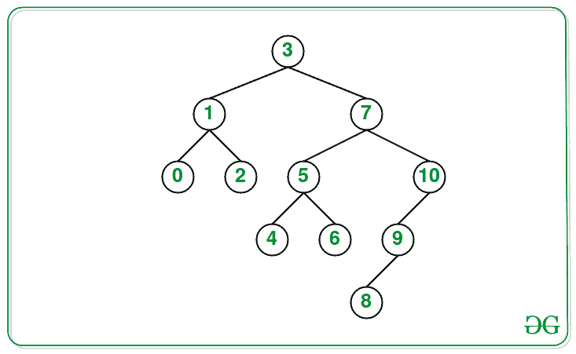
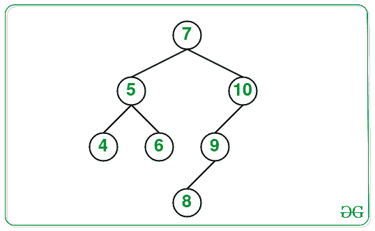

# BST 中距离给定节点距离为 K 处具有较小值的所有节点的总和

> 原文:[https://www . geeksforgeeks . org/距离给定 bst 中节点 k 距离值较小的所有节点的总和/](https://www.geeksforgeeks.org/sum-of-all-nodes-with-smaller-values-at-a-distance-k-from-a-given-node-in-a-bst/)

给定一个[二叉查找树](https://www.geeksforgeeks.org/binary-search-tree-set-1-search-and-insertion/)、一个**目标节点**和一个整数值 **K** ，任务是找出距离目标节点 **K** 距离值小于目标节点的所有节点的和。

**示例:**

> **输入:**目标= 7，K = 2
> 
> 
> 
> **输出:** 11
> **说明:**
> 距节点 7 距离为 K(= 2)的节点为 1、4、6。因此，节点的总和是 11。
> 
> **输入:**目标= 5，K = 1
> 
> 
> 
> **输出:** 4

**方法:**给定的问题可以通过对目标节点下方的 **K** 距离执行 [DFS 遍历](https://www.geeksforgeeks.org/depth-first-search-or-dfs-for-a-graph/)并对目标节点上方的 **K** 距离执行 DFS 遍历来解决。按照以下步骤解决问题:

*   定义一个[函数](https://www.geeksforgeeks.org/functions-in-c/) **kDistanceDownSum(根，k，& sum)** ，并执行以下步骤:
    *   对于[基本情况](https://www.geeksforgeeks.org/recursion/)，检查**根**是否为**零点**和 **k** 是否小于 **0** ，然后[从功能](https://www.geeksforgeeks.org/c-function-argument-return-values/)返回。
    *   如果 **k** 的值等于 **0** ，则将**根- >值**加到变量**和**上并返回。
    *   对左右子树调用相同的函数 **kDistanceDownSum(根- >左，k-1，sum)** 和 **kDistanceDownSum(根- >右，k-1，sum)** 。
*   对于基本情况，检查**根**是否为**空**，然后返回 **-1** 。
*   如果**根**与**目标**相同，则调用[函数](https://www.geeksforgeeks.org/functions-in-c/) **kDistanceDownSum(根- > left，k–1，sum)** 计算第一类节点的总和，并返回 **0** (不可能有第二类节点)。
*   将变量 **dl** 初始化为 **-1** ，如果**目标**小于根，则将 **dl** 的值设置为函数**kdistansum(根- >左，目标 k，求和)**返回的值。
*   如果 **dl** 的值不等于 **-1** ，那么如果**和**等于 **(dl + 1)** ，那么将**根- >数据**的值加到**和**上，然后返回 **-1** 。
*   同样，将变量 **dr** 初始化为 **-1** ，如果**目标**大于**根**，则将 **dr** 的值更新为**kdistanceum(根- >右，目标 k，sum)** 返回的值。
*   如果 **dr** 的值不等于 **-1** ，那么如果 **sum** 的值等于 **(dr + 1)** ，那么将**根- >数据**的值加到 **sum** 上。否则，调用函数**kDistanceDownSum(root->left，k–dr–2，sum)** 并返回 **(1 + dr)** 。
*   执行上述步骤后，打印**和**的值作为结果总和。

以下是上述方法的实施情况:

## C++

```
// C++ program for the above approach

#include <bits/stdc++.h>
using namespace std;

// Structure of Tree
struct TreeNode {

    int data;
    TreeNode* left;
    TreeNode* right;

    // Constructor
    TreeNode(int data)
    {
        this->data = data;
        this->left = NULL;
        this->right = NULL;
    }
};

// Function to add the node to the sum
// below the target node
void kDistanceDownSum(TreeNode* root,
                      int k, int& sum)
{

    // Base Case
    if (root == NULL || k < 0)
        return;

    // If Kth distant node is reached
    if (k == 0) {
        sum += root->data;
        return;
    }

    // Recur for the left and the
    // right subtrees
    kDistanceDownSum(root->left,
                     k - 1, sum);
    kDistanceDownSum(root->right,
                     k - 1, sum);
}

// Function to find the K distant nodes
// from target node, it returns -1 if
// target node is not present in tree
int kDistanceSum(TreeNode* root,
                 int target,
                 int k, int& sum)
{
    // Base Case 1
    if (root == NULL)
        return -1;

    // If target is same as root.
    if (root->data == target) {
        kDistanceDownSum(root->left,
                         k - 1, sum);
        return 0;
    }

    // Recurr for the left subtree
    int dl = -1;

    // Tree is BST so reduce the
    // search space
    if (target < root->data) {
        dl = kDistanceSum(root->left,
                          target, k, sum);
    }

    // Check if target node was found
    // in left subtree
    if (dl != -1) {

        // If root is at distance k from
        // the target
        if (dl + 1 == k)
            sum += root->data;

        // Node less than target will be
        // present in left
        return -1;
    }

    // When node is not present in the
    // left subtree
    int dr = -1;
    if (target > root->data) {
        dr = kDistanceSum(root->right,
                          target, k, sum);
    }

    if (dr != -1) {

        // If Kth distant node is reached
        if (dr + 1 == k)
            sum += root->data;

        // Node less than target at k
        // distance maybe present in the
        // left tree
        else
            kDistanceDownSum(root->left,
                             k - dr - 2, sum);

        return 1 + dr;
    }

    // If target was not present in the
    // left nor in right subtree
    return -1;
}

// Function to insert a node in BST
TreeNode* insertNode(int data,
                     TreeNode* root)
{
    // If root is NULL
    if (root == NULL) {
        TreeNode* node = new TreeNode(data);
        return node;
    }

    // Insert the data in right half
    else if (data > root->data) {
        root->right = insertNode(
            data, root->right);
    }

    // Insert the data in left half
    else if (data <= root->data) {
        root->left = insertNode(
            data, root->left);
    }

    // Return the root node
    return root;
}

// Function to find the sum of K distant
// nodes from the target node having
// value less than target node
void findSum(TreeNode* root, int target,
             int K)
{

    // Stores the sum of nodes having
    // values < target at K distance
    int sum = 0;

    kDistanceSum(root, target, K, sum);

    // Print the resultant sum
    cout << sum;
}

// Driver Code
int main()
{
    TreeNode* root = NULL;
    int N = 11;
    int tree[] = { 3, 1, 7, 0, 2, 5,
                   10, 4, 6, 9, 8 };

    // Create the Tree
    for (int i = 0; i < N; i++) {
        root = insertNode(tree[i], root);
    }

    int target = 7;
    int K = 2;
    findSum(root, target, K);

    return 0;
}
```

## Java 语言(一种计算机语言，尤用于创建网站)

```
// Java program for the above approach
import java.util.*;

public class GFG{
    static int sum;

// Structure of Tree
static class TreeNode {

    int data;
    TreeNode left;
    TreeNode right;

    // Constructor
    TreeNode(int data)
    {
        this.data = data;
        this.left = null;
        this.right = null;
    }
};

// Function to add the node to the sum
// below the target node
static void kDistanceDownSum(TreeNode root,
                      int k)
{

    // Base Case
    if (root == null || k < 0)
        return;

    // If Kth distant node is reached
    if (k == 0) {
        sum += root.data;
        return;
    }

    // Recur for the left and the
    // right subtrees
    kDistanceDownSum(root.left,
                     k - 1);
    kDistanceDownSum(root.right,
                     k - 1);
}

// Function to find the K distant nodes
// from target node, it returns -1 if
// target node is not present in tree
static int kDistanceSum(TreeNode root,
                 int target,
                 int k)
{
    // Base Case 1
    if (root == null)
        return -1;

    // If target is same as root.
    if (root.data == target) {
        kDistanceDownSum(root.left,
                         k - 1);
    return 0;
    }

    // Recurr for the left subtree
    int dl = -1;

    // Tree is BST so reduce the
    // search space
    if (target < root.data) {
        dl = kDistanceSum(root.left,
                          target, k);
    }

    // Check if target node was found
    // in left subtree
    if (dl != -1) {

        // If root is at distance k from
        // the target
        if (dl + 1 == k)
            sum += root.data;

        // Node less than target will be
        // present in left
        return -1;
    }

    // When node is not present in the
    // left subtree
    int dr = -1;
    if (target > root.data) {
        dr = kDistanceSum(root.right,
                          target, k);
    }

    if (dr != -1) {

        // If Kth distant node is reached
        if (dr + 1 == k)
            sum += root.data;

        // Node less than target at k
        // distance maybe present in the
        // left tree
        else
            kDistanceDownSum(root.left,
                             k - dr - 2);

        return 1 + dr;
    }

    // If target was not present in the
    // left nor in right subtree
    return -1;
}

// Function to insert a node in BST
static TreeNode insertNode(int data,
                     TreeNode root)
{
    // If root is null
    if (root == null) {
        TreeNode node = new TreeNode(data);
        return node;
    }

    // Insert the data in right half
    else if (data > root.data) {
        root.right = insertNode(
            data, root.right);
    }

    // Insert the data in left half
    else if (data <= root.data) {
        root.left = insertNode(
            data, root.left);
    }

    // Return the root node
    return root;
}

// Function to find the sum of K distant
// nodes from the target node having
// value less than target node
static void findSum(TreeNode root, int target,
             int K)
{

    // Stores the sum of nodes having
    // values < target at K distance
    sum = 0;

    kDistanceSum(root, target, K);

    // Print the resultant sum
    System.out.print(sum);
}

// Driver Code
public static void main(String[] args)
{
    TreeNode root = null;
    int N = 11;
    int tree[] = { 3, 1, 7, 0, 2, 5,
                   10, 4, 6, 9, 8 };

    // Create the Tree
    for (int i = 0; i < N; i++) {
        root = insertNode(tree[i], root);
    }

    int target = 7;
    int K = 2;
    findSum(root, target, K);

}
}

// This code is contributed by 29AjayKumar
```

## 蟒蛇 3

```
# python 3 program for the above approach

# Structure of Tree
sum = 0

class Node:
    # A constructor to create a new node
    def __init__(self, data):
        self.data = data
        self.left = None
        self.right = None

# Function to add the node to the sum
# below the target node
def kDistanceDownSum(root, k):
    global sum
    # Base Case
    if (root == None or k < 0):
        return

    # If Kth distant node is reached
    if (k == 0):
        sum += root.data
        return

    # Recur for the left and the
    # right subtrees
    kDistanceDownSum(root.left,k - 1)
    kDistanceDownSum(root.right,k - 1)

# Function to find the K distant nodes
# from target node, it returns -1 if
# target node is not present in tree
def kDistanceSum(root, target, k):
    global sum
    # Base Case 1
    if (root == None):
        return -1

    # If target is same as root.
    if (root.data == target):
        kDistanceDownSum(root.left,k - 1)
        return 0

    # Recurr for the left subtree
    dl = -1

    # Tree is BST so reduce the
    # search space
    if (target < root.data):
        dl = kDistanceSum(root.left, target, k)

    # Check if target node was found
    # in left subtree
    if (dl != -1):
        # If root is at distance k from
        # the target
        if (dl + 1 == k):
            sum += root.data

        # Node less than target will be
        # present in left
        return -1

    # When node is not present in the
    # left subtree
    dr = -1
    if (target > root.data):
        dr = kDistanceSum(root.right, target, k)

    if (dr != -1):
        # If Kth distant node is reached
        if (dr + 1 == k):
            sum += root.data

        # Node less than target at k
        # distance maybe present in the
        # left tree
        else:
            kDistanceDownSum(root.left, k - dr - 2)

        return 1 + dr

    # If target was not present in the
    # left nor in right subtree
    return -1

# Function to insert a node in BST
def insertNode(data, root):
    # If root is NULL
    if (root == None):
        node = Node(data)
        return node

    # Insert the data in right half
    elif (data > root.data):
        root.right = insertNode(data, root.right)

    # Insert the data in left half
    elif(data <= root.data):
        root.left = insertNode(data, root.left)

    # Return the root node
    return root

# Function to find the sum of K distant
# nodes from the target node having
# value less than target node
def findSum(root, target, K):

    # Stores the sum of nodes having
    # values < target at K distance
    kDistanceSum(root, target, K)

    # Print the resultant sum
    print(sum)

# Driver Code
if __name__ == '__main__':
    root = None
    N = 11
    tree = [3, 1, 7, 0, 2, 5,10, 4, 6, 9, 8]

    # Create the Tree
    for i in range(N):
        root = insertNode(tree[i], root)

    target = 7
    K = 2
    findSum(root, target, K)

    # This code is contributed by SURENDRA_GANGWAR.
```

## C#

```
// C# program for the above approach
using System;

public class GFG{
    static int sum;

// Structure of Tree
public

 class TreeNode {

    public

 int data;
    public

 TreeNode left;
    public

 TreeNode right;

    // Constructor
    public TreeNode(int data)
    {
        this.data = data;
        this.left = null;
        this.right = null;
    }
};

// Function to add the node to the sum
// below the target node
static void kDistanceDownSum(TreeNode root,
                      int k)
{

    // Base Case
    if (root == null || k < 0)
        return;

    // If Kth distant node is reached
    if (k == 0) {
        sum += root.data;
        return;
    }

    // Recur for the left and the
    // right subtrees
    kDistanceDownSum(root.left,
                     k - 1);
    kDistanceDownSum(root.right,
                     k - 1);
}

// Function to find the K distant nodes
// from target node, it returns -1 if
// target node is not present in tree
static int kDistanceSum(TreeNode root,
                 int target,
                 int k)
{
    // Base Case 1
    if (root == null)
        return -1;

    // If target is same as root.
    if (root.data == target) {
        kDistanceDownSum(root.left,
                         k - 1);
    return 0;
    }

    // Recurr for the left subtree
    int dl = -1;

    // Tree is BST so reduce the
    // search space
    if (target < root.data) {
        dl = kDistanceSum(root.left,
                          target, k);
    }

    // Check if target node was found
    // in left subtree
    if (dl != -1) {

        // If root is at distance k from
        // the target
        if (dl + 1 == k)
            sum += root.data;

        // Node less than target will be
        // present in left
        return -1;
    }

    // When node is not present in the
    // left subtree
    int dr = -1;
    if (target > root.data) {
        dr = kDistanceSum(root.right,
                          target, k);
    }

    if (dr != -1) {

        // If Kth distant node is reached
        if (dr + 1 == k)
            sum += root.data;

        // Node less than target at k
        // distance maybe present in the
        // left tree
        else
            kDistanceDownSum(root.left,
                             k - dr - 2);

        return 1 + dr;
    }

    // If target was not present in the
    // left nor in right subtree
    return -1;
}

// Function to insert a node in BST
static TreeNode insertNode(int data,
                     TreeNode root)
{
    // If root is null
    if (root == null) {
        TreeNode node = new TreeNode(data);
        return node;
    }

    // Insert the data in right half
    else if (data > root.data) {
        root.right = insertNode(
            data, root.right);
    }

    // Insert the data in left half
    else if (data <= root.data) {
        root.left = insertNode(
            data, root.left);
    }

    // Return the root node
    return root;
}

// Function to find the sum of K distant
// nodes from the target node having
// value less than target node
static void findSum(TreeNode root, int target,
             int K)
{

    // Stores the sum of nodes having
    // values < target at K distance
    sum = 0;

    kDistanceSum(root, target, K);

    // Print the resultant sum
    Console.Write(sum);
}

// Driver Code
public static void Main(String[] args)
{
    TreeNode root = null;
    int N = 11;
    int []tree = { 3, 1, 7, 0, 2, 5,
                   10, 4, 6, 9, 8 };

    // Create the Tree
    for (int i = 0; i < N; i++) {
        root = insertNode(tree[i], root);
    }

    int target = 7;
    int K = 2;
    findSum(root, target, K);

}
}

// This code is contributed by gauravrajput1
```

## java 描述语言

```
<script>
// Javascript program for the above approach

// Structure of Tree
let sum = 0;

class TreeNode {
  // Constructor
  constructor(data = "", left = null, right = null) {
    this.data = data;
    this.left = left;
    this.right = right;
  }
}

// Function to add the node to the sum
// below the target node
function kDistanceDownSum(root, k)
{
  // Base Case
  if (root == null || k < 0) {
    return
  }

  // If Kth distant node is reached
  if (k == 0) {
    sum += root.data;
    return;
  }

  // Recur for the left and the
  // right subtrees
  kDistanceDownSum(root.left, k - 1);
  kDistanceDownSum(root.right, k - 1);
}

// Function to find the K distant nodes
// from target node, it returns -1 if
// target node is not present in tree
function kDistanceSum(root, target, k) {
  // Base Case 1
  if (root == null) return -1;

  // If target is same as root.
  if (root.data == target) {
    kDistanceDownSum(root.left, k - 1);
    return 0;
  }

  // Recurr for the left subtree
  let dl = -1;

  // Tree is BST so reduce the
  // search space
  if (target < root.data) {
    dl = kDistanceSum(root.left, target, k);
  }

  // Check if target node was found
  // in left subtree
  if (dl != -1) {
    // If root is at distance k from
    // the target
    if (dl + 1 == k) sum += root.data;

    // Node less than target will be
    // present in left
    return -1;
  }

  // When node is not present in the
  // left subtree
  let dr = -1;
  if (target > root.data) {
    dr = kDistanceSum(root.right, target, k);
  }

  if (dr != -1) {
    // If Kth distant node is reached
    if (dr + 1 == k) sum += root.data;
    // Node less than target at k
    // distance maybe present in the
    // left tree
    else kDistanceDownSum(root.left, k - dr - 2);

    return 1 + dr;
  }

  // If target was not present in the
  // left nor in right subtree
  return -1;
}

// Function to insert a node in BST
function insertNode(data, root) {
  // If root is null
  if (root == null) {
    let node = new TreeNode(data);
    return node;
  }

  // Insert the data in right half
  else if (data > root.data) {
    root.right = insertNode(data, root.right);
  }

  // Insert the data in left half
  else if (data <= root.data) {
    root.left = insertNode(data, root.left);
  }

  // Return the root node
  return root;
}

// Function to find the sum of K distant
// nodes from the target node having
// value less than target node
function findSum(root, target, K) {
  // Stores the sum of nodes having
  // values < target at K distance
  kDistanceSum(root, target, K, sum);

  // Print the resultant sum
  document.write(sum);
}

// Driver Code

let root = null;
let N = 11;
let tree = [3, 1, 7, 0, 2, 5, 10, 4, 6, 9, 8];

// Create the Tree
for (let i = 0; i < N; i++) {
  root = insertNode(tree[i], root);
}

let target = 7;
let K = 2;
findSum(root, target, K);
</script>
```

**Output:** 

```
11
```

***时间复杂度:***
***辅助空间:O(1)***