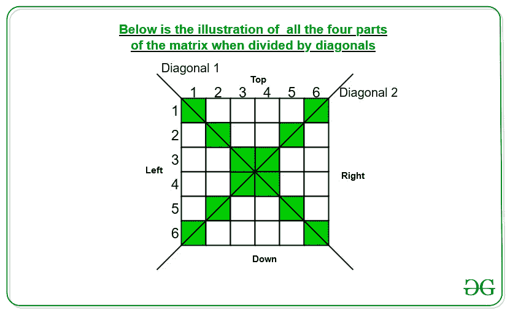

# 正方形矩阵的所有部分除以其对角线的总和

> 原文:[https://www . geesforgeks . org/方阵所有部分之和除以其对角线/](https://www.geeksforgeeks.org/sum-of-all-parts-of-a-square-matrix-divided-by-its-diagonals/)

给定一个 2D [矩阵](https://www.geeksforgeeks.org/matrix-introduction/)**arr【】【】**的 **N*N** 维，任务是找到矩阵所有四个部分的元素之和除以对角线，而不包括四个部分中的任何一个对角线元素。
**例:**

> **输入:** arr[][] = { {1，2，3}，{4，5，6}，{7，8，9} }
> **输出:** 2 4 6 8
> **说明:**
> (1，5，9)和(3，5，7)是 **arr[][]** 矩阵的对角线。因此零件之和为:
> 顶部= 2
> 左侧= 4
> 右侧= 6
> 底部= 8
> **输入:** arr[][] = { {1，3，1，5}，{2，2，4，1}，{5，0，2，3}，{1，3，3，5} }
> **输出:** 4 7 4 6
> **解释:**
> (1 因此零件总数为:
> 顶部= 3 + 1 = 4
> 左侧= 2 + 5 = 7
> 右侧= 1 + 3 = 4
> 底部= 3 + 3 = 6

**进场:**



如上图所示，尺寸 **NxN** 的矩阵被对角线分割后。我们观察到以下特性:

1.  如果行和列的索引之和小于**N–1**，则属于顶部或左侧。
    *   如果列索引大于行索引，则属于**顶部**部分。
    *   否则属于**左侧**部分。
2.  否则它属于右部或下部。
    *   如果列索引大于行索引，则属于**右**部分。
    *   否则属于**向下**部分。

以下是上述方法的实现:

## C++

```
// C++ program for the above approach
#include "bits/stdc++.h"
using namespace std;

// Function to calculate the
// sum of all parts of matrix
void SumOfPartsOfMetrics(int* arr,
                         int N)
{

    // To store the sum of all four
    // parts of the diagonals
    int top, bottom, left, right;

    // Initialise respective sum
    // as zero
    top = bottom = right = left = 0;

    // Traversing the matrix
    for (int i = 0; i < N; i++) {
        for (int j = 0; j < N; j++) {

            // If i + j < N -1
            // then it belongs to
            // top or left
            if (i + j < N - 1 && i != j) {

                // Belongs to top
                if (i < j) {
                    top += (arr + i * N)[j];
                }

                // Belongs to left
                else {
                    left += (arr + i * N)[j];
                }
            }

            // If i+j > N - 1 then
            // it belongs to right
            // or bottom
            else if (i + j > N - 1 && i != j) {

                // Belongs to right
                if (i > j) {
                    bottom += (arr + i * N)[j];
                }

                // Belongs to bottom
                else {
                    right += (arr + i * N)[j];
                }
            }
        }
    }
    cout << top << ' ' << left
         << ' ' << right << ' '
         << bottom << endl;
}

// Driver Code
int main()
{
    int N = 4;
    int arr[N][N] = { { 1, 3, 1, 5 },
                      { 2, 2, 4, 1 },
                      { 5, 0, 2, 3 },
                      { 1, 3, 3, 5 } };
    // Function call to find print
    // sum of al parts
    SumOfPartsOfMetrics((int*)arr, N);
    return 0;
}
```

## Java 语言(一种计算机语言，尤用于创建网站)

```
// Java program for the above approach
class GFG {

// Function to calculate the
// sum of all parts of matrix
static void SumOfPartsOfMetrics(int [][]arr,
                                int N)
{

    // To store the sum of all four
    // parts of the diagonals
    // Initialise respective sum
    // as zero
    int top = 0, bottom = 0;
    int left = 0, right = 0;

    // Traversing the matrix
    for(int i = 0; i < N; i++)
    {
       for(int j = 0; j < N; j++)
       {

          // If i + j < N -1
          // then it belongs to
          // top or left
          if (i + j < N - 1 && i != j)
          {

              // Belongs to top
              if (i < j)
              {
                  top += arr[i][j];
              }

              // Belongs to left
              else
              {
                  left += arr[i][j];
              }
          }

          // If i+j > N - 1 then
          // it belongs to right
          // or bottom
          else if (i + j > N - 1 && i != j)
          {

              // Belongs to right
              if (i > j)
              {
                  bottom += arr[i][j];
              }

              // Belongs to bottom
              else
              {
                  right += arr[i][j];
              }
          }
       }
    }
    System.out.println(top + " " + left + " " +
                     right + " " + bottom);
}

// Driver Code
public static void main (String[] args)
{
    int N = 4;
    int arr[][] = { { 1, 3, 1, 5 },
                    { 2, 2, 4, 1 },
                    { 5, 0, 2, 3 },
                    { 1, 3, 3, 5 } };

    // Function call to find print
    // sum of al parts
    SumOfPartsOfMetrics(arr, N);
}
}

// This code is contributed by AnkitRai01
```

## 蟒蛇 3

```
# Python3 program for the above approach

# Function to calculate the
# sum of all parts of matrix
def SumOfPartsOfMetrics(arr, N):

    # To store the sum of all four
    # parts of the diagonals
    # Initialise respective sum
    # as zero
    top = bottom = right = left = 0;

    # Traversing the matrix
    for i in range(N):
        for j in range(N):

            # If i + j < N -1
            # then it belongs to
            # top or left
            if (i + j < N - 1 and i != j):

                # Belongs to top
                if (i < j):
                    top += arr[i][j];

                # Belongs to left
                else:
                    left += arr[i][j];

            # If i+j > N - 1 then
            # it belongs to right
            # or bottom
            elif (i + j > N - 1 and i != j):

                # Belongs to right
                if (i > j):
                    bottom += arr[i][j];

                # Belongs to bottom
                else:
                    right += arr[i][j];

    print(top, left, right, bottom);

# Driver Code
if __name__ == "__main__":

    N = 4;
    arr = [ [ 1, 3, 1, 5 ],
            [ 2, 2, 4, 1 ],
            [ 5, 0, 2, 3 ],
            [ 1, 3, 3, 5 ] ];

    # Function call to find print
    # sum of al parts
    SumOfPartsOfMetrics(arr, N);

# This code is contributed by AnkitRai01
```

## C#

```
// C# program for the above approach
using System;

class GFG {

// Function to calculate the
// sum of all parts of matrix
static void SumOfPartsOfMetrics(int [,]arr,
                                int N)
{

    // To store the sum of all four
    // parts of the diagonals
    // Initialise respective sum
    // as zero
    int top = 0, bottom = 0;
    int left = 0, right = 0;

    // Traversing the matrix
    for(int i = 0; i < N; i++)
    {
       for(int j = 0; j < N; j++)
       {

          // If i + j < N -1
          // then it belongs to
          // top or left
          if (i + j < N - 1 && i != j)
          {

              // Belongs to top
              if (i < j)
              {
                  top += arr[i, j];
              }

              // Belongs to left
              else
              {
                  left += arr[i, j];
              }
          }

          // If i+j > N - 1 then
          // it belongs to right
          // or bottom
          else if (i + j > N - 1 && i != j)
          {

            // Belongs to right
            if (i > j)
            {
                bottom += arr[i, j];
            }

            // Belongs to bottom
            else
            {
                right += arr[i, j];
            }
          }
       }
    }
    Console.WriteLine(top + " " + left + " " +
                    right + " " + bottom);
}

// Driver Code
public static void Main (string[] args)
{
    int N = 4;
    int [,]arr = { { 1, 3, 1, 5 },
                   { 2, 2, 4, 1 },
                   { 5, 0, 2, 3 },
                   { 1, 3, 3, 5 } };

    // Function call to find print
    // sum of al parts
    SumOfPartsOfMetrics(arr, N);
}
}

// This code is contributed by AnkitRai01
```

## java 描述语言

```
<script>
// Javascript program for the above approach

// Function to calculate the
// sum of all parts of matrix
function SumOfPartsOfMetrics(arr, N)
{

    // To store the sum of all four
    // parts of the diagonals
    let top, bottom, left, right;

    // Initialise respective sum
    // as zero
    top = bottom = right = left = 0;

    // Traversing the matrix
    for (let i = 0; i < N; i++) {
        for (let j = 0; j < N; j++) {

            // If i + j < N -1
            // then it belongs to
            // top or left
            if (i + j < N - 1 && i != j) {

                // Belongs to top
                if (i < j) {
                    top += arr[i][j];
                }

                // Belongs to left
                else {
                    left += arr[i][j];
                }
            }

            // If i+j > N - 1 then
            // it belongs to right
            // or bottom
            else if (i + j > N - 1 && i != j) {

                // Belongs to right
                if (i > j) {
                    bottom += arr[i][j];
                }

                // Belongs to bottom
                else {
                    right += arr[i][j];
                }
            }
        }
    }
    document.write(top + ' ' + left
         + ' ' + right + ' '
         + bottom + "<br>");
}

// Driver Code
    let N = 4;
    let arr = [ [ 1, 3, 1, 5 ],
                      [ 2, 2, 4, 1 ],
                      [ 5, 0, 2, 3 ],
                      [ 1, 3, 3, 5 ] ];
    // Function call to find print
    // sum of al parts
    SumOfPartsOfMetrics(arr, N);

// This code is contributed by rishavmahato348.
</script>
```

**Output:** 

```
4 7 4 6
```

**时间复杂度:** O(N <sup>2</sup> )