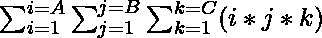
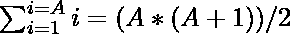
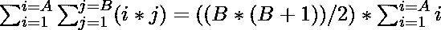

# 给定范围内所有可能的三元组乘积之和

> 原文:[https://www . geeksforgeeks . org/给定范围的所有可能三元组乘积之和/](https://www.geeksforgeeks.org/sum-of-all-possible-triplet-products-from-given-ranges/)

给定三个整数 **A** 、 **B** 和 **C** ，任务是找到表达式的值



由于答案可能很大，打印答案[模 10 <sup>9</sup> + 7](https://www.geeksforgeeks.org/modulo-1097-1000000007/) 。

**示例:**

> **输入:** A = 1，B = 1，C = 2
> **输出:** 3
> **说明:**给定表达式的值为:(1 * 1 * 1+1 * 1 * 2)%(10<sup>9</sup>+7)= 3
> 因此，所需输出为 3。
> 
> **输入:** A = 10，B =100，C = 1000
> T3】输出: 13874027

**天真方法:**解决这个问题最简单的方法是生成所有可能的三元组 **(i，j，k)** 并打印所有可能的乘积之和**(I * j * k)mod(10<sup>9</sup>+7)**。

下面是上述方法的实现。

## C++

```
// C++ program to implement
// the above approach

#include <bits/stdc++.h>
using namespace std;
#define M 1000000007

// Function to find the sum of all
// possible triplet products (i * j * k)
long long findTripleSum(long long A,
                        long long B,
                        long long C)
{

    // Stores sum required sum
    long long sum = 0;

    // Iterate over all
    // possible values of i
    for (long long i = 1; i <= A;
         i++) {

        // Iterate over all
        // possible values of j
        for (long long j = 1; j <= B;
             j++) {

            // Iterate over all
            // possible values of k
            for (long long k = 1; k <= C;
                 k++) {

                // Stores the product
                // of (i * j *k)
                long long prod = (((i % M)

                                   * (j % M))
                                  % M
                                  * (k % M))
                                 % M;

                // Update sum
                sum = (sum + prod) % M;
            }
        }
    }

    return sum;
}

// Driver Code
int main()
{

    long long A = 10;
    long long B = 100;
    long long C = 1000;
    cout << findTripleSum(A, B, C);

    return 0;
}
```

## Java 语言(一种计算机语言，尤用于创建网站)

```
// Java program to implement
// the above approach
import java.util.*;

class GFG{

static int M = 1000000007;

// Function to find the sum of all
// possible triplet products (i * j * k)
static int findTripleSum(int A, int B,
                         int C)
{

    // Stores sum required sum
    int sum = 0;

    // Iterate over all
    // possible values of i
    for(int i = 1; i <= A; i++)
    {

        // Iterate over all
        // possible values of j
        for(int j = 1; j <= B; j++)
        {

            // Iterate over all
            // possible values of k
            for(int k = 1; k <= C; k++)
            {

                // Stores the product
                // of (i * j *k)
                int prod = (((i % M) * (j % M)) %
                                   M * (k % M)) % M;

                // Update sum
                sum = (sum + prod) % M;
            }
        }
    }
    return sum;
}

// Driver Code
public static void main(String args[])
{
    int A = 10;
    int B = 100;
    int C = 1000;

    System.out.println(findTripleSum(A, B, C));
}
}

// This code is contributed by bgangwar59
```

## 蟒蛇 3

```
# Python3 program to implement
# the above approach
M = 1000000007

# Function to find the sum
# of all possible triplet
# products (i * j * k)
def findTripleSum(A, B, C):

    # Stores sum required sum
    sum = 0

    # Iterate over all
    # possible values of i
    for i in range(1, A + 1):

        # Iterate over all
        # possible values of j
        for j in range(1, B + 1):

            # Iterate over all
            # possible values of k
            for k in range(1, C + 1):

                # Stores the product
                # of (i * j *k)
                prod = (((i % M) * (j % M)) %
                          M * (k % M)) % M

                # Update sum
                sum = (sum + prod) % M

    return sum

# Driver Code
if __name__ == '__main__':

    A = 10
    B = 100
    C = 1000

    print(findTripleSum(A, B, C))

# This code is contributed by mohit kumar 29
```

## C#

```
// C# program to implement
// the above approach 
using System;

class GFG{

static int M = 1000000007;

// Function to find the sum of all
// possible triplet products (i * j * k)
static int findTripleSum(int A, int B,
                         int C)
{

    // Stores sum required sum
    int sum = 0;

    // Iterate over all
    // possible values of i
    for(int i = 1; i <= A; i++)
    {

        // Iterate over all
        // possible values of j
        for(int j = 1; j <= B; j++)
        {

            // Iterate over all
            // possible values of k
            for(int k = 1; k <= C; k++)
            {

                // Stores the product
                // of (i * j *k)
                int prod = (((i % M) * (j % M)) %
                                   M * (k % M)) % M;

                // Update sum
                sum = (sum + prod) % M;
            }
        }
    }
    return sum;
}

// Driver Code
public static void Main()
{
    int A = 10;
    int B = 100;
    int C = 1000;

    Console.WriteLine(findTripleSum(A, B, C));
}
}

// This code is contributed by code_hunt
```

## java 描述语言

```
<script>

// JavaScript program to implement the above approach

let M = 1000000007;

// Function to find the sum of all
// possible triplet products (i * j * k)
function findTripleSum(A, B, C)
{

    // Stores sum required sum
    let sum = 0;

    // Iterate over all
    // possible values of i
    for(let i = 1; i <= A; i++)
    {

        // Iterate over all
        // possible values of j
        for(let j = 1; j <= B; j++)
        {

            // Iterate over all
            // possible values of k
            for(let k = 1; k <= C; k++)
            {

                // Stores the product
                // of (i * j *k)
                let prod = (((i % M) * (j % M)) %
                                   M * (k % M)) % M;

                // Update sum
                sum = (sum + prod) % M;
            }
        }
    }
    return sum;
}

// Driver Code
    let A = 10;
    let B = 100;
    let C = 1000;

    document.write(findTripleSum(A, B, C));

    // This code is contributed by susmitakunndugoaldanga.
</script>
```

**Output:** 

```
13874027
```

***时间复杂度:**O(A * B * C)*
T5**辅助空间:** O(1)

**高效方法:**上述方法可以基于以下观察进行优化:

> 单次求和:
> 
> 
> 
> 双重求和:
> 
> 
> 
> = ((A * (A + 1) / 2) * (B * (B + 1) / 2))
> 
> 同样，对于三重求和:
> 
> 
> 
> =((A *(A+1)/2)*(B *(B+1)/2)*(C *(C+1)/2))

按照以下步骤解决问题:

*   初始化一个变量，说 **MMI** 存储 **8** 的[模乘逆](https://www.geeksforgeeks.org/multiplicative-inverse-under-modulo-m/)。
*   初始化一个变量，比如说 **M** 来存储 **10 <sup>9</sup> + 7** 的值。

> 最后打印**((A *(A+1)% M)*(B *(B+1)% M)*(C *(C+1)% M)* MMI)% M**的值。

## C++

```
// C++ implementation to implement
// the above approach

#include <bits/stdc++.h>
using namespace std;
#define M 1000000007

// Function to find the value
// of power(X, N) % M
long long power(long long x,
                long long N)
{

    // Stores the value
    // of (X ^ N) % M
    long long res = 1;

    // Calculate the value of
    // power(x, N) % M
    while (N > 0) {

        // If N is odd
        if (N & 1) {

            // Update res
            res = (res * x) % M;
        }

        // Update x
        x = (x * x) % M;

        // Update N
        N = N >> 1;
    }
    return res;
}

// Function to find modulo multiplicative
// inverse of X under modulo M
long long modinv(long long X)
{
    return power(X, M - 2);
}

// Function to find the sum of all
// possible triplet products (i * j * k)
int findTripleSum(long long A, long long B,
                  long long C)
{

    // Stores modulo multiplicative
    // inverse of 8
    long long MMI = modinv(8);

    // Stores the sum of all
    // possible values of (i * j * k)
    long long res = 0;

    // Update res
    res = ((((A % M * (A + 1) % M)
             % M
             * (B % M * (B + 1) % M)
             % M)
            % M
            * (C % M * (C + 1) % M)
            % M)
           % M
           * MMI)
          % M;

    return res;
}

// Driver Code
int main()
{

    long long A = 10;
    long long B = 100;
    long long C = 1000;
    cout << findTripleSum(A, B, C);

    return 0;
}
```

## Java 语言(一种计算机语言，尤用于创建网站)

```
// Java implementation to implement
// the above approach
import java.util.*;

class GFG{

static final int M = 1000000007;

// Function to find the value
// of power(X, N) % M
static long power(long x, long N)
{

    // Stores the value
    // of (X ^ N) % M
    long res = 1;

    // Calculate the value of
    // power(x, N) % M
    while (N > 0)
    {

        // If N is odd
        if (N % 2 == 1)
        {

            // Update res
            res = (res * x) % M;
        }

        // Update x
        x = (x * x) % M;

        // Update N
        N = N >> 1;
    }
    return res;
}

// Function to find modulo multiplicative
// inverse of X under modulo M
static long modinv(long X)
{
    return power(X, M - 2);
}

// Function to find the sum of all
// possible triplet products (i * j * k)
static long findTripleSum(long A, long B,
                          long C)
{

    // Stores modulo multiplicative
    // inverse of 8
    long MMI = modinv(8);

    // Stores the sum of all
    // possible values of (i * j * k)
    long res = 0;

    // Update res
    res = ((((A % M * (A + 1) % M) % M *
             (B % M * (B + 1) % M) % M) % M *
             (C % M * (C + 1) % M) % M) % M *
               MMI) % M;

    return res;
}

// Driver Code
public static void main(String[] args)
{
    long A = 10;
    long B = 100;
    long C = 1000;

    System.out.print(findTripleSum(A, B, C));
}
}

// This code is contributed by Rajput-Ji
```

## 蟒蛇 3

```
# Python3 implementation to
# implement the above approach
M = 1000000007

# Function to find the value
# of power(X, N) % M
def power(x,N):

    global M

    # Stores the value
    # of (X ^ N) % M
    res = 1

    # Calculate the value of
    # power(x, N) % M
    while (N > 0):

        # If N is odd
        if (N & 1):

            # Update res
            res = (res * x) % M

        # Update x
        x = (x * x) % M

        # Update N
        N = N >> 1
    return res

# Function to find modulo
# multiplicative inverse
# of X under modulo M
def modinv(X):

    return power(X, M - 2)

# Function to find the
# sum of all possible
# triplet products (i * j * k)
def findTripleSum(A, B, C):

    global M

    # Stores modulo multiplicative
    # inverse of 8
    MMI = modinv(8)
    # Stores the sum of all
    # possible values of (i * j * k)
    res = 0

    # Update res
    res = ((((A % M * (A + 1) % M) % M *
             (B % M * (B + 1) % M) % M) % M *
             (C % M * (C + 1) % M) % M) % M *
              MMI)% M
    return res

# Driver Code
if __name__ == '__main__':

    A = 10
    B = 100
    C = 1000
    print(findTripleSum(A, B, C))

# This code is contributed by SURENDRA_GANGWAR
```

## C#

```
// C# implementation to implement
// the above approach
using System;

class GFG{

static readonly int M = 1000000007;

// Function to find the value
// of power(X, N) % M
static long power(long x, long N)
{

    // Stores the value
    // of (X ^ N) % M
    long res = 1;

    // Calculate the value of
    // power(x, N) % M
    while (N > 0)
    {

        // If N is odd
        if (N % 2 == 1)
        {

            // Update res
            res = (res * x) % M;
        }

        // Update x
        x = (x * x) % M;

        // Update N
        N = N >> 1;
    }
    return res;
}

// Function to find modulo multiplicative
// inverse of X under modulo M
static long modinv(long X)
{
    return power(X, M - 2);
}

// Function to find the sum of all
// possible triplet products (i * j * k)
static long findTripleSum(long A, long B,
                          long C)
{

    // Stores modulo multiplicative
    // inverse of 8
    long MMI = modinv(8);

    // Stores the sum of all
    // possible values of (i * j * k)
    long res = 0;

    // Update res
    res = ((((A % M * (A + 1) % M) % M *
             (B % M * (B + 1) % M) % M) % M *
             (C % M * (C + 1) % M) % M) % M *
               MMI) % M;

    return res;
}

// Driver Code
public static void Main(String[] args)
{
    long A = 10;
    long B = 100;
    long C = 1000;

    Console.Write(findTripleSum(A, B, C));
}
}

// This code is contributed by Amit Katiyar
```

**Output:** 

```
13874027
```

***时间复杂度:** O(log <sub>2</sub> N)，其中 N = (A * B * C)*
***辅助空间:** O(1)*