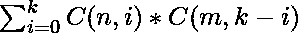
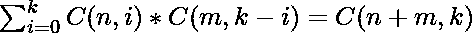

# 两个数的二项式系数到 K 的所有乘积之和

> 原文:[https://www . geeksforgeeks . org/二项系数的所有乘积之和最多为-k/](https://www.geeksforgeeks.org/sum-of-all-products-of-the-binomial-coefficients-of-two-numbers-up-to-k/)

给定三个整数 **N** 、 **M** 和 **K** ，任务是计算[二项式系数](https://www.geeksforgeeks.org/program-calculate-value-ncr/) C(N，I)和 C(M，K–I)的乘积之和，其中 **i** 的范围在**【0，K】**之间。

> 

**示例:**

> **输入:** N = 2，M = 2，K = 2
> **输出:** 6
> **解释:**
> C(2，0) * C(2，2) + C(2，1) * C(2，1) + C(2，2) * C(2，0) = 1*1 + 2*2 +1*1 = 6
> **输入:** N = 2，M = 3，K = 1

**天真法:**解决这个问题最简单的方法就是简单的迭代范围**【0，K】**计算 [**C(N，i)**](https://www.geeksforgeeks.org/program-calculate-value-ncr/) 和 **C(M，K–1)**为每一个 **i** 并通过相加它们的乘积更新**和**。
以下是上述方法的实施:

## C++

```
// C++ implementation of
// the above approach

#include <bits/stdc++.h>
using namespace std;

// Function returns nCr
// i.e. Binomial Coefficient
int nCr(int n, int r)
{

    // Initialize res with 1
    int res = 1;

    // Since C(n, r) = C(n, n-r)
    if (r > n - r)
        r = n - r;

    // Evaluating expression
    for (int i = 0; i < r; ++i) {

        res *= (n - i);
        res /= (i + 1);
    }

    return res;
}

// Function to calculate and
// return the sum of the products
int solve(int n, int m, int k)
{

    // Initialize sum to 0
    int sum = 0;

    // Traverse from 0 to k
    for (int i = 0; i <= k; i++)
        sum += nCr(n, i)
               * nCr(m, k - i);

    return sum;
}

// Driver Code
int main()
{
    int n = 3, m = 2, k = 2;

    cout << solve(n, m, k);
    return 0;
}
```

## Java 语言(一种计算机语言，尤用于创建网站)

```
// Java implementation of
// the above approach
import java.util.*;
class GFG{

// Function returns nCr
// i.e. Binomial Coefficient
static int nCr(int n, int r)
{

    // Initialize res with 1
    int res = 1;

    // Since C(n, r) = C(n, n-r)
    if (r > n - r)
        r = n - r;

    // Evaluating expression
    for (int i = 0; i < r; ++i)
    {
        res *= (n - i);
        res /= (i + 1);
    }

    return res;
}

// Function to calculate and
// return the sum of the products
static int solve(int n, int m, int k)
{

    // Initialize sum to 0
    int sum = 0;

    // Traverse from 0 to k
    for (int i = 0; i <= k; i++)
        sum += nCr(n, i)
               * nCr(m, k - i);

    return sum;
}

// Driver Code
public static void main(String[] args)
{
    int n = 3, m = 2, k = 2;

    System.out.print(solve(n, m, k));
}
}

// This code is contributed by Rohit_ranjan
```

## 蟒蛇 3

```
# Python3 implementation of
# the above approach

# Function returns nCr
# i.e. Binomial Coefficient
def nCr(n, r):

    # Initialize res with 1
    res = 1

    # Since C(n, r) = C(n, n-r)
    if r > n - r:
        r = n - r

    # Evaluating expression
    for i in range(r):
        res *= (n - i)
        res /= (i + 1)

    return res;

# Function to calculate and
# return the sum of the products
def solve(n, m, k):

    # Initialize sum to 0
    sum = 0;

    # Traverse from 0 to k
    for i in range(k + 1):
        sum += nCr(n, i) * nCr(m, k - i)

    return int(sum)

# Driver code
if __name__ == '__main__':

    n = 3
    m = 2
    k = 2;

    print(solve(n, m, k))

# This code is contributed by jana_sayantan   
```

## C#

```
// C# implementation of
// the above approach
using System;
class GFG{

// Function returns nCr
// i.e. Binomial Coefficient
static int nCr(int n, int r)
{

    // Initialize res with 1
    int res = 1;

    // Since C(n, r) = C(n, n-r)
    if (r > n - r)
        r = n - r;

    // Evaluating expression
    for (int i = 0; i < r; ++i)
    {
        res *= (n - i);
        res /= (i + 1);
    }

    return res;
}

// Function to calculate and
// return the sum of the products
static int solve(int n, int m, int k)
{

    // Initialize sum to 0
    int sum = 0;

    // Traverse from 0 to k
    for (int i = 0; i <= k; i++)
        sum += nCr(n, i)
            * nCr(m, k - i);

    return sum;
}

// Driver Code
public static void Main(String[] args)
{
    int n = 3, m = 2, k = 2;

    Console.Write(solve(n, m, k));
}
}

// This code is contributed by Rajput-Ji
```

## java 描述语言

```
<script>
// JavaScript program for the above approach

// Function returns nCr
// i.e. Binomial Coefficient
function nCr(n, r)
{

    // Initialize res with 1
    let res = 1;

    // Since C(n, r) = C(n, n-r)
    if (r > n - r)
        r = n - r;

    // Evaluating expression
    for (let i = 0; i < r; ++i)
    {
        res *= (n - i);
        res /= (i + 1);
    }

    return res;
}

// Function to calculate and
// return the sum of the products
function solve(n, m, k)
{

    // Initialize sum to 0
    let sum = 0;

    // Traverse from 0 to k
    for (let i = 0; i <= k; i++)
        sum += nCr(n, i)
               * nCr(m, k - i);

    return sum;
}

// Driver Code

    let n = 3, m = 2, k = 2;

    document.write(solve(n, m, k));

</script>
```

**Output:** 

```
10
```

***时间复杂度:**O(K<sup>2</sup>)*
***辅助空间:** O(1)*

**高效方法:**
上述方法可以利用范德蒙的恒等式进行优化。

> 根据**范德蒙身份**，总共( **N + M** 项中的 **K** 项的任意组合都应该有 **M** 中的 **r** 项和**K–r**中的 **N** 项。

因此，给定的表达式简化为以下内容:

> 

下面是上述方法的实现:

## C++

```
// C++ implementation of
// the above approach

#include <bits/stdc++.h>
using namespace std;

// Function returns nCr
// i.e. Binomial Coefficient
int nCr(int n, int r)
{

    // Initialize res with 1
    int res = 1;

    // Since C(n, r) = C(n, n-r)
    if (r > n - r)
        r = n - r;

    // Evaluating expression
    for (int i = 0; i < r; ++i) {

        res *= (n - i);
        res /= (i + 1);
    }

    return res;
}

// Driver Code
int main()
{
    int n = 3, m = 2, k = 2;

    cout << nCr(n + m, k);
    return 0;
}
```

## Java 语言(一种计算机语言，尤用于创建网站)

```
// Java implementation of
// the above approach
import java.util.*;
class GFG{

// Function returns nCr
// i.e. Binomial Coefficient
static int nCr(int n, int r)
{

    // Initialize res with 1
    int res = 1;

    // Since C(n, r) = C(n, n-r)
    if (r > n - r)
        r = n - r;

    // Evaluating expression
    for (int i = 0; i < r; ++i)
    {
        res *= (n - i);
        res /= (i + 1);
    }
    return res;
}

// Driver Code
public static void main(String[] args)
{
    int n = 3, m = 2, k = 2;

    System.out.print(nCr(n + m, k));
}
}

// This code is contributed by sapnasingh4991
```

## 蟒蛇 3

```
# Python3 implementation of
# the above approach

# Function returns nCr
# i.e. Binomial Coefficient
def nCr(n, r):

    # Initialize res with 1
    res = 1

    # Since C(n, r) = C(n, n-r)
    if(r > n - r):
        r = n - r

    # Evaluating expression
    for i in range(r):
        res *= (n - i)
        res //= (i + 1)

    return res

# Driver Code
if __name__ == '__main__':

    n = 3
    m = 2
    k = 2

    # Function call
    print(nCr(n + m, k))

# This code is contributed by Shivam Singh
```

## C#

```
// C# implementation of
// the above approach
using System;
class GFG{

// Function returns nCr
// i.e. Binomial Coefficient
static int nCr(int n, int r)
{

    // Initialize res with 1
    int res = 1;

    // Since C(n, r) = C(n, n-r)
    if (r > n - r)
        r = n - r;

    // Evaluating expression
    for (int i = 0; i < r; ++i)
    {
        res *= (n - i);
        res /= (i + 1);
    }

    return res;
}

// Driver Code
public static void Main()
{
    int n = 3, m = 2, k = 2;
    Console.Write(nCr(n + m, k));
}
}

// This code is contributed by Code_Mech
```

## java 描述语言

```
<script>

// JavaScript implementation of the above approach

// Function returns nCr
// i.e. Binomial Coefficient
function nCr(n, r)
{

    // Initialize res with 1
    let res = 1;

    // Since C(n, r) = C(n, n-r)
    if (r > n - r)
        r = n - r;

    // Evaluating expression
    for (let i = 0; i < r; ++i)
    {
        res *= (n - i);
        res /= (i + 1);
    }
    return res;
}

// Driver code

        let n = 3, m = 2, k = 2;

        document.write(nCr(n + m, k));

    // This code is contributed by code_hunt.
</script>
```

**Output:** 

```
10
```

***时间复杂度:** O(K)*
***辅助空间:** O(1)*