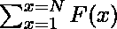

# 从 1 到 N 的所有自然数之和

> 原文:[https://www . geeksforgeeks . org/all-sum-professionars-from-1-n/](https://www.geeksforgeeks.org/sum-of-all-proper-divisors-from-1-to-n/)

给定一个正整数 **N** ，任务是找到的值，其中函数 F(x)可以定义为“ **x** 的所有适当因子之和。
**示例:**

> **输入:** N = 4
> **输出:** 5
> **解释:**
> 所有数的适当除数之和:
> F(1)= 0
> F(2)= 1
> F(3)= 1
> F(4)= 1+2 = 3
> 总和= F(1) + F(2) + F(3) + F(4) = 0 + 1 + 1 + 3 = 5
> **输入:** N = 5
> **输出:** 6
> **解释:**
> 所有数的适当除数之和:
> F(1)= 0
> F(2)= 1
> F(3)= 1
> F(4)= 1+2 = 3
> F(5)= 1
> 总和= F

**<u>天真的做法:</u>** 思路是[分别求出[1，N]范围内每个数](https://www.geeksforgeeks.org/sum-of-all-proper-divisors-of-a-natural-number/)的适当除数之和，然后相加求出所需之和。
以下是上述方法的实现:

## C++

```
// C++ implementation to find sum of all
// proper divisor of number up to N
#include <bits/stdc++.h>
using namespace std;

// Utility function to find sum of
// all proper divisor of number up to N
int properDivisorSum(int n)
{
    int sum = 0;

    // Loop to iterate over all the
    // numbers from 1 to N
    for (int i = 1; i <= n; ++i) {

        // Find all divisors of
        // i and add them
        for (int j = 1; j * j <= i; ++j) {
            if (i % j == 0) {
                if (i / j == j)
                    sum += j;
                else
                    sum += j + i / j;
            }
        }

        // Subtracting 'i' so that the
        // number itself is not included
        sum = sum - i;
    }
    return sum;
}

// Driver Code
int main()
{
    int n = 4;
    cout << properDivisorSum(n) << endl;

    n = 5;
    cout << properDivisorSum(n) << endl;

    return 0;
}
```

## Java 语言(一种计算机语言，尤用于创建网站)

```
// Java implementation to find sum of all
// proper divisor of number up to N
class GFG {

    // Utility function to find sum of
    // all proper divisor of number up to N
    static int properDivisorSum(int n)
    {
        int sum = 0;

        // Loop to iterate over all the
        // numbers from 1 to N
        for (int i = 1; i <= n; ++i) {

            // Find all divisors of
            // i and add them
            for (int j = 1; j * j <= i; ++j) {
                if (i % j == 0) {
                    if (i / j == j)
                        sum += j;
                    else
                        sum += j + i / j;
                }
            }

            // Subtracting 'i' so that the
            // number itself is not included
            sum = sum - i;
        }
        return sum;
    }

    // Driver Code
    public static void main (String[] args)
    {
        int n = 4;
        System.out.println(properDivisorSum(n));

        n = 5;
        System.out.println(properDivisorSum(n)) ;

    }
}

// This code is contributed by Yash_R
```

## 蟒蛇 3

```
# Python3 implementation to find sum of all
# proper divisor of number up to N

# Utility function to find sum of
# all proper divisor of number up to N
def properDivisorSum(n):

    sum = 0

    # Loop to iterate over all the
    # numbers from 1 to N
    for i in range(n+1):

        # Find all divisors of
        # i and add them
        for j in range(1, i + 1):
            if j * j > i:
                break
            if (i % j == 0):
                if (i // j == j):
                    sum += j
                else:
                    sum += j + i // j

        # Subtracting 'i' so that the
        # number itself is not included
        sum = sum - i

    return sum

# Driver Code
if __name__ == '__main__':

    n = 4
    print(properDivisorSum(n))

    n = 5
    print(properDivisorSum(n))

# This code is contributed by mohit kumar 29
```

## C#

```
// C# implementation to find sum of all
// proper divisor of number up to N
using System;

class GFG {

    // Utility function to find sum of
    // all proper divisor of number up to N
    static int properDivisorSum(int n)
    {
        int sum = 0;

        // Loop to iterate over all the
        // numbers from 1 to N
        for (int i = 1; i <= n; ++i) {

            // Find all divisors of
            // i and add them
            for (int j = 1; j * j <= i; ++j) {
                if (i % j == 0) {
                    if (i / j == j)
                        sum += j;
                    else
                        sum += j + i / j;
                }
            }

            // Subtracting 'i' so that the
            // number itself is not included
            sum = sum - i;
        }
        return sum;
    }

    // Driver Code
    public static void Main (string[] args)
    {
        int n = 4;
        Console.WriteLine(properDivisorSum(n));

        n = 5;
        Console.WriteLine(properDivisorSum(n)) ;   
    }
}

// This code is contributed by Yash_R
```

## java 描述语言

```
<script>

//Javascript implementation to find sum of all
// proper divisor of number up to N 

// Utility function to find sum of
// all proper divisor of number up to N
function properDivisorSum(n)
{
    let sum = 0;

    // Loop to iterate over all the
    // numbers from 1 to N
    for (let i = 1; i <= n; ++i) {

        // Find all divisors of
        // i and add them
        for (let j = 1; j * j <= i; ++j) {
            if (i % j == 0) {
                if (i / j == j)
                    sum += j;
                else
                    sum += j + i / j;
            }
        }

        // Subtracting 'i' so that the
        // number itself is not included
        sum = sum - i;
    }
    return sum;
}

// Driver Code

    let n = 4;
    document.write(properDivisorSum(n) + "<br>");

    n = 5;
    document.write(properDivisorSum(n) + "<br>");

// This code is contributed by Mayank Tyagi

</script>
```

**Output:** 

```
5
6
```

**时间复杂度:** O(N * √N)
**辅助空间:** O(1)
**<u>高效逼近:</u>** 观察函数中的模式，可以看出*“对于给定的数字 N，范围[1，N]内的每个数字‘x’出现(N/x)次”*。
**例如:**

> 设 N = 6 = > G(N)= F(1)+F(2)+F(3)+F(4)+F(5)+F(6)
> x = 1 =>1 将发生 6 次(在 F(1)、F(2)、F(3)、F(4)、F(5)和 F(6)中)
> x = 2 = > 2 将发生 3 次(在 F(2)、 F(4)和 F(6))
> x = 3 = > 3 将出现 2 次(在 F(3)和 F(6)中)
> x = 4 = > 4 将出现 1 次(在 F(4)中)
> x = 5 = > 5 将出现 1 次(在 F(5)中)
> x = 6 = > 6 将出现 1 次(在 F(6)中)

从上面的观察可以很容易地观察到，数 **x** 只出现在其小于或等于 **N** 的倍数内。所以，我们只需要求这样倍数的计数，对于[1，N]中 x 的每个值，再乘以 **x** 。然后将该值加到最终总和中。
以下是上述方法的实现:

## C++

```
// C++ implementation to find sum of all
// proper divisor of numbers up to N

#include <bits/stdc++.h>
using namespace std;

// Utility function to find sum of
// all proper divisor of number up to N
int properDivisorSum(int n)
{
    int sum = 0;

    // Loop to find the proper
    // divisor of every number
    // from 1 to N
    for (int i = 1; i <= n; ++i)
        sum += (n / i) * i;

    return sum - n * (n + 1) / 2;
}

// Driver Code
int main()
{
    int n = 4;
    cout << properDivisorSum(n) << endl;

    n = 5;
    cout << properDivisorSum(n) << endl;
    return 0;
}
```

## Java 语言(一种计算机语言，尤用于创建网站)

```
// Java implementation to find sum of all
// proper divisor of numbers up to N

// Utility function to find sum of
// all proper divisor of number up to N

class GFG
{
    static int properDivisorSum(int n)
    {
        int sum = 0;
        int i;
        // Loop to find the proper
        // divisor of every number
        // from 1 to N
        for (i = 1; i <= n; ++i)
            sum += (n / i) * i;

        return sum - n * (n + 1) / 2;
    }

    // Driver Code
    public static void main(String []args)
    {
        int n = 4;
        System.out.println(properDivisorSum(n));

        n = 5;
        System.out.println(properDivisorSum(n));

    }
}
```

## 蟒蛇 3

```
# Python3 implementation to find sum of all
# proper divisor of numbers up to N

# Utility function to find sum of
# all proper divisor of number up to N
def properDivisorSum(n):

    sum = 0

    # Loop to find the proper
    # divisor of every number
    # from 1 to N
    for i in range(1, n + 1):
        sum += (n // i) * i

    return sum - n * (n + 1) // 2

# Driver Code
n = 4
print(properDivisorSum(n))

n = 5
print(properDivisorSum(n))

# This code is contributed by shubhamsingh10
```

## C#

```
// C# implementation to find sum of all
// proper divisor of numbers up to N

// Utility function to find sum of
// all proper divisor of number up to N
using System;

class GFG
{
    static int properDivisorSum(int n)
    {
        int sum = 0;
        int i;
        // Loop to find the proper
        // divisor of every number
        // from 1 to N
        for (i = 1; i <= n; ++i)
            sum += (n / i) * i;

        return sum - n * (n + 1) / 2;
    }

    // Driver Code
    public static void Main(String []args)
    {
        int n = 4;
        Console.WriteLine(properDivisorSum(n));

        n = 5;
        Console.WriteLine(properDivisorSum(n));

    }
}

// This code is contributed by 29AjayKumar
```

## java 描述语言

```
<script>

// Javascript implementation to find sum of all
// proper divisor of numbers up to N

// Utility function to find sum of
// all proper divisor of number up to N
function properDivisorSum(n)
{
    var sum = 0;

    // Loop to find the proper
    // divisor of every number
    // from 1 to N
    for (var i = 1; i <= n; ++i)
        sum += parseInt(n / i) * i;

    return sum - n * ((n + 1) / 2);
}

// Driver Code
var n = 4;
document.write(properDivisorSum(n)+"<br>");
n = 5;
document.write(properDivisorSum(n)+"<br>");

// This code is contributed by rutvik_56.
</script>
```

**Output:** 

```
5
6
```

**时间复杂度:**O(N)
T3】辅助空间: O(1)