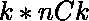
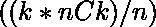
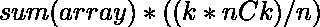

# 长度为 K 的所有子序列之和

> 原文:[https://www . geesforgeks . org/所有长度子序列之和-k/](https://www.geeksforgeeks.org/sum-of-all-subsequences-of-length-k/)

给定一个**数组 arr[]** 和一个**整数 K** ，任务是从给定数组中找到所有 K 个长度子序列的和。

**示例:**

> **输入:** arr[] = {2，3，4}，K = 2
> **输出:** 18
> **解释:**
> 长度为 2 的 3 个可能的子序列分别为{2，3}、{2，4}和{3，4}
> 所有 2 个长度子序列之和为 5 + 6 + 7 = 18
> 
> **输入:** arr[] = {7，8，9，2}，K = 2
> **输出:** 78
> **解释:**
> 长度为{7，8}、{7，9}、{7，2}、{8，9}、{8，2}和{9，2}的 6 个子序列。
> 所有 2 个长度子序列之和为 15 + 16 + 9 + 17 + 10 + 11 = 78

**方法:**
为了解决上述问题，我们必须考虑所有 **K** 长度子序列，即“n 选 K”，即

*   所有 K 长度子序列中的总元素计数为，每个元素出现的可能性相同。
*   所以每个元素出现次，在结果中贡献![arr[i] * ( (k*nCk)/n )](img/581ab7fc2e7532627b0a3a35166f8aa7.png "Rendered by QuickLaTeX.com")。
*   因此，所有 K 长度子序列的和为

以下是上述方法的实施情况:

## C++

```
// C++ implementation to find sum
// of all subsequences of length K

#include <bits/stdc++.h>
using namespace std;

int fact(int n);

// Function to find nCr
int nCr(int n, int r)
{
    return fact(n)
           / (fact(r)
              * fact(n - r));
}

// Function that returns
// factorial of n
int fact(int n)
{
    int res = 1;
    for (int i = 2; i <= n; i++)
        res = res * i;
    return res;
}

// Function for finding sum
// of all K length subsequences
int sumSubsequences(
    int arr[], int n, int k)
{

    int sum = 0;

    // Calculate the sum of array
    for (int i = 0; i < n; i++) {
        sum += arr[i];
    }
    int kLengthSubSequence;

    // Calculate nCk
    kLengthSubSequence = nCr(n, k);

    int ans
        = sum
          * ((k * kLengthSubSequence)
             / n);

    // Return the final result
    return ans;
}

// Driver code
int main()
{

    int arr[] = { 7, 8, 9, 2 };

    int K = 2;

    int n = sizeof(arr) / sizeof(arr[0]);

    cout << sumSubsequences(arr, n, K);
    return 0;
}
```

## Java 语言(一种计算机语言，尤用于创建网站)

```
// Java implementation to find sum
// of all subsequences of length K
class GFG{

// Function to find nCr
static int nCr(int n, int r)
{
    return fact(n) / (fact(r) * fact(n - r));
}

// Function that returns
// factorial of n
static int fact(int n)
{
    int res = 1;
    for (int i = 2; i <= n; i++)
        res = res * i;
    return res;
}

// Function for finding sum
// of all K length subsequences
static int sumSubsequences(int arr[], 
                           int n, int k)
{
    int sum = 0;

    // Calculate the sum of array
    for (int i = 0; i < n; i++) 
    {
        sum += arr[i];
    }
    int kLengthSubSequence;

    // Calculate nCk
    kLengthSubSequence = nCr(n, k);

    int ans = sum * ((k * kLengthSubSequence) / n);

    // Return the final result
    return ans;
}

// Driver code
public static void main(String[] args)
{
    int arr[] = { 7, 8, 9, 2 };

    int K = 2;

    int n = arr.length;

    System.out.print(sumSubsequences(arr, n, K));
}
}

// This code contributed by Rajput-Ji
```

## 蟒蛇 3

```
# Python3 implementation to find sum 
# of all subsequences of length K

# Function to find nCr 
def nCr(n, r):

    return fact(n) / (fact(r) * 
                      fact(n - r))

# Function that returns 
# factorial of n
def fact(n):

    res = 1
    for i in range(2, n + 1):
        res = res * i 
    return res

# Function for finding sum 
# of all K length subsequences
def sumSubsequences(arr, n, k):

    sum = 0

    # Calculate the sum of array 
    for i in range(0, n):
        sum = sum + arr[i]

    # Calculate nCk     
    kLengthSubSequence = nCr(n, k)
    ans = sum * ((k * kLengthSubSequence) / n);

    # Return the final result 
    return ans

# Driver Code 
arr = [ 7, 8, 9, 2 ]
k = 2
n = len(arr)

print(sumSubsequences(arr, n, k))

# This code is contributed by skylags    
```

## C#

```
// C# implementation to find sum
// of all subsequences of length K
using System;

class GFG{

// Function to find nCr
static int nCr(int n, int r)
{
    return fact(n) / (fact(r) * fact(n - r));
}

// Function that returns
// factorial of n
static int fact(int n)
{
    int res = 1;

    for(int i = 2; i <= n; i++)
       res = res * i;
    return res;
}

// Function for finding sum
// of all K length subsequences
static int sumSubsequences(int[] arr, 
                           int n, int k)
{
    int sum = 0;

    // Calculate the sum of array
    for(int i = 0; i < n; i++) 
    {
       sum += arr[i];
    }

    int kLengthSubSequence;

    // Calculate nCk
    kLengthSubSequence = nCr(n, k);
    int ans = sum * ((k * kLengthSubSequence) / n);

    // Return the final result
    return ans;
}

// Driver code
static void Main() 
{
    int[] arr = { 7, 8, 9, 2 };
    int K = 2;
    int n = arr.Length;

    Console.Write(sumSubsequences(arr, n, K));
}
}

// This code is contributed by divyeshrabadiya07
```

## java 描述语言

```
<script>

// Javascript implementation to find sum
// of all subsequences of length K

// Function to find nCr
function nCr(n, r)
{
    return fact(n) / (fact(r) * 
           fact(n - r));
}

// Function that returns
// factorial of n
function fact(n)
{
    var res = 1;
    for(var i = 2; i <= n; i++)
        res = res * i;

    return res;
}

// Function for finding sum
// of all K length subsequences
function sumSubsequences(arr, n, k)
{
    var sum = 0;

    // Calculate the sum of array
    for(var i = 0; i < n; i++)
    {
        sum += arr[i];
    }
    var kLengthSubSequence;

    // Calculate nCk
    kLengthSubSequence = nCr(n, k);

    var ans = sum * ((k * 
              kLengthSubSequence) / n);

    // Return the final result
    return ans;
}

// Driver code
var arr = [ 7, 8, 9, 2 ];
var K = 2;
var n = arr.length;

document.write(sumSubsequences(arr, n, K));

// This code is contributed by noob2000

</script>
```

**Output:** 

```
78
```