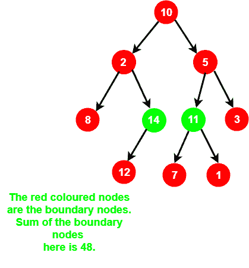

# 二叉树所有边界节点的和

> 原文:[https://www . geesforgeks . org/二叉树所有边界节点之和/](https://www.geeksforgeeks.org/sum-of-all-the-boundary-nodes-of-a-binary-tree/)

给定一棵二叉树，任务是打印该树所有边界节点的总和。



**示例:**

```
Input:
               1
             /   \
            2     3
           / \   / \
          4   5 6   7
Output: 28

Input:
                1
              /   \
             2     3
              \    /
               4  5
                  \
                   6
                  / \
                 7   8
Output: 36
```

**方法:**我们已经讨论了二叉树的[边界遍历](https://www.geeksforgeeks.org/boundary-traversal-of-binary-tree/)。在这里，我们将分四步找到给定二叉树的边界节点的和:

*   将左边界的所有节点相加，
*   将左侧子树的所有叶节点相加，
*   总结右子树的所有叶节点
*   总结右边界的所有节点。

我们必须注意一件事，节点不会再次相加，即最左边的节点也是树的叶节点。

下面是上述方法的实现:

## C++

```
// C++ implementation of the approach
#include <bits/stdc++.h>
using namespace std;

// A binary tree node has data,
// pointer to left child
// and a pointer to right child
struct Node {
    int data;
    struct Node* left;
    struct Node* right;
};

// Utility function to create a node
Node* newNode(int data)
{
    Node* temp = new Node;

    temp->left = NULL;
    temp->right = NULL;
    temp->data = data;

    return temp;
}

// Function to sum up all the left boundary nodes
// except the leaf nodes
void LeftBoundary(Node* root, int& sum_of_boundary_nodes)
{
    if (root) {
        if (root->left) {
            sum_of_boundary_nodes += root->data;
            LeftBoundary(root->left, sum_of_boundary_nodes);
        }
        else if (root->right) {
            sum_of_boundary_nodes += root->data;
            LeftBoundary(root->right, sum_of_boundary_nodes);
        }
    }
}

// Function to sum up all the right boundary nodes
// except the leaf nodes
void RightBoundary(Node* root, int& sum_of_boundary_nodes)
{
    if (root) {
        if (root->right) {
            RightBoundary(root->right, sum_of_boundary_nodes);
            sum_of_boundary_nodes += root->data;
        }
        else if (root->left) {
            RightBoundary(root->left, sum_of_boundary_nodes);
            sum_of_boundary_nodes += root->data;
        }
    }
}

// Function to sum up all the leaf nodes
// of a binary tree
void Leaves(Node* root, int& sum_of_boundary_nodes)
{
    if (root) {
        Leaves(root->left, sum_of_boundary_nodes);

        // Sum it up if it is a leaf node
        if (!(root->left) && !(root->right))
            sum_of_boundary_nodes += root->data;

        Leaves(root->right, sum_of_boundary_nodes);
    }
}

// Function to return the sum of all the
// boundary nodes of the given binary tree
int sumOfBoundaryNodes(struct Node* root)
{
    if (root) {

        // Root node is also a boundary node
        int sum_of_boundary_nodes = root->data;

        // Sum up all the left nodes
        // in TOP DOWN manner
        LeftBoundary(root->left, sum_of_boundary_nodes);

        // Sum up all the
        // leaf nodes
        Leaves(root->left, sum_of_boundary_nodes);
        Leaves(root->right, sum_of_boundary_nodes);

        // Sum up all the right nodes
        // in BOTTOM UP manner
        RightBoundary(root->right, sum_of_boundary_nodes);

        // Return the sum of
        // all the boundary nodes
        return sum_of_boundary_nodes;
    }

    return 0;
}

// Driver code
int main()
{
    Node* root = newNode(10);
    root->left = newNode(2);
    root->right = newNode(5);
    root->left->left = newNode(8);
    root->left->right = newNode(14);
    root->right->left = newNode(11);
    root->right->right = newNode(3);
    root->left->right->left = newNode(12);
    root->right->left->right = newNode(1);
    root->right->left->left = newNode(7);

    cout << sumOfBoundaryNodes(root);

    return 0;
}
```

## Java 语言(一种计算机语言，尤用于创建网站)

```
// Java implementation of the approach
class GFG
{
    static int sum_of_boundary_nodes=0;

// A binary tree node has data,
// pointer to left child
static class Node
{
    int data;
    Node left;
    Node right;
};

// Utility function to create a node
static Node newNode(int data)
{
    Node temp = new Node();

    temp.left = null;
    temp.right = null;
    temp.data = data;

    return temp;
}

// Function to sum up all the left boundary nodes
// except the leaf nodes
static void LeftBoundary(Node root)
{
    if (root != null)
    {
        if (root.left != null)
        {
            sum_of_boundary_nodes += root.data;
            LeftBoundary(root.left);
        }
        else if (root.right != null)
        {
            sum_of_boundary_nodes += root.data;
            LeftBoundary(root.right);
        }
    }
}

// Function to sum up all the right boundary nodes
// except the leaf nodes
static void RightBoundary(Node root)
{
    if (root != null)
    {
        if (root.right != null)
        {
            RightBoundary(root.right);
            sum_of_boundary_nodes += root.data;
        }
        else if (root.left != null)
        {
            RightBoundary(root.left);
            sum_of_boundary_nodes += root.data;
        }
    }
}

// Function to sum up all the leaf nodes
// of a binary tree
static void Leaves(Node root)
{
    if (root != null)
    {
        Leaves(root.left);

        // Sum it up if it is a leaf node
        if ((root.left == null) && (root.right == null))
            sum_of_boundary_nodes += root.data;

        Leaves(root.right);
    }
}

// Function to return the sum of all the
// boundary nodes of the given binary tree
static int sumOfBoundaryNodes( Node root)
{
    if (root != null)
    {

        // Root node is also a boundary node
        sum_of_boundary_nodes = root.data;

        // Sum up all the left nodes
        // in TOP DOWN manner
        LeftBoundary(root.left);

        // Sum up all the
        // leaf nodes
        Leaves(root.left);
        Leaves(root.right);

        // Sum up all the right nodes
        // in BOTTOM UP manner
        RightBoundary(root.right);

        // Return the sum of
        // all the boundary nodes
        return sum_of_boundary_nodes;
    }

    return 0;
}

// Driver code
public static void main(String args[])
{
    Node root = newNode(10);
    root.left = newNode(2);
    root.right = newNode(5);
    root.left.left = newNode(8);
    root.left.right = newNode(14);
    root.right.left = newNode(11);
    root.right.right = newNode(3);
    root.left.right.left = newNode(12);
    root.right.left.right = newNode(1);
    root.right.left.left = newNode(7);

    System.out.println(sumOfBoundaryNodes(root));
}
}

// This code is contributed by andrew1234
```

## 蟒蛇 3

```
# Python3 implementation of the approach

# A binary tree node has data,
# pointer to left child
# and a pointer to right child
class Node:

    def __init__(self):

        self.left = None
        self.right = None

sum_of_boundary_nodes = 0

# Utility function to create a node
def newNode(data):

    temp = Node()
    temp.data = data;
    return temp;

# Function to sum up all the
# left boundary nodes except
# the leaf nodes
def LeftBoundary(root):

    global sum_of_boundary_nodes

    if (root != None):
        if (root.left != None):
            sum_of_boundary_nodes += root.data;
            LeftBoundary(root.left);

        elif (root.right != None):
            sum_of_boundary_nodes += root.data;
            LeftBoundary(root.right);

# Function to sum up all the right
# boundary nodes except the leaf nodes
def RightBoundary(root):

    global sum_of_boundary_nodes

    if (root != None):
        if (root.right != None):
            RightBoundary(root.right);
            sum_of_boundary_nodes += root.data;

        elif (root.left != None):
            RightBoundary(root.left);
            sum_of_boundary_nodes += root.data;

# Function to sum up all the leaf nodes
# of a binary tree
def Leaves(root):

    global sum_of_boundary_nodes

    if (root != None):
        Leaves(root.left);

        # Sum it up if it is a leaf node
        if ((root.left == None) and
           (root.right == None)):
            sum_of_boundary_nodes += root.data;

        Leaves(root.right);

# Function to return the sum of all the
# boundary nodes of the given binary tree
def sumOfBoundaryNodes(root):

    global sum_of_boundary_nodes

    if (root != None):

        # Root node is also a boundary node
        sum_of_boundary_nodes = root.data;

        # Sum up all the left nodes
        # in TOP DOWN manner
        LeftBoundary(root.left);

        # Sum up all the
        # leaf nodes
        Leaves(root.left);
        Leaves(root.right);

        # Sum up all the right nodes
        # in BOTTOM UP manner
        RightBoundary(root.right);

        # Return the sum of
        # all the boundary nodes
        return sum_of_boundary_nodes;

    return 0;

# Driver code
if __name__=="__main__":

    root = newNode(10);
    root.left = newNode(2);
    root.right = newNode(5);
    root.left.left = newNode(8);
    root.left.right = newNode(14);
    root.right.left = newNode(11);
    root.right.right = newNode(3);
    root.left.right.left = newNode(12);
    root.right.left.right = newNode(1);
    root.right.left.left = newNode(7);

    print(sumOfBoundaryNodes(root));

# This code is contributed by rutvik_56
```

## C#

```
// C# implementation of the approach
using System;
class GFG
{
static int sum_of_boundary_nodes = 0;

// A binary tree node has data,
// pointer to left child
public class Node
{
    public int data;
    public Node left;
    public Node right;
};

// Utility function to create a node
static Node newNode(int data)
{
    Node temp = new Node();

    temp.left = null;
    temp.right = null;
    temp.data = data;

    return temp;
}

// Function to sum up all the left boundary
// nodes except the leaf nodes
static void LeftBoundary(Node root)
{
    if (root != null)
    {
        if (root.left != null)
        {
            sum_of_boundary_nodes += root.data;
            LeftBoundary(root.left);
        }

        else if (root.right != null)
        {
            sum_of_boundary_nodes += root.data;
            LeftBoundary(root.right);
        }
    }
}

// Function to sum up all the right boundary
// nodes except the leaf nodes
static void RightBoundary(Node root)
{
    if (root != null)
    {
        if (root.right != null)
        {
            RightBoundary(root.right);
            sum_of_boundary_nodes += root.data;
        }
        else if (root.left != null)
        {
            RightBoundary(root.left);
            sum_of_boundary_nodes += root.data;
        }
    }
}

// Function to sum up all the leaf nodes
// of a binary tree
static void Leaves(Node root)
{
    if (root != null)
    {
        Leaves(root.left);

        // Sum it up if it is a leaf node
        if ((root.left == null) &&
            (root.right == null))
            sum_of_boundary_nodes += root.data;

        Leaves(root.right);
    }
}

// Function to return the sum of all the
// boundary nodes of the given binary tree
static int sumOfBoundaryNodes(Node root)
{
    if (root != null)
    {

        // Root node is also a boundary node
        sum_of_boundary_nodes = root.data;

        // Sum up all the left nodes
        // in TOP DOWN manner
        LeftBoundary(root.left);

        // Sum up all the
        // leaf nodes
        Leaves(root.left);
        Leaves(root.right);

        // Sum up all the right nodes
        // in BOTTOM UP manner
        RightBoundary(root.right);

        // Return the sum of
        // all the boundary nodes
        return sum_of_boundary_nodes;
    }
    return 0;
}

// Driver code
public static void Main(String []args)
{
    Node root = newNode(10);
    root.left = newNode(2);
    root.right = newNode(5);
    root.left.left = newNode(8);
    root.left.right = newNode(14);
    root.right.left = newNode(11);
    root.right.right = newNode(3);
    root.left.right.left = newNode(12);
    root.right.left.right = newNode(1);
    root.right.left.left = newNode(7);

    Console.WriteLine(sumOfBoundaryNodes(root));
}
}

// This code is contributed by Princi Singh
```

## java 描述语言

```
<script>

    // JavaScript implementation of the approach

    let sum_of_boundary_nodes=0;

    // Binary Tree Node
    class Node
    {
        constructor(data) {
           this.left = null;
           this.right = null;
           this.data = data;
        }
    }

    // Utility function to create a node
    function newNode(data)
    {
        let temp = new Node(data);
        return temp;
    }

    // Function to sum up all the left boundary nodes
    // except the leaf nodes
    function LeftBoundary(root)
    {
        if (root != null)
        {
            if (root.left != null)
            {
                sum_of_boundary_nodes += root.data;
                LeftBoundary(root.left);
            }
            else if (root.right != null)
            {
                sum_of_boundary_nodes += root.data;
                LeftBoundary(root.right);
            }
        }
    }

    // Function to sum up all the right boundary nodes
    // except the leaf nodes
    function RightBoundary(root)
    {
        if (root != null)
        {
            if (root.right != null)
            {
                RightBoundary(root.right);
                sum_of_boundary_nodes += root.data;
            }
            else if (root.left != null)
            {
                RightBoundary(root.left);
                sum_of_boundary_nodes += root.data;
            }
        }
    }

    // Function to sum up all the leaf nodes
    // of a binary tree
    function Leaves(root)
    {
        if (root != null)
        {
            Leaves(root.left);

            // Sum it up if it is a leaf node
            if ((root.left == null) && (root.right == null))
                sum_of_boundary_nodes += root.data;

            Leaves(root.right);
        }
    }

    // Function to return the sum of all the
    // boundary nodes of the given binary tree
    function sumOfBoundaryNodes(root)
    {
        if (root != null)
        {

            // Root node is also a boundary node
            sum_of_boundary_nodes = root.data;

            // Sum up all the left nodes
            // in TOP DOWN manner
            LeftBoundary(root.left);

            // Sum up all the
            // leaf nodes
            Leaves(root.left);
            Leaves(root.right);

            // Sum up all the right nodes
            // in BOTTOM UP manner
            RightBoundary(root.right);

            // Return the sum of
            // all the boundary nodes
            return sum_of_boundary_nodes;
        }

        return 0;
    }

    let root = newNode(10);
    root.left = newNode(2);
    root.right = newNode(5);
    root.left.left = newNode(8);
    root.left.right = newNode(14);
    root.right.left = newNode(11);
    root.right.right = newNode(3);
    root.left.right.left = newNode(12);
    root.right.left.right = newNode(1);
    root.right.left.left = newNode(7);

    document.write(sumOfBoundaryNodes(root));

</script>
```

**Output:** 

```
48
```

**时间复杂度:** O(N)，其中 N 为二叉树中的节点数。