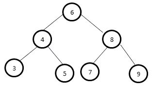
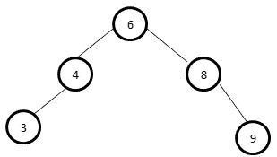

# 二叉查找树所有级别的总和

> 原文:[https://www . geesforgeks . org/二进制搜索树中所有级别的总和/](https://www.geeksforgeeks.org/sum-of-all-the-levels-in-a-binary-search-tree/)

给定一个[二叉查找树](https://www.geeksforgeeks.org/binary-search-tree-set-1-search-and-insertion/)，任务是找到处于同一级别的节点的水平和。
**例:**

> **输入:**
> 
> 
> 
> **输出:**
> 6
> 12
> 24
> **输入:**
> 
> 
> 
> **输出:**T2 6
> 12
> 12

**方法:**找到给定二叉树的高度，那么树中的层数将是**层=高度+ 1** 。现在创建一个大小为**级**的数组 **sum[]** ，其中 **sum[i]** 将存储第**I**级的所有节点的总和。为了更新这个数组，写一个递归函数，在**sum【level】**处添加当前节点的数据，其中 **level** 是当前节点的级别，然后对级别为 **level + 1** 的子节点递归调用相同的方法。
以下是上述办法的实施:

## C++

```
// C++ implementation of the approach
#include <iostream>
#include <queue>
using namespace std;

// A Binary Tree Node
struct Node {
    int data;
    struct Node *left, *right;
};

// Utility function to create a new tree node
Node* newNode(int data)
{
    Node* temp = new Node;
    temp->data = data;
    temp->left = temp->right = NULL;
    return temp;
}

// Utility function to print
// the contents of an array
void printArr(int arr[], int n)
{
    for (int i = 0; i < n; i++)
        cout << arr[i] << endl;
}

// Function to return the height
// of the binary tree
int getHeight(Node* root)
{
    if (root->left == NULL && root->right == NULL)
        return 0;

    int left = 0;
    if (root->left != NULL)
        left = getHeight(root->left);

    int right = 0;
    if (root->right != NULL)
        right = getHeight(root->right);

    return (max(left, right) + 1);
}

// Recursive function to update sum[] array
// such that sum[i] stores the sum
// of all the elements at ith level
void calculateLevelSum(Node* node, int level, int sum[])
{
    if (node == NULL)
        return;

    // Add current node data to the sum
    // of the current node's level
    sum[level] += node->data;

    // Recursive call for left and right sub-tree
    calculateLevelSum(node->left, level + 1, sum);
    calculateLevelSum(node->right, level + 1, sum);
}

// Driver code
int main()
{
    // Create the binary tree
    Node* root = newNode(6);
    root->left = newNode(4);
    root->right = newNode(8);
    root->left->left = newNode(3);
    root->left->right = newNode(5);
    root->right->left = newNode(7);
    root->right->right = newNode(9);

    // Count of levels in the
    // given binary tree
    int levels = getHeight(root) + 1;

    // To store the sum at every level
    int sum[levels] = { 0 };
    calculateLevelSum(root, 0, sum);

    // Print the required sums
    printArr(sum, levels);

    return 0;
}
```

## Java 语言(一种计算机语言，尤用于创建网站)

```
// Java implementation of the approach
class Sol
{

// A Binary Tree Node
static class Node
{
    int data;
    Node left, right;
};

// Utility function to create a new tree node
static Node newNode(int data)
{
    Node temp = new Node();
    temp.data = data;
    temp.left = temp.right = null;
    return temp;
}

// Utility function to print
// the contents of an array
static void printArr(int arr[], int n)
{
    for (int i = 0; i < n; i++)
        System.out.print(arr[i]+ " " );
}

// Function to return the height
// of the binary tree
static int getHeight(Node root)
{
    if (root.left == null && root.right == null)
        return 0;

    int left = 0;
    if (root.left != null)
        left = getHeight(root.left);

    int right = 0;
    if (root.right != null)
        right = getHeight(root.right);

    return (Math.max(left, right) + 1);
}

// Recursive function to update sum[] array
// such that sum[i] stores the sum
// of all the elements at ith level
static void calculateLevelSum(Node node, int level, int sum[])
{
    if (node == null)
        return;

    // Add current node data to the sum
    // of the current node's level
    sum[level] += node.data;

    // Recursive call for left and right sub-tree
    calculateLevelSum(node.left, level + 1, sum);
    calculateLevelSum(node.right, level + 1, sum);
}

// Driver code
public static void main(String args[])
{
    // Create the binary tree
    Node root = newNode(6);
    root.left = newNode(4);
    root.right = newNode(8);
    root.left.left = newNode(3);
    root.left.right = newNode(5);
    root.right.left = newNode(7);
    root.right.right = newNode(9);

    // Count of levels in the
    // given binary tree
    int levels = getHeight(root) + 1;

    // To store the sum at every level
    int sum[]=new int[levels];
    calculateLevelSum(root, 0, sum);

    // Print the required sums
    printArr(sum, levels);
}
}

// This code is contributed by andrew1234
```

## 蟒蛇 3

```
# Python3 implementation of above algorithm

# Utility class to create a node
class Node:
    def __init__(self, key):
        self.data = key
        self.left = self.right = None

# Utility function to create a tree node
def newNode( data):

    temp = Node(0)
    temp.data = data
    temp.left = temp.right = None
    return temp

# Utility function to print
# the contents of an array
def printArr(arr, n):

    i = 0
    while ( i < n):
        print( arr[i])
        i = i + 1

# Function to return the height
# of the binary tree
def getHeight(root):

    if (root.left == None and root.right == None):
        return 0

    left = 0
    if (root.left != None):
        left = getHeight(root.left)

    right = 0
    if (root.right != None):
        right = getHeight(root.right)

    return (max(left, right) + 1)

sum = []

# Recursive function to update sum[] array
# such that sum[i] stores the sum
# of all the elements at ith level
def calculateLevelSum(node, level):

    global sum
    if (node == None):
        return

    # Add current node data to the sum
    # of the current node's level
    sum[level] += node.data

    # Recursive call for left and right sub-tree
    calculateLevelSum(node.left, level + 1)
    calculateLevelSum(node.right, level + 1)

# Driver code

# Create the binary tree
root = newNode(6)
root.left = newNode(4)
root.right = newNode(8)
root.left.left = newNode(3)
root.left.right = newNode(5)
root.right.left = newNode(7)
root.right.right = newNode(9)

# Count of levels in the
# given binary tree
levels = getHeight(root) + 1

# To store the sum at every level
sum = [0] * levels
calculateLevelSum(root, 0)

# Print the required sums
printArr(sum, levels)

# This code is contributed by Arnab Kundu
```

## C#

```
// C# implementation of the approach
using System;
class GFG
{

// A Binary Tree Node
public class Node
{
    public int data;
    public Node left, right;
};

// Utility function to create a new tree node
static Node newNode(int data)
{
    Node temp = new Node();
    temp.data = data;
    temp.left = temp.right = null;
    return temp;
}

// Utility function to print
// the contents of an array
static void printArr(int []arr, int n)
{
    for (int i = 0; i < n; i++)
        Console.WriteLine(arr[i]);
}

// Function to return the height
// of the binary tree
static int getHeight(Node root)
{
    if (root.left == null &&
        root.right == null)
        return 0;

    int left = 0;
    if (root.left != null)
        left = getHeight(root.left);

    int right = 0;
    if (root.right != null)
        right = getHeight(root.right);

    return (Math.Max(left, right) + 1);
}

// Recursive function to update sum[] array
// such that sum[i] stores the sum
// of all the elements at ith level
static void calculateLevelSum(Node node, int level,
                                         int []sum)
{
    if (node == null)
        return;

    // Add current node data to the sum
    // of the current node's level
    sum[level] += node.data;

    // Recursive call for left and right sub-tree
    calculateLevelSum(node.left, level + 1, sum);
    calculateLevelSum(node.right, level + 1, sum);
}

// Driver code
public static void Main(String []args)
{
    // Create the binary tree
    Node root = newNode(6);
    root.left = newNode(4);
    root.right = newNode(8);
    root.left.left = newNode(3);
    root.left.right = newNode(5);
    root.right.left = newNode(7);
    root.right.right = newNode(9);

    // Count of levels in the
    // given binary tree
    int levels = getHeight(root) + 1;

    // To store the sum at every level
    int []sum = new int[levels];
    calculateLevelSum(root, 0, sum);

    // Print the required sums
    printArr(sum, levels);
}
}

// This code is contributed by 29AjayKumar
```

## java 描述语言

```
<script>
// Javascript implementation of the approach

// A Binary Tree Node
class Node
{
    constructor(data)
    {
        this.data = data;
        this.left = this.right = null;
    }
}

// Utility function to print
// the contents of an array
function printArr(arr, n)
{
    for (let i = 0; i < n; i++)
        document.write(arr[i]+ " <br>" );
}

// Function to return the height
// of the binary tree
function getHeight(root)
{
    if (root.left == null && root.right == null)
        return 0;

    let left = 0;
    if (root.left != null)
        left = getHeight(root.left);

    let right = 0;
    if (root.right != null)
        right = getHeight(root.right);

    return (Math.max(left, right) + 1);
}

// Recursive function to update sum[] array
// such that sum[i] stores the sum
// of all the elements at ith level
function calculateLevelSum(node,level,sum)
{
    if (node == null)
        return;

    // Add current node data to the sum
    // of the current node's level
    sum[level] += node.data;

    // Recursive call for left and right sub-tree
    calculateLevelSum(node.left, level + 1, sum);
    calculateLevelSum(node.right, level + 1, sum);   
}

// Driver code
// Create the binary tree
let root = new Node(6);
root.left = new Node(4);
root.right = new Node(8);
root.left.left = new Node(3);
root.left.right = new Node(5);
root.right.left = new Node(7);
root.right.right = new Node(9);

// Count of levels in the
// given binary tree
let levels = getHeight(root) + 1;

// To store the sum at every level
let sum=new Array(levels);
for(let i = 0; i < levels; i++)
    sum[i] = 0;

calculateLevelSum(root, 0, sum);

// Print the required sums
printArr(sum, levels);

// This code is contributed by avanitrachhadiya2155
</script>
```

**Output:** 

```
6
12
24
```

**时间复杂度:**O(N)
T3】辅助空间: O(N)