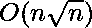

# 给定范围内所有素数之和

> 原文:[https://www . geesforgeks . org/给定范围内所有素数之和/](https://www.geeksforgeeks.org/sum-of-all-the-prime-numbers-in-a-given-range/)

给定一个范围[l，r]，任务是找出该范围内所有素数的和。
**例:**

```
Input : l=1 and r=6
Output : 10

Input : l=4 and r=13
Output : 36

```

**方法 1:(天真的方法)**
迭代从‘l’到‘r’的循环，将所有质数相加。
以下是上述办法的实施:

## C++

```
// C++ Program to compute sum of prime number
// in a given range
#include <iostream>
using namespace std;

// Method to compute the prime number
// Time Complexity is O(sqrt(N))
bool checkPrime(int numberToCheck)
{
    if(numberToCheck == 1) {
        return false;
    }
    for (int i = 2; i*i <= numberToCheck; i++) {
        if (numberToCheck % i == 0) {
            return false;
        }
    }
    return true;
}

// Method to iterate the loop from l to r
// If the current number is prime, sum the value
int primeSum(int l, int r)
{
    int sum = 0;
    for (int i = r; i >= l; i--) {

        // Check for prime
        bool isPrime = checkPrime(i);
        if (isPrime) {

            // Sum the prime number
            sum = sum + i;
        }
    }
    return sum;
}
// Time Complexity is O(r x sqrt(N))

//Driver code
int main()
{
    int l = 4, r = 13;

    // Call the method with l and r
    cout << primeSum(l, r);
}
```

## Java 语言(一种计算机语言，尤用于创建网站)

```
// Java Program to compute sum of prime number
// in a given range
public class GFG {

    // Method to compute the prime number
    // Time Complexity is O(sqrt(N))
    static boolean checkPrime(int numberToCheck)
    {
        if(numberToCheck == 1) {
            return false;
        }
        for (int i = 2; i*i <= numberToCheck; i++) {
            if (numberToCheck % i == 0) {
                return false;
            }
        }
        return true;
    }

    // Method to iterate the loop from l to r
    // If prime number detects, sum the value
    static int primeSum(int l, int r)
    {
        int sum = 0;
        for (int i = r; i >= l; i--) {

            // Check for prime
            boolean isPrime = checkPrime(i);
            if (isPrime) {

                // Sum the prime number
                sum = sum + i;
            }
        }
        return sum;
    }
    // Time Complexity is O(r x sqrt(N))

    // Driver code
    public static void main(String[] args)
    {
        int l = 4, r = 13;

        // Call the method with l and r
        System.out.println(primeSum(l, r));
    }
}
```

## 蟒蛇 3

```
# Python3 Program to compute sum
# of prime number in a given range

# from math lib import sqrt method
from math import sqrt

# Function to compute the prime number
# Time Complexity is O(sqrt(N))
def checkPrime(numberToCheck) :

    if numberToCheck == 1 :
        return False

    for i in range(2, int(sqrt(numberToCheck)) + 1) :

        if numberToCheck % i == 0 :
            return False

    return True

# Function to iterate the loop
# from l to r. If the current
# number is prime, sum the value
def primeSum(l, r) :

    sum = 0

    for i in range(r, (l - 1), -1) :

        # Check for prime
        isPrime = checkPrime(i)

        if (isPrime) :

            # Sum the prime number
            sum += i

    return sum

# Time Complexity is O(r x sqrt(N))

# Driver code    
if __name__ == "__main__" :

    l, r = 4, 13

    # Call the function with l and r
    print(primeSum(l, r))

# This code is contributed
# by ANKITRAI1
```

## C#

```
// C# Program to compute sum
// of prime number in a given range
using System;

class GFG
{

// Method to compute the prime
// number Time Complexity is O(sqrt(N))
static bool checkPrime(int numberToCheck)
{
    if(numberToCheck == 1)
    {
        return false;
    }
    for (int i = 2;
             i * i <= numberToCheck; i++)
    {
        if (numberToCheck % i == 0)
        {
            return false;
        }
    }
    return true;
}

// Method to iterate the loop from l to r
// If prime number detects, sum the value
static int primeSum(int l, int r)
{
    int sum = 0;
    for (int i = r; i >= l; i--)
    {

        // Check for prime
        bool isPrime = checkPrime(i);
        if (isPrime)
        {

            // Sum the prime number
            sum = sum + i;
        }
    }
    return sum;
}
// Time Complexity is O(r x sqrt(N))

// Driver code
public static void Main()
{
    int l = 4, r = 13;

    // Call the method with l and r
    Console.Write(primeSum(l, r));
}
}

// This code is contributed
// by ChitraNayal
```

## 服务器端编程语言（Professional Hypertext Preprocessor 的缩写）

```
<?php
// PHP Program to compute sum of
// prime number in a given range

// Method to compute the prime number
// Time Complexity is O(sqrt(N))
function checkPrime($numberToCheck)
{
    if($numberToCheck == 1)
    {
        return false;
    }
    for ($i = 2; $i * $i <= $numberToCheck; $i++)
    {
        if ($numberToCheck % $i == 0)
        {
            return false;
        }
    }
    return true;
}

// Method to iterate the loop from
// l to r. If the current number
// is prime, sum the value
function primeSum($l, $r)
{
    $sum = 0;
    for ($i = $r; $i >= $l; $i--)
    {

        // Check for prime
        $isPrime = checkPrime($i);
        if ($isPrime)
        {

            // Sum the prime number
            $sum = $sum + $i;
        }
    }
    return $sum;
}

// Time Complexity is O(r x sqrt(N))

// Driver code
$l = 4; $r = 13;

// Call the method with l and r
echo primeSum($l, $r);

// This code is contributed by ajit
?>
```

## java 描述语言

```
<script>
    // Javascript Program to compute sum
    // of prime number in a given range

    // Method to compute the prime
    // number Time Complexity is O(sqrt(N))
    function checkPrime(numberToCheck)
    {
        if(numberToCheck == 1)
        {
            return false;
        }
        for (let i = 2; i * i <= numberToCheck; i++)
        {
            if (numberToCheck % i == 0)
            {
                return false;
            }
        }
        return true;
    }

    // Method to iterate the loop from l to r
    // If prime number detects, sum the value
    function primeSum(l, r)
    {
        let sum = 0;
        for (let i = r; i >= l; i--)
        {

            // Check for prime
            let isPrime = checkPrime(i);
            if (isPrime)
            {

                // Sum the prime number
                sum = sum + i;
            }
        }
        return sum;
    }

    let l = 4, r = 13;

    // Call the method with l and r
    document.write(primeSum(l, r));

</script>
```

**输出:**

```
36
```

**时间复杂度:** 
**空间复杂度:** 
**途径 2:(动态规划)**

1.  声明一个数组 dp 和 arr
2.  将数组 arr 填充为 0
3.  重复循环直到 sqrt(N)，如果 arr[i] = 0(标记为质数)，那么通过将相应的位置标记为 1，将其所有倍数设置为非质数
4.  用运行的质数总和更新 dp 数组，其中每个位置“dp[i]”保存范围[1，i]内所有质数的总和

*图像表示*


## C++

```
// C++ Program to compute sum of prime number
// in a given range
#include <bits/stdc++.h>
using namespace std;

// Suppose the constraint is N<=1000
const int N = 1000;

// Declare an array for dynamic approach
int dp[N + 1];

// Method to compute the array
void sieve()
{
    // Declare an extra array as arr
    int arr[N + 1];
    arr[0] = 1;
    arr[1] = 1;

    // Iterate the loop till sqrt(n)
    // Time Complexity is O(log(n) X sqrt(n))
    for (int i = 2; i <= sqrt(N); i++)

        // if ith element of arr is 0 i.e. marked as prime
        if (arr[i] == 0)

            // mark all of it's multiples till N as non-prime
            // by setting the locations to 1
            for (int j = i * i; j <= N; j += i)
                arr[j] = 1;

    long runningPrimeSum = 0;

    // Update the array 'dp' with the running sum
    // of prime numbers within the range [1, N]
    // Time Complexity is O(n)
    for (int i = 1; i <= N; i++)
    {
        if (arr[i] == 0)
            runningPrimeSum += i;

        // Here, dp[i] is the sum of all the prime numbers
        // within the range [1, i]
        dp[i] = runningPrimeSum;
    }
}

// Driver code
int main()
{
    int l = 4, r = 13;

    // Compute dp
    sieve();
    cout << dp[r] - dp[l - 1];

    return 0;
}

// This code is contributed by divyesh072019
```

## Java 语言(一种计算机语言，尤用于创建网站)

```
// Java Program to compute sum of prime number
// in a given range
public class GFG {

    // Suppose the constraint is N<=1000
    static int N = 1000;

    // Declare an array for dynamic approach
    static long dp[] = new long[N + 1];

    // Method to compute the array
    static void sieve()
    {
        // Declare an extra array as arr
        int arr[] = new int[N + 1];
        arr[0] = 1;
        arr[1] = 1;

        // Iterate the loop till sqrt(n)
        // Time Complexity is O(log(n) X sqrt(n))
        for (int i = 2; i <= Math.sqrt(N); i++)

            // if ith element of arr is 0 i.e. marked as prime
            if (arr[i] == 0)

                // mark all of it's multiples till N as non-prime
                // by setting the locations to 1
                for (int j = i * i; j <= N; j += i)
                    arr[j] = 1;

        long runningPrimeSum = 0;

        // Update the array 'dp' with the running sum
        // of prime numbers within the range [1, N]
        // Time Complexity is O(n)
        for (int i = 1; i <= N; i++) {
            if (arr[i] == 0)
                runningPrimeSum += i;

            //Here, dp[i] is the sum of all the prime numbers
            //within the range [1, i]
            dp[i] = runningPrimeSum;
        }
    }

    // Driver code
    public static void main(String[] args)
    {
        int l = 4, r = 13;

        // Compute dp
        sieve();
        System.out.println(dp[r] - dp[l - 1]);
    }
}
```

## 蟒蛇 3

```
# Python3 Program to compute sum of prime number
# in a given range
import math # for sqrt and ceil function

# Suppose the constraint is N<=1000
N = 1000

# Declare an array for dynamic approach
dp = [0] * (N + 1)

# Method to compute the array
def sieve():

    # Declare an extra array as array
    array = [0] * (N + 1)

    array[0] = 1
    array[1] = 1

    # Iterate the loop till sqrt(N)
    # Time Complexity is O(log(n) X sqrt(N))
    for i in range(2, math.ceil(math.sqrt(N) + 1)):

        # if ith element of arr is 0
        # i.e. marked as prime
        if array[i] == 0:

            # mark all of it's multiples till N as
            # non-prime by setting the locations to 1
            for j in range(i * i, N + 1, i):
                array[j] = 1

    runningPrimeSum = 0

    # Update the array 'dp' with the running sum
    # of prime numbers within the range [1, N]
    # Time Complexity is O(n)
    for i in range(1, N + 1):
        if array[i] == 0:
            runningPrimeSum += i

        # Here, dp[i] is the sum of all the prime numbers
        # within the range [1, i]
        dp[i] = runningPrimeSum

# Driver Code
l = 4
r = 13
sieve()
print(dp[r] - dp[l - 1])

# This code is contributed by Vivek Kumar Singh
```

## C#

```
// C# Program to compute sum of prime number
// in a given range
using System;
public class GFG {

    // Suppose the constraint is N<=1000
    static int N = 1000;

    // Declare an array for dynamic approach
    static long[] dp = new long[N + 1];

    // Method to compute the array
    static void sieve()
    {
        // Declare an extra array as arr
        int []arr = new int[N + 1];
        arr[0] = 1;
        arr[1] = 1;

        // Iterate the loop till sqrt(n)
        // Time Complexity is O(log(n) X sqrt(n))
        for (int i = 2; i <= Math.Sqrt(N); i++)

            // if ith element of arr is 0 i.e. marked as prime
            if (arr[i] == 0)

                // mark all of it's multiples till N as non-prime
                // by setting the locations to 1
                for (int j = i * i; j <= N; j += i)
                    arr[j] = 1;

        long runningPrimeSum = 0;

        // Update the array 'dp' with the running sum
        // of prime numbers within the range [1, N]
        // Time Complexity is O(n)
        for (int i = 1; i <= N; i++) {
            if (arr[i] == 0)
                runningPrimeSum += i;

            //Here, dp[i] is the sum of all the prime numbers
            //within the range [1, i]
            dp[i] = runningPrimeSum;
        }
    }

    // Driver code
    public static void Main()
    {
        int l = 4, r = 13;

        // Compute dp
        sieve();
        Console.WriteLine(dp[r] - dp[l - 1]);
    }
}

/*This code is contributed by 29AjayKumar*/
```

## java 描述语言

```
<script>
// Javascript Program to compute sum of prime number
// in a given range

    // Suppose the constraint is N<=1000
    let N = 1000;

    // Declare an array for dynamic approach
    let dp=new Array(N+1);
    for(let i=0;i<dp.length;i++)
    {
        dp[i]=0;
    }
    // Method to compute the array
    function sieve()
    {
        let arr=new Array(N+1);
        for(let i=0;i<arr.length;i++)
        {
            arr[i]=0;
        }
        arr[0] = 1;
        arr[1] = 1;

        // Iterate the loop till sqrt(n)
        // Time Complexity is O(log(n) X sqrt(n))
        for (let i = 2; i <= Math.ceil(Math.sqrt(N)+1); i++)

            // if ith element of arr is 0 i.e. marked as prime
            if (arr[i] == 0)

                // mark all of it's multiples till N as non-prime
                // by setting the locations to 1
                for (let j = i * i; j <= N; j += i)
                    arr[j] = 1;

        let runningPrimeSum = 0;

        // Update the array 'dp' with the running sum
        // of prime numbers within the range [1, N]
        // Time Complexity is O(n)
        for (let i = 1; i <= N; i++) {
            if (arr[i] == 0)
                runningPrimeSum += i;

            //Here, dp[i] is the sum of all the prime numbers
            //within the range [1, i]
            dp[i] = runningPrimeSum;
        }
    }

    // Driver code
    let l = 4, r = 13;
    // Compute dp
    sieve();
    document.write(dp[r] - dp[l - 1]);

// This code is contributed by avanitrachhadiya2155
</script>
```

**输出:**

```
36
```

**时间复杂度:** 
**空间复杂度:** 