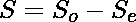

# 前 N 个自然数的交替符号立方之和

> 原文:[https://www . geeksforgeeks . org/交替符号立方之和第 n 个自然数/](https://www.geeksforgeeks.org/sum-of-alternating-sign-cubes-of-first-n-natural-numbers/)

给定一个数 **N** ，任务是求前 N 个自然数的交替符号立方之和，即

> 1<sup>3</sup>–2<sup>3</sup>+3<sup>3</sup>–4<sup>3</sup>+5<sup>3</sup>–6<sup>3</sup>+…。

**例:**

> **输入:** N = 2
> **输出:** -7
> **解释:**
> 所需和= 1<sup>3</sup>–2<sup>3</sup>=-7
> **输入:** N = 3
> **输出:** 20
> **解释:**
> 所需和= 1<sup>3</sup>–2

**天真方法:**一个简单的解决方案是通过迭代一个从到 N 的[循环](https://www.geeksforgeeks.org/c-c-for-loop-with-examples/)来解决这个问题，并通过每次交替符号来计算总和。
以下是上述方法的实施:

## C++

```
// C++ implementation to compute
// the sum of cubes with
// alternating sign

#include <iostream>

using namespace std;

// Function to compute sum
// of the cubes with
// alternating sign
int summation(int n)
{
    int sum = 0;
    for (int i = 1; i <= n; i++)
        if (i % 2 == 1)
            sum += (i * i * i);
        else
            sum -= (i * i * i);

    return sum;
}

// Driver code
int main()
{
    int n = 3;
    cout << summation(n);
    return 0;
}
```

## Java 语言(一种计算机语言，尤用于创建网站)

```
// Java implementation to compute
// the sum of cubes with
// alternating sign
import java.util.*;

class GFG {

// Function to compute sum
// of the cubes with
// alternating sign
static int summation(int n)
{
    int sum = 0;

    for(int i = 1; i <= n; i++)
    {
       if (i % 2 == 1)
           sum += (i * i * i);
       else
           sum -= (i * i * i);
    }
    return sum;
}

// Driver code
public static void main(String[] args)
{
    int n = 3;

    System.out.println(summation(n));
}
}

// This code is contributed by offbeat
```

## 蟒蛇 3

```
# Python3 implementation to 
# compute the sum of cubes 
# with alternating sign

# Function to compute sum
# of the cubes with
# alternating sign
def summation(n):

    sum = 0
    for i in range(1, n + 1):
        if i % 2 == 1:
            sum = sum + (i * i * i)
        else:
            sum = sum - (i * i * i)

    return sum

# Driver code
n = 3

print(summation(n))

# This code is contributed by ishayadav181
```

## C#

```
// C# implementation to compute
// the sum of cubes with
// alternating sign
using System;
class GFG{

// Function to compute sum
// of the cubes with
// alternating sign
static int summation(int n)
{
    int sum = 0;

    for(int i = 1; i <= n; i++)
    {
        if (i % 2 == 1)
            sum += (i * i * i);
        else
            sum -= (i * i * i);
    }
    return sum;
}

// Driver code
public static void Main(String[] args)
{
    int n = 3;

    Console.WriteLine(summation(n));
}
}

// This code is contributed by sapnasingh4991
```

## java 描述语言

```
<script>
// JavaScript implementation to compute
// the sum of cubes with
// alternating sign

    // Function to compute sum
    // of the cubes with
    // alternating sign
    function summation(n)
    {
        let sum = 0;
        for (let i = 1; i <= n; i++)
            if (i % 2 == 1)
                sum += (i * i * i);
            else
                sum -= (i * i * i);

        return sum;
    }

    // Driver code

    let n = 3;
    document.write(summation(n));

// This code is contributed by Surbhi Tyagi

</script>
```

**Output:** 

```
20
```

时间复杂度:0(n)

辅助空间:0(1)

**高效逼近:**问题中的关键观察是每一个偶数都带有一个负号，也就是用来减少整体和的。因此，如果我们单独计算偶数和奇数的立方之和，那么总和可以很容易地计算出来。

*   前 N 个自然数中偶数或奇数的计数
    = > 
    = > 

*   第一偶数项之和
    = > 

*   第一奇数项之和
    = > 

*   总和
    = > 
    = > 

以下是上述方法的实现:

## C++

```
// C++ implementation to compute
// the sum of cubes with
// alternating sign

#include <bits/stdc++.h>
using namespace std;

// Function to compute sum
// of the cubes with alternating sign
int summation(int N)
{
    int co = (N + 1) / 2;
    int ce = (N) / 2;
    int se = 2 * ((ce * (ce + 1))
                  * (ce * (ce + 1)));
    int so = (co * co)
             * (2 * ((co * co)) - 1);
    return so - se;
}

// Driver Code
int main()
{
    int n = 3;
    cout << summation(n);
    return 0;
}
```

## Java 语言(一种计算机语言，尤用于创建网站)

```
// Java implementation to compute
// the sum of cubes with
// alternating sign
import java.util.*;

class GFG{

// Function to compute sum
// of the cubes with
// alternating sign
static int summation(int N)
{
    int co = (N + 1) / 2;
    int ce = (N) / 2;

    int se = 2 * ((ce * (ce + 1)) *
                  (ce * (ce + 1)));
    int so = (co * co) * (2 * ((co * co)) - 1);

    return so - se;
}

// Driver code
public static void main(String[] args)
{
    int n = 3;

    System.out.println(summation(n));
}
}

// This code is contributed by offbeat
```

## 蟒蛇 3

```
# Python3 implementation to compute
# the sum of cubes with
# alternating sign

# Function to compute sum of
# the cubes with alternating sign
def summation(N):

    co = (N + 1) / 2
    co = int(co)

    ce = N / 2
    ce = int(ce)

    se = 2 * ((ce * (ce + 1)) *
              (ce * (ce + 1)))
    so = (co * co) * (2 * (co * co) - 1)

    return so - se

# Driver Code
n = 3

print(summation(n))

# This code is contributed by ishayadav181
```

## C#

```
// C# implementation to compute
// the sum of cubes with
// alternating sign
using System;

class GFG{

// Function to compute sum
// of the cubes with
// alternating sign
static int summation(int N)
{
    int co = (N + 1) / 2;
    int ce = (N) / 2;

    int se = 2 * ((ce * (ce + 1)) *
                  (ce * (ce + 1)));
    int so = (co * co) * (2 * ((co * co)) - 1);

    return so - se;
}

// Driver code
public static void Main(String[] args)
{
    int n = 3;

    Console.WriteLine(summation(n));
}
}

// This code is contributed by Rohit_ranjan
```

## java 描述语言

```
<script>
// javascript implementation to compute
// the sum of cubes with
// alternating sign

// Function to compute sum
// of the cubes with
// alternating sign
function summation(N)
{
    var co = parseInt((N + 1) / 2);
    var ce = parseInt((N) / 2);

    var se = 2 * ((ce * (ce + 1)) *
                  (ce * (ce + 1)));
    var so = (co * co) * (2 * ((co * co)) - 1);

    return so - se;
}

// Driver code
var n = 3;
document.write(summation(n));

// This code is contributed by Amit Katiyar
</script>
```

**Output:** 

```
20
```

时间复杂度:0(1)

辅助空间:0(1)