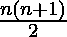

# 前 N 个自然数的交替符号平方和

> 原文:[https://www . geesforgeks . org/第一 n 个自然数的交替符号平方和/](https://www.geeksforgeeks.org/sum-of-alternating-sign-squares-of-first-n-natural-numbers/)

给定一个数 N，任务是求前 N 个自然数的交替符号平方和，即

> 1<sup>2</sup>–2<sup>2</sup>+3<sup>2</sup>–4<sup>2</sup>+5<sup>2</sup>–6<sup>2</sup>+…。

**例:**

```
Input: N = 2
Output: 5
Explanation:
Required sum = 12 - 22 = -1

Input: N = 8
Output: 36
Explanation:
Required sum 
= 12 - 22 + 32 - 42 + 52 - 62 + 72 - 82 
= 36
```

**天真法:O(N)**
解决这个问题的天真法或蛮力法规定，找出从 1 到 N 的每个数的平方，并用交替符号相加，以得到所需的和。

1.  对于 1 到 N 中的每个数字，求其平方
2.  用交替符号将这些方块相加
3.  这将给出所需的金额。

以下是上述方法的实现:

## C++

```
// C++ program to find Sum of alternating
// sign Squares of first N natural numbers

#include <iostream>
using namespace std;

// Function to calculate
// the alternating sign sum
int summation(int n)
{

    // Variable to store the sum
    int sum = 0;

    // Loop to iterate each number
    // from 1 to N
    for (int i = 1; i <= n; i++) {

        // The alternating sign is put
        // by checking if the number
        // is even or odd
        if (i % 2 == 1)
            // Add the square with the sign
            sum += (i * i);

        else
            // Add the square with the sign
            sum -= (i * i);
    }
    return sum;
}

// Driver code
int main()
{
    int N = 2;
    cout << summation(N);
    return 0;
}
```

## Java 语言(一种计算机语言，尤用于创建网站)

```
// Java program to find Sum of alternating
// sign Squares of first N natural numbers
class GFG
{

    // Function to calculate
    // the alternating sign sum
    static int summation(int n)
    {

        // Variable to store the sum
        int sum = 0;

        // Loop to iterate each number
        // from 1 to N
        for (int i = 1; i <= n; i++) {

            // The alternating sign is put
            // by checking if the number
            // is even or odd
            if (i % 2 == 1)

                // Add the square with the sign
                sum += (i * i);

            else

                // Add the square with the sign
                sum -= (i * i);
        }
        return sum;
    }

    // Driver code
    public static void main (String[] args)
    {
        int N = 2;
        System.out.println(summation(N));
    }
}

// This code is contributed by AnkitRai01
```

## 蟒蛇 3

```
# Python3 program to find Sum of alternating
# sign Squares of first N natural numbers

# Function to calculate
# the alternating sign sum
def summation(n) :

    # Variable to store the sum
    sum = 0;

    # Loop to iterate each number
    # from 1 to N
    for i in range(1, n + 1) :

        # The alternating sign is put
        # by checking if the number
        # is even or odd
        if (i % 2 == 1) :
            # Add the square with the sign
            sum += (i * i);

        else :
            # Add the square with the sign
            sum -= (i * i);

    return sum;

# Driver code
if __name__ == "__main__" :

    N = 2;
    print(summation(N));

    # This code is contributed by AnkitRai01
```

## C#

```
// C# program to find Sum of alternating
// sign Squares of first N natural numbers
using System;

class GFG
{

    // Function to calculate
    // the alternating sign sum
    static int summation(int n)
    {

        // Variable to store the sum
        int sum = 0;

        // Loop to iterate each number
        // from 1 to N
        for (int i = 1; i <= n; i++) {

            // The alternating sign is put
            // by checking if the number
            // is even or odd
            if (i % 2 == 1)

                // Add the square with the sign
                sum += (i * i);

            else

                // Add the square with the sign
                sum -= (i * i);
        }
        return sum;
    }

    // Driver code
    public static void Main()
    {
        int N = 2;
        Console.WriteLine(summation(N));
    }
}

// This code is contributed by AnkitRai01
```

## java 描述语言

```
<script>
// JavaScript program to find Sum of alternating
// sign Squares of first N natural numbers

    // Function to calculate
    // the alternating sign sum
    function summation(n)
    {

        // Variable to store the sum
        let sum = 0;

        // Loop to iterate each number
        // from 1 to N
        for (let i = 1; i <= n; i++) {

            // The alternating sign is put
            // by checking if the number
            // is even or odd
            if (i % 2 == 1)
                // Add the square with the sign
                sum += (i * i);

            else
                // Add the square with the sign
                sum -= (i * i);
        }
        return sum;
    }

    // Driver code

    let N = 2;
    document.write(summation(N));

// This code is contributed by Surbhi Tyagi

</script>
```

**Output:** 

```
-3
```

**有效方法:O(1)**
有一个公式可以求出前 n 个交替符号数的平方和:

![\[\LARGE 1^{2}-2^{2}+3^{2}-4^{2}+... = (-1)^{n+1} \text{ } \frac{n(n+1)}{2}\]    ](img/c165ec9f430b118292a7dda4d10cf96d.png "Rendered by QuickLaTeX.com")

**这是如何工作的？**

```
We can prove this formula using induction.
We can easily see that the formula is true for
n = 1 and n = 2 as sums are 1 and -3 respectively.

Let it be true for n = k-1\. So sum of k-1 numbers
is (-1)k(k - 1) * k / 2

In the following steps, we show that it is true 
for k assuming that it is true for k-1.

Sum of k numbers
 =(-1)k (Sum of k-1 numbers + k2)
 =(-1)k+1 ((k - 1) * k / 2 + k2)
 =(-1)k+1 (k * (k + 1) / 2), which is true.
```

因此，为了找到前 N 个自然数的交替符号平方和，只需计算公式并打印结果。

## C++

```
// C++ program to find Sum of alternating
// sign Squares of first N natural numbers

#include <iostream>
using namespace std;

// Function to calculate
// the alternating sign sum
int summation(int n)
{

    // Variable to store the absolute sum
    int abs_sum = n * (n + 1) / 2;

    // Variable to store the sign
    int sign = n + 1 % 2 == 0 ? 1 : -1;

    // Variable to store the resultant sum
    int result_sum = sign * abs_sum;

    return result_sum;
}

// Driver code
int main()
{
    int N = 2;
    cout << summation(N);
    return 0;
}
```

## Java 语言(一种计算机语言，尤用于创建网站)

```
// Java program to find Sum of alternating
// sign Squares of first N natural numbers
class GFG
{

    // Function to calculate
    // the alternating sign sum
    static int summation(int n)
    {

        // Variable to store the absolute sum
        int abs_sum = n * (n + 1) / 2;

        // Variable to store the sign
        int sign = n + 1 % 2 == 0 ? 1 : -1;

        // Variable to store the resultant sum
        int result_sum = sign * abs_sum;

        return result_sum;
    }

    // Driver code
    public static void main (String[] args)
    {
        int N = 2;
        System.out.println(summation(N));
    }
}

// This code is contributed by AnkitRai01
```

## 蟒蛇 3

```
# Python3 program to find Sum of alternating
# sign Squares of first N natural numbers

# Function to calculate
# the alternating sign sum
def summation(n) :

    # Variable to store the absolute sum
    abs_sum = n * (n + 1) // 2;

    # Variable to store the sign
    sign = 1 if ((n + 1) % 2 == 0 ) else -1;

    # Variable to store the resultant sum
    result_sum = sign * abs_sum;

    return result_sum;

# Driver code
if __name__ == "__main__" :

    N = 2;
    print(summation(N));

# This code is contributed by AnkitRai01
```

## C#

```
// C# program to find Sum of alternating
// sign Squares of first N natural numbers

using System;

public class GFG
{

    // Function to calculate
    // the alternating sign sum
    static int summation(int n)
    {

        // Variable to store the absolute sum
        int abs_sum = (int)(n * (n + 1) / 2);

        // Variable to store the sign
        int sign = n + 1 % 2 == 0 ? 1 : -1;

        // Variable to store the resultant sum
        int result_sum = sign * abs_sum;

        return result_sum;
    }

    // Driver code
    public static void Main()
    {
        int N = 2;
        Console.WriteLine(summation(N));
    }
}

// This code is contributed by AnkitRai01
```

## java 描述语言

```
<script>

// Javascript program to find Sum of alternating
// sign Squares of first N natural numbers

// Function to calculate
// the alternating sign sum
function summation(n)
{

    // Variable to store the absolute sum
    var abs_sum = n * (n + 1) / 2;

    // Variable to store the sign
    var sign = n + 1 % 2 == 0 ? 1 : -1;

    // Variable to store the resultant sum
    var result_sum = sign * abs_sum;

    return result_sum;
}

// Driver code
var N = 2;
document.write(summation(N));

// This code is contributed by rutvik_56.
</script>
```

**Output:** 

```
-3
```