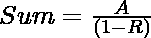
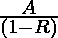

# 无限几何级数的和

> 原文:[https://www . geesforgeks . org/无限几何级数求和-gp/](https://www.geeksforgeeks.org/sum-of-an-infinite-geometric-progression-gp/)

给定两个整数 **A** 和 **R** ，表示一个[几何序列](https://www.geeksforgeeks.org/geometric-sequence-and-series/)的第一项和[公比](https://www.geeksforgeeks.org/program-to-find-the-common-ratio-of-three-numbers/)，任务是[求给定的第一项和公比形成的无穷几何级数](https://www.geeksforgeeks.org/program-sum-geometric-series/)的和。

**示例:**

> **输入:** A = 1，R = 0.5
> T3】输出: 2
> 
> **输入:** A = 1，R =-0.25
> T3】输出: 0.8

**方法:**给定的问题可以基于以下观察来解决:

*   如果 **R** 的绝对值大于等于 1，那么和将是**无穷大。**
*   否则，具有无限项的几何级数的[和可以使用以下公式计算](https://www.geeksforgeeks.org/program-sum-geometric-series/)

> 

因此，如果 **R** 的绝对值大于等于 1，则打印**“无限”**。否则，打印值作为结果总和。

下面是上述方法的实现:

## C++

```
// C++ program for the above approach

#include <bits/stdc++.h>
using namespace std;

// Function to calculate the sum of
// an infinite Geometric Progression
void findSumOfGP(double a, double r)
{
    // Case for Infinite Sum
    if (abs(r) >= 1) {
        cout << "Infinite";
        return;
    }

    // Store the sum of GP Series
    double sum = a / (1 - r);

    // Print the value of sum
    cout << sum;
}

// Driver Code
int main()
{
    double A = 1, R = 0.5;
    findSumOfGP(A, R);

    return 0;
}
```

## Java 语言(一种计算机语言，尤用于创建网站)

```
// Java program for the above approach
import java.util.*;

class GFG{

// Function to calculate the sum of
// an infinite Geometric Progression
static void findSumOfGP(double a, double r)
{

    // Case for Infinite Sum
    if (Math.abs(r) >= 1)
    {
        System.out.print("Infinite");
        return;
    }

    // Store the sum of GP Series
    double sum = a / (1 - r);

    // Print the value of sum
    System.out.print(sum);
}

// Driver Code
public static void main(String[] args)
{
    double A = 1, R = 0.5;
    findSumOfGP(A, R);
}
}

// This code is contributed by 29AjayKumar
```

## 蟒蛇 3

```
# Python3 program for the above approach

# Function to calculate the sum of
# an infinite Geometric Progression
def findSumOfGP(a, r):

    # Case for Infinite Sum
    if (abs(r) >= 1):
        print("Infinite")
        return

    # Store the sum of GP Series
    sum = a / (1 - r)

    # Print the value of sum
    print(int(sum))

# Driver Code
if __name__ == '__main__':
    A, R = 1, 0.5
    findSumOfGP(A, R)

# This code is contributed by mohit kumar 29.
```

## C#

```
// C# program for the above approach
using System;
class GFG
{

    // Function to calculate the sum of
    // an infinite Geometric Progression
    static void findSumOfGP(double a, double r)
    {

        // Case for Infinite Sum
        if (Math.Abs(r) >= 1) {
            Console.Write("Infinite");
            return;
        }

        // Store the sum of GP Series
        double sum = a / (1 - r);

        // Print the value of sum
        Console.Write(sum);
    }

    // Driver Code
    public static void Main()
    {
        double A = 1, R = 0.5;
        findSumOfGP(A, R);
    }
}

// This code is contributed by ukasp.
```

## java 描述语言

```
<script>

// JavaScript program for the above approach

// Function to calculate the sum of
// an infinite Geometric Progression
function findSumOfGP(a, r)
{

    // Case for Infinite Sum
    if (Math.abs(r) >= 1)
    {
        document.write("Infinite");
        return;
    }

    // Store the sum of GP Series
    let sum = a / (1 - r);

    // Print the value of sum
    document.write(sum);
}

// Driver Code
let A = 1, R = 0.5;

findSumOfGP(A, R);

// This code is contributed by sanjoy_62

</script>
```

**Output:** 

```
2
```

***时间复杂度:**O(1)*
T5**辅助空间:** O(1)