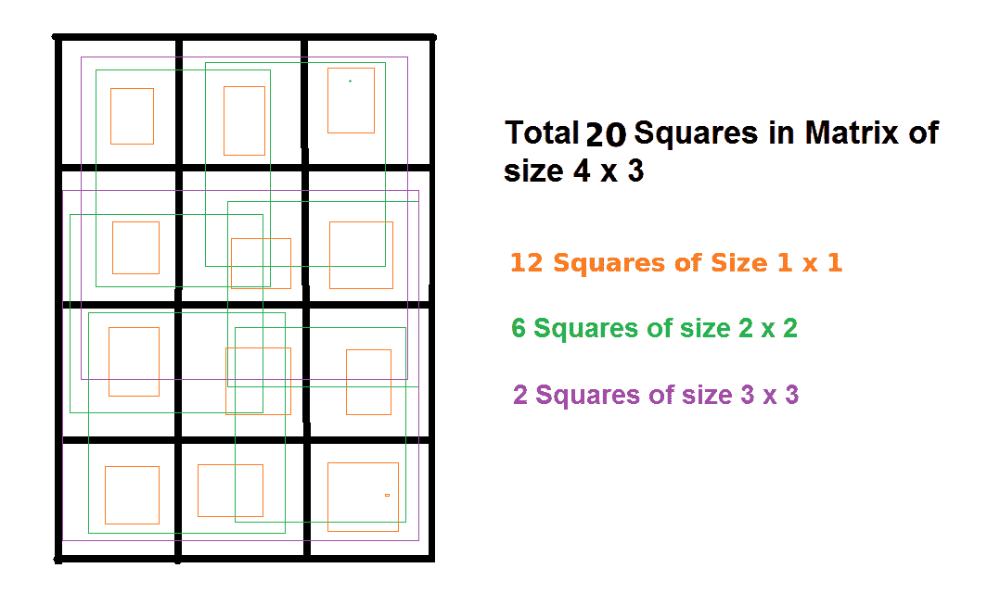

# 矩形内所有可能的正方形面积之和

> 原文:[https://www . geesforgeks . org/矩形内所有可能正方形面积之和/](https://www.geeksforgeeks.org/sum-of-area-of-all-possible-square-inside-a-rectangle/)

给定两个整数 L 和 B，分别表示矩形的长度和宽度。任务是计算进入矩形的所有可能正方形的面积总和。
**例** :

```
Input: L = 4, B = 3
Output: 54

Input:  L = 2, B = 5
Output: 26
```

这个想法是观察矩形中正方形数量的[计数。](https://www.geeksforgeeks.org/count-number-of-squares-in-a-rectangle/) 



现在，边 1 的方块数将为 12，因为将有两种情况，一种是沿水平方向的 1 个单位边的方块(3)，第二种是沿垂直方向的 1 个单位边的方块(4)。这给了我们 3*4 = 12 个正方形。
当边为 2 个单位时，一种情况将作为 2 个单位的边的正方形仅沿一个地方水平排列，第二种情况作为两个地方垂直排列。所以方块数= 6
所以我们可以推导出，
大小为 1*1 的方块数将为 L*B
大小为 2*2 的方块数将为(L-1)(B-1)
因此，大小为的方块数将为:

> **大小为 K = (L-K+1)*(B-K+1)的平方数**

因此，大小为 K 的方块总数的面积将为:

> **面积大小为 K = (L-K+1)*(B-K+1)*K*K**
> 的正方形总数的面积

以下是上述思路的实现:

## C++

```
// CPP program to calculate the sum of area
// of all possible squares that comes
// inside the rectangle

#include <bits/stdc++.h>
using namespace std;

// Function to calculate the sum of area
// of all possible squares that comes
// inside the rectangle
int calculateAreaSum(int l, int b)
{
    int size = 1;

    // Square with max size possible
    int maxSize = min(l,b);

    int totalArea = 0;

    for(int i=1; i <= maxSize; i++)
    {  
        // calculate total square of a given size
        int totalSquares = (l-size+1)*(b-size+1);

        // calculate area of squares of a
        // particular size   
        int area = totalSquares*size*size;

        // total area   
        totalArea += area;

        // increment size   
        size++;
    }

    return totalArea;
}

// Driver Code
int main()
{
    int l = 4, b = 3;

    cout<<calculateAreaSum(l,b);

    return 0;
}
```

## Java 语言(一种计算机语言，尤用于创建网站)

```
// Java program to calculate the
// sum of area of all possible
// squares that comes inside
// the rectangle
class GFG
{
// Function to calculate the
// sum of area of all possible
// squares that comes inside
// the rectangle
static int calculateAreaSum(int l, int b)
{
    int size = 1;

    // Square with max size possible
    int maxSize = Math.min(l, b);

    int totalArea = 0;

    for(int i = 1; i <= maxSize; i++)
    {
        // calculate total square
        // of a given size
        int totalSquares = (l - size + 1) *
                           (b - size + 1);

        // calculate area of squares
        // of a particular size
        int area = totalSquares *  
                    size * size;

        // total area
        totalArea += area;

        // increment size
        size++;
    }

    return totalArea;
}

// Driver Code
public static void main(String[] args)
{
    int l = 4, b = 3;

    System.out.println(calculateAreaSum(l, b));
}
}

// This code is contributed
// by ChitraNayal
```

## 蟒蛇 3

```
# Python 3 program to calculate
# the sum of area of all possible
# squares that comes inside
# the rectangle

# Function to calculate the
# sum of area of all possible
# squares that comes inside
# the rectangle
def calculateAreaSum(l, b):
    size = 1

    # Square with max size possible
    maxSize = min(l, b)

    totalArea = 0

    for i in range(1, maxSize + 1 ):

        # calculate total square
        # of a given size
        totalSquares = ((l - size + 1) *
                        (b - size + 1))

        # calculate area of squares
        # of a particular size
        area = (totalSquares *
                size * size)

        # total area
        totalArea += area

        # increment size
        size += 1

    return totalArea

# Driver Code
if __name__ == "__main__":
    l = 4
    b = 3

    print(calculateAreaSum(l,b))

# This code is contributed
# by ChitraNayal
```

## C#

```
// C# program to calculate the
// sum of area of all possible
// squares that comes inside
// the rectangle
using System;

class GFG
{
// Function to calculate the
// sum of area of all possible
// squares that comes inside
// the rectangle
static int calculateAreaSum(int l,
                            int b)
{
    int size = 1;

    // Square with max size possible
    int maxSize = Math.Min(l, b);

    int totalArea = 0;

    for(int i = 1; i <= maxSize; i++)
    {
        // calculate total square
        // of a given size
        int totalSquares = (l - size + 1) *
                           (b - size + 1);

        // calculate area of squares
        // of a particular size
        int area = totalSquares *
                   size * size;

        // total area
        totalArea += area;

        // increment size
        size++;
    }
    return totalArea;
}

// Driver Code
public static void Main()
{
    int l = 4, b = 3;

    Console.Write(calculateAreaSum(l,b));
}
}

// This code is contributed
// by ChitraNayal
```

## 服务器端编程语言（Professional Hypertext Preprocessor 的缩写）

```
<?php
// PHP program to calculate the
// sum of area of all possible
// squares that comes inside
// the rectangle

// Function to calculate the
// sum of area of all possible
// squares that comes inside
// the rectangle
function calculateAreaSum($l, $b)
{
    $size = 1;

    // Square with max size possible
    $maxSize = min($l, $b);

    $totalArea = 0;

    for($i = 1; $i <= $maxSize; $i++)
    {
        // calculate total square
        // of a given size
        $totalSquares = ($l - $size + 1) *
                        ($b - $size + 1);

        // calculate area of squares
        // of a particular size
        $area = $totalSquares *
                 $size * $size;

        // total area
        $totalArea += $area;

        // increment size
        $size++;
    }

    return $totalArea;
}

// Driver Code
$l = 4;
$b = 3;

echo calculateAreaSum($l,$b);

// This code is contributed
// by ChitraNayal
?>
```

## java 描述语言

```
<script>

// Javascript program to calculate the sum of area
// of all possible squares that comes
// inside the rectangle

// Function to calculate the sum of area
// of all possible squares that comes
// inside the rectangle
function calculateAreaSum(l, b)
{
    var size = 1;

    // Square with max size possible
    var maxSize = Math.min(l,b);

    var totalArea = 0;

    for(var i=1; i <= maxSize; i++)
    {
        // calculate total square of a given size
        var totalSquares = (l-size+1)*(b-size+1);

        // calculate area of squares of a
        // particular size   
        var area = totalSquares*size*size;

        // total area   
        totalArea += area;

        // increment size   
        size++;
    }

    return totalArea;
}

// Driver Code
var l = 4, b = 3;
document.write( calculateAreaSum(l,b));

// This code is contributed by noob2000.
</script>
```

**Output:** 

```
54
```