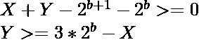

# 给定数组中对的和及其位与的位与之和

> 原文:[https://www . geeksforgeeks . org/给定数组的按位和对及其按位和的和/](https://www.geeksforgeeks.org/sum-of-bitwise-and-of-sum-of-pairs-and-their-bitwise-and-from-a-given-array/)

给定一个由 **N** 个整数组成的[数组](https://www.geeksforgeeks.org/introduction-to-arrays/) **arr[]** ，任务是从给定的中为每对元素 **(arr[i]，arr[j])** 和[逐位 AND](https://www.geeksforgeeks.org/bitwise-operators-in-c-cpp/) 求 **(arr[i] + arr[j])的**位 AND** 之和 **arr[i]** 和 **arr[j]** 由于总和可能很大，打印出来[模 **(10 <sup>9</sup> + 7)**](https://www.geeksforgeeks.org/modulo-1097-1000000007/) 。**

**示例:**

> **输入:** arr[] = {8，9}
> **输出:** 0
> **解释:**数组中唯一的一对是(8，9)。对的和= (8 + 9) = 17。对的位与= (8 & 9) = 8。因此需要按位 AND = (17 & 8) = 0。
> 
> **输入:** arr[] = {1，3，3}
> **输出:** 2
> **解释:**
> 对(1，3):必选位 AND =(1+3)&(1&3)=(4&1)= 0。
> 对(3，3):必选按位 AND =(3+3)&(3&3)=(6&3)= 2。
> 因此，总和= 0 + 0 + 2 = 2。

**简单方法:**最简单的方法是[从给定的数组](https://www.geeksforgeeks.org/find-all-pairs-possible-from-the-given-array/)中生成所有可能的对，并检查是否存在满足给定条件的对。如果发现是真的，那么**数一下**这一对。检查所有对后，打印结果**计数**。
***时间复杂度:**O(N<sup>2</sup>)*
***辅助空间:** O(1)*

**高效方法:**上述方法可以基于以下观察进行优化:

*   考虑到对 **(X，Y)** ，[位与](https://www.geeksforgeeks.org/bitwise-operators-in-c-cpp/)位，假设 **b <sup>第</sup>个**是 **1** ，那么 **(X + Y)** 也必须有 **b <sup>第</sup>个**位作为设定位在 **b <sup>第</sup>个**位贡献。
*   仅考虑这两个对的数量的最后 **b** 位，可以观察到，为了满足上述条件， **b <sup>第</sup>T5】位和 **(b + 1) <sup>第</sup>T9】位都必须被设置。****
*   因此，从上述步骤可以得出，要满足上述条件，以下条件应满足:

> 

*   因此，任务减少到为每个比特位置找到满足上述条件的对的计数，并将结果增加值**CNT * 2<sup>b</sup>T3**0≤b<31**。**

按照以下步骤解决问题:

*   初始化一个变量，比如**和**，来存储结果和。
*   [迭代范围](https://www.geeksforgeeks.org/range-based-loop-c/)**【0，30】**并执行以下操作:
    *   初始化一个[向量](https://www.geeksforgeeks.org/vector-in-cpp-stl/) **V** ，它存储满足上述条件的对。
    *   [遍历给定数组](https://www.geeksforgeeks.org/c-program-to-traverse-an-array/) **arr[]** ，在向量 **V** 中插入值**arr[j]–(arr[j]>>(I+1))*(1<<(I+1))**模 **M** ，如果**((arr[j]>>(I+1))&1)**为真。
    *   [按升序排列向量 V](https://www.geeksforgeeks.org/sorting-a-vector-in-c/)。
    *   [遍历向量](https://www.geeksforgeeks.org/vector-in-cpp-stl/) **V** 并执行以下操作:
        *   计算值**2<sup>(I+1)</sup>+2<sup>I</sup>–V【j】**并将其存储在变量中，比如 **Y** 。
        *   在 **V** 中找出大于或等于 **V** 中 **Y** 的点数，并将其存储在一个变量中，比如 **cnt** ，即**CNT = V . size()–(下界(V.begin() + j + 1，V.end()，Y)–V . begin())。**
        *   将**年**更新为**年= (ans+ cnt* 2 <sup>i</sup> )%M** 。
*   完成上述步骤后，打印**和**的值作为结果。

下面是上述方法的实现:

## C++14

```
// C++ program for the above approach

#include <bits/stdc++.h>
#define M 1000000007
using namespace std;

// Function to find the sum of Bitwise AND
// of sum of pairs and their Bitwise AND
// from a given array
void findSum(int A[], int N)
{
    // Stores the total sum
    long long ans = 0;

    for (int i = 0; i < 30; i++) {

        vector<long long> vec;

        for (int j = 0; j < N; j++) {

            // Check if jth bit is set
            if ((A[j] >> i) & 1) {

                // Stores the right shifted
                // element by(i+1)
                long long X = (A[j] >> (i + 1));

                // Update the value
                // of X
                X = X * (1 << (i + 1));
                X %= M;

                // Push in vector vec
                vec.push_back(A[j] - X);
            }
        }
        // Sort the vector in
        // ascending order
        sort(vec.begin(), vec.end());

        // Traverse the vector vec
        for (int j = 0; j < vec.size(); j++) {

            // Stores the value
            // 2^(i+1)- 2^(i)- vec[j]
            int Y = (1 << (i + 1))
                    + (1 << i)
                    - vec[j];

            // Stores count of numbers
            // whose value > Y
            int idx = lower_bound(
                          vec.begin() + j + 1,
                          vec.end(), Y)
                      - vec.begin();

            // Update the ans
            ans += (vec.size() - idx)
                   * 1ll * (1 << i);

            ans %= M;
        }
    }

    // Return the ans
    cout << ans % M << endl;
}

// Driver Code
int main()
{
    int arr[] = { 1, 3, 3 };
    int N = sizeof(arr) / sizeof(arr[0]);
    findSum(arr, N);

    return 0;
}
```

## 蟒蛇 3

```
# Python 3 program for the above approach
M = 1000000007
from bisect import bisect_left

# Function to find the sum of Bitwise AND
# of sum of pairs and their Bitwise AND
# from a given array
def findSum(A, N):

    # Stores the total sum
    ans = 0

    for i in range(30):
        vec = []

        for j in range(N):
            # Check if jth bit is set
            if ((A[j] >> i) & 1):
                # Stores the right shifted
                # element by(i+1)
                X = (A[j] >> (i + 1))

                # Update the value
                # of X
                X = X * (1 << (i + 1))
                X %= M

                # Push in vector vec
                vec.append(A[j] - X)

        # Sort the vector in
        # ascending order
        vec.sort(reverse=False)

        # Traverse the vector vec
        for j in range(len(vec)):

            # Stores the value
            # 2^(i+1)- 2^(i)- vec[j]
            Y = (1 << (i + 1)) + (1 << i) - vec[j]

            # Stores count of numbers
            # whose value > Y
            temp = vec[j+1:]
            idx = int(bisect_left(temp,Y))

            # Update the ans
            ans += ((len(vec) - idx) * (1 << i))

            ans %= M
    ans /= 7

    # Return the ans
    print(int(ans % M))

# Driver Code
if __name__ == '__main__':
    arr =  [1, 3, 3]
    N = len(arr)
    findSum(arr, N)

    # This code is contributed by SURENNDRA_GANGWAR.
```

**Output:** 

```
2
```

***时间复杂度:** O(N*log N)*
***辅助空间:** O(N)*