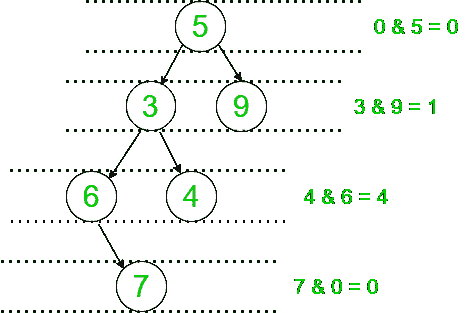

# 二叉树每一级所有叶节点和非叶节点之和的按位“与”和

> 原文:[https://www . geeksforgeeks . org/二进制树每一级的所有叶节点和非叶节点的按位求和之和/](https://www.geeksforgeeks.org/sum-of-bitwise-and-of-the-sum-of-all-leaf-and-non-leaf-nodes-for-each-level-of-a-binary-tree/)

给定一个由 **N** 节点组成的[二叉树](https://www.geeksforgeeks.org/binary-tree-data-structure/)，任务是为给定树中的每一级寻找所有叶节点的[和所有非叶节点](https://www.geeksforgeeks.org/sum-leaf-nodes-binary-tree/)的[和的](https://www.geeksforgeeks.org/print-all-internal-nodes-of-a-binary-tree/)[位](https://www.geeksforgeeks.org/bitwise-operators-in-c-cpp/)之和。

**示例:**

> **输入:**下面是给定的树:
> 5
> /\
> 3 9
> /\
> 6 4
> \
> 7
> **输出:** 5
> **解释:**
> 
> 
> 
> 对于级别 1:叶节点和= 0，非叶节点和= 5。所以，0&5 = 0。
> 对于等级 2:叶节点和= 9，非叶节点和= 3。所以，9 & 3 = 1。
> 对于 3 级:叶节点和= 4，非叶节点和= 6。所以，6 & 4 = 4。
> 级别 4:叶节点和= 7，非叶节点和= 0。所以，0 & 7 = 0。
> 因此，总和为 0 + 1 + 4 + 0 = 5。
> 
> **输入:**下面是给定的树:
> 4
> /\
> 9 3
> /\
> 5 3
> **输出:** 1
> **说明:**
> 对于级别 1:叶节点和= 0，非叶节点和= 4。所以，0 & 4 = 0
> 对于级别 2:叶节点和= 9，非叶节点和= 3。所以，9 & 3 = 1
> 对于 3 级:叶节点和= 8，非叶节点和= 0。所以，8 & 0 = 0
> 因此，总和为 0 + 1 + 0 = 1

**方法:**解决上述问题的思路是执行树的[级序遍历](https://www.geeksforgeeks.org/level-order-tree-traversal/)。遍历时，分别处理不同层次的节点，对于每一个被处理的层次，求每一个层次的[叶节点](https://www.geeksforgeeks.org/write-a-c-program-to-get-count-of-leaf-nodes-in-a-binary-tree/)和非叶节点之和。按照以下步骤解决问题:

*   初始化一个[队列](https://www.geeksforgeeks.org/queue-data-structure/)**Q**[将](https://www.geeksforgeeks.org/queuepush-and-queuepop-in-cpp-stl/)推至**根**节点，将 **ans** 初始化为 **0** 存储所需答案。
*   执行以下步骤直到 [**Q** 不为空](https://www.geeksforgeeks.org/queueempty-queuesize-c-stl/):
    *   将**叶总和**初始化为 **0** 、**非叶总和**初始化为 **0** ，分别存储当前级别的叶节点和非叶节点的总和。
    *   找到当前队列的大小 **Q** 让它是 **L** 。
    *   迭代范围**【0，L】**，并执行以下操作:
        *   [从队列中弹出节点](https://www.geeksforgeeks.org/queuepush-and-queuepop-in-cpp-stl/)。
        *   如果弹出的节点是叶节点，则将该值添加到**叶总和**中，否则将其添加到**非叶总和**中。
        *   将当前弹出节点的左右子节点推入队列(如果它们存在)。
    *   对于当前级别，将**叶总和**和**非叶总和**的**位与**添加到变量**和**中。
*   完成上述步骤后，打印**和**的值作为结果。

下面是上述方法的实现:

## C++

```
// C++ program for given approach
#include<bits/stdc++.h>
using namespace std;

// Structure of a Binary tree node
struct TreeNode
{
  int val;
  TreeNode *left,*right;

  // Helper function to allocate
  // a new node with the given data
  // and left and right pointers as None
    TreeNode(int x = 0)
    {
        val = x;
        left = NULL;
        right = NULL;
   }
};

// Function to calculate the sum of
// bitwise AND of the sum of all leaf
// nodes and non-leaf nodes for each level
int findSum(TreeNode *root){

    // Initialize a queue and
    // append root to it
    queue<TreeNode*> que;

    que.push(root);

  // Store the required answer
    int ans = 0;
    while (que.size())
    {

        // Stores the sum of leaf nodes
        // at the current level
        int leaf = 0;

        // Stores the sum of non-leaf
        // nodes at the current level
        int nonleaf = 0;

        // Get the size of the queue
        int length = que.size();

        // Iterate for all the nodes
        // in the queue currently
        while (length)
        {

            // Dequeue a node from queue
            auto temp = que.front();
            que.pop();

            // Check if the node is a
            // leaf node
            if (!temp->left && !temp->right)

                // If true, update the
                // leaf node sum
                leaf += temp->val;

            // Otherwise, update the
            // non-leaf node sum
            else
                nonleaf += temp->val;

            // Enqueue left and right
            // children of removed node
            if (temp->left)
                que.push(temp->left);
            if (temp->right)
                que.push(temp->right);

            length -= 1;
        }

        // Update the answer
        ans += leaf & nonleaf;
      }

    // Return the answer
    return ans;
}

// Driver Code
int main()
{

  // Given Tree
  TreeNode *root = new TreeNode(5);
  root->left = new TreeNode(3);
  root->right = new TreeNode(9);
  root->left->left = new TreeNode(6);
  root->left->right = new TreeNode(4);
  root->left->left->right = new TreeNode(7);

  // Function Call
  cout<<findSum(root);
}

// This code is contributed by mohit kumar 29.
```

## Java 语言(一种计算机语言，尤用于创建网站)

```
// Java program for given approach
import java.util.*;
class GFG
{

// Structure of a Binary tree node
static class TreeNode
{
  int val;
  TreeNode left,right;

  // Helper function to allocate
  // a new node with the given data
  // and left and right pointers as None
    TreeNode(int x)
    {
        val = x;
        left = null;
        right = null;
   }
};

// Function to calculate the sum of
// bitwise AND of the sum of all leaf
// nodes and non-leaf nodes for each level
static int findSum(TreeNode root)
{

    // Initialize a queue and
    // append root to it
    Queue<TreeNode> que = new LinkedList<>();

    que.add(root);

  // Store the required answer
    int ans = 0;
    while (que.size() > 0)
    {

        // Stores the sum of leaf nodes
        // at the current level
        int leaf = 0;

        // Stores the sum of non-leaf
        // nodes at the current level
        int nonleaf = 0;

        // Get the size of the queue
        int length = que.size();

        // Iterate for all the nodes
        // in the queue currently
        while (length>0)
        {

            // Dequeue a node from queue
            TreeNode temp = que.peek();
            que.remove();

            // Check if the node is a
            // leaf node
            if (temp.left == null && temp.right == null)

                // If true, update the
                // leaf node sum
                leaf += temp.val;

            // Otherwise, update the
            // non-leaf node sum
            else
                nonleaf += temp.val;

            // Enqueue left and right
            // children of removed node
            if (temp.left != null)
                que.add(temp.left);
            if (temp.right != null)
                que.add(temp.right);

            length -= 1;
        }

        // Update the answer
        ans += leaf & nonleaf;
      }

    // Return the answer
    return ans;
}

// Driver Code
public static void main(String[] args)
{

  // Given Tree
  TreeNode root = new TreeNode(5);
  root.left = new TreeNode(3);
  root.right = new TreeNode(9);
  root.left.left = new TreeNode(6);
  root.left.right = new TreeNode(4);
  root.left.left.right = new TreeNode(7);

  // Function Call
  System.out.print(findSum(root));
}
}

// This code is contributed by 29AjayKumar
```

## 蟒蛇 3

```
# Python program for the above approach

# Structure of a Binary tree node
class TreeNode:

    # Helper function to allocate
    # a new node with the given data
    # and left and right pointers as None
    def __init__(self, val = 0, left = None, right = None):
        self.val = val
        self.left = left
        self.right = right

# Function to calculate the sum of
# bitwise AND of the sum of all leaf
# nodes and non-leaf nodes for each level
def findSum(root):

    # Initialize a queue and
    # append root to it
    que = [root]

    # Store the required answer
    ans = 0

    while (len(que)):

        # Stores the sum of leaf nodes
        # at the current level
        leaf = 0

        # Stores the sum of non-leaf
        # nodes at the current level
        nonleaf = 0

        # Get the size of the queue
        length = len(que)

        # Iterate for all the nodes
        # in the queue currently
        while length:

            # Dequeue a node from queue
            temp = que.pop(0)

            # Check if the node is a
            # leaf node
            if not temp.left and not temp.right:

                # If true, update the
                # leaf node sum
                leaf += temp.val

            # Otherwise, update the
            # non-leaf node sum
            else:
                nonleaf += temp.val

            # Enqueue left and right
            # children of removed node
            if temp.left:
                que.append(temp.left)
            if temp.right:
                que.append(temp.right)

            length -= 1

        # Update the answer
        ans += leaf & nonleaf

    # Return the answer
    return ans

# Driver Code

# Given Tree
root = TreeNode(5)
root.left = TreeNode(3)
root.right = TreeNode(9)
root.left.left = TreeNode(6)
root.left.right = TreeNode(4)
root.left.left.right = TreeNode(7)

# Function Call
print(findSum(root))
```

## C#

```
// C# program for given approach

using System;
using System.Collections.Generic;

// Structure of a Binary tree node
class GFG{

class TreeNode
{
  public int val;
  public TreeNode left,right;
};

  // Helper function to allocate
  // a new node with the given data
  // and left and right pointers as None
  static TreeNode newNode(int x)
    {
        TreeNode temp = new TreeNode();
        temp.val = x;
        temp.left = null;
        temp.right = null;
        return temp;
   }

// Function to calculate the sum of
// bitwise AND of the sum of all leaf
// nodes and non-leaf nodes for each level
static int findSum(TreeNode root){

    // Initialize a queue and
    // append root to it
    Queue<TreeNode> que =new Queue<TreeNode>();

    que.Enqueue(root);

  // Store the required answer
    int ans = 0;
    while (que.Count>0)
    {

        // Stores the sum of leaf nodes
        // at the current level
        int leaf = 0;

        // Stores the sum of non-leaf
        // nodes at the current level
        int nonleaf = 0;

        // Get the size of the queue
        int length = que.Count;

        // Iterate for all the nodes
        // in the queue currently
        while (length>0)
        {

            // Dequeue a node from queue
            TreeNode temp = que.Peek();
            que.Dequeue();

            // Check if the node is a
            // leaf node
            if (temp.left == null && temp.right==null)

                // If true, update the
                // leaf node sum
                leaf += temp.val;

            // Otherwise, update the
            // non-leaf node sum
            else
                nonleaf += temp.val;

            // Enqueue left and right
            // children of removed node
            if (temp.left!=null)
                que.Enqueue(temp.left);
            if (temp.right != null)
                que.Enqueue(temp.right);

            length -= 1;
        }

        // Update the answer
        ans += (leaf & nonleaf);
      }

    // Return the answer
    return ans;
}

// Driver Code
public static void Main()
{

  // Given Tree
  TreeNode root = newNode(5);
  root.left = newNode(3);
  root.right = newNode(9);
  root.left.left = newNode(6);
  root.left.right = newNode(4);
  root.left.left.right = newNode(7);

  // Function Call
  Console.WriteLine(findSum(root));
}
}

// This code is contributed by bgangwar59.
```

## java 描述语言

```
<script>

// Javascript program for given approach

// Structure of a Binary tree node
class TreeNode
{

    // Helper function to allocate
    // a new node with the given data
    // and left and right pointers as None
    constructor(x)
    {
        this.val = x;
        this.left = null;
        this.right = null;
    }
}

// Function to calculate the sum of
// bitwise AND of the sum of all leaf
// nodes and non-leaf nodes for each level
function findSum(root)
{

    // Initialize a queue and
    // append root to it
    let que = [];

    que.push(root);

    // Store the required answer
    let ans = 0;
    while (que.length > 0)
    {

        // Stores the sum of leaf nodes
        // at the current level
        let leaf = 0;

        // Stores the sum of non-leaf
        // nodes at the current level
        let nonleaf = 0;

        // Get the size of the queue
        let length = que.length;

        // Iterate for all the nodes
        // in the queue currently
        while (length > 0)
        {

            // Dequeue a node from queue
            let temp = que.shift();

            // Check if the node is a
            // leaf node
            if (temp.left == null &&
                temp.right == null)

                // If true, update the
                // leaf node sum
                leaf += temp.val;

            // Otherwise, update the
            // non-leaf node sum
            else
                nonleaf += temp.val;

            // Enqueue left and right
            // children of removed node
            if (temp.left != null)
                que.push(temp.left);
            if (temp.right != null)
                que.push(temp.right);

            length -= 1;
        }

        // Update the answer
        ans += leaf & nonleaf;
    }

    // Return the answer
    return ans;
}

// Driver Code

// Given Tree
let root = new TreeNode(5);
root.left = new TreeNode(3);
root.right = new TreeNode(9);
root.left.left = new TreeNode(6);
root.left.right = new TreeNode(4);
root.left.left.right = new TreeNode(7);

// Function Call
document.write(findSum(root));

// This code is contributed by unknown2108

</script>
```

**Output:** 

```
5
```

***时间复杂度:**O(N)*
T5**辅助空间:** O(N)