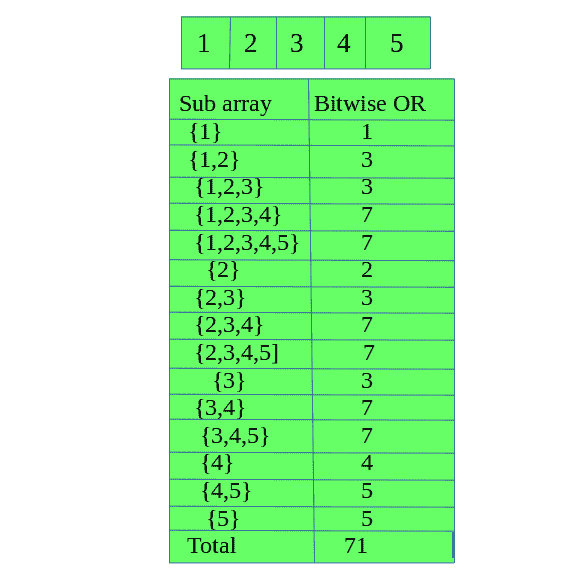

# 给定阵列的所有子阵列的按位或之和|集合 2

> 原文:[https://www . geesforgeks . org/给定数组集 2 的所有子数组的按位或和/](https://www.geeksforgeeks.org/sum-of-bitwise-or-of-all-subarrays-of-a-given-array-set-2/)

给出一个正整数数组。任务是在对给定数组的所有子数组执行按位“或”运算后，找到总和。
**例:**

```
Input : arr[] = {1, 2, 3, 4, 5}
Output : 71

Input : arr[] = {6, 5, 4, 3, 2}
Output : 84
```

**解说** :



**简单方法**:简单的方法是[利用两个嵌套循环求给定数组](https://www.geeksforgeeks.org/sum-of-bitwise-or-of-all-subarrays/)每个子数组的按位 OR，然后求总和。该方法的时间复杂度为 0(N<sup>2</sup>)。
**高效方法** :

1.  请注意，如果数组中的某个元素设置了某个位，则具有该元素的所有子数组都将设置该位。因此，当我们计算具有该数目的所有子阵列的和时，我们可以直接将子阵列的数目乘以该比特所产生的值。
2.  现在，要做到这一点，一个简单的方法是计算未设置位的子阵列的数量，并将其从子阵列的总数中减去。

我们来看一个例子:
让数组**A =【1，2，3，4，5】**。现在在元素 2 和 4 中没有设置第一位，并且位“或”没有设置第一位的子阵列的总数将是 2。
因此，按位“或”将设置第 1 位的子阵列总数将为:15-2 = 13。
因此我们将加(13 *幂(2，0))到和。
以下是上述方法的实施:

## C++

```
// C++ program to find sum of bitwise OR
// of all subarrays

#include <bits/stdc++.h>
using namespace std;

// Function to find sum of bitwise OR
// of all subarrays
int givesum(int A[], int n)
{
    // Find max element of the array
    int max = *max_element(A, A + n);

    // Find the max bit position set in
    // the array
    int maxBit = log2(max) + 1;

    int totalSubarrays = n * (n + 1) / 2;

    int s = 0;

    // Traverse from 1st bit to last bit which
    // can be set in any element of the array
    for (int i = 0; i < maxBit; i++) {
        int c1 = 0;

        // Vector to store indexes of the array
        // with i-th bit not set
        vector<int> vec;

        int sum = 0;

        // Traverse the array
        for (int j = 0; j < n; j++) {

            // Check if ith bit is not set in A[j]
            int a = A[j] >> i;
            if (!(a & 1)) {
                vec.push_back(j);
            }
        }

        // Variable to store count of subarrays
        // whose bitwise OR will have i-th bit
        // not set
        int cntSubarrNotSet = 0;

        int cnt = 1;

        for (int j = 1; j < vec.size(); j++) {
            if (vec[j] - vec[j - 1] == 1) {
                cnt++;
            }
            else {
                cntSubarrNotSet += cnt * (cnt + 1) / 2;

                cnt = 1;
            }
        }

        // For last element of vec
        cntSubarrNotSet += cnt * (cnt + 1) / 2;

        // If vec is empty then cntSubarrNotSet
        // should be 0 and not 1
        if (vec.size() == 0)
            cntSubarrNotSet = 0;

        // Variable to store count of subarrays
        // whose bitwise OR will have i-th bit set
        int cntSubarrIthSet = totalSubarrays - cntSubarrNotSet;

        s += cntSubarrIthSet * pow(2, i);
    }

    return s;
}

// Driver code
int main()
{
    int A[] = { 1, 2, 3, 4, 5 };
    int n = sizeof(A) / sizeof(A[0]);

    cout << givesum(A, n);

    return 0;
}
```

## Java 语言(一种计算机语言，尤用于创建网站)

```
// Java program to find sum of bitwise OR
// of all subarrays
import java.util.*;

class GFG {

    // Function to find sum of bitwise OR
    // of all subarrays
    static int givesum(int A[], int n)
    {

        // Find max element of the array
        int max = Arrays.stream(A).max().getAsInt();

        // Find the max bit position
        // set in the array
        int maxBit = (int)Math.ceil(Math.log(max) + 1);
        int totalSubarrays = n * (n + 1) / 2;

        int s = 0;

        // Traverse from 1st bit to last bit which
        // can be set in any element of the array
        for (int i = 0; i < maxBit; i++) {
            int c1 = 0;

            // Vector to store indexes of the array
            // with i-th bit not set
            Vector<Integer> vec = new Vector<>();

            int sum = 0;

            // Traverse the array
            for (int j = 0; j < n; j++) {

                // Check if ith bit is not set in A[j]
                int a = A[j] >> i;
                if (!(a % 2 == 1)) {
                    vec.add(j);
                }
            }

            // Variable to store count of subarrays
            // whose bitwise OR will have i-th bit
            // not set
            int cntSubarrNotSet = 0;

            int cnt = 1;

            for (int j = 1; j < vec.size(); j++) {
                if (vec.get(j) - vec.get(j - 1) == 1) {
                    cnt++;
                }
                else {
                    cntSubarrNotSet += cnt * (cnt + 1) / 2;

                    cnt = 1;
                }
            }

            // For last element of vec
            cntSubarrNotSet += cnt * (cnt + 1) / 2;

            // If vec is empty then cntSubarrNotSet
            // should be 0 and not 1
            if (vec.size() == 0)
                cntSubarrNotSet = 0;

            // Variable to store count of subarrays
            // whose bitwise OR will have i-th bit set
            int cntSubarrIthSet = totalSubarrays - cntSubarrNotSet;

            s += cntSubarrIthSet * Math.pow(2, i);
        }
        return s;
    }

    // Driver code
    public static void main(String[] args)
    {
        int A[] = { 1, 2, 3, 4, 5 };
        int n = A.length;
        System.out.println(givesum(A, n));
    }
}

// This code is contributed by 29AjayKumar
```

## 蟒蛇 3

```
# Python 3 program to find sum of
# bitwise OR of all subarrays

# from math lib. import log2 function
from math import log2

# Function to find sum of bitwise OR
# of all subarrays
def givesum(A, n) :

    # Find max element of the array
    max_element = max(A)

    # Find the max bit position set in
    # the array
    maxBit = int(log2(max_element)) + 1

    totalSubarrays = n * (n + 1) // 2

    s = 0

    # Traverse from 1st bit to last bit which
    # can be set in any element of the array
    for i in range(maxBit) :
        c1 = 0

        # List to store indexes of the array
        # with i-th bit not set
        vec = []

        sum = 0

        # Traverse the array
        for j in range(n) :

            # Check if ith bit is not set in A[j]
            a = A[j] >> i

            if (not(a & 1)) :
                vec.append(j)

        # Variable to store count of subarrays
        # whose bitwise OR will have i-th bit
        # not set
        cntSubarrNotSet = 0

        cnt = 1

        for j in range(1, len(vec)) :

            if (vec[j] - vec[j - 1] == 1) :
                cnt += 1

            else :

                cntSubarrNotSet += cnt * (cnt + 1) // 2

                cnt = 1

        # For last element of vec
        cntSubarrNotSet += cnt * (cnt + 1) // 2

        # If vec is empty then cntSubarrNotSet
        # should be 0 and not 1
        if len(vec) == 0:
            cntSubarrNotSet = 0   

        # Variable to store count of subarrays
        # whose bitwise OR will have i-th bit set
        cntSubarrIthSet = totalSubarrays - cntSubarrNotSet

        s += cntSubarrIthSet * pow(2, i)

    return s

# Driver code
if __name__ == "__main__" :

    A = [ 1, 2, 3, 4, 5 ]
    n = len(A)

    print(givesum(A, n))

# This code is contributed by Ryuga
```

## C#

```
// C# program to find sum of bitwise OR
// of all subarrays
using System;
using System.Linq;
using System.Collections.Generic;

class GFG {

    // Function to find sum of bitwise OR
    // of all subarrays
    static int givesum(int[] A, int n)
    {

        // Find max element of the array
        int max = A.Max();

        // Find the max bit position
        // set in the array
        int maxBit = (int)Math.Ceiling(Math.Log(max) + 1);
        int totalSubarrays = n * (n + 1) / 2;

        int s = 0;

        // Traverse from 1st bit to last bit which
        // can be set in any element of the array
        for (int i = 0; i < maxBit; i++) {

            // Vector to store indexes of the array
            // with i-th bit not set
            List<int> vec = new List<int>();

            // Traverse the array
            for (int j = 0; j < n; j++) {

                // Check if ith bit is not set in A[j]
                int a = A[j] >> i;
                if (!(a % 2 == 1)) {
                    vec.Add(j);
                }
            }

            // Variable to store count of subarrays
            // whose bitwise OR will have i-th bit
            // not set
            int cntSubarrNotSet = 0;

            int cnt = 1;

            for (int j = 1; j < vec.Count; j++) {
                if (vec[j] - vec[j - 1] == 1) {
                    cnt++;
                }
                else {
                    cntSubarrNotSet += cnt * (cnt + 1) / 2;

                    cnt = 1;
                }
            }

            // For last element of vec
            cntSubarrNotSet += cnt * (cnt + 1) / 2;

            // If vec is empty then cntSubarrNotSet
            // should be 0 and not 1
            if (vec.Count() == 0)
                cntSubarrNotSet = 0;

            // Variable to store count of subarrays
            // whose bitwise OR will have i-th bit set
            int cntSubarrIthSet = totalSubarrays - cntSubarrNotSet;

            s += (int)(cntSubarrIthSet * Math.Pow(2, i));
        }
        return s;
    }

    // Driver code
    public static void Main()
    {
        int[] A = { 1, 2, 3, 4, 5 };
        int n = A.Length;
        Console.WriteLine(givesum(A, n));
    }
}

/* This code contributed by PrinciRaj1992 */
```

## 服务器端编程语言（Professional Hypertext Preprocessor 的缩写）

```
<?php
// PHP program to find sum of bitwise OR
// of all subarrays

// Function to find sum of bitwise OR
// of all subarrays
function givesum($A, $n)
{
    // Find max element of the array
    $max = max($A);

    // Find the max bit position set in
    // the array
    $maxBit = (int)((log($max) /
                     log10(2)) + 1);

    $totalSubarrays = (int)($n * ($n + 1) / 2);

    $s = 0;

    // Traverse from 1st bit to last bit which
    // can be set in any element of the array
    for ($i = 0; $i < $maxBit; $i++)
    {
        $c1 = 0;

        // Vector to store indexes of
        // the array with i-th bit not set
        $vec = array();

        $sum = 0;

        // Traverse the array
        for ($j = 0; $j < $n; $j++)
        {

            // Check if ith bit is
            // not set in A[j]
            $a = $A[$j] >> $i;
            if (!($a & 1))
            {
                array_push($vec, $j);
            }
        }

        // Variable to store count of subarrays
        // whose bitwise OR will have i-th bit
        // not set
        $cntSubarrNotSet = 0;

        $cnt = 1;

        for ($j = 1; $j < count($vec); $j++)
        {
            if ($vec[$j] - $vec[$j - 1] == 1)
            {
                $cnt++;
            }
            else
            {
                $cntSubarrNotSet += (int)($cnt *
                                         ($cnt + 1) / 2);

                $cnt = 1;
            }
        }

        // For last element of vec
        $cntSubarrNotSet += (int)($cnt *
                                 ($cnt + 1) / 2);

        // If vec is empty then cntSubarrNotSet
        // should be 0 and not 1
        if (count($vec) == 0)
            $cntSubarrNotSet = 0;

        // Variable to store count of subarrays
        // whose bitwise OR will have i-th bit set
        $cntSubarrIthSet = $totalSubarrays -
                           $cntSubarrNotSet;

        $s += $cntSubarrIthSet * pow(2, $i);
    }

    return $s;
}

// Driver code
$A = array( 1, 2, 3, 4, 5 );
$n = count($A);

echo givesum($A, $n);

// This code is contributed by mits
?>
```

## java 描述语言

```
<script>
    // Javascript program to find sum of bitwise OR of all subarrays

    // Function to find sum of bitwise OR
    // of all subarrays
    function givesum(A, n)
    {

        // Find max element of the array
        let max = Number.MIN_VALUE;

        for(let i = 0; i < A.length; i++)
        {
            max = Math.max(max, A[i]);
        }

        // Find the max bit position
        // set in the array
        let maxBit = Math.ceil(Math.log(max) + 1);
        let totalSubarrays = n * (n + 1) / 2;

        let s = 0;

        // Traverse from 1st bit to last bit which
        // can be set in any element of the array
        for (let i = 0; i < maxBit; i++) {

            // Vector to store indexes of the array
            // with i-th bit not set
            let vec = [];

            // Traverse the array
            for (let j = 0; j < n; j++) {

                // Check if ith bit is not set in A[j]
                let a = A[j] >> i;
                if (!(a % 2 == 1)) {
                    vec.push(j);
                }
            }

            // Variable to store count of subarrays
            // whose bitwise OR will have i-th bit
            // not set
            let cntSubarrNotSet = 0;

            let cnt = 1;

            for (let j = 1; j < vec.length; j++) {
                if (vec[j] - vec[j - 1] == 1) {
                    cnt++;
                }
                else {
                    cntSubarrNotSet += cnt * (cnt + 1) / 2;

                    cnt = 1;
                }
            }

            // For last element of vec
            cntSubarrNotSet += cnt * (cnt + 1) / 2;

            // If vec is empty then cntSubarrNotSet
            // should be 0 and not 1
            if (vec.length == 0)
                cntSubarrNotSet = 0;

            // Variable to store count of subarrays
            // whose bitwise OR will have i-th bit set
            let cntSubarrIthSet = totalSubarrays - cntSubarrNotSet;

            s += parseInt(cntSubarrIthSet * Math.pow(2, i), 10);
        }
        return s;
    }

    let A = [ 1, 2, 3, 4, 5 ];
    let n = A.length;
    document.write(givesum(A, n));

    // This code is contributed by suresh07.
</script>
```

**Output:** 

```
71
```

**时间复杂度** : O(N*logN)