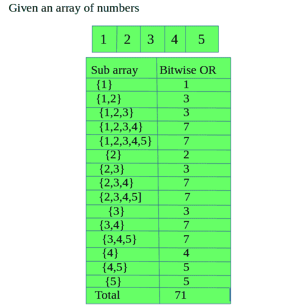

# 所有子阵列的按位“或”之和

> 原文:[https://www . geeksforgeeks . org/所有子数组的按位或和/](https://www.geeksforgeeks.org/sum-of-bitwise-or-of-all-subarrays/)

给定一个正整数数组，在给定数组的所有子数组上执行逐位“或”运算后，求其总和。
**例:**

```
Input : 1 2 3 4 5
Output : 71

Input : 6 5 4 3 2
Output : 84
```



首先初始化两个变量 sum=0，sum1=0，变量 sum 将存储总和，使用 sum1，我们将对每个 jth 元素执行按位“或”运算，并将 sum1 与 sum 相加。
1:-从第 0 个位置遍历到 n-1。
2:-对于每个 ith 变量，我们将对所有子数组执行位“或”运算，以找到总和。
重复步骤，直到整个数组遍历完毕。

## C++

```
// C++ program to find sum of
// bitwise ors of all subarrays.
#include <iostream>
using namespace std;

int totalSum(int a[], int n)
{
    int i, sum = 0, sum1 = 0, j;

    for (i = 0; i < n; i++)
    {

        sum1 = 0;

        // perform Bitwise OR operation
        // on all the subarray present
        // in array
        for (j = i; j < n; j++)
        {

            // OR operation
            sum1 = (sum1 | a[j]);

            // now add the sum after performing
            // the Bitwise OR operation
            sum = sum + sum1;
        }
    }

    return sum;
}

// Driver code
int main()
{
    int a[] = { 1, 2, 3, 4, 5 };
    int n = sizeof(a) / sizeof(a[0]);
    cout << totalSum(a, n) << endl;
    return 0;
}

// This code is contributed
// by Shivi_Aggarwal
```

## C

```
// C program to find sum of bitwise ors
// of all subarrays.
#include <stdio.h>

int totalSum(int a[], int n)
{
    int i, sum = 0, sum1 = 0, j;

    for (i = 0; i < n; i++) {

        sum1 = 0;

        // perform Bitwise OR operation
        // on all the subarray present in array
        for (j = i; j < n; j++) {

            // OR operation
            sum1 = (sum1 | a[j]);

            // now add the sum after performing the
            // Bitwise OR operation
            sum = sum + sum1;
        }
    }

    return sum;
}

// Driver code
int main()
{
    int a[] = { 1, 2, 3, 4, 5 };
    int n = sizeof(a)/sizeof(a[0]);
    printf("%d ", totalSum(a, n));
    return 0;
}
```

## Java 语言(一种计算机语言，尤用于创建网站)

```
// Java program to find sum
// of bitwise ors of all subarrays.
import java.util.*;
import java.lang.*;
import java.io.*;

class GFG
{
static int totalSum(int a[], int n)
{
    int i, sum = 0, sum1 = 0, j;

    for (i = 0; i < n; i++)
    {
        sum1 = 0;

        // perform Bitwise OR operation
        // on all the subarray present
        // in array
        for (j = i; j < n; j++)
        {

            // OR operation
            sum1 = (sum1 | a[j]);

            // now add the sum after
            // performing the Bitwise
            // OR operation
            sum = sum + sum1;
        }
    }

    return sum;
}

// Driver code
public static void main(String args[])
{
    int a[] = { 1, 2, 3, 4, 5 };
    int n = a.length;
    System.out.println(totalSum(a,n));
}
}

// This code is contributed
// by Subhadeep
```

## 蟒蛇 3

```
# Python3 program to find sum of
# bitwise ors of all subarrays.
def totalSum(a, n):
    sum = 0;
    for i in range(n):
        sum1 = 0;

        # perform Bitwise OR operation
        # on all the subarray present
        # in array
        for j in range(i, n):

            # OR operation
            sum1 = (sum1 | a[j]);

            # now add the sum after
            # performing the
            # Bitwise OR operation
            sum = sum + sum1;
    return sum;

# Driver code
a = [1, 2, 3, 4, 5];
n = len(a);
print(totalSum(a, n));

# This code is contributed by mits
```

## C#

```
// C# program to find sum
// of bitwise ors of all
// subarrays.
using System;

class GFG
{
static int totalSum(int[] a, int n)
{
    int sum = 0;
    for(int i = 0; i < n; i++)
    {
        int sum1 = 0;

        // perform Bitwise OR operation
        // on all the subarray present
        // in array
        for (int j = i; j < n; j++)
        {

            // OR operation
            sum1 = (sum1 | a[j]);

            // now add the sum after
            // performing the Bitwise
            // OR operation
            sum = sum + sum1;
        }
    }

    return sum;
}

// Driver code
static void Main()
{
    int[] a = { 1, 2, 3, 4, 5 };
    int n = a.Length;
    Console.WriteLine(totalSum(a,n));
}
}

// This code is contributed
// by mits
```

## 服务器端编程语言（Professional Hypertext Preprocessor 的缩写）

```
<?php
// PHP program to find
// sum of bitwise ors
// of all subarrays.
function totalSum($a,$n)
{
$sum = 0;
for ($i = 0; $i < $n; $i++)
{
    $sum1 = 0;

    // perform Bitwise OR operation
    // on all the subarray present
    // in array
    for ($j = $i; $j < $n; $j++)
    {

        // OR operation
        $sum1 = ($sum1 | $a[$j]);

        // now add the sum after
        // performing the
        // Bitwise OR operation
        $sum = $sum + $sum1;
    }
}
return $sum;
}

// Driver code
$a = array(1, 2, 3, 4, 5);
$n = sizeof($a);
echo totalSum($a, $n);

// This code is contributed by mits
?>
```

## java 描述语言

```
<script>

// Java program to find sum
// of bitwise ors of all subarrays.
function totalSum(a, n)
{
    let i, sum = 0, sum1 = 0, j;

    for (i = 0; i < n; i++)
    {
        sum1 = 0;

        // perform Bitwise OR operation
        // on all the subarray present
        // in array
        for (j = i; j < n; j++)
        {

            // OR operation
            sum1 = (sum1 | a[j]);

            // now add the sum after
            // performing the Bitwise
            // OR operation
            sum = sum + sum1;
        }
    }
    return sum;
}

// Driver code
    let a = [ 1, 2, 3, 4, 5 ];
    let n = a.length;
    document.write(totalSum(a,n));

// This code is contributed shivanisinghss2110
</script>
```

**Output:** 

```
71
```