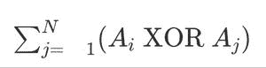

# 每个数组元素与所有其他数组元素的按位异或之和

> 原文:[https://www . geeksforgeeks . org/每个数组元素与所有其他数组元素的按位异或之和/](https://www.geeksforgeeks.org/sum-of-bitwise-xor-of-each-array-element-with-all-other-array-elements/)

给定一个长度为 **N** 的[数组](https://www.geeksforgeeks.org/array-data-structure/) **arr[]** ，每个数组元素的任务是打印其与所有其他数组元素的按位异或之和。



**示例:**

> **输入:** arr[] = {1，2， 3}
> **输出:**5 4 3
> T6】解释:t8】for arr[0]:arr[0]^ arr[0]+arr[0]^ arr[1]+arr[0]^ arr[2]= 1^1+1^2+1^3 = 0+3+2 = 5
> for arr[1]:arr[1]^ arr[0]+arr[1]^ arr[1]+arr[2]= 2 1+2+2+3 = 3+0
> 
> **输入:** arr[] = {2，4，8}
> **输出:** 16 18 22
> **解释:**
> 为 arr[0]:arr[0]^ arr[0]+arr[0]^ arr[1]+arr[0]^ arr[2]= 2^2+2^4+2^8 = 0+6+10 = 16。
> for arr[1]:arr[1]^ arr[0]+arr[1]^ arr[1]+arr[1]^ arr[2]= 4^2+4^4+4^8 = 6+0+12 = 18
> for arr[2]:arr[2]^ arr[0]+arr[2]^ arr[1]+arr[2]arr[2]= 8 2+8 4+8 = 10+12+0 = 22

**天真方法:**想法是[遍历数组](https://www.geeksforgeeks.org/c-program-to-traverse-an-array/)，对于每个数组元素，[遍历数组](https://www.geeksforgeeks.org/iterating-arrays-java/)，计算其与所有其他数组元素的[位异或](https://www.geeksforgeeks.org/bitwise-operators-in-c-cpp/)之和。

***时间复杂度:**O(N<sup>2</sup>)*
***辅助空间:** O(N)*

**有效方法:**为了优化上述方法，其思想是使用**逐位异或**的属性，即异或上的相似位给出 **0** ，否则给出 **1** 。按照以下步骤解决问题:

*   计算位置 **i** 处设置位的频率，其中 **0 < = i < = 32** ，跨越频率数组中数组的所有元素。
*   对于数组的每个元素 **X** ，通过运行从 **i=0 到 32** 的循环来计算异或和，并检查是否设置了 **X** 的**I<sup>th</sup>T7】位。**
    *   如果是，那么将**(N-frequency[I])* 2<sup>I</sup>**加到异或和上，因为在这个位置上的 **X** 的设置位将使所有的设置位为零，所有的未设置位为 **1** 。
    *   否则，将**频率【I】* 2<sup>I</sup>T3】加到异或和上。**
*   计算数组中每个元素的所有异或和的总和，并作为答案返回。

下面是上述方法的实现:

## C++

```
// C++ program for the above approach

#include <bits/stdc++.h>
using namespace std;

// Function to calculate for each array
// element, sum of its Bitwise XOR with
// all other array elements
void XOR_for_every_i(int A[], int N)
{
    // Declare an array of size 64
    // to store count of each bit
    int frequency_of_bits[32]{};

    // Traversing the array
    for (int i = 0; i < N; i++) {

        int bit_position = 0;
        int M = A[i];

        while (M) {

            // Check if bit is present of not
            if (M & 1) {
                frequency_of_bits[bit_position] += 1;
            }

            // Increase the bit position
            bit_position += 1;

            // Reduce the number to half
            M >>= 1;
        }
    }

    // Traverse the array
    for (int i = 0; i < N; i++) {
        int M = A[i];

        // Stores the bit position
        int value_at_that_bit = 1;

        // Stores the sum of Bitwise XOR
        int XOR_sum = 0;

        for (int bit_position = 0;
             bit_position < 32;
             bit_position++) {

            // Check if bit is present of not
            if (M & 1) {
                XOR_sum
                    += (N
                        - frequency_of_bits[bit_position])
                       * value_at_that_bit;
            }
            else {
                XOR_sum
                    += (frequency_of_bits[bit_position])
                       * value_at_that_bit;
            }

            // Reduce the number to its half
            M >>= 1;

            value_at_that_bit <<= 1;
        }

        // Print the sum for A[i]
        cout << XOR_sum << ' ';
    }

    return;
}

// Driver Code
int main()
{

    // Given array
    int A[] = { 1, 2, 3 };

    // Given N
    int N = sizeof(A) / sizeof(A[0]);

    // Function Call
    XOR_for_every_i(A, N);

    return 0;
}
```

## Java 语言(一种计算机语言，尤用于创建网站)

```
// Java program for the above approach
import java.util.*;

class GFG{

// Function to calculate for each array
// element, sum of its Bitwise XOR with
// all other array elements
static void XOR_for_every_i(int A[], int N)
{

    // Declare an array of size 64
    // to store count of each bit
    int frequency_of_bits[] = new int[32];

    // Traversing the array
    for(int i = 0; i < N; i++)
    {
        int bit_position = 0;
        int M = A[i];

        while (M != 0)
        {

            // Check if bit is present of not
            if ((M & 1) != 0)
            {
                frequency_of_bits[bit_position] += 1;
            }

            // Increase the bit position
            bit_position += 1;

            // Reduce the number to half
            M >>= 1;
        }
    }

    // Traverse the array
    for(int i = 0; i < N; i++)
    {
        int M = A[i];

        // Stores the bit position
        int value_at_that_bit = 1;

        // Stores the sum of Bitwise XOR
        int XOR_sum = 0;

        for(int bit_position = 0;
                bit_position < 32;
                bit_position++)
        {

            // Check if bit is present of not
            if ((M & 1) != 0)
            {
                XOR_sum += (N -
                            frequency_of_bits[bit_position]) *
                            value_at_that_bit;
            }
            else
            {
                XOR_sum += (frequency_of_bits[bit_position]) *
                            value_at_that_bit;
            }

            // Reduce the number to its half
            M >>= 1;

            value_at_that_bit <<= 1;
        }

        // Print the sum for A[i]
        System.out.print( XOR_sum + " ");
    }
    return;
}

// Driver code
public static void main(String[] args)
{

    // Given array
    int A[] = { 1, 2, 3 };

    // Given N
    int N = A.length;

    // Function Call
    XOR_for_every_i(A, N);
}
}

// This code is contributed by susmitakundugoaldanga
```

## 蟒蛇 3

```
# Python3 program for the above approach

# Function to calculate for each array
# element, sum of its Bitwise XOR with
# all other array elements
def XOR_for_every_i(A, N):

    # Declare an array of size 64
    # to store count of each bit
    frequency_of_bits = [0] * 32

    # Traversing the array
    for i in range(N):
        bit_position = 0
        M = A[i]

        while (M):

            # Check if bit is present of not
            if (M & 1 != 0):
                frequency_of_bits[bit_position] += 1

            # Increase the bit position
            bit_position += 1

            # Reduce the number to half
            M >>= 1

    # Traverse the array
    for i in range(N):
        M = A[i]

        # Stores the bit position
        value_at_that_bit = 1

        # Stores the sum of Bitwise XOR
        XOR_sum = 0

        for bit_position in range(32):

            # Check if bit is present of not
            if (M & 1 != 0):
                XOR_sum += ((N - frequency_of_bits[bit_position]) *
                            value_at_that_bit)

            else:
                XOR_sum += ((frequency_of_bits[bit_position]) *
                            value_at_that_bit)

            # Reduce the number to its half
            M >>= 1

            value_at_that_bit <<= 1

        # Print the sum for A[i]
        print(XOR_sum, end = " ")

    return

# Driver Code

# Given arr1[]
A = [ 1, 2, 3 ]

# Size of N
N = len(A)

# Function Call
XOR_for_every_i(A, N)

# This code is contributed by code_hunt
```

## C#

```
// C# program for the above approach
using System;
class GFG
{

// Function to calculate for each array
// element, sum of its Bitwise XOR with
// all other array elements
static void XOR_for_every_i(int[] A, int N)
{

    // Declare an array of size 64
    // to store count of each bit
    int[] frequency_of_bits = new int[32];

    // Traversing the array
    for(int i = 0; i < N; i++)
    {
        int bit_position = 0;
        int M = A[i];

        while (M != 0)
        {

            // Check if bit is present of not
            if ((M & 1) != 0)
            {
                frequency_of_bits[bit_position] += 1;
            }

            // Increase the bit position
            bit_position += 1;

            // Reduce the number to half
            M >>= 1;
        }
    }

    // Traverse the array
    for(int i = 0; i < N; i++)
    {
        int M = A[i];

        // Stores the bit position
        int value_at_that_bit = 1;

        // Stores the sum of Bitwise XOR
        int XOR_sum = 0;

        for(int bit_position = 0;
                bit_position < 32;
                bit_position++)
        {

            // Check if bit is present of not
            if ((M & 1) != 0)
            {
                XOR_sum += (N -
                            frequency_of_bits[bit_position]) *
                            value_at_that_bit;
            }
            else
            {
                XOR_sum += (frequency_of_bits[bit_position]) *
                            value_at_that_bit;
            }

            // Reduce the number to its half
            M >>= 1; 
            value_at_that_bit <<= 1;
        }

        // Print the sum for A[i]
        Console.Write( XOR_sum + " ");
    }
    return;
}

// Driver Code
public static void Main()
{

    // Given array
    int[] A = { 1, 2, 3 };

    // Given N
    int N = A.Length;

    // Function Call
    XOR_for_every_i(A, N);
}
}

// This code is contributed by sanjoy_62
```

## java 描述语言

```
<script>
// JavaScript program for the above approach

// Function to calculate for each array
// element, sum of its Bitwise XOR with
// all other array elements
function XOR_for_every_i(A, N)
{

    // Declare an array of size 64
    // to store count of each bit
    let frequency_of_bits = new Uint8Array(32);

    // Traversing the array
    for(let i = 0; i < N; i++)
    {
        let bit_position = 0;
        let M = A[i];

        while (M != 0)
        {

            // Check if bit is present of not
            if ((M & 1) != 0)
            {
                frequency_of_bits[bit_position] += 1;
            }

            // Increase the bit position
            bit_position += 1;

            // Reduce the number to half
            M >>= 1;
        }
    }

    // Traverse the array
    for(let i = 0; i < N; i++)
    {
        let M = A[i];

        // Stores the bit position
        let value_at_that_bit = 1;

        // Stores the sum of Bitwise XOR
        let XOR_sum = 0;
        for(let bit_position = 0;
                bit_position < 32;
                bit_position++)
        {

            // Check if bit is present of not
            if ((M & 1) != 0)
            {
                XOR_sum += (N -
                            frequency_of_bits[bit_position]) *
                            value_at_that_bit;
            }
            else
            {
                XOR_sum += (frequency_of_bits[bit_position]) *
                            value_at_that_bit;
            }

            // Reduce the number to its half
            M >>= 1;
            value_at_that_bit <<= 1;
        }

        // Print the sum for A[i]
        document.write( XOR_sum + " ");
    }
    return;
}

// Driver code

    // Given array
    let A = [ 1, 2, 3 ];

    // Given N
    let N = A.length;

    // Function Call
    XOR_for_every_i(A, N);

// This code is contributed by Surbhi Tyagi.
</script>
```

**Output:** 

```
5 4 3
```

***时间复杂度:**O(N)*
T5**辅助空间:** O(N)