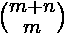
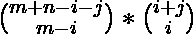

# 到达矩阵中给定单元的所有路径的成本总和

> 原文:[https://www . geeksforgeeks . org/到达矩阵中给定单元的所有路径的成本总和/](https://www.geeksforgeeks.org/sum-of-cost-of-all-paths-to-reach-a-given-cell-in-a-matrix/)

给定一个矩阵**网格[][]** 和两个整数 **M** 和 **N** ，任务是通过向下或向右移动一个单元格来找到从 **(0，0)** 到 **(M，N)** 的所有可能路径的成本总和。每条路径的成本被定义为路径中被访问的单元的值的总和。
**举例:**

> **输入:** M = 1，N = 1，网格[][] = {{1，2，3}，{4，5，6}，{7，8，9}}
> **输出:** 18
> **解释:**
> 到达(1，1)
> **路径 1:** (0，0) = > (0，1) = > (1，1)
> 路径成本= 1)
> 路径成本= 1 + 4 + 5 = 10
> 总路径总和= 8 + 10 = 18
> **输入:** M = 2，N = 2，网格= { {1，1，1}、{1，1，1}、{1，1，1} }
> **输出:** 30
> **解释:**
> 所有路径的路径成本总和为 30。

**方法:**思路是找出矩阵每个单元对于达到(M，N)的贡献，即每个 **i** 和 **j** 的贡献，其中 **0 < = i < = M** 和 **0 < = j < = N** 。
下面是每个单元对通过各个单元的从(0，0)到(M，N)的所有路径的贡献的图示:

> 从(0，0) = 
> 到达(M，N)的途径数从(0，0)经由(I，j) = 
> 到达(M，N)的途径数因此，每个网格(I，j)的贡献为= ![grid[i][j] * \binom{m+n-i-j}{m-i} * \binom{i+j}{i}  ](img/959c9cfd7fbbdd1557e3e8ed537f7da9.png "Rendered by QuickLaTeX.com")

以下是上述方法的实现:

## C++

```
// C++ implementation to find the
// sum of cost of all paths
// to reach (M, N)

#include <iostream>
using namespace std;

const int Col = 3;
int fact(int n);

// Function for computing
// combination
int nCr(int n, int r)
{
    return fact(n) / (fact(r)
                      * fact(n - r));
}

// Function to find the
// factorial of N
int fact(int n)
{
    int res = 1;

    // Loop to find the factorial
    // of a given number
    for (int i = 2; i <= n; i++)
        res = res * i;
    return res;
}

// Function for coumputing the
// sum of all path cost
int sumPathCost(int grid[][Col],
                int m, int n)
{
    int sum = 0, count;

    // Loop to find the contribution
    // of each (i, j) in the all possible
    // ways
    for (int i = 0; i <= m; i++) {
        for (int j = 0; j <= n; j++) {

            // Count number of
            // times (i, j) visited
            count
                = nCr(i + j, i)
                  * nCr(m + n - i - j, m - i);

            // Add the contribution of
            // grid[i][j] in the result
            sum += count * grid[i][j];
        }
    }
    return sum;
}

// Driver Code
int main()
{

    int m = 2;
    int n = 2;
    int grid[][Col] = { { 1, 2, 3 },
                        { 4, 5, 6 },
                        { 7, 8, 9 } };

    // Function Call
    cout << sumPathCost(grid, m, n);
    return 0;
}
```

## Java 语言(一种计算机语言，尤用于创建网站)

```
// Java implementation to find the
// sum of cost of all paths
// to reach (M, N)
import java.util.*;

class GFG{

static int Col = 3;

// Function for computing
// combination
static int nCr(int n, int r)
{
    return fact(n) / (fact(r) *
                      fact(n - r));
}

// Function to find the
// factorial of N
static int fact(int n)
{
    int res = 1;

    // Loop to find the factorial
    // of a given number
    for(int i = 2; i <= n; i++)
       res = res * i;
    return res;
}

// Function for coumputing the
// sum of all path cost
static int sumPathCost(int grid[][],
                       int m, int n)
{
    int sum = 0, count;

    // Loop to find the contribution
    // of each (i, j) in the all possible
    // ways
    for(int i = 0; i <= m; i++)
    {
       for(int j = 0; j <= n; j++)
       {

          // Count number of
          // times (i, j) visited
          count = nCr(i + j, i) *
                  nCr(m + n - i - j, m - i);

          // Add the contribution of
          // grid[i][j] in the result
          sum += count * grid[i][j];
       }
    }
    return sum;
}

// Driver code
public static void main(String[] args)
{
    int m = 2;
    int n = 2;
    int grid[][] = { { 1, 2, 3 },
                     { 4, 5, 6 },
                     { 7, 8, 9 } };

    // Function Call
    System.out.println(sumPathCost(grid, m, n));
}
}

// This code is contributed by offbeat
```

## 蟒蛇 3

```
# Python3 implementation to find the sum
# of cost of all paths to reach (M, N)

Col = 3;

# Function for computing
# combination
def nCr(n, r):

    return fact(n) / (fact(r) *
                      fact(n - r));

# Function to find the
# factorial of N
def fact(n):

    res = 1;

    # Loop to find the factorial
    # of a given number
    for i in range(2, n + 1):
        res = res * i;
    return res;

# Function for coumputing the
# sum of all path cost
def sumPathCost(grid, m, n):

    sum = 0;
    count = 0;

    # Loop to find the contribution
    # of each (i, j) in the all possible
    # ways
    for i in range(0, m + 1):
        for j in range(0, n + 1):

            # Count number of
            # times (i, j) visited
            count = (nCr(i + j, i) *
                     nCr(m + n - i - j, m - i));

            # Add the contribution of
            # grid[i][j] in the result
            sum += count * grid[i][j];

    return sum;

# Driver code
if __name__ == '__main__':

    m = 2;
    n = 2;
    grid = [ [ 1, 2, 3 ],
             [ 4, 5, 6 ],
             [ 7, 8, 9 ] ];

    # Function Call
    print(int(sumPathCost(grid, m, n)));

# This code is contributed by 29AjayKumar
```

## C#

```
// C# implementation to find the
// sum of cost of all paths
// to reach (M, N)
using System;

class GFG{

// Function for computing
// combination
static int nCr(int n, int r)
{
    return fact(n) / (fact(r) *
                      fact(n - r));
}

// Function to find the
// factorial of N
static int fact(int n)
{
    int res = 1;

    // Loop to find the factorial
    // of a given number
    for(int i = 2; i <= n; i++)
       res = res * i;
    return res;
}

// Function for coumputing the
// sum of all path cost
static int sumPathCost(int [,]grid,
                       int m, int n)
{
    int sum = 0, count;

    // Loop to find the contribution
    // of each (i, j) in the all possible
    // ways
    for(int i = 0; i <= m; i++)
    {
       for(int j = 0; j <= n; j++)
       {

          // Count number of
          // times (i, j) visited
          count = nCr(i + j, i) *
                  nCr(m + n - i - j, m - i);

          // Add the contribution of
          // grid[i][j] in the result
          sum += count * grid[i, j];
       }
    }
    return sum;
}

// Driver code
public static void Main()
{
    int m = 2;
    int n = 2;
    int [, ]grid = { { 1, 2, 3 },
                     { 4, 5, 6 },
                     { 7, 8, 9 } };

    // Function Call
    Console.Write(sumPathCost(grid, m, n));
}
}

// This code is contributed by Code_Mech
```

## java 描述语言

```
<script>

// Javascript implementation to find the
// sum of cost of all paths
// to reach (M, N)

var Col = 3;

// Function for computing
// combination
function nCr(n, r)
{
    return fact(n) / (fact(r)
                      * fact(n - r));
}

// Function to find the
// factorial of N
function fact(n)
{
    var res = 1;

    // Loop to find the factorial
    // of a given number
    for (var i = 2; i <= n; i++)
        res = res * i;
    return res;
}

// Function for coumputing the
// sum of all path cost
function sumPathCost(grid, m, n)
{
    var sum = 0, count;

    // Loop to find the contribution
    // of each (i, j) in the all possible
    // ways
    for (var i = 0; i <= m; i++) {
        for (var j = 0; j <= n; j++) {

            // Count number of
            // times (i, j) visited
            count
                = nCr(i + j, i)
                  * nCr(m + n - i - j, m - i);

            // Add the contribution of
            // grid[i][j] in the result
            sum += count * grid[i][j];
        }
    }
    return sum;
}

// Driver Code
var m = 2;
var n = 2;
var grid = [ [ 1, 2, 3 ],
                    [ 4, 5, 6 ],
                    [ 7, 8, 9 ] ];
// Function Call
document.write( sumPathCost(grid, m, n));

</script>
```

**Output:** 

```
150
```