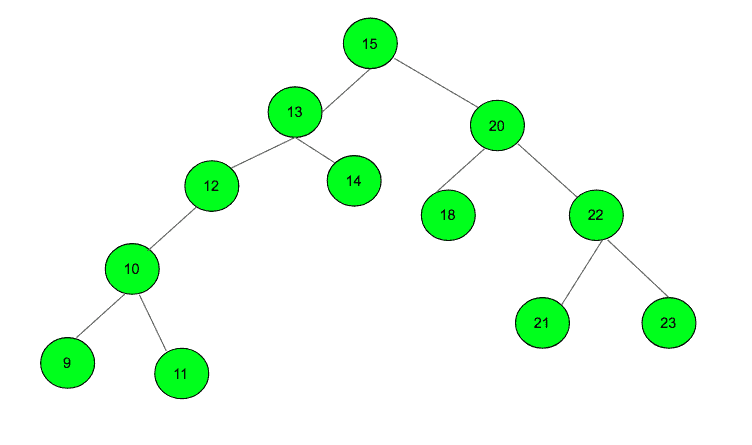

# BST 中给定节点的表亲节点之和

> 原文:[https://www . geesforgeks . org/给定 bst 中给定节点的表亲节点之和/](https://www.geeksforgeeks.org/sum-of-cousin-nodes-of-a-given-node-in-a-bst/)

给定一个二叉查找树和一个数字 N，任务是找到给定节点 N 的表兄弟的和，如果在给定的 BST 中存在具有给定值“N”的节点，则打印-1。



**示例:**

```
Input: Node = 12 
Output: 40 
Cousins are 18 and 22 

Input: 19
Output: -1
```

**方法:**下面给出的是解决问题的算法。

*   找到给定节点的父节点，如果该节点不存在，返回-1。
*   在树中遍历，遍历时找到每个节点的[级。](https://www.geeksforgeeks.org/get-level-of-a-node-in-a-binary-tree/)
*   如果级别与给定节点相同。检查该节点的父节点，如果父节点不同，则将该节点添加到总和中。

下面是上述方法的实现:

## C++

```
// C++ program to find the sum of cousins
// of a node of a given BST
#include <bits/stdc++.h>
using namespace std;

// structure to store the binary tree
struct Tree {
    int data;
    struct Tree *left, *right;
};

// insertion of node in the binary tree
struct Tree* newNode(int data)
{
    // allocates memory
    struct Tree* node = (struct Tree*)malloc(sizeof(struct Tree));

    // initializes data
    node->data = data;

    // marks the left and right
    // child as NULL
    node->left = node->right = NULL;

    // Return the node after allocating memory
    return (node);
};

// Function which calculates the sum of the cousin Node
int SumOfCousin(struct Tree* root, int p,
                int level1, int level)
{
    int sum = 0;
    if (root == NULL)
        return 0;

    // nodes which has same parent
    // as the given node will not be
    // taken to count for calculation
    if (p == root->data)
        return 0;

    // if the level is same
    // then it is a cousin
    // as parent checking has been
    // done above
    if (level1 == level)
        return root->data;

    // traverse in the tree left and right
    else
        sum += SumOfCousin(root->left, p, level1 + 1, level) + SumOfCousin(root->right, p, level1 + 1, level);

    return sum;
}

// Function that returns the parent node
int ParentNode(struct Tree* root, int NodeData)
{
    int parent = -1;

    // traverse the full Binary tree
    while (root != NULL) {

        // if node is found
        if (NodeData == root->data)
            break;

        // if less than move to left
        else if (NodeData < root->data) {
            parent = root->data;
            root = root->left;
        }

        // if greater than move to right
        else {
            parent = root->data;
            root = root->right;
        }
    }

    // Node not found
    if (root == NULL)
        return -1;
    else
        return parent;
}

// Function to find the level of the given node
int LevelOfNode(struct Tree* root, int NodeData)
{
    // calculate the level of node
    int level = 0;
    while (root != NULL) {

        // if the node is found
        if (NodeData == root->data)
            break;

        // move to the left of the tree
        if (NodeData < root->data) {
            root = root->left;
        }

        // move to the right of the tree
        else {
            root = root->right;
        }

        // increase the level after every traversal
        level++;
    }

    // return the level of a given node
    return level;
}

// Driver Code
int main()
{

    // initialize the root as NULL
    struct Tree* root = NULL;

    // Inserts node in the tree
    // tree is the same as the one in image
    root = newNode(15);
    root->left = newNode(13);
    root->left->left = newNode(12);
    root->left->right = newNode(14);
    root->right = newNode(20);
    root->right->left = newNode(18);
    root->right->right = newNode(22);

    // Given Node
    int NodeData = 12;
    int p, level, sum;

    // function call to find the parent node
    p = ParentNode(root, NodeData);

    // if given Node is not present then print -1
    if (p == -1)
        cout << "-1\n";

    // if present then find the level of the node
    // and call the sum of cousin function
    else {

        // function call to find the level of that node
        level = LevelOfNode(root, NodeData);

        // sum of cousin nodes of the given nodes
        sum = SumOfCousin(root, p, 0, level);

        // print the sum
        cout << sum;
    }
    return 0;
}
```

## Java 语言(一种计算机语言，尤用于创建网站)

```
// Java program to find the sum of cousins
// of a node of a given BST
class GFG
{

// structure to store the binary tree
static class Tree
{
    int data;
    Tree left, right;
};

// insertion of node in the binary tree
static Tree newNode(int data)
{
    // allocates memory
    Tree node = new Tree();

    // initializes data
    node.data = data;

    // marks the left and right
    // child as null
    node.left = node.right = null;

    // Return the node after allocating memory
    return (node);
}

// Function which calculates
// the sum of the cousin Node
static int SumOfCousin(Tree root, int p,
                      int level1, int level)
{
    int sum = 0;
    if (root == null)
        return 0;

    // nodes which has same parent
    // as the given node will not be
    // taken to count for calculation
    if (p == root.data)
        return 0;

    // if the level is same
    // then it is a cousin
    // as parent checking has been
    // done above
    if (level1 == level)
        return root.data;

    // traverse in the tree left and right
    else
        sum += SumOfCousin(root.left, p, level1 + 1, level) +
               SumOfCousin(root.right, p, level1 + 1, level);

    return sum;
}

// Function that returns the parent node
static int ParentNode(Tree root, int NodeData)
{
    int parent = -1;

    // traverse the full Binary tree
    while (root != null)
    {

        // if node is found
        if (NodeData == root.data)
            break;

        // if less than move to left
        else if (NodeData < root.data)
        {
            parent = root.data;
            root = root.left;
        }

        // if greater than move to right
        else
        {
            parent = root.data;
            root = root.right;
        }
    }

    // Node not found
    if (root == null)
        return -1;
    else
        return parent;
}

// Function to find the level of the given node
static int LevelOfNode(Tree root, int NodeData)
{
    // calculate the level of node
    int level = 0;
    while (root != null)
    {

        // if the node is found
        if (NodeData == root.data)
            break;

        // move to the left of the tree
        if (NodeData < root.data)
        {
            root = root.left;
        }

        // move to the right of the tree
        else
        {
            root = root.right;
        }

        // increase the level after every traversal
        level++;
    }

    // return the level of a given node
    return level;
}

// Driver Code
public static void main(String[] args)
{

    // initialize the root as null
    Tree root = null;

    // Inserts node in the tree
    // tree is the same as the one in image
    root = newNode(15);
    root.left = newNode(13);
    root.left.left = newNode(12);
    root.left.right = newNode(14);
    root.right = newNode(20);
    root.right.left = newNode(18);
    root.right.right = newNode(22);

    // Given Node
    int NodeData = 12;
    int p, level, sum;

    // function call to find the parent node
    p = ParentNode(root, NodeData);

    // if given Node is not present then print -1
    if (p == -1)
        System.out.print("-1\n");

    // if present then find the level of the node
    // and call the sum of cousin function
    else
    {

        // function call to find the level of that node
        level = LevelOfNode(root, NodeData);

        // sum of cousin nodes of the given nodes
        sum = SumOfCousin(root, p, 0, level);

        // print the sum
        System.out.print(sum);
    }
}
}

// This code is contributed by 29AjayKumar
```

## 蟒蛇 3

```
# Python3 program to find the sum of cousins
# of a node of a given BST

# structure to store the binary tree
class newNode:

    def __init__(self, data):

        self.data = data
        self.left = None
        self.right = None

# Function which calculates the
# sum of the cousin Node
def SumOfCousin(root, p, level1, level):

    sum = 0

    if (root == None):
        return 0

    # Nodes which has same parent
    # as the given node will not be
    # taken to count for calculation
    if (p == root.data):
        return 0

    # If the level is same
    # then it is a cousin
    # as parent checking has been
    # done above
    if (level1 == level):
        return root.data

    # Traverse in the tree left and right
    else:
        sum += (SumOfCousin(root.left, p,
                            level1 + 1, level) +
                SumOfCousin(root.right, p, 
                            level1 + 1, level))

    return sum

# Function that returns the parent node
def ParentNode(root, NodeData):

    parent = -1

    # Traverse the full Binary tree
    while (root != None):

        # If node is found
        if (NodeData == root.data):
            break

        # If less than move to left
        elif (NodeData < root.data):
            parent = root.data
            root = root.left

        # If greater than move to right
        else:
            parent = root.data
            root = root.right

    # Node not found
    if (root == None):
        return -1
    else:
        return parent

# Function to find the level of
# the given node
def LevelOfNode(root, NodeData):

    # Calculate the level of node
    level = 0

    while (root != None):

        # If the node is found
        if (NodeData == root.data):
            break

        # Move to the left of the tree
        if (NodeData < root.data):
            root = root.left

        # Move to the right of the tree
        else:
            root = root.right

        # Increase the level after every traversal
        level += 1

    # Return the level of a given node
    return level

# Driver Code
if __name__ == '__main__':

    # Initialize the root as NULL
    root = None

    # Inserts node in the tree
    # tree is the same as the
    # one in image
    root = newNode(15)
    root.left = newNode(13)
    root.left.left = newNode(12)
    root.left.right = newNode(14)
    root.right = newNode(20)
    root.right.left = newNode(18)
    root.right.right = newNode(22)

    # Given Node
    NodeData = 12

    # Function call to find the parent node
    p = ParentNode(root, NodeData)

    # If given Node is not present then print -1
    if (p == -1):
        print("-1")

    # If present then find the level of the node
    # and call the sum of cousin function
    else:

        # Function call to find the
        # level of that node
        level = LevelOfNode(root, NodeData)

        # Sum of cousin nodes of the given nodes
        sum = SumOfCousin(root, p, 0, level)

        # Print the sum
        print(sum)

# This code is contributed by bgangwar59
```

## C#

```
// C# program to find the sum of cousins
// of a node of a given BST
using System;

class GFG
{

// structure to store the binary tree
class Tree
{
    public int data;
    public Tree left, right;
};

// insertion of node in the binary tree
static Tree newNode(int data)
{
    // allocates memory
    Tree node = new Tree();

    // initializes data
    node.data = data;

    // marks the left and right
    // child as null
    node.left = node.right = null;

    // Return the node after allocating memory
    return (node);
}

// Function which calculates
// the sum of the cousin Node
static int SumOfCousin(Tree root, int p,
                       int level1, int level)
{
    int sum = 0;
    if (root == null)
        return 0;

    // nodes which has same parent
    // as the given node will not be
    // taken to count for calculation
    if (p == root.data)
        return 0;

    // if the level is same
    // then it is a cousin
    // as parent checking has been
    // done above
    if (level1 == level)
        return root.data;

    // traverse in the tree left and right
    else
        sum += SumOfCousin(root.left, p,
                           level1 + 1, level) +
               SumOfCousin(root.right, p,
                           level1 + 1, level);

    return sum;
}

// Function that returns the parent node
static int ParentNode(Tree root,
                      int NodeData)
{
    int parent = -1;

    // traverse the full Binary tree
    while (root != null)
    {

        // if node is found
        if (NodeData == root.data)
            break;

        // if less than move to left
        else if (NodeData < root.data)
        {
            parent = root.data;
            root = root.left;
        }

        // if greater than move to right
        else
        {
            parent = root.data;
            root = root.right;
        }
    }

    // Node not found
    if (root == null)
        return -1;
    else
        return parent;
}

// Function to find the level of the given node
static int LevelOfNode(Tree root, int NodeData)
{
    // calculate the level of node
    int level = 0;
    while (root != null)
    {

        // if the node is found
        if (NodeData == root.data)
            break;

        // move to the left of the tree
        if (NodeData < root.data)
        {
            root = root.left;
        }

        // move to the right of the tree
        else
        {
            root = root.right;
        }

        // increase the level
        // after every traversal
        level++;
    }

    // return the level of a given node
    return level;
}

// Driver Code
public static void Main(String[] args)
{

    // initialize the root as null
    Tree root = null;

    // Inserts node in the tree
    // tree is the same as the one in image
    root = newNode(15);
    root.left = newNode(13);
    root.left.left = newNode(12);
    root.left.right = newNode(14);
    root.right = newNode(20);
    root.right.left = newNode(18);
    root.right.right = newNode(22);

    // Given Node
    int NodeData = 12;
    int p, level, sum;

    // function call to find the parent node
    p = ParentNode(root, NodeData);

    // if given Node is not present
    // then print -1
    if (p == -1)
        Console.Write("-1\n");

    // if present then find the level of the node
    // and call the sum of cousin function
    else
    {

        // function call to find the level of that node
        level = LevelOfNode(root, NodeData);

        // sum of cousin nodes of the given nodes
        sum = SumOfCousin(root, p, 0, level);

        // print the sum
        Console.Write(sum);
    }
}
}

// This code is contributed by PrinciRaj1992
```

## java 描述语言

```
<script>

// Javascript program to find the sum of
// cousins of a node of a given BST

// Structure to store the binary tree
class Tree
{
    constructor(data)
    {
        this.left = null;
        this.right = null;
        this.data = data;
    }
}

// Insertion of node in the binary tree
function newNode(data)
{

    // Allocates memory
    let node = new Tree(data);

    // Return the node after
    // allocating memory
    return (node);
}

// Function which calculates
// the sum of the cousin Node
function SumOfCousin(root, p, level1, level)
{
    let sum = 0;

    if (root == null)
        return 0;

    // Nodes which has same parent
    // as the given node will not be
    // taken to count for calculation
    if (p == root.data)
        return 0;

    // If the level is same
    // then it is a cousin
    // as parent checking has been
    // done above
    if (level1 == level)
        return root.data;

    // Traverse in the tree left and right
    else
        sum += SumOfCousin(root.left, p,
                           level1 + 1, level) +
               SumOfCousin(root.right, p,
                           level1 + 1, level);

    return sum;
}

// Function that returns the parent node
function ParentNode(root, NodeData)
{
    let parent = -1;

    // Traverse the full Binary tree
    while (root != null)
    {

        // If node is found
        if (NodeData == root.data)
            break;

        // If less than move to left
        else if (NodeData < root.data)
        {
            parent = root.data;
            root = root.left;
        }

        // If greater than move to right
        else
        {
            parent = root.data;
            root = root.right;
        }
    }

    // Node not found
    if (root == null)
        return -1;
    else
        return parent;
}

// Function to find the level of the given node
function LevelOfNode(root, NodeData)
{

    // Calculate the level of node
    let level = 0;
    while (root != null)
    {

        // If the node is found
        if (NodeData == root.data)
            break;

        // Move to the left of the tree
        if (NodeData < root.data)
        {
            root = root.left;
        }

        // Move to the right of the tree
        else
        {
            root = root.right;
        }

        // Increase the level
        // after every traversal
        level++;
    }

    // Return the level of a given node
    return level;
}

// Driver code

// Initialize the root as null
let root = null;

// Inserts node in the tree
// tree is the same as the one in image
root = newNode(15);
root.left = newNode(13);
root.left.left = newNode(12);
root.left.right = newNode(14);
root.right = newNode(20);
root.right.left = newNode(18);
root.right.right = newNode(22);

// Given Node
let NodeData = 12;
let p, level, sum;

// Function call to find the parent node
p = ParentNode(root, NodeData);

// If given Node is not present
// then print -1
if (p == -1)
    document.write("-1" + "</br>");

// If present then find the level of the node
// and call the sum of cousin function
else
{

    // Function call to find the level of that node
    level = LevelOfNode(root, NodeData);

    // Sum of cousin nodes of the given nodes
    sum = SumOfCousin(root, p, 0, level);

    // Print the sum
    document.write(sum);
}

// This code is contributed by divyeshrabadiya07

</script>
```

**Output:** 

```
40
```