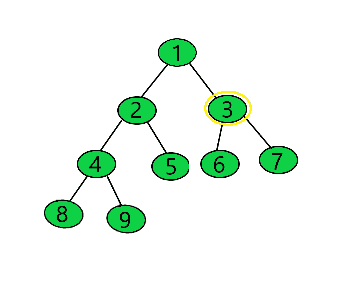
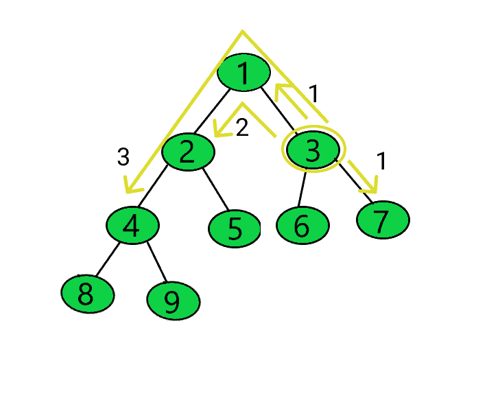
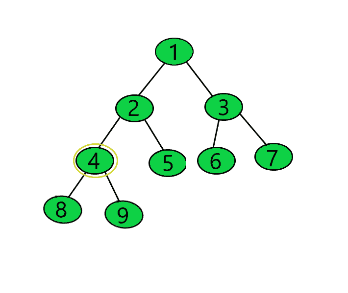

# 所有节点到给定节点的距离之和

> 原文:[https://www . geeksforgeeks . org/给定节点的所有节点距离总和/](https://www.geeksforgeeks.org/sum-of-distances-of-all-nodes-from-a-given-node/)

给定一个[二叉树](https://www.geeksforgeeks.org/binary-tree-data-structure/)和一个整数**目标**，表示一个节点的值，任务是找出所有节点到给定节点的距离之和。

**示例:**

> **输入:**目标= 3
> 
> [](https://media.geeksforgeeks.org/wp-content/uploads/20210101185744/treenormal1.png)
> 
> **输出:**19
> T3】说明:
> 
> [](https://media.geeksforgeeks.org/wp-content/uploads/20210101185859/ques3tree.png)
> 
> 节点 1、6、7 距节点 3 的距离= 1
> 节点 2 距节点 3 的距离= 2
> 节点 4、5 距节点 3 的距离= 3
> 节点 8、9 距节点 3 的距离= 4
> 距离之和= (1 + 1 + 1) + (2) + (3 + 3) + (4 + 4) = 19。
> 
> **输入:**目标= 4
> 
> [](https://media.geeksforgeeks.org/wp-content/uploads/20210112204019/treeexample2.png)
> 
> **输出:** 18

**天真方法:**解决这个问题最简单的想法是，每当一个节点在一个节点的左侧或右侧被遍历时，那么它们的子树的节点的距离减少 1，其余节点与该节点的距离增加 1。
因此，下面的关系给出了所有节点到一个节点的距离之和，比如 **u** :

> **sumDists(u)= sumDists(父(u))–(u 的左右子串中的节点)+(N–u 的左右子串中的节点)**
> 
> 其中，
> **sumDists(u):** 所有节点到节点 u 的距离之和
> **sumDists(父节点(u)):** 所有节点到节点 u 的父节点的距离之和 **u**

按照以下步骤解决问题:

*   创建一个函数来**找到给定节点(包括给定节点)的**左右子树**中的节点数**。
*   创建一个函数来计算节点深度的总和，变量**总和**表示所有节点到目标的距离总和。
*   [使用深度优先搜索](https://www.geeksforgeeks.org/dfs-traversal-of-a-tree-using-recursion/)遍历树，并对每个节点执行以下操作:
    *   如果**目标与当前节点匹配**，则更新**总和**为**距离**。
    *   否则:
        *   如果**根- >左侧不为空**，则找到左侧子树中的**节点数，并将所有节点距**根- >左侧节点**的距离之和作为 **tempSum** 。**
        *   如果**根- >右侧不为空**，则找到右侧子树中的**节点数，并将所有节点距**根- >右侧节点**的距离之和作为**温度总和**传递。**
*   到达目标节点后，打印节点到目标节点的距离总和。

下面是上述方法的实现:

## C++

```
// C++ program for the above approach

#include <bits/stdc++.h>
using namespace std;

// Structure of a
// Binary Tree Node
class TreeNode {
public:
    int data;
    TreeNode* left;
    TreeNode* right;
};

// Function that allocates a new node
// with the given data and NULL to its
// left and right pointers
TreeNode* newNode(int data)
{
    // Allocate the node
    TreeNode* Node = new TreeNode();

    // Allocate Memory
    Node->data = data;
    Node->left = NULL;
    Node->right = NULL;

    return (Node);
}

// Function which calculates sum
// of depths of all nodes
int sumofdepth(TreeNode* root, int l)
{
    // Base Case
    if (root == NULL)
        return 0;

    // Return recursively
    return l + sumofdepth(root->left,
                          l + 1)
           + sumofdepth(root->right,
                        l + 1);
}

// Function to count of nodes
// in the left and right subtree
int Noofnodes(TreeNode* root)
{
    // Base Case
    if (root == NULL)
        return 0;

    // Return recursively
    return Noofnodes(root->left)
           + Noofnodes(root->right)
           + 1;
}

// Stores the sum of distances
// of all nodes from given node
int sum = 0;

// Function to find sum of distances
// of all nodes from a given node
void distance(TreeNode* root,
              int target,
              int distancesum,
              int n)
{
    // If target node matches
    // with the current node
    if (root->data == target) {
        sum = distancesum;
        return;
    }

    // If left of current node exists
    if (root->left) {

        // Count number of nodes
        // in the left subtree
        int nodes = Noofnodes(
            root->left);

        // Update sum
        int tempsum = distancesum
                      - nodes
                      + (n - nodes);

        // Recur for the left subtree
        distance(root->left, target,
                 tempsum, n);
    }

    // If right is not null
    if (root->right) {

        // Find number of nodes
        // in the left subtree
        int nodes = Noofnodes(
            root->right);

        // Applying the formula given
        // in the approach
        int tempsum = distancesum
                      - nodes + (n - nodes);

        // Recur for the right subtree
        distance(root->right, target,
                 tempsum, n);
    }
}

// Driver Code
int main()
{
    // Input tree
    TreeNode* root = newNode(1);
    root->left = newNode(2);
    root->right = newNode(3);
    root->left->left = newNode(4);
    root->left->right = newNode(5);
    root->right->left = newNode(6);
    root->right->right = newNode(7);
    root->left->left->left = newNode(8);
    root->left->left->right = newNode(9);

    int target = 3;

    // Sum of depth of all
    // nodes from root node
    int distanceroot
        = sumofdepth(root, 0);

    // Number of nodes in the
    // left and right subtree
    int totalnodes = Noofnodes(root);

    distance(root, target, distanceroot,
             totalnodes);

    // Print the sum of distances
    cout << sum;

    return 0;
}
```

## Java 语言(一种计算机语言，尤用于创建网站)

```
// Java program for the above approach
import java.io.*;

class GFG{

// Structure of a
// Binary Tree Node
static class TreeNode
{
    int data;
    TreeNode left, right;
}

// Function that allocates a new node
// with the given data and NULL to its
// left and right pointers
static TreeNode newNode(int data)
{
    TreeNode Node = new TreeNode();
    Node.data = data;
    Node.left = Node.right = null;
    return (Node);
}

// Function which calculates sum
// of depths of all nodes
static int sumofdepth(TreeNode root, int l)
{

    // Base Case
    if (root == null)
        return 0;

    // Return recursively
    return l + sumofdepth(root.left, l + 1) +
              sumofdepth(root.right, l + 1);
}

// Function to count of nodes
// in the left and right subtree
static int Noofnodes(TreeNode root)
{

    // Base Case
    if (root == null)
        return 0;

    // Return recursively
    return Noofnodes(root.left) +
          Noofnodes(root.right) + 1;
}

// Stores the sum of distances
// of all nodes from given node
public static int sum = 0;

// Function to find sum of distances
// of all nodes from a given node
static void distance(TreeNode root, int target,
                     int distancesum, int n)
{

    // If target node matches
    // with the current node
    if (root.data == target)
    {
        sum = distancesum;
        return;
    }

    // If left of current node exists
    if (root.left != null)
    {

        // Count number of nodes
        // in the left subtree
        int nodes = Noofnodes(root.left);

        // Update sum
        int tempsum = distancesum - nodes +
                               (n - nodes);

        // Recur for the left subtree
        distance(root.left, target, tempsum, n);
    }

    // If right is not null
    if (root.right != null)
    {

        // Find number of nodes
        // in the left subtree
        int nodes = Noofnodes(root.right);

        // Applying the formula given
        // in the approach
        int tempsum = distancesum - nodes +
                               (n - nodes);

        // Recur for the right subtree
        distance(root.right, target, tempsum, n);
    }
}

// Driver Code
public static void main(String[] args)
{

    // Input tree
    TreeNode root = newNode(1);
    root.left = newNode(2);
    root.right = newNode(3);
    root.left.left = newNode(4);
    root.left.right = newNode(5);
    root.right.left = newNode(6);
    root.right.right = newNode(7);
    root.left.left.left = newNode(8);
    root.left.left.right = newNode(9);

    int target = 3;

    // Sum of depth of all
    // nodes from root node
    int distanceroot = sumofdepth(root, 0);

    // Number of nodes in the
    // left and right subtree
    int totalnodes = Noofnodes(root);

    distance(root, target, distanceroot,
             totalnodes);

    // Print the sum of distances
    System.out.println(sum);
}
}

// This code is contributed by Dharanendra L V
```

## 蟒蛇 3

```
# Python3 program for the above approach

# Structure of a
# Binary Tree Node
class TreeNode:
    def __init__(self, x):
        self.data = x
        self.left = None
        self.right = None

# Function which calculates sum
# of depths of all nodes
def sumofdepth(root, l):

    # Base Case
    if (root == None):
        return 0

    # Return recursively
    return l + sumofdepth(root.left, l + 1)+ sumofdepth(root.right, l + 1)

# Function to count of nodes
# in the left and right subtree
def Noofnodes(root):

    # Base Case
    if (root == None):
        return 0

    # Return recursively
    return Noofnodes(root.left) + Noofnodes(root.right) + 1

# Stores the sum of distances
# of all nodes from given node
sum = 0

# Function to find sum of distances
# of all nodes from a given node
def distance(root, target, distancesum, n):
    global sum

    # If target node matches
    # with the current node
    if (root.data == target):
        sum = distancesum
        return

    # If left of current node exists
    if (root.left):

        # Count number of nodes
        # in the left subtree
        nodes = Noofnodes(root.left)

        # Update sum
        tempsum = distancesum - nodes + (n - nodes)

        # Recur for the left subtree
        distance(root.left, target, tempsum, n)

    # If right is not null
    if (root.right):

        # Find number of nodes
        # in the left subtree
        nodes = Noofnodes(root.right)

        # Applying the formula given
        # in the approach
        tempsum = distancesum - nodes + (n - nodes)

        # Recur for the right subtree
        distance(root.right, target, tempsum, n)

# Driver Code
if __name__ == '__main__':

    # Input tree
    root = TreeNode(1)
    root.left = TreeNode(2)
    root.right = TreeNode(3)
    root.left.left = TreeNode(4)
    root.left.right = TreeNode(5)
    root.right.left = TreeNode(6)
    root.right.right = TreeNode(7)
    root.left.left.left = TreeNode(8)
    root.left.left.right = TreeNode(9)
    target = 3

    # Sum of depth of all
    # nodes from root node
    distanceroot = sumofdepth(root, 0)

    # Number of nodes in the
    # left and right subtree
    totalnodes = Noofnodes(root)
    distance(root, target, distanceroot, totalnodes)

    # Print the sum of distances
    print (sum)

    # This code is contributed by mohit kumar 29.
```

## C#

```
// C# program for the above approach
using System;

public class GFG{

// Structure of a
// Binary Tree Node
class TreeNode
{
    public int data;
    public TreeNode left, right;
}

// Function that allocates a new node
// with the given data and NULL to its
// left and right pointers
static TreeNode newNode(int data)
{
    TreeNode Node = new TreeNode();
    Node.data = data;
    Node.left = Node.right = null;
    return (Node);
}

// Function which calculates sum
// of depths of all nodes
static int sumofdepth(TreeNode root, int l)
{

    // Base Case
    if (root == null)
        return 0;

    // Return recursively
    return l + sumofdepth(root.left, l + 1) +
              sumofdepth(root.right, l + 1);
}

// Function to count of nodes
// in the left and right subtree
static int Noofnodes(TreeNode root)
{

    // Base Case
    if (root == null)
        return 0;

    // Return recursively
    return Noofnodes(root.left) +
          Noofnodes(root.right) + 1;
}

// Stores the sum of distances
// of all nodes from given node
public static int sum = 0;

// Function to find sum of distances
// of all nodes from a given node
static void distance(TreeNode root, int target,
                     int distancesum, int n)
{

    // If target node matches
    // with the current node
    if (root.data == target)
    {
        sum = distancesum;
        return;
    }

    // If left of current node exists
    if (root.left != null)
    {

        // Count number of nodes
        // in the left subtree
        int nodes = Noofnodes(root.left);

        // Update sum
        int tempsum = distancesum - nodes +
                               (n - nodes);

        // Recur for the left subtree
        distance(root.left, target, tempsum, n);
    }

    // If right is not null
    if (root.right != null)
    {

        // Find number of nodes
        // in the left subtree
        int nodes = Noofnodes(root.right);

        // Applying the formula given
        // in the approach
        int tempsum = distancesum - nodes +
                               (n - nodes);

        // Recur for the right subtree
        distance(root.right, target, tempsum, n);
    }
}

// Driver Code
public static void Main(String[] args)
{

    // Input tree
    TreeNode root = newNode(1);
    root.left = newNode(2);
    root.right = newNode(3);
    root.left.left = newNode(4);
    root.left.right = newNode(5);
    root.right.left = newNode(6);
    root.right.right = newNode(7);
    root.left.left.left = newNode(8);
    root.left.left.right = newNode(9);

    int target = 3;

    // Sum of depth of all
    // nodes from root node
    int distanceroot = sumofdepth(root, 0);

    // Number of nodes in the
    // left and right subtree
    int totalnodes = Noofnodes(root);

    distance(root, target, distanceroot,
             totalnodes);

    // Print the sum of distances
    Console.WriteLine(sum);
}
}

// This code is contributed by shikhasingrajput
```

## java 描述语言

```
<script>
    // Javascript program for the above approach

    // Structure of a
    // Binary Tree Node
    class TreeNode
    {
        constructor(data) {
           this.left = null;
           this.right = null;
           this.data = data;
        }
    }

    // Function that allocates a new node
    // with the given data and NULL to its
    // left and right pointers
    function newNode(data)
    {
        let Node = new TreeNode(data);
        return (Node);
    }

    // Function which calculates sum
    // of depths of all nodes
    function sumofdepth(root, l)
    {

        // Base Case
        if (root == null)
            return 0;

        // Return recursively
        return l + sumofdepth(root.left, l + 1) +
                  sumofdepth(root.right, l + 1);
    }

    // Function to count of nodes
    // in the left and right subtree
    function Noofnodes(root)
    {

        // Base Case
        if (root == null)
            return 0;

        // Return recursively
        return Noofnodes(root.left) +
              Noofnodes(root.right) + 1;
    }

    // Stores the sum of distances
    // of all nodes from given node
    let sum = 0;

    // Function to find sum of distances
    // of all nodes from a given node
    function distance(root, target, distancesum, n)
    {

        // If target node matches
        // with the current node
        if (root.data == target)
        {
            sum = distancesum;
            return;
        }

        // If left of current node exists
        if (root.left != null)
        {

            // Count number of nodes
            // in the left subtree
            let nodes = Noofnodes(root.left);

            // Update sum
            let tempsum = distancesum - nodes + (n - nodes);

            // Recur for the left subtree
            distance(root.left, target, tempsum, n);
        }

        // If right is not null
        if (root.right != null)
        {

            // Find number of nodes
            // in the left subtree
            let nodes = Noofnodes(root.right);

            // Applying the formula given
            // in the approach
            let tempsum = distancesum - nodes + (n - nodes);

            // Recur for the right subtree
            distance(root.right, target, tempsum, n);
        }
    }

    // Input tree
    let root = newNode(1);
    root.left = newNode(2);
    root.right = newNode(3);
    root.left.left = newNode(4);
    root.left.right = newNode(5);
    root.right.left = newNode(6);
    root.right.right = newNode(7);
    root.left.left.left = newNode(8);
    root.left.left.right = newNode(9);

    let target = 3;

    // Sum of depth of all
    // nodes from root node
    let distanceroot = sumofdepth(root, 0);

    // Number of nodes in the
    // left and right subtree
    let totalnodes = Noofnodes(root);

    distance(root, target, distanceroot,
             totalnodes);

    // Print the sum of distances
    document.write(sum);

// This code is contributed by suresh07.
</script>
```

**Output:** 

```
19
```

***时间复杂度:**O(N<sup>2</sup>)*
***辅助空间:** O(1)*

**有效方法:**上述方法可以通过添加一个额外的变量来优化，比如说**大小**，以表示节点结构中其左右子树中的节点数。这将计算子树的[大小的任务减少到恒定的计算时间](https://www.geeksforgeeks.org/calculate-number-nodes-subtrees-using-dfs/)

下面是上述方法的实现:

## C++

```
// C++ program for the above approach
#include <bits/stdc++.h>
using namespace std;

// Structure of a
// binary tree node
class TreeNode {
public:
    int data, size;
    TreeNode* left;
    TreeNode* right;
};

// Function that allocates a new node
// with the given data and NULL to
// its left and right pointers
TreeNode* newNode(int data)
{
    TreeNode* Node = new TreeNode();
    Node->data = data;
    Node->left = NULL;
    Node->right = NULL;

    // Return newly created node
    return (Node);
}

// Function to count the number of
// nodes in the left and right subtrees
pair<int, int> sumofsubtree(TreeNode* root)
{
    // Initialize a pair that stores
    // the pair {number of nodes, depth}
    pair<int, int> p = make_pair(1, 0);

    // Finding the number of nodes
    // in the left subtree
    if (root->left) {
        pair<int, int> ptemp
            = sumofsubtree(root->left);

        p.second += ptemp.first
                    + ptemp.second;
        p.first += ptemp.first;
    }

    // Find the number of nodes
    // in the right subtree
    if (root->right) {

        pair<int, int> ptemp
            = sumofsubtree(root->right);

        p.second += ptemp.first
                    + ptemp.second;
        p.first += ptemp.first;
    }

    // Filling up size field
    root->size = p.first;
    return p;
}

// Stores the sum of distances of all
// nodes from the given node
int sum = 0;

// Function to find the total distance
void distance(TreeNode* root, int target,
              int distancesum, int n)
{
    // If target node matches with
    // the current node
    if (root->data == target) {
        sum = distancesum;
    }

    // If root->left is not null
    if (root->left) {

        // Update sum
        int tempsum = distancesum
                      - root->left->size
                      + (n - root->left->size);

        // Recur for the left subtree
        distance(root->left, target,
                 tempsum, n);
    }

    // If root->right is not null
    if (root->right) {

        // Apply the formula given
        // in the approach
        int tempsum = distancesum
                      - root->right->size
                      + (n - root->right->size);

        // Recur for the right subtree
        distance(root->right, target,
                 tempsum, n);
    }
}

// Driver Code
int main()
{
    // Input tree
    TreeNode* root = newNode(1);
    root->left = newNode(2);
    root->right = newNode(3);
    root->left->left = newNode(4);
    root->left->right = newNode(5);
    root->right->left = newNode(6);
    root->right->right = newNode(7);
    root->left->left->left = newNode(8);
    root->left->left->right = newNode(9);

    int target = 3;

    pair<int, int> p = sumofsubtree(root);

    // Total number of nodes
    int totalnodes = p.first;

    distance(root, target, p.second,
             totalnodes);

    // Print the sum of distances
    cout << sum << endl;

    return 0;
}
```

## Java 语言(一种计算机语言，尤用于创建网站)

```
// Java program for the above approach
import java.util.*;
class GFG
{
    static class pair
    {
        int first, second;
        public pair(int first, int second) 
        {
            this.first = first;
            this.second = second;
        }   
    }

// Structure of a
// binary tree node
static class TreeNode
{
    int data, size;
    TreeNode left;
    TreeNode right;
};

// Function that allocates a new node
// with the given data and null to
// its left and right pointers
static TreeNode newNode(int data)
{
    TreeNode Node = new TreeNode();
    Node.data = data;
    Node.left = null;
    Node.right = null;

    // Return newly created node
    return (Node);
}

// Function to count the number of
// nodes in the left and right subtrees
static pair sumofsubtree(TreeNode root)
{

    // Initialize a pair that stores
    // the pair {number of nodes, depth}
    pair p = new pair(1, 0);

    // Finding the number of nodes
    // in the left subtree
    if (root.left != null)
    {
        pair ptemp
            = sumofsubtree(root.left);

        p.second += ptemp.first
                    + ptemp.second;
        p.first += ptemp.first;
    }

    // Find the number of nodes
    // in the right subtree
    if (root.right != null)
    {
        pair ptemp
            = sumofsubtree(root.right);

        p.second += ptemp.first
                    + ptemp.second;
        p.first += ptemp.first;
    }

    // Filling up size field
    root.size = p.first;
    return p;
}

// Stores the sum of distances of all
// nodes from the given node
static int sum = 0;

// Function to find the total distance
static void distance(TreeNode root, int target,
              int distancesum, int n)
{

    // If target node matches with
    // the current node
    if (root.data == target)
    {
        sum = distancesum;
    }

    // If root.left is not null
    if (root.left != null)
    {

        // Update sum
        int tempsum = distancesum
                      - root.left.size
                      + (n - root.left.size);

        // Recur for the left subtree
        distance(root.left, target,
                 tempsum, n);
    }

    // If root.right is not null
    if (root.right != null)
    {

        // Apply the formula given
        // in the approach
        int tempsum = distancesum
                      - root.right.size
                      + (n - root.right.size);

        // Recur for the right subtree
        distance(root.right, target,
                 tempsum, n);
    }
}

// Driver Code
public static void main(String[] args)
{

    // Input tree
    TreeNode root = newNode(1);
    root.left = newNode(2);
    root.right = newNode(3);
    root.left.left = newNode(4);
    root.left.right = newNode(5);
    root.right.left = newNode(6);
    root.right.right = newNode(7);
    root.left.left.left = newNode(8);
    root.left.left.right = newNode(9);
    int target = 3;
    pair p = sumofsubtree(root);

    // Total number of nodes
    int totalnodes = p.first;
    distance(root, target, p.second,
             totalnodes);

    // Print the sum of distances
    System.out.print(sum +"\n");
}
}

// This code is contributed by shikhasingrajput
```

## 蟒蛇 3

```
# Python3 program for the above approach

# Stores the sum of distances of all
# nodes from the given node
sum = 0

# Structure of a
# binary tree node
class TreeNode:

    def __init__(self, data):

        self.data = data
        self.size = 0
        self.left = None
        self.right = None

# Function to count the number of
# nodes in the left and right subtrees
def sumofsubtree(root):

    # Initialize a pair that stores
    # the pair {number of nodes, depth}
    p =  [1, 0]

    # Finding the number of nodes
    # in the left subtree
    if (root.left):
        ptemp = sumofsubtree(root.left)
        p[1] += ptemp[0] + ptemp[1]
        p[0] += ptemp[0]

    # Find the number of nodes
    # in the right subtree
    if (root.right):
        ptemp = sumofsubtree(root.right)
        p[1] += ptemp[0] + ptemp[1]
        p[0] += ptemp[0]

    # Filling up size field
    root.size = p[0]
    return p

# Function to find the total distance
def distance(root, target, distancesum, n):

    global sum

    # If target node matches with
    # the current node
    if (root.data == target):
        sum = distancesum

    # If root.left is not null
    if (root.left):

        # Update sum
        tempsum = (distancesum - root.left.size +
                            (n - root.left.size))

        # Recur for the left subtree
        distance(root.left, target, tempsum, n)

    # If root.right is not null
    if (root.right):

        # Apply the formula given
        # in the approach
        tempsum = (distancesum - root.right.size +
                            (n - root.right.size))

        # Recur for the right subtree
        distance(root.right, target, tempsum, n)

# Driver Code
if __name__ == '__main__':

    # Input tree
    root = TreeNode(1)
    root.left = TreeNode(2)
    root.right = TreeNode(3)
    root.left.left = TreeNode(4)
    root.left.right = TreeNode(5)
    root.right.left = TreeNode(6)
    root.right.right = TreeNode(7)
    root.left.left.left = TreeNode(8)
    root.left.left.right = TreeNode(9)

    target = 3

    p = sumofsubtree(root)

    # Total number of nodes
    totalnodes = p[0]

    distance(root, target, p[1], totalnodes)

    # Print the sum of distances
    print(sum)

# This code is contributed by ipg2016107
```

## C#

```
// C# program for the above approach
using System;
public class GFG
{
    class pair
    {
        public int first, second;
        public pair(int first, int second) 
        {
            this.first = first;
            this.second = second;
        }   
    }

// Structure of a
// binary tree node
class TreeNode
{
    public int data, size;
    public TreeNode left;
    public TreeNode right;
};

// Function that allocates a new node
// with the given data and null to
// its left and right pointers
static TreeNode newNode(int data)
{
    TreeNode Node = new TreeNode();
    Node.data = data;
    Node.left = null;
    Node.right = null;

    // Return newly created node
    return (Node);
}

// Function to count the number of
// nodes in the left and right subtrees
static pair sumofsubtree(TreeNode root)
{

    // Initialize a pair that stores
    // the pair {number of nodes, depth}
    pair p = new pair(1, 0);

    // Finding the number of nodes
    // in the left subtree
    if (root.left != null)
    {
        pair ptemp
            = sumofsubtree(root.left);

        p.second += ptemp.first
                    + ptemp.second;
        p.first += ptemp.first;
    }

    // Find the number of nodes
    // in the right subtree
    if (root.right != null)
    {
        pair ptemp
            = sumofsubtree(root.right);

        p.second += ptemp.first
                    + ptemp.second;
        p.first += ptemp.first;
    }

    // Filling up size field
    root.size = p.first;
    return p;
}

// Stores the sum of distances of all
// nodes from the given node
static int sum = 0;

// Function to find the total distance
static void distance(TreeNode root, int target,
              int distancesum, int n)
{

    // If target node matches with
    // the current node
    if (root.data == target)
    {
        sum = distancesum;
    }

    // If root.left is not null
    if (root.left != null)
    {

        // Update sum
        int tempsum = distancesum
                      - root.left.size
                      + (n - root.left.size);

        // Recur for the left subtree
        distance(root.left, target,
                 tempsum, n);
    }

    // If root.right is not null
    if (root.right != null)
    {

        // Apply the formula given
        // in the approach
        int tempsum = distancesum
                      - root.right.size
                      + (n - root.right.size);

        // Recur for the right subtree
        distance(root.right, target,
                 tempsum, n);
    }
}

// Driver Code
public static void Main(String[] args)
{

    // Input tree
    TreeNode root = newNode(1);
    root.left = newNode(2);
    root.right = newNode(3);
    root.left.left = newNode(4);
    root.left.right = newNode(5);
    root.right.left = newNode(6);
    root.right.right = newNode(7);
    root.left.left.left = newNode(8);
    root.left.left.right = newNode(9);
    int target = 3;
    pair p = sumofsubtree(root);

    // Total number of nodes
    int totalnodes = p.first;
    distance(root, target, p.second,
             totalnodes);

    // Print the sum of distances
    Console.Write(sum +"\n");
}
}

// This code is contributed by shikhasingrajput
```

## java 描述语言

```
<script>
// Javascript program for the above approach

class pair
{
    constructor(first,second)
    {
        this.first = first;
        this.second = second;
    }
}

// Structure of a
// binary tree node
class Node
{
    // Function that allocates a new node
// with the given data and null to
// its left and right pointers
    constructor(data)
    {
        this.data=data;
        this.size=0;
        this.left=this.right=null;
    }
}

// Function to count the number of
// nodes in the left and right subtrees   
function sumofsubtree(root)
{
    // Initialize a pair that stores
    // the pair {number of nodes, depth}
    let p = new pair(1, 0);

    // Finding the number of nodes
    // in the left subtree
    if (root.left != null)
    {
        let ptemp
            = sumofsubtree(root.left);

        p.second += ptemp.first
                    + ptemp.second;
        p.first += ptemp.first;
    }

    // Find the number of nodes
    // in the right subtree
    if (root.right != null)
    {
        let ptemp
            = sumofsubtree(root.right);

        p.second += ptemp.first
                    + ptemp.second;
        p.first += ptemp.first;
    }

    // Filling up size field
    root.size = p.first;
    return p;
}

// Stores the sum of distances of all
// nodes from the given node
let sum = 0;

// Function to find the total distance
function distance(root,target,distancesum,n)
{
    // If target node matches with
    // the current node
    if (root.data == target)
    {
        sum = distancesum;
    }

    // If root.left is not null
    if (root.left != null)
    {

        // Update sum
        let tempsum = distancesum
                      - root.left.size
                      + (n - root.left.size);

        // Recur for the left subtree
        distance(root.left, target,
                 tempsum, n);
    }

    // If root.right is not null
    if (root.right != null)
    {

        // Apply the formula given
        // in the approach
        let tempsum = distancesum
                      - root.right.size
                      + (n - root.right.size);

        // Recur for the right subtree
        distance(root.right, target,
                 tempsum, n);
    }
}

// Driver Code
// Input tree
let root = new Node(1);
root.left = new Node(2);
root.right = new Node(3);
root.left.left = new Node(4);
root.left.right = new Node(5);
root.right.left = new Node(6);
root.right.right = new Node(7);
root.left.left.left = new Node(8);
root.left.left.right = new Node(9);
let target = 3;
let p = sumofsubtree(root);

// Total number of nodes
let totalnodes = p.first;
distance(root, target, p.second,
         totalnodes);

// Print the sum of distances
document.write(sum +"<br>");

// This code is contributed by unknown2108
</script>
```

**Output:** 

```
19
```

***时间复杂度:**O(N)*
T5**辅助空间:** O(1)