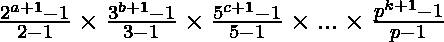

# 给定数组乘积的因子之和

> 原文:[https://www . geeksforgeeks . org/给定阵列的因子之和/](https://www.geeksforgeeks.org/sum-of-factors-of-the-product-of-a-given-array/)

给定一个由正整数 **N** 组成的[数组](https://www.geeksforgeeks.org/array-data-structure/)**arr【】**，任务是找出所有数组元素乘积的[因子之和](https://www.geeksforgeeks.org/sum-factors-number/)。由于输出可以很大，打印出来[模 10 <sup>9</sup> + 7](https://www.geeksforgeeks.org/modulo-1097-1000000007/) 。

**示例:**

> **输入:** arr[] = { 1，2，3，4，5 }
> **输出:** 360
> **解释:**
> 所有数组元素的乘积= 1 * 2 * 3 * 4 * 5 = 120
> 120 的所有因子是{ 1，2，3，4，5，6，8，10，12，15，20，24，30，40，60，120 }
> 
> **输入:** arr[] = { 1，2 }
> **输出:** 3
> **解释:**
> 所有数组元素的乘积= 1 * 2 = 2
> 2 的所有因子都是{ 1，2 }
> 因此，因子之和是 3。

**天真法:**解决这个问题最简单的方法就是[遍历数组](https://www.geeksforgeeks.org/c-program-to-traverse-an-array/)计算数组所有元素的[积，计算得到的积](https://www.geeksforgeeks.org/program-for-product-of-array/)所有因子的[和。但是这种方法的问题是，如果数组元素很大，那么乘积可能会超出](https://www.geeksforgeeks.org/sum-factors-number/)[整数存储容量](https://www.geeksforgeeks.org/what-is-maximum-possible-value-of-an-integer-in-python/)的范围，从而导致错误的输出。
***时间复杂度:** O(max(N，sqrt(数组元素的乘积))*
***辅助空间:** O(N)*

**高效方法:**上述方法可以基于以下观察进行优化:

> 如果数组元素的乘积(P) = 
> 
> 那么 **P** = 的因子之和

按照以下步骤解决问题:

1.  初始化一个整数，比如**和**，来存储数组乘积的所有因子的和。
2.  初始化一个整数数组，比如说 **count[]** ，其中 **count[i]** 以数组元素乘积的形式存储质因数 **i** 的频率。
3.  [遍历阵](https://www.geeksforgeeks.org/iterating-arrays-java/) **计数[]** ，检查**计数【I】**是否大于**零**。如果发现为真，则将**和**乘以 **(i <sup>(计数【I】+1)</sup>)–1**和 **(i -1)** 的乘法倒数
4.  最后，打印在**和**中获得的结果

下面是上述方法的实现:

## C

```
// C program to implement
// the above approach

#include <stdio.h>
#define size 1000100
#define inverse(a) power(a, mod - 2)
typedef long long int ll;
const ll mod = ((ll)(1e9 + 7));

// Stores minimum prime
// factorization of a number
int spf[size] = { 0 };

// Function to add two numbers
static inline ll add(ll a, ll b)
{
    return (a % mod + b % mod) % mod;
}

// Function to subtract two numbers
static inline ll sub(ll a, ll b)
{
    return add(mod, a - b) % mod;
}

// Function to multiply two numbers
static inline ll mul(ll a, ll b)
{
    return (a % mod * b % mod) % mod;
}

// Function to calculate
// x to the power y
ll power(ll x, ll y)
{

    // Stores  x ^ y
    ll res = 1;
    for (res = 1; y > 0;
         x = (x * x) % mod, y >>= 1) {

        // If y is odd
        if (y & 1) {

            // Update result
            res = (res * x) % mod;
        }
    }
    return res;
}

// Function to find the smallest prime factor
// of numbers in the range [1, 1000100]
void sieve()
{

    // Update the smallest prime factor of
    // all the numbers which is divisible by 2
    for (int i = 2; i < size; i += 2) {

        // Update spf[i]
        spf[i] = 2;
    }
    for (int i = 3; i < size; i += 2)
        spf[i] = i;

    // Calculate the smallest prime factor
    // of all the numbers in the range [3, 1000100]
    for (int i = 3; i * i < size; i += 2)
        if (spf[i] == i)
            for (int j = i * i; j < size; j += i)
                spf[j] = i;
}

// Function to find the sum of factors of
// product of all array elements
long long int sumof_factors(int a[], int n)
{

    // Stores the sum of factors of
    // product of all array elements
    ll ans = 1;

    // count[i]: Stores frequency of
    // prime factor i in product of
    // all the array elements
    ll count[size] = { 0 };

    // Traverse the array
    for (int i = 0; i < n; i++) {

        // Calculate the prime factor
        // of a[i]
        while (a[i] > 1) {

            // Update frequency of
            // prime factor spf[a[i]]
            count[spf[a[i]]]++;

            // Update a[i]
            a[i] /= spf[a[i]];
        }
    }

    // Traverse the array, count[]
    for (ll i = 0; i < size; i++)

        // If frequency of prime factor i in
        // product of array elements
        // greater than 0
        if (count[i] > 0) {

            // Calculate (i^(count[i]+1))-1 and
            // multiplicative inverse of (i -1)
            ll num1 = sub(power(i, count[i] + 1), 1);
            ll num2 = inverse(i - 1);
            ans = mul(ans, mul(num1, num2));
        }

    return ans;
}

// Driver Code
int main()
{
    sieve();
    int arr[] = { 1, 3, 2, 5, 4 };
    int N = sizeof(arr) / sizeof(arr[0]);
    ll res = sumof_factors(arr, N);
    printf("%lld\n", res);
    return 0;
}
```

## C++

```
// C++ program to implement
// the above approach

#include <bits/stdc++.h>
using namespace std;

#define size 1000100
#define inverse(a) power(a, mod - 2)

typedef long long int ll;
const ll mod = ((ll)(1e9 + 7));

// Stores minimum prime
// factorization of a number
int spf[size] = { 0 };

// Function to add two numbers
static inline ll add(ll a, ll b)
{
    return (a % mod + b % mod) % mod;
}

// Function to subtract two numbers
static inline ll sub(ll a, ll b)
{
    return add(mod, a - b) % mod;
}

// Function to multiply two numbers
static inline ll mul(ll a, ll b)
{
    return (a % mod * b % mod) % mod;
}

// Function to calculate
// x to the power y
ll power(ll x, ll y)
{

    // Stores  x ^ y
    ll res = 1;
    for (res = 1; y > 0;
         x = (x * x) % mod, y >>= 1) {

        // If y is odd
        if (y & 1) {

            // Update result
            res = (res * x) % mod;
        }
    }
    return res;
}

// Function to find the smallest prime factor
// of numbers in the range [1, 1000100]
void sieve()
{

    // Update the smallest prime factor of
    // all the numbers which is divisible by 2
    for (int i = 2; i < size; i += 2) {

        // Update spf[i]
        spf[i] = 2;
    }
    for (int i = 3; i < size; i += 2)
        spf[i] = i;

    // Calculate the smallest prime factor
    // of all the numbers in the range [3, 1000100]
    for (int i = 3; i * i < size; i += 2)
        if (spf[i] == i)
            for (int j = i * i; j < size; j += i)
                spf[j] = i;
}

// Function to calculate sum of factors
// of product of the given array
long long int sumof_factors(int a[], int n)
{

    // Stores the sum of factors of
    // product of all array elements
    ll ans = 1;

    // count[i]: Stores frequency of
    // prime factor i in product of
    // all the array elements
    ll count[size] = { 0 };

    // Traverse the array
    for (int i = 0; i < n; i++) {

        // Calculate the prime factor
        // of a[i]
        while (a[i] > 1) {

            // Update frequency of
            // prime factor spf[a[i]]
            count[spf[a[i]]]++;

            // Update a[i]
            a[i] /= spf[a[i]];
        }
    }

    // Traverse the array, count[]
    for (ll i = 0; i < size; i++)

        // If frequency of prime factor i in
        // product of array elements
        // greater than 0
        if (count[i] > 0) {

            // Calculate (i^(count[i]+1))-1 and
            // multiplicative inverse of (i -1)
            ll num1 = sub(power(i, count[i] + 1), 1);
            ll num2 = inverse(i - 1);
            ans = mul(ans, mul(num1, num2));
        }

    return ans;
}

// Driver Code
int main()
{
    sieve();
    int arr[] = { 1, 3, 2, 5, 4 };
    int N = sizeof(arr) / sizeof(arr[0]);
    ll res = sumof_factors(arr, N);
    cout << res;
    return 0;
}
```

## Java 语言(一种计算机语言，尤用于创建网站)

```
// Java program to implement
// the above approach

import java.util.HashMap;
import java.util.Map;
class GFG {

    static final long mod = (int)(1e9 + 7);
    static final int size = (int)(1e6 + 100);

    // Function to subtract two numbers
    static final long sub(long a, long b)
    {
        return (mod + a % mod - b % mod) % mod;
    }

    // Function to multiply two numbers
    static final long mul(long a, long b)
    {
        return (a % mod * b % mod) % mod;
    }

    // Function to calculate
    // x to the power y
    static long power(long x, long y)
    {
        // Stores  x ^ y
        long res = 1;
        for (res = 1; y > 0;
             x = (x * x) % mod, y >>= 1) {

            // If y is odd
            if ((y & 1) == 1) {

                // Update result
                res = (res * x) % mod;
            }
        }
        return res;
    }

    // Function to find inverse
    // of a mod 1e9 + 7
    static long inverse(long a)
    {
        return power(a, mod - 2);
    }

    // Stores minimum prime
    // factorization of a number
    static int spf[] = new int[size];

    // Function to find the smallest prime factor
    // of numbers in the range [1, 1000100]
    static void sieve()
    {
        for (int i = 1; i < size; i += 2)
            spf[i] = i;
        for (int i = 2; i < size; i += 2)
            spf[i] = 2;
        for (int i = 3; i * i < size; i += 2)
            if (spf[i] == i)
                for (int j = i * i; j < size; j += i)
                    spf[j] = i;
    }

    // Function to calculate sum of factors
    // of product of the given array
    static long sumof_factors(int a[], int n)
    {

        // Traverse the array
        for (int i = 0; i < n; i++)
            if (a[i] == 0)
                return 0;

        // Stores the sum of factors of
        // product of all array elements
        long ans = 1;

        // count[i]: Stores frequency of
        // prime factor i in product of
        // all the array elements
        Map<Integer, Integer> count
            = new HashMap<Integer, Integer>();

        // Traverse the array
        for (int num : a) {

            // Calculate the prime factor
            // of a[i]
            while (num > 1) {
                int temp = 0;
                try {
                    temp = count.get(spf[num]);
                }
                catch (Exception e) {
                    temp = 0;
                }

                // Update frequency of
                // prime factor spf[a[i]]
                count.put(spf[num], temp + 1);

                // Update num
                num /= spf[num];
            }
        }

        for (Map.Entry<Integer, Integer> i :
             count.entrySet()) {

            // Calculate (i^(count[i]+1))-1 and
            // multiplicative inverse of (i -1)
            long num1 = sub(
                power(i.getKey(), i.getValue() + 1), 1);
            long num2 = inverse(i.getKey() - 1);

            ans = mul(ans, mul(num1, num2));
        }

        return ans;
    }

    // Driver Code
    public static void main(String[] args)
    {
        sieve();
        int n = 5;
        int a[] = { 1, 3, 2, 5, 4 };
        System.out.println(sumof_factors(a, n));
    }
}
```

## 蟒蛇 3

```
# Python program to implement
# the above approach

from collections import defaultdict
from math import sqrt

# Function to find the smallest prime factor
# of numbers in the range [1, 1000100]
def computeSPF(size):

    # Stores smallest prime
    # factorization of a number
    spf = [i for i in range(size)]

    # Update the smallest prime factor of
    # all the numbers which is divisible by 2
    for i in range(2, size, 2):
        spf[i] = 2

    # Calculate the smallest prime factor
    # of all the numbers in the range [3, 1000100]   
    for i in range(3, int(sqrt(size))+1, 2):
        if spf[i] == i:
            for j in range(i * i, size, i):
                spf[j] = i
    return spf

# Function to calculate sum of factors
# of product of the given array
def sumof_factors(a, n, spf, mod):

    # Traverse the array
    if 0 in a:
        return 0
    count = defaultdict(int)

    # Stores the sum of factors of
    # product of all array elements
    ans = 1

    # Traverse the array
    for num in a:

        # Calculate the prime factor
        # of a[i]
        while num > 1:

            # Update frequency of
            # prime factor spf[a[i]]
            count[spf[num]] += 1
            num //= spf[num]

    # Traverse the array, count[] 
    for i in count:
        num1 = pow(i, count[i]+1, mod) - 1
        num2 = pow(i-1, mod-2, mod)
        ans = (ans * num1 * num2) % mod
    return ans

# Driver Code
def main():
    spf = computeSPF(10**6)
    mod = 10**9 + 7
    n = 4
    a = [1, 3, 2, 5]
    ans = sumof_factors(a, n, spf, mod)
    print(ans)

main()
```

## C#

```
// C# program to implement
// the above approach

using System;
using System.Collections.Generic;
class GFG {

    static long mod = (int)(1e9 + 7);
    static int size = (int)(1e6 + 100);

    // Function to subtract two numbers
    static long sub(long a, long b)
    {
        return (mod + a % mod - b % mod) % mod;
    }

    // Function to multiply two numbers
    static long mul(long a, long b)
    {
        return (a % mod * b % mod) % mod;
    }

    // Function to calculate
    // x to the power y
    static long power(long x, long y)
    {
        // Stores  x ^ y
        long res = 1;
        for (res = 1; y > 0; x = (x * x) % mod, y >>= 1) {

            // If y is odd
            if ((y & 1) == 1) {

                // Update result
                res = (res * x) % mod;
            }
        }
        return res;
    }

    // Function to find inverse
    // of a mod 1e9 + 7
    static long inverse(long a)
    {
        return power(a, mod - 2);
    }

    // Stores minimum prime
    // factorization of a number
    static int[] spf = new int[size];

    // Function to find the smallest prime factor
    // of numbers in the range [1, 1000100]
    static void sieve()
    {
        for (int i = 1; i < size; i += 2)
            spf[i] = i;
        for (int i = 2; i < size; i += 2)
            spf[i] = 2;
        for (int i = 3; i * i < size; i += 2)
            if (spf[i] == i)
                for (int j = i * i; j < size; j += i)
                    spf[j] = i;
    }

    // Function to calculate sum of factors
    // of product of the given array
    static long sumof_factors(int[] a, int n)
    {

        // Traverse the array
        for (int i = 0; i < n; i++)
            if (a[i] == 0)
                return 0;

        // Stores the sum of factors of
        // product of all array elements
        long ans = 1;

        // count[i]: Stores frequency of
        // prime factor i in product of
        // all the array elements
        Dictionary<int, int> count
            = new Dictionary<int, int>();

        // Traverse the array
        for (int i = 0; i < a.Length; i++) {

            // Calculate the prime factor
            // of a[i]
            while (a[i] > 1) {
                int temp = 0;

                if (count.ContainsKey(spf[a[i]]))
                    temp = count[spf[a[i]]];

                // Update frequency of
                // prime factor spf[a[i]]
                count[spf[a[i]]] = temp + 1;

                // Update num
                a[i] /= spf[a[i]];
            }
        }

        foreach(KeyValuePair<int, int> i in count)
        {

            // Calculate (i^(count[i]+1))-1 and
            // multiplicative inverse of (i -1)
            long num1 = sub(power(i.Key, i.Value + 1), 1);
            long num2 = inverse(i.Key - 1);

            ans = mul(ans, mul(num1, num2));
        }

        return ans;
    }

    // Driver Code
    public static void Main(string[] args)
    {
        sieve();
        int n = 5;
        int[] a = { 1, 3, 2, 5, 4 };
        Console.WriteLine(sumof_factors(a, n));
    }
}

// This code is contributed by ukasp.
```

**Output:** 

```
360
```

***时间复杂度:**O(N * log(log(N))*
***辅助空间:** O(N)*