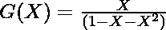
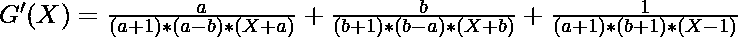
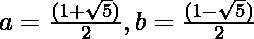
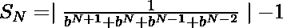

# 斐波那契数之和|集合 2

> 原文:[https://www . geesforgeks . org/Fibonacci-numbers-set-2 之和/](https://www.geeksforgeeks.org/sum-of-fibonacci-numbers-set-2/)

给定一个正数 **N** ，任务是[求第一个(N + 1)斐波那契数](https://www.geeksforgeeks.org/sum-fibonacci-numbers/)的和。

**示例:**

> **输入:** N = 3
> **输出:** 4
> **解释:**
> 斐波那契数列的前 4 项是{0，1，1，2}。因此，所需的总和= 0 + 1 + 1 + 2 = 4。
> 
> **输入:**N = 4
> T3】输出: 7

**幼稚的做法:**最简单的解决问题的方法，参考本文[之前的帖子](https://www.geeksforgeeks.org/sum-fibonacci-numbers/)。
***时间复杂度:** O(N)*
***辅助空间:** O(1)*

**有效方法:**上述方法可以通过以下观察和计算进行优化:

让 **S(N)** 代表斐波那契数列的前 **N** 项之和。现在，为了简单地找到 **S(N)** ，[计算第(N + 2) <sup>个</sup>斐波那契数](https://www.geeksforgeeks.org/program-for-nth-fibonacci-number/)，并从结果中减去 **1** 。本系列的 **N <sup>第</sup>项**可由下式计算:

> 

现在 **S(N)** 的值可以通过**(F<sub>N+2</sub>–1)**来计算。

因此，想法是使用上面的公式计算**S<sub>N</sub>T3 的值:**

下面是上述方法的实现:

## C++

```
// C++ program for the above approach
#include <bits/stdc++.h>
using namespace std;

// Function to find the sum of
// first N + 1 fibonacci numbers
void sumFib(int N)
{

    // Apply the formula
    long num = (long)round(pow((sqrt(5) + 1)
                               / 2.0, N + 2)
                           / sqrt(5));

    // Print the result
    cout << (num - 1);
}

// Driver Code
int main()
{
    int N = 3;
    sumFib(N);
    return 0;
}

// This code is contributed by Dharanendra L V.
```

## Java 语言(一种计算机语言，尤用于创建网站)

```
// Java program for the above approach
import java.io.*;

class GFG {

    // Function to find the sum of
    // first N + 1 fibonacci numbers
    public static void sumFib(int N)
    {
        // Apply the formula
        long num = (long)Math.round(
            Math.pow((Math.sqrt(5) + 1)
                         / 2.0,
                     N + 2)
            / Math.sqrt(5));

        // Print the result
        System.out.println(num - 1);
    }

    // Driver Code
    public static void main(String[] args)
    {
        int N = 3;
        sumFib(N);
    }
}
```

## 蟒蛇 3

```
# Python program for the above approach
import math

# Function to find the sum of
# first N + 1 fibonacci numbers
def sumFib(N):

    # Apply the formula
    num = round(pow((pow(5,1/2) + 1) \
                    / 2.0, N + 2) \
                / pow(5,1/2));

    # Print the result
    print(num - 1);

# Driver Code
if __name__ == '__main__':
    N = 3;
    sumFib(N);

# This code is contributed by 29AjayKumar
```

## C#

```
// C# program for the above approach
using System;
class GFG
{

    // Function to find the sum of
    // first N + 1 fibonacci numbers
    public static void sumFib(int N)
    {
        // Apply the formula
        long num = (long)Math.Round(
            Math.Pow((Math.Sqrt(5) + 1)
                         / 2.0,
                     N + 2)
            / Math.Sqrt(5));

        // Print the result
        Console.WriteLine(num - 1);
    }

// Driver Code
static public void Main()
{
        int N = 3;
        sumFib(N);
}
}

// This code is contributed by jana_sayantan.
```

## java 描述语言

```
<script>

// Javascript program for the above approach

    // Function to find the sum of
    // first N + 1 fibonacci numbers
    function sumFib(N)
    {
        // Apply the formula
        var num =  Math.round(Math.pow((Math.sqrt(5) + 1)
        / 2.0, N + 2) / Math.sqrt(5));

        // Print the result
        document.write(num - 1);
    }

    // Driver Code

        var N = 3;
        sumFib(N);

// This code contributed by umadevi9616

</script>
```

**Output:** 

```
4
```

***时间复杂度:**O(1)*
T5**辅助空间:** O(1)

**替代方法:**按照以下步骤解决问题:

*   第 **N <sup>个</sup>斐波那契数**也可以使用[生成函数](https://www.geeksforgeeks.org/discrete-maths-generating-functions-introduction-prerequisites/)来计算。
*   第 **N <sup>个</sup>斐波那契数**的生成函数由下式给出:

> 

*   因此，斐波那契数之和的生成函数由下式给出:

> 

*   **G’(X)**部分分数分解后，G’(X)的值由下式给出:

> 
> 
> 其中，
> 

*   因此，斐波那契数之和的公式如下:

> 

下面是上述方法的实现:

## C++

```
// C++  program for the above approach
#include <bits/stdc++.h>
using namespace std;

// Function to find the sum of
// first N + 1 fibonacci numbers
void sumFib(int N)
{

  // Apply the formula
  double num = (1 - sqrt(5)) / 2;

  long val = round(
    abs(1
        / (pow(num, N + 2)
           + pow(num, N + 1)
           + pow(num, N)
           + pow(num, N - 1)))
    - 1);

  // Print the result
  cout<<val;
}

// Driver Code
int main()
{
    int N = 3;

      // Function Call
    sumFib(N);
}

// This code is contributed by 29AjayKumar
```

## Java 语言(一种计算机语言，尤用于创建网站)

```
// Java program for the above approach
import java.io.*;

class GFG {

    // Function to find the sum of
    // first N + 1 fibonacci numbers
    public static void sumFib(int N)
    {
        // Apply the formula
        double num = (1 - Math.sqrt(5)) / 2;

        long val = Math.round(
            Math.abs(1
                     / (Math.pow(num, N + 2)
                        + Math.pow(num, N + 1)
                        + Math.pow(num, N)
                        + Math.pow(num, N - 1)))
            - 1);

        // Print the result
        System.out.println(val);
    }

    // Driver Code
    public static void main(String[] args)
    {
        int N = 3;

        // Function Call
        sumFib(N);
    }
}
```

## 蟒蛇 3

```
# Pyhton3 program for the above approach
import math

# Function to find the sum of
# first N + 1 fibonacci numbers
def sumFib(N):

    # Apply the formula
    num = (1 - math.sqrt(5)) / 2

    val = round(abs(1 / (pow(num, N + 2) +
                         pow(num, N + 1) +
                         pow(num, N) +
                         pow(num, N - 1))) - 1)

    # Print the result
    print(val)

# Driver Code
if __name__ == '__main__':

    N = 3

    # Function Call
    sumFib(N)

# This code is contributed by Surbhi Tyagi.
```

## C#

```
// C# program for the above approach

using System;

public class GFG {

    // Function to find the sum of
    // first N + 1 fibonacci numbers
    public static void sumFib(int N)
    {
        // Apply the formula
        double num = (1 - Math.Sqrt(5)) / 2;

        double val = Math.Round(
            Math.Abs(1
                     / (Math.Pow(num, N + 2)
                        + Math.Pow(num, N + 1)
                        + Math.Pow(num, N)
                        + Math.Pow(num, N - 1)))
            - 1);

        // Print the result
        Console.WriteLine(val);
    }

    // Driver Code
    public static void Main(String[] args)
    {
        int N = 3;

        // Function Call
        sumFib(N);
    }
}

// This code is contributed by 29AjayKumar
```

## java 描述语言

```
<script>

// Javascript program for the above approach

    // Function to find the sum of
    // first N + 1 fibonacci numbers
    function sumFib(N) {
        // Apply the formula
        var num = ((1 - Math.sqrt(5)) / 2);

        var val = Math.round(
            Math.abs(1
                     / (Math.pow(num, N + 2)
                        + Math.pow(num, N + 1)
                        + Math.pow(num, N)
                        + Math.pow(num, N - 1)))
            - 1);

        // Print the result
        document.write(val);
    }

    // Driver Code

        var N = 3;

        // Function Call
        sumFib(N);

// This code is contributed by todaysgaurav

</script>
```

**Output:** 

```
4
```

***时间复杂度:**O(1)*
T5**辅助空间:** O(1)