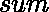

# 不是 K 的幂的前 N 个自然数之和

> 原文:[https://www . geeksforgeeks . org/第一 n 个自然数之和-不是 k 的幂/](https://www.geeksforgeeks.org/sum-of-first-n-natural-numbers-which-are-not-powers-of-k/)

给定两个整数和，任务是求**【1，n】**范围内所有数字的和，不包括 **k** 的正幂的数字，即数字 **k，k <sup>2</sup> ，k <sup>3</sup> 等等**。
**示例:**

> **输入:** n = 10，k = 3
> **输出:**43
> 1+2+4+5+6+7+8+10 = 43
> 3 和 9 不包括在内，因为它们是 3 的幂
> **输入:** n = 11，k = 2
> **输出:** 52

**进场:**

*   将第一个自然数的和存储在变量中，即**和= (n * (n + 1)) / 2** 。
*   现在对于每一个小于 T1 的 T0 的正幂，从 T2 中减去它。
*   最后打印变量的值。

以下是上述方法的实现:

## C++

```
// C++ program to find the sum of
// first n natural numbers which are
// not positive powers of k
#include <bits/stdc++.h>
using namespace std;

// Function to return the sum of
// first n natural numbers which are
// not positive powers of k
int find_sum(int n, int k)
{
    // sum of first n natural numbers
    int total_sum = (n * (n + 1)) / 2;

    int power = k;
    while (power <= n) {

        // subtract all positive powers
        // of k which are less than n
        total_sum -= power;

        // next power of k
        power *= k;
    }

    return total_sum;
}

// Driver code
int main()
{
    int n = 11, k = 2;

    cout << find_sum(n, k);

    return 0;
}
```

## Java 语言(一种计算机语言，尤用于创建网站)

```
// Java program to find the sum of
// first n natural numbers which are
// not positive powers of k
import java.io.*;

class GFG {

// Function to return the sum of
// first n natural numbers which are
// not positive powers of k
static int find_sum(int n, int k)
{
    // sum of first n natural numbers
    int total_sum = (n * (n + 1)) / 2;

    int power = k;
    while (power <= n) {

        // subtract all positive powers
        // of k which are less than n
        total_sum -= power;

        // next power of k
        power *= k;
    }

    return total_sum;
}

// Driver code

    public static void main (String[] args) {
        int n = 11, k = 2;

    System.out.println(find_sum(n, k));
    }
}
// This code is contributed by inder_verma..
```

## 蟒蛇 3

```
# Python 3 program to find the sum of
# first n natural numbers which are
# not positive powers of k

# Function to return the sum of
# first n natural numbers which are
# not positive powers of k
def find_sum(n, k):

    # sum of first n natural numbers
    total_sum = (n * (n + 1)) // 2
    power = k
    while power <= n:

        # subtract all positive powers
        # of k which are less than n
        total_sum -= power

        # next power of k
        power *= k
    return total_sum

# Driver code
n = 11; k = 2
print(find_sum(n, k))

# This code is contributed
# by Shrikant13
```

## C#

```
// C# program to find the sum of
// first n natural numbers which are
// not positive powers of k
using System;

class GFG {

// Function to return the sum of
// first n natural numbers which are
// not positive powers of k
static int find_sum(int n, int k)
{
    // sum of first n natural numbers
    int total_sum = (n * (n + 1)) / 2;

    int power = k;
    while (power <= n) {

        // subtract all positive powers
        // of k which are less than n
        total_sum -= power;

        // next power of k
        power *= k;
    }

    return total_sum;
}

// Driver code

    public static void Main () {
        int n = 11, k = 2;

    Console.WriteLine(find_sum(n, k));
    }
}
// This code is contributed by inder_verma..
```

## 服务器端编程语言（Professional Hypertext Preprocessor 的缩写）

```
<?php
// PHP program to find the sum of
// first n natural numbers which are
// not positive powers of k

// Function to return the sum of
// first n natural numbers which are
// not positive powers of k
function find_sum($n, $k)
{
    // sum of first n natural numbers
    $total_sum = ($n * ($n + 1)) / 2;

    $power = $k;
    while ($power <= $n)
    {

        // subtract all positive powers
        // of k which are less than n
        $total_sum -= $power;

        // next power of k
        $power *= $k;
    }

    return $total_sum;
}

// Driver code
$n = 11; $k = 2;

echo find_sum($n, $k);

// This code is contributed by inder_verma..
?>
```

## java 描述语言

```
<script>

// Javascript program to find the sum of
// first n natural numbers which are
// not positive powers of k

// Function to return the sum of
// first n natural numbers which are
// not positive powers of k
function find_sum(n, k)
{
    // sum of first n natural numbers
    let total_sum = (n * (n + 1)) / 2;

    let power = k;
    while (power <= n) {

        // subtract all positive powers
        // of k which are less than n
        total_sum -= power;

        // next power of k
        power *= k;
    }

    return total_sum;
}

// Driver code
    let n = 11, k = 2;

    document.write(find_sum(n, k));

// This code is contributed by Mayank Tyagi

</script>
```

**Output:** 

```
52
```