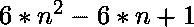
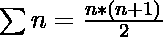
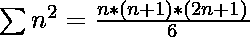
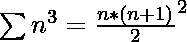
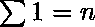
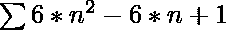
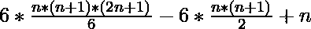
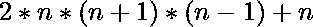

# 前 N 个星号之和

> 原文:[https://www.geeksforgeeks.org/sum-of-first-n-star-numbers/](https://www.geeksforgeeks.org/sum-of-first-n-star-numbers/)

给定一个数字 **N** ，任务是找出前 N 个[星号](https://www.geeksforgeeks.org/program-to-find-star-number/)的和。
前几个星号是 **1，13，37，73，..**
**示例:**

> **输入:** N = 2
> **输出:** 14
> **说明:**
> 1、13 是前两个星号。
> **输入:** N = 3
> **输出:** 51

**进场 1:**

1.  第 N <sup>个</sup>星号给出为
2.  运行一个从 1 到 N 的循环，找到前 N 个星号。
3.  将以上计算出的所有星号相加。
4.  返回总和。

以下是上述方法的实现:

## C++

```
// C++ program to find the sum of
// the first N Star Number
#include <bits/stdc++.h>
using namespace std;

// Function to find the N-th
// Star Number
int star_num(int n)
{

    // Formula to calculate nth
    // Star Number
    return (6 * n * n - 6 * n + 1);
}

// Function to find the sum of the
// first N Star Number
int sum_star_num(int n)
{

    // Variable to store the sum
    int summ = 0;

    // Iterating from 1 to N
    for(int i = 1; i < n + 1; i++)
    {

        // Finding the sum
        summ += star_num(i);
    }
    return summ;
}

// Driver code
int main()
{
    int n = 3;

    cout << sum_star_num(n);
}

// This code is contributed by spp____
```

## Java 语言(一种计算机语言，尤用于创建网站)

```
// Java program to find the sum of
// the first N Star Number
class GFG{

// Function to find the N-th
// Star Number
static int star_num(int n)
{

    // Formula to calculate nth
    // Star Number
    return (6 * n * n - 6 * n + 1);
}

// Function to find the sum of the
// first N Star Number
static int sum_star_num(int n)
{

    // Variable to store the sum
    int summ = 0;

    // Iterating from 1 to N
    for(int i = 1; i < n + 1; i++)
    {

        // Finding the sum
        summ += star_num(i);
    }
    return summ;
}

// Driver code
public static void main(String[] args)
{
    int n = 3;

    System.out.println(sum_star_num(n));
}
}

// This code is contributed by rock_cool
```

## 蟒蛇 3

```
# Python3 program to find the
# sum of the first N 
# star numbers

# Function to find the
# N-th star
# number
def star_num(n):

    # Formula to calculate 
    # nth star
    # number
    return (6 * n * n - 6 * n + 1)

# Function to find the sum of
# the first N star numbers
def sum_star_num(n) :

    # Variable to store
    # the sum
    summ = 0

    # Iterating in the range
    # 1 to N
    for i in range(1, n + 1):
        summ += star_num(i)

    return summ

# Driver code
n = 3
print(sum_star_num(n))
```

## C#

```
// C# program to find the sum of
// the first N Star Number
using System;
class GFG{

// Function to find the N-th
// Star Number
static int star_num(int n)
{

    // Formula to calculate nth
    // Star Number
    return (6 * n * n - 6 * n + 1);
}

// Function to find the sum of the
// first N Star Number
static int sum_star_num(int n)
{

    // Variable to store the sum
    int summ = 0;

    // Iterating from 1 to N
    for(int i = 1; i < n + 1; i++)
    {

        // Finding the sum
        summ += star_num(i);
    }
    return summ;
}

// Driver code
public static void Main(String[] args)
{
    int n = 3;

    Console.WriteLine(sum_star_num(n));
}
}

// This code is contributed by gauravrajput1
```

## java 描述语言

```
<script>

    // Javascript program to find the sum of    
    // the first N Star Number

    // Function to find the N-th
    // Star Number
    function star_num(n)
    {

        // Formula to calculate nth
        // Star Number
        return (6 * n * n - 6 * n + 1);
    }

    // Function to find the sum of the
    // first N Star Number
    function sum_star_num(n)
    {

        // Variable to store the sum
        let summ = 0;

        // Iterating from 1 to N
        for(let i = 1; i < n + 1; i++)
        {

            // Finding the sum
            summ += star_num(i);
        }
        return summ;
    }

    let n = 3;

    document.write(sum_star_num(n));

</script>
```

**Output:** 

```
51
```

***时间复杂度:** O(N)。*
**高效方法:**

*   我们已经知道、、和
*   第 N <sup>个</sup>星号给出为
*   所以，前 N 个星号之和为
    之和= 
    之和= 
    之和= 
*   计算总和并返回。

以下是上述方法的实现:

## C++

```
// C++ program to find the
// sum of the first N
// star numbers
#include <bits/stdc++.h>

using namespace std;

// Function to find the
// sum of the first N
// star number
int sum_star_num(int n)
{

    // Variable to store
    // the sum
    int summ = 2 * n * (n + 1) * (n - 1) + n;

    return summ;
}

// Driver code
int main()
{
    int n = 3;

    cout << sum_star_num(n);
    return 0;
}

// This code is contributed by Amit Katiyar
```

## Java 语言(一种计算机语言，尤用于创建网站)

```
// Java program to find the
// sum of the first N 
// star numbers
class GFG{

    // Function to find the
    // sum of the first N
    // star number
    static int sum_star_num(int n)
    {

        // Variable to store
        // the sum
        int summ = 2 * n * (n + 1) * (n - 1) + n;

        return summ;
    }

    // Driver code
    public static void main(String[] args)
    {
        int n = 3;
        System.out.println(sum_star_num(n));
    }
}

// This code is contributed by PrinciRaj1992
```

## 蟒蛇 3

```
# Python3 program to find the
# sum of the first N 
# star numbers

# Function to find the
# sum of the first N
# star number
def sum_star_num(n) :

    # Variable to store
    # the sum
    summ = 2 * n*(n + 1)*(n-1) + n

    return summ

# Driver code
n = 3
print(sum_star_num(n))
```

## C#

```
// C# program to find the
// sum of the first N
// star numbers
using System;

class GFG{

// Function to find the
// sum of the first N
// star number
static int sum_star_num(int n)
{

    // Variable to store
    // the sum
    int summ = 2 * n * (n + 1) * (n - 1) + n;

    return summ;
}

// Driver code
public static void Main(String[] args)
{
    int n = 3;

    Console.WriteLine(sum_star_num(n));
}
}

// This code is contributed by PrinciRaj1992
```

## java 描述语言

```
<script>
// Javascript program to find the
// sum of the first N
// star numbers

// Function to find the
// sum of the first N
// star number
function sum_star_num(n)
{

    // Variable to store
    // the sum
    let summ = 2 * n * (n + 1) * (n - 1) + n;

    return summ;
}

// Driver code
let n = 3;

document.write(sum_star_num(n));

// This code is contributed by rishavmahato348.
</script>
```

**Output:** 

```
51
```

***时间复杂度:** O(1)。*