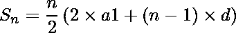
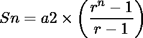
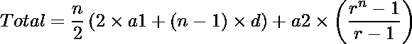

# 给定数列 3，6，11，…的前 n 项之和..

> 原文:[https://www . geesforgeks . org/给定系列的第一个 n 项之和-3-6-11/](https://www.geeksforgeeks.org/sum-of-first-n-terms-of-a-given-series-3-6-11/)

给定一个数列和一个数 n，任务是求其前 n 项的和。下面是系列:

> 3, 6, 11, 20, ….

**例:**

```
Input: N = 2
Output: 9
The sum of first 2 terms of Series is
3 + 6 = 9

Input: N = 3
Output: 20
The sum of first 3 terms of Series is
3 + 6 + 11 = 20
```

**方法:**通过观察级数的第 n 项:
可以很容易地解决这个问题

> sn = 3+6+11+20……+第 n 项
> sn =(1+2^1)+(2+2^2)+(3+2^3)+(4+2^4)……+第 n 项
> sn =(1+2+3+4……。+至第 n 期)+ ( 2^1 + 2^2 + 2^3 …… +至第 n 期)

我们观察到 Sn 是两个系列的总和: **AP 和 GP**
正如我们所知，AP 的前 n 项之和由下式给出



并且前 n 项的和由下式给出



因此，总和由 AP 和 GP 的总和给出。



下面是上述方法的实现。

## C++

```
// C++ program to find sum of first n terms
#include <bits/stdc++.h>
using namespace std;

// Function to calculate the sum
int calculateSum(int n)
{
    // starting number
    int a1 = 1, a2 = 2;

    // Common Ratio
    int r = 2;

    // Common difference
    int d = 1;

    return (n) * (2 * a1 + (n - 1) * d) / 2 + a2
               * (pow(r, n) - 1) / (r - 1);
}

// Driver code
int main()
{

    // N th term to be find
    int n = 5;

    // find the Sn
    cout << "Sum = " << calculateSum(n);

    return 0;
}
```

## Java 语言(一种计算机语言，尤用于创建网站)

```
// Java program to find sum of first n terms

import java.io.*;

class GFG {

// Function to calculate the sum
static int calculateSum(int n)
{
    // starting number
    int a1 = 1, a2 = 2;

    // Common Ratio
    int r = 2;

    // Common difference
    int d = 1;

    return (n) * (2 * a1 + (n - 1) * d) / 2 + a2
            * (int)(Math.pow(r, n) - 1) / (r - 1);
}

// Driver code
    public static void main (String[] args) {
        // N th term to be find
    int n = 5;

    // find the Sn
    System.out.print( "Sum = " + calculateSum(n));
    }
}
// This code is contributed by inder_verma.
```

## 蟒蛇 3

```
# Python3 program to find
# sum of first n terms
def calculateSum(n):
    # First term of AP
    a1 = 1;

    # First term of GP
    a2 = 2;

    # common ratio of GP
    r = 2;

    # common difference Of AP
    d = 1;
    return ((n) * (2 * a1 + (n - 1) * d) /
                   2 + a2 * (pow(r, n) - 1) /
                  (r - 1));

# Driver Code

# no. of the terms
# for the sum
n = 5;

# Find the Sn
print ("Sum =", int(calculateSum(n)))

# This code is contributed
# by Surendra_Gangwar
```

## C#

```
// C# program to find sum
// of first n terms
using System;

class GFG
{

// Function to calculate the sum
static int calculateSum(int n)
{
    // starting number
    int a1 = 1, a2 = 2;

    // Common Ratio
    int r = 2;

    // Common difference
    int d = 1;

    return (n) * (2 * a1 + (n - 1) * d) / 2 + a2 *
             (int)(Math.Pow(r, n) - 1) / (r - 1);
}

// Driver code
public static void Main ()
{
    // N th term to be find
    int n = 5;

    // find the Sn
    Console.WriteLine("Sum = " + calculateSum(n));
}
}

// This code is contributed
// by inder_verma
```

## 服务器端编程语言（Professional Hypertext Preprocessor 的缩写）

```
<?php
// PHP program to find sum of first n terms

// Function to calculate the sum
function calculateSum($n)
{
    // starting number
    $a1 = 1;
    $a2 = 2;

    // Common Ratio
    $r = 2;

    // Common difference
    $d = 1;

    return ($n) * (2 * $a1 + ($n - 1) * $d) / 2 +
            $a2 * (pow($r, $n) - 1) / ($r - 1);
}

// Driver code

// Nth term to be find
$n = 5;

// find the Sn
echo "Sum = ", calculateSum($n);

// This code is contributed
// by Shashank_Sharma
?>
```

## java 描述语言

```
<script>

// Javascript program to find sum of first n terms
// Function to calculate the sum

function calculateSum(n)
{
    // starting number
    let a1 = 1, a2 = 2;

    // Common Ratio
    let r = 2;

    // Common difference
    let d = 1;

    return (n) * (2 * a1 + (n - 1) * d) / 2 + a2
            * (Math.pow(r, n) - 1) / (r - 1);
}

// Driver code

    // N th term to be find
    let n = 5;

    // find the Sn
    document.write("Sum = " + calculateSum(n));

// This code is contributed by Mayank Tyagi

</script>
```

**Output:** 

```
Sum = 77
```