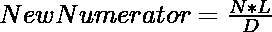

# 给定 N 个简化形式分数的和

> 原文:[https://www . geeksforgeeks . org/给定 n 个简化形式分数之和/](https://www.geeksforgeeks.org/sum-of-given-n-fractions-in-reduced-form/)

给定两个长度为 **N** 的[数组](https://www.geeksforgeeks.org/introduction-to-arrays/) **arr1[]** 和 **arr2[]** ，它们分别包含 **N** 分数的分子和分母，任务是以简化形式找到给定的 **N 个分数**的和。

**示例:**

> **输入:** arr1[] = { 1，2，5 }，arr2[] = { 2，1，6 }
> **输出:** 10/3
> 
> **输入:** arr1[] = { 1，1 } arr2[] = { 2，2 }
> T3】输出: 1/1

**进场:**

*   查找存储在**arr 2【】**中的所有分母的[最小公倍数(LCM)](https://www.geeksforgeeks.org/program-to-find-lcm-of-two-numbers/) 。
*   将存储在 **arr1[]** 中的每个分数的分子更改为:

> 设 L 为所有分母(比如 **L** )的合成 LCM，分数的分子和分母分别为 N 和 D。
> 则每个分子的值必须改为:
> 
> 

*   求上述步骤后形成的新分子(比如 **sumN** )之和。
*   将 **sumL** 和 **L** 除以 **sumL 和 L** 的 GCD，得到简化形式的结果分数。

下面是上述方法的实现:

## C++

```
// C++ program for the above approach
#include <bits/stdc++.h>
using namespace std;

// Function to find  GCD of a & b
// using Euclid Lemma
int gcd(int a, int b)
{
    // Base Case
    if (b == 0) {
        return a;
    }

    return gcd(b, a % b);
}

// Function to find the LCM of all
// elements in arr[]
int findlcm(int arr[], int n)
{
    // Initialize result
    int ans = arr[0];

    // Iterate arr[] to find LCM
    for (int i = 1; i < n; i++) {
        ans = (((arr[i] * ans)) / (gcd(arr[i], ans)));
    }

    // Return the final LCM
    return ans;
}

// Function to find the sum of N
// fraction in reduced form
void addReduce(int n, int num[],
               int den[])
{

    // To store the sum of all
    // final numerators
    int final_numerator = 0;

    // Find the LCM of all denominator
    int final_denominator = findlcm(den, n);

    // Find the sum of all N
    // numerators & denominators
    for (int i = 0; i < n; i++) {

        // Add each fraction one by one
        final_numerator = final_numerator
                          + (num[i]) * (final_denominator
                                        / den[i]);
    }

    // Find GCD of final numerator and
    // denominator
    int GCD = gcd(final_numerator,
                  final_denominator);

    // Convert into reduced form
    // by dividing from GCD
    final_numerator /= GCD;
    final_denominator /= GCD;

    // Print the final fraction
    cout << final_numerator
         << "/"
         << final_denominator
         << endl;
}

// Driven Code
int main()
{
    // Given N
    int N = 3;

    // Given Numerator
    int arr1[] = { 1, 2, 5 };

    // Given Denominator
    int arr2[] = { 2, 1, 6 };

    // Function Call
    addReduce(N, arr1, arr2);
    return 0;
}
```

## Java 语言(一种计算机语言，尤用于创建网站)

```
// Java program for the above approach
import java.util.*;

class GFG{

// Function to find GCD of a & b
// using Euclid Lemma
static int gcd(int a, int b)
{

    // Base case
    if (b == 0)
    {
        return a;
    }

    return gcd(b, a % b);
}

// Function to find the LCM of all
// elements in arr[]
static int findlcm(int arr[], int n)
{

    // Initialize result
    int ans = arr[0];

    // Iterate arr[] to find LCM
    for(int i = 1; i < n; i++)
    {
        ans = (((arr[i] * ans)) /
             (gcd(arr[i], ans)));
    }

    // Return the final LCM
    return ans;
}

// Function to find the sum of N
// fraction in reduced form
static void addReduce(int n, int num[],
                             int den[])
{

    // To store the sum of all
    // final numerators
    int final_numerator = 0;

    // Find the LCM of all denominator
    int final_denominator = findlcm(den, n);

    // Find the sum of all N
    // numerators & denominators
    for(int i = 0; i < n; i++)
    {

        // Add each fraction one by one
        final_numerator = final_numerator + (num[i]) *
                         (final_denominator / den[i]);
    }

    // Find GCD of final numerator and
    // denominator
    int GCD = gcd(final_numerator,
                  final_denominator);

    // Convert into reduced form
    // by dividing from GCD
    final_numerator /= GCD;
    final_denominator /= GCD;

    // Print the final fraction
    System.out.println(final_numerator + "/" +
                       final_denominator);
}

// Driver code
public static void main(String[] args)
{

    // Given N
    int N = 3;

    // Given numerator
    int arr1[] = { 1, 2, 5 };

    // Given denominator
    int arr2[] = { 2, 1, 6 };

    // Function call
    addReduce(N, arr1, arr2);
}
}

// This code is contributed by offbeat
```

## 蟒蛇 3

```
# Python3 program for the above approach

# Function to find  GCD of a & b
# using Euclid Lemma
def gcd(a, b):

    # Base Case
    if (b == 0):
        return a

    return gcd(b, a % b)

# Function to find the LCM of all
# elements in arr[]
def findlcm(arr, n):

    # Initialize result
    ans = arr[0]

    # Iterate arr[] to find LCM
    for i in range(1, n):
        ans = (((arr[i] * ans)) //
            (gcd(arr[i], ans)))

    # Return the final LCM
    return ans

# Function to find the sum of N
# fraction in reduced form
def addReduce(n, num, den):

    # To store the sum of all
    # final numerators
    final_numerator = 0

    # Find the LCM of all denominator
    final_denominator = findlcm(den, n)

    # Find the sum of all N
    # numerators & denominators
    for i in range(n):

        # Add each fraction one by one
        final_numerator = (final_numerator +
                          (num[i]) * (final_denominator //
                           den[i]))

    # Find GCD of final numerator and
    # denominator
    GCD = gcd(final_numerator,
              final_denominator)

    # Convert into reduced form
    # by dividing from GCD
    final_numerator //= GCD
    final_denominator //= GCD

    # Print the final fraction
    print(final_numerator, "/",
          final_denominator)

# Driver Code

# Given N
N = 3

# Given Numerator
arr1 = [ 1, 2, 5 ]

# Given Denominator
arr2 = [ 2, 1, 6 ]

# Function call
addReduce(N, arr1, arr2)

# This code is contributed by code_hunt
```

## C#

```
// C# program for the above approach
using System;
class GFG{

// Function to find GCD of a & b
// using Euclid Lemma
static int gcd(int a, int b)
{

    // Base case
    if (b == 0)
    {
        return a;
    }

    return gcd(b, a % b);
}

// Function to find the LCM of all
// elements in arr[]
static int findlcm(int []arr, int n)
{

    // Initialize result
    int ans = arr[0];

    // Iterate arr[] to find LCM
    for(int i = 1; i < n; i++)
    {
        ans = (((arr[i] * ans)) /
             (gcd(arr[i], ans)));
    }

    // Return the final LCM
    return ans;
}

// Function to find the sum of N
// fraction in reduced form
static void addReduce(int n, int []num,
                             int []den)
{

    // To store the sum of all
    // final numerators
    int final_numerator = 0;

    // Find the LCM of all denominator
    int final_denominator = findlcm(den, n);

    // Find the sum of all N
    // numerators & denominators
    for(int i = 0; i < n; i++)
    {

        // Add each fraction one by one
        final_numerator = final_numerator + (num[i]) *
                         (final_denominator / den[i]);
    }

    // Find GCD of final numerator and
    // denominator
    int GCD = gcd(final_numerator,
                  final_denominator);

    // Convert into reduced form
    // by dividing from GCD
    final_numerator /= GCD;
    final_denominator /= GCD;

    // Print the final fraction
    Console.Write(final_numerator + "/" +
                  final_denominator);
}

// Driver code
public static void Main(string[] args)
{

    // Given N
    int N = 3;

    // Given numerator
    int []arr1 = { 1, 2, 5 };

    // Given denominator
    int []arr2 = { 2, 1, 6 };

    // Function call
    addReduce(N, arr1, arr2);
}
}

// This code is contributed by Ritik Bansal
```

## java 描述语言

```
<script>

// Javascript program for the above approach

// Function to find  GCD of a & b
// using Euclid Lemma
function gcd( a, b)
{
    // Base Case
    if (b == 0) {
        return a;
    }

    return gcd(b, a % b);
}

// Function to find the LCM of all
// elements in arr[]
function findlcm( arr,  n)
{
    // Initialize result
    var ans = arr[0];

    // Iterate arr[] to find LCM
    for (var i = 1; i < n; i++) {
        ans = (((arr[i] * ans)) / (gcd(arr[i], ans)));
    }

    // Return the final LCM
    return ans;
}

// Function to find the sum of N
// fraction in reduced form
function addReduce(n, num, den)
{

    // To store the sum of all
    // final numerators
    var final_numerator = 0;

    // Find the LCM of all denominator
    var final_denominator = findlcm(den, n);

    // Find the sum of all N
    // numerators & denominators
    for (var i = 0; i < n; i++) {

        // Add each fraction one by one
        final_numerator = final_numerator
                          + (num[i]) * parseInt(final_denominator
                                        / den[i]);
    }

    // Find GCD of final numerator and
    // denominator
    var GCD = gcd(final_numerator,
                  final_denominator);

    // Convert into reduced form
    // by dividing from GCD
    final_numerator = parseInt(final_numerator / GCD);
    final_denominator = parseInt(final_denominator / GCD);

    // Print the final fraction
    document.write( final_numerator
        + "/"
         + final_denominator
         + "<br>");
}

// Driven Code
// Given N
var N = 3;

// Given Numerator
var arr1 = [ 1, 2, 5 ];

// Given Denominator
var arr2 = [ 2, 1, 6 ];

// Function Call
addReduce(N, arr1, arr2);

// This code is contributed by noob2000.
</script>
```

**Output:** 

```
10/3
```