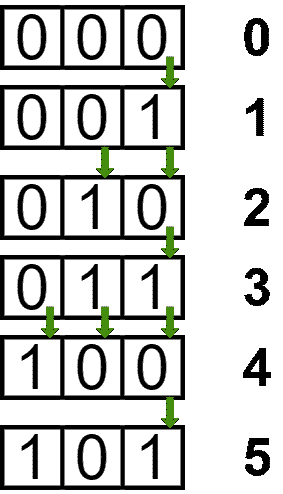

# 0 到 N 连续数的汉明差之和|集合 2

> 原文:[https://www . geesforgeks . org/从 0 到 n-set-2 的连续数字汉明差之和/](https://www.geeksforgeeks.org/sum-of-hamming-difference-of-consecutive-numbers-from-0-to-n-set-2/)

给定一个数 **N** ，任务是求从 0 到 N 的连续数的汉明差之和

> [两个整数之间的汉明距离](https://www.geeksforgeeks.org/hamming-distance-between-two-integers/)是两个数中相同位置不同的位数。

**例:**

> **输入:** 5
> **输出:** 8
> **解释:**
> 差(0，1) = 1，(1，2) = 2，
> (2，3) = 1，(3，4) = 3，(4，5) = 1。
> 所以总和为 1 + 2 + 1 + 3 + 1 = 8
> **输入:** 9
> **输出:** 16

**天真和对数法:**参考[从 0 到 N 的数的位差之和](https://www.geeksforgeeks.org/sum-of-bit-differences-for-numbers-from-0-to-n/)对于天真法和对数法，基于检查 **N** 是否为 **2** 的幂来计算和。
**方法:**本文讨论了一种基于观察从 LSB 到 MSB 的所有位中发生的变化数量的方法。
按照以下步骤解决问题:

*   可以观察到**最低有效位**将改变 **N** 次。第二个最低有效位将改变**楼层(N/2)** 次(即如果 **N** 为奇数，则**(N–1)/2**；如果 N 为偶数，则为 N/2)。因此，i <sup>第</sup>位将改变楼层(N/2 <sup>i</sup> )次。



*   因此，为了解决这个问题，我们可以简单地存储总和

> N +楼层(N/2) + …楼层(N/2 <sup>i</sup> )

*   直到该项不为零。

以下是上述方法的实现:

## C++

```
// C++ Program to implement
// the above approach

#include <bits/stdc++.h>
using namespace std;

// Function to calculate and
// return the hamming distance
// between all consecutive
// numbers from 0 to N
int TotalHammingDistance(int n)
{
    int i = 1, sum = 0;
    while (n / i > 0) {
        sum = sum + n / i;
        i = i * 2;
    }
    return sum;
}

// Driver Code
int main()
{
    int N = 9;
    cout << TotalHammingDistance(N);
    return 0;
}
```

## Java 语言(一种计算机语言，尤用于创建网站)

```
// Java program to implement the
// above approach
import java.util.*;

class GFG{

// Function to calculate and
// return the hamming distance
// between all consecutive
// numbers from 0 to N
static int TotalHammingDistance(int n)
{
    int i = 1, sum = 0;
    while (n / i > 0)
    {
        sum = sum + n / i;
        i = i * 2;
    }
    return sum;
}

// Driver code
public static void main(String[] args)
{
    int N = 9;

    System.out.println(TotalHammingDistance(N));
}
}

// This code is contributed by offbeat
```

## 蟒蛇 3

```
# Python3 program to implement
# the above approach

# Function to calculate and
# return the hamming distance
# between all consecutive
# numbers from 0 to N
def TotalHammingDistance(n):

    i = 1
    sum = 0

    while (n // i > 0):
        sum = sum + n // i
        i = i * 2

    return sum

# Driver Code
if __name__ == '__main__':

    N = 9

    print(TotalHammingDistance(N))

# This code is contributed by mohit kumar 29
```

## C#

```
// C# Program to implement
// the above approach
using System;
class GFG{

// Function to calculate and
// return the hamming distance
// between all consecutive
// numbers from 0 to N
static int TotalHammingDistance(int n)
{
    int i = 1, sum = 0;
    while (n / i > 0)
    {
        sum = sum + n / i;
        i = i * 2;
    }
    return sum;
}

// Driver Code
public static void Main()
{
    int N = 9;
    Console.Write(TotalHammingDistance(N));
}
}

// This code is contributed by Code_Mech
```

## java 描述语言

```
<script>

// Javascript program for the above approach

// Function to calculate and
// return the hamming distance
// between all consecutive
// numbers from 0 to N
function TotalHammingDistance(n)
{
    let i = 1, sum = 0;
    while (Math.floor(n / i) > 0)
    {
        sum = sum + Math.floor(n / i);
        i = i * 2;
    }
    return sum;
}

// Driver Code   
    let N = 9;    
    document.write(TotalHammingDistance(N));

// This code is contributed by code_hunt.
</script>
```

**Output:** 

```
16
```

***时间复杂度:** O(logN)*
***辅助空间:** O(1)*