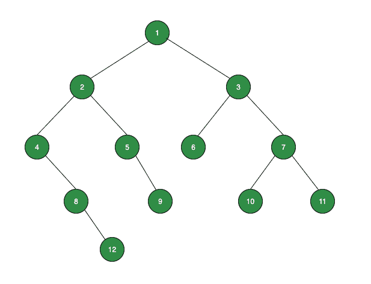
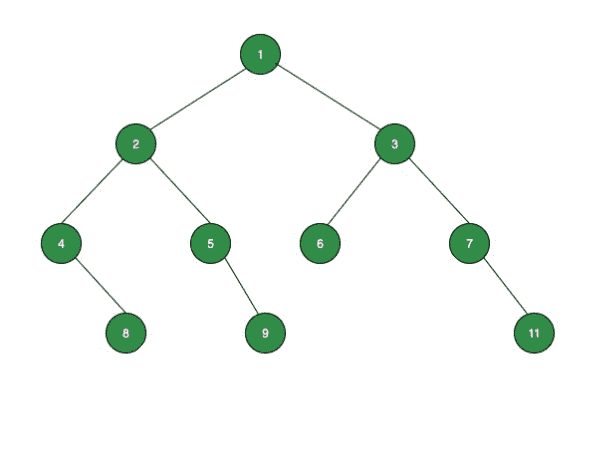

# 二叉树中每个水平层次的叶节点的和

> 原文:[https://www . geeksforgeeks . org/二叉树每水平层叶节点总数/](https://www.geeksforgeeks.org/sum-of-leaf-nodes-at-each-horizontal-level-in-a-binary-tree/)

给定一棵[二叉树](https://www.geeksforgeeks.org/binary-tree-data-structure/)，任务是找到给定树的每个[级的叶节点的和。](https://www.geeksforgeeks.org/get-level-of-a-node-in-a-binary-tree/)

**示例:**

> **输入:**
> 
> [](https://media.geeksforgeeks.org/wp-content/uploads/20211007183032/binarytreeex1.png)
> 
> **输出:**
> 0
> 0
> 6
> 30
> 12
> **说明:**
> 级别 1:无叶节点，所以 sum = 0
> 级别 2:无叶节点，所以 sum = 0
> 级别 3:一个叶节点:6，所以 sum = 6
> 级别 4:三个叶节点:9，10，11，所以 sum = 30
> 级别 5:一个叶节点:12，所以
> 
> **输入:**
> 
> [](https://media.geeksforgeeks.org/wp-content/uploads/20211010111121/TreeImageExample2.jpg)
> 
> **输出:**T2 0
> 0
> 6
> 28

**方法:**使用[级序遍历](https://www.geeksforgeeks.org/level-order-tree-traversal/)可以解决给定的问题。按照以下步骤解决给定的问题:

*   创建一个[队列](https://www.geeksforgeeks.org/queue-data-structure/) **队列**，将节点存储在其级别旁边。此外，创建一个[地图](http://www.geeksforgeeks.org/map-associative-containers-the-c-standard-template-library-stl/)来存储每个级别的总和。
*   [执行从根节点](https://www.geeksforgeeks.org/level-order-tree-traversal/)开始的级别顺序遍历，并将每个节点及其级别存储在队列中，同时检查当前节点的[叶节点](https://www.geeksforgeeks.org/check-whether-a-node-is-leaf-node-or-not-for-multiple-queries/)。如果它是一个叶节点，那么在对应于它的级别的映射中添加它的值。
*   完成上述步骤后，将地图中的值打印为给定树的每个级别的总和。

下面是上述方法的实现:

## C++

```
// C++ program for the above approach

#include <bits/stdc++.h>
using namespace std;

// Tree node structure
class Node {
public:
    int data;
    Node *left, *right;

    Node(int data)
    {
        this->data = data;
        left = right = NULL;
    }
};

// Function to print the sum of leaf nodes
// at each horizontal level
void printLevelSum(Node* root)
{
    if (root == NULL) {
        cout << "No nodes present\n";
        return;
    }

    // Map to hold sum at each level
    map<int, int> mp;

    // Queue to hold tree node with level
    queue<pair<Node*, int> > q;

    // Root node is at level 1
    q.push({ root, 1 });

    pair<Node*, int> p;

    // Level Order Traversal of tree
    while (!q.empty()) {
        p = q.front();
        q.pop();

        // Create a key for each level
        // in the map
        if (mp.find(p.second) == mp.end()) {
            mp[p.second] = 0;
        }

        // If current node is a leaf node
        if (p.first->left == NULL
            && p.first->right == NULL) {

            // Adding value in the map
            // corresponding to its level
            mp[p.second] += p.first->data;
        }

        if (p.first->left)
            q.push({ p.first->left, p.second + 1 });
        if (p.first->right)
            q.push({ p.first->right, p.second + 1 });
    }

    // Print the sum at each level
    for (auto i : mp) {
        cout << i.second << endl;
    }
}

// Driver Code
int main()
{
    Node* root = new Node(1);
    root->left = new Node(2);
    root->right = new Node(3);
    root->left->left = new Node(4);
    root->left->right = new Node(5);
    root->right->left = new Node(6);
    root->right->right = new Node(7);
    root->left->left->right = new Node(8);
    root->left->right->right = new Node(9);
    root->right->right->left = new Node(10);
    root->right->right->right = new Node(11);
    root->left->left->right->right = new Node(12);

    printLevelSum(root);

    return 0;
}
```

## Java 语言(一种计算机语言，尤用于创建网站)

```
// Java program for the above approach

import java.util.LinkedList;
import java.util.Map;
import java.util.Queue;
import java.util.HashMap;

public class Print_Level_Sum_Btree {

    /* A tree node structure */
    static class Node {
        int data;
        Node left;
        Node right;
        Node(int data){
            this.data = data;
            left = null;
            right = null;
        }
    }

    // User defined class Pair to hold
    // the node and its level
    static class Pair{
        Node n;
        int i;
        Pair(Node n, int i){
            this.n = n;
            this.i = i;
        }

    }

    // Function to print the sum of leaf nodes
    // at each horizontal level
    static void printLevelSum(Node root)
    {
        if (root == null)
        {
            System.out.println("No nodes present");
            return;
        }

        // hashmap to hold sum at each level
        HashMap<Integer, Integer> map = new HashMap<>();

        // queue to hold tree node with level
        Queue<Pair> q = new LinkedList<Pair>();

        // Root node is at level 1
        q.add(new Pair(root, 1));

        Pair p;

        // Level Order Traversal of tree
        while (!q.isEmpty()) {
            p = q.peek();
            q.remove();

              // Create a key for each level
            // in the map
            if (!map.containsKey(p.i))
                map.put(p.i, 0);

              // If current node is a leaf node
            if (p.n.left == null && p.n.right == null)
            {
                  // Adding value in the map
                // corresponding to its level
                map.put(p.i, map.get(p.i) + p.n.data);
            }

            if (p.n.left != null)
                q.add(new Pair(p.n.left, p.i + 1));
            if (p.n.right != null)
                q.add(new Pair(p.n.right, p.i + 1));
        }

          // Print the sum at each level
        for (Map.Entry mapElement : map.entrySet()) {
            int value = ((int)mapElement.getValue());

            System.out.println(value);
        }
    }

    // Driver Code
    public static void main(String args[])
    {
        Node root = null;
        root = new Node(1);
        root.left = new Node(2);
        root.right = new Node(3);
        root.left.left = new Node(4);
        root.left.right = new Node(5);
        root.right.left = new Node(6);
        root.right.right = new Node(7);
        root.left.left.right = new Node(8);
        root.left.right.right = new Node(9);
        root.right.right.left = new Node(10);
        root.right.right.right = new Node(11);
        root.left.left.right.right = new Node(12);

        printLevelSum(root);
    }
}

// This code is contributed by vineetsharma36.
```

## 蟒蛇 3

```
# Python3 program for the above approach
class newNode:

    # Construct to create a new node
    def __init__(self, key):
        self.data = key
        self.left = None
        self.right = None

# Function to print the sum of leaf nodes
# at each horizontal level
def printLevelSum(root):

    if (not root):
        print("No nodes present")
        return

    # Dictionary to hold sum at each level
    dict = {}

    # queue to hold tree node with level
    q = []

    # Root node is at level 1
    q.append([root, 1])

    p = []

    # Level order Traversal of Tree
    while (len(q)):
        p=q[0]
        q.pop(0)

        # Create a key for each level
        # in the dictionary
        if (p[1] not in dict.keys()):
            dict[p[1]] = 0

        # If current node is a leaf node
        if (not p[0].left and not p[0].right):
            # Adding value in the dictionary
            # corresponding to its level
            dict[p[1]] = p[0].data + dict.get(p[1])

        if (p[0].left):
            q.append([p[0].left, p[1] + 1])
        if (p[0].right):
            q.append([p[0].right, p[1] + 1])

    # Print the sum at each level
    for sum in dict.values():
        print(sum)

# Driver Code
if __name__ == '__main__':

    root = newNode(1)
    root.left = newNode(2)
    root.right = newNode(3)
    root.left.left = newNode(4)
    root.left.right = newNode(5)
    root.right.left = newNode(6)
    root.right.right = newNode(7)
    root.left.left.right = newNode(8)
    root.left.right.right = newNode(9)
    root.right.right.left = newNode(10)
    root.right.right.right = newNode(11)
    root.left.left.right.right = newNode(12)

    printLevelSum(root)

    # This code is contributed by vineetsharma36.
```

## C#

```
// C# program for the above approach
using System;
using System.Collections.Generic;

public class Print_Level_Sum_Btree {

    /* A tree node structure */
   public class Node {
      public  int data;
      public  Node left;
      public  Node right;
      public  Node(int data){
            this.data = data;
            left = null;
            right = null;
        }
    }

    // User defined class Pair to hold
    // the node and its level
  public  class Pair{
       public Node n;
      public  int i;
      public  Pair(Node n, int i){
            this.n = n;
            this.i = i;
        }

    }

    // Function to print the sum of leaf nodes
    // at each horizontal level
    static void printLevelSum(Node root)
    {
        if (root == null)
        {
            Console.WriteLine("No nodes present");
            return;
        }

        // hashmap to hold sum at each level
        Dictionary<int, int> map = new Dictionary<int,int>();

        // queue to hold tree node with level
        Queue<Pair> q = new Queue<Pair>();

        // Root node is at level 1
        q.Enqueue(new Pair(root, 1));

        Pair p;

        // Level Order Traversal of tree
        while (q.Count!=0) {
            p = q.Peek();
            q.Dequeue();

              // Create a key for each level
            // in the map
            if (!map.ContainsKey(p.i))
                map.Add(p.i, 0);

              // If current node is a leaf node
            if (p.n.left == null && p.n.right == null)
            {
                  // Adding value in the map
                // corresponding to its level
                map[p.i]= map[p.i] + p.n.data;
            }

            if (p.n.left != null)
                q.Enqueue(new Pair(p.n.left, p.i + 1));
            if (p.n.right != null)
                q.Enqueue(new Pair(p.n.right, p.i + 1));
        }

          // Print the sum at each level
       foreach(KeyValuePair<int, int> entry in map){
            int value = (entry.Value);

            Console.WriteLine(value);
        }
    }

    // Driver Code
    public static void Main(String []args)
    {
        Node root = null;
        root = new Node(1);
        root.left = new Node(2);
        root.right = new Node(3);
        root.left.left = new Node(4);
        root.left.right = new Node(5);
        root.right.left = new Node(6);
        root.right.right = new Node(7);
        root.left.left.right = new Node(8);
        root.left.right.right = new Node(9);
        root.right.right.left = new Node(10);
        root.right.right.right = new Node(11);
        root.left.left.right.right = new Node(12);

        printLevelSum(root);
    }
}

// This code is contributed by umadevi9616
```

## java 描述语言

```
<script>
// Javascript program for the above approach

// Tree node structure
class Node {
  constructor(data) {
    this.data = data;
    this.left = this.right = null;
  }
}

// Function to print the sum of leaf nodes
// at each horizontal level
function printLevelSum(root) {
  if (root == null) {
    document.write("No nodes present\n");
    return;
  }

  // Map to hold sum at each level
  let mp = new Map();

  // Queue to hold tree node with level
  let q = [];

  // Root node is at level 1
  q.push([root, 1]);

  let p = [];

  // Level Order Traversal of tree
  while (q.length) {
    p = q[q.length - 1];
    q.pop();

    // Create a key for each level
    // in the map
    if (!mp.has(p[1])) {
      mp.set(p[1], 0);
    }

    // If current node is a leaf node
    if (p[0].left == null && p[0].right == null) {
      // Adding value in the map
      // corresponding to its level
      mp.set(p[1], mp.get(p[1]) + p[0].data);
    }

    if (p[0].left) q.push([p[0].left, p[1] + 1]);
    if (p[0].right) q.push([p[0].right, p[1] + 1]);
  }

  // Print the sum at each level
  for (let i of mp) {
    document.write(i[1] + "<bR>");
  }
}

// Driver Code

let root = new Node(1);
root.left = new Node(2);
root.right = new Node(3);
root.left.left = new Node(4);
root.left.right = new Node(5);
root.right.left = new Node(6);
root.right.right = new Node(7);
root.left.left.right = new Node(8);
root.left.right.right = new Node(9);
root.right.right.left = new Node(10);
root.right.right.right = new Node(11);
root.left.left.right.right = new Node(12);

printLevelSum(root);

</script>
```

**Output**

```
0
0
6
30
12
```

***时间复杂度:**O(N)*
T5**辅助空间:** O(N)