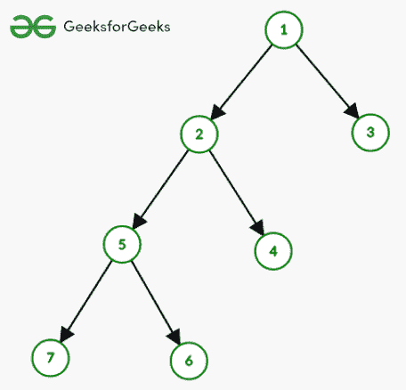
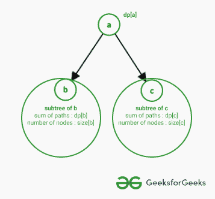
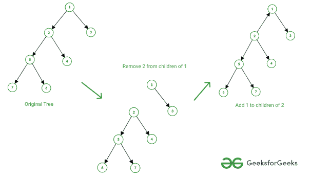

# 使用树重排序技术从每个节点到所有其他节点的路径长度总和

> 原文:[https://www . geesforgeks . org/从每个节点到所有其他节点的路径长度总和-使用树重跟踪技术/](https://www.geeksforgeeks.org/sum-of-length-of-paths-from-every-node-to-all-other-nodes-using-tree-rerooting-technique/)

对于**无向树**中的每个节点，使用树重跟踪技术找到从该节点到所有其他节点的路径长度之和。

> 重根是树木中的一种动态编程技术。当树扎根于 **i** 时，使用该属性计算树的**DP【I】**。

**示例:**

> **输入:**考虑图中所示的树:
> 
> 
> 
> 以 1 为根树(箭头表示从根到其他节点的路径)
> 
> **产量:** 12 9 17 14 10 15 15
> 
> **说明:**为节点 **i : i1 + i2 + i3。。。在中，**其中 ij 是从 I 到 j 的路径长度
> 对于节点 1 : 0 + 1 + 1 + 2 + 2 + 3 + 3 = 12
> 对于节点 2:1+0+2+1+2+2 = 9
> 对于节点 3 : 1 + 2 + 0 + 3 + 3 + 4 + 4 = 17
> 对于节点 4 : 2 + 1 + 3 + 0 + 2 + 3 + 3 = 14
> 对于节点 5 : 2 + 1 + 3 + 2 + 0 + 1 + 1 = 10
> 对于节点 6 : 3 + 2 + 4 + 3 + 1 + 0 + 2 = 15
> 对于节点 7 : 3 + 2 + 4 + 3 + 1 + 2 + 0 = 15

**天真的做法:**这种做法是基于以下对[动态规划](http://www.geeksforgeeks.org/dynamic-programming/)的观察。

请看下图，了解动态编程中的转换:

> 插图:
> 
> 
> 
> 路径长度总和的树 dp
> 
> **注:** **图中 dp【节点】**表示从**节点**到其所有子树的路径之和。
> 
> 现在考虑节点**【a】**的子节点**【b】**，
> 
> 1.  子树 **'b'** ，**大小【B】**和子树 **'b'** 的路径长度之和给出为**DP【B】**。
> 2.  考虑**在**【a】**开始**并且**在**【b】**的子树**的某个节点结束的所有路径。
> 3.  每条路径可以分解如下:**路径(a，x) =边(a，b) +路径(b，x)**
> 4.  由于**路径(b，x)** 的所有路径的长度已经被**DP【b】**覆盖，因此只需要为**【b】**的子树中的**所有节点“x”**添加边(a，b)。
> 5.  这意味着大小[b]需要添加到 dp[b]中，因此子树“b”对 **dp[a]** 的贡献是 **(dp[b] +大小[b])。**

过渡如下:

> **过渡:**
> 为(节点的子级):
> DP[节点] += DP[子级]+大小[子级]

按照以下步骤实施该方法:

1.  对每个节点执行以下操作:
    *   在这个节点上建立树的根，并如上所述找到 dp
2.  由于树的根在**“节点”**，所有其他节点都将在其子树中。所以 **dp【节点】**将是**【节点】**的必选项。

## C++

```
// C++ code to implement above approach
#include <bits/stdc++.h>
using namespace std;

// Dfs computes dp, answer for each node
// with respect to its subtree it also
// computes size of each subtree
void dfs(int node, int par,
         vector<vector<int> >& g,
         vector<int>& size, vector<int>& dp)
{
    // Initialise given subtree with dp = 0
    // [as there is no paths currently] and
    // size 1, because tehre is only
    // one node in subtree
    size[node] = 1;
    dp[node] = 0;
    for (auto nebr : g[node]) {

        // For every neighbour of node
        // which is not its parent
        // 1\. compute size and dp for
        // nebr by dfs
        // 2\. update size and dp for node,
        // based on nebr
        // See explanation to understand
        // the dp transition
        if (nebr != par) {
            dfs(nebr, node, g, size, dp);
            size[node] += size[nebr];
            dp[node] += dp[nebr] +
                size[nebr];
        }
    }
}

// Creates a edge between a and b,
// given graph g
void edge(int a, int b,
          vector<vector<int> >& g)
{
    // Convert into 0-based indexing
    a--;
    b--;

    // Push b to adjacency list of a
    // and vice versa because given
    // tree is undirected
    g[a].push_back(b);
    g[b].push_back(a);
}

// Function to get the sum of paths
vector<int> pathSum(vector<vector<int> > &g,
                   int N)
{
    vector<int> dp(N), ans(N), size(N);
    // For root 'r'
    // 1\. compute dp for tree rooted at 'r'
    // 2\. as all nodes belong to some
    // subtree of root, answer will be
    // equal to dp
    for (int r = 0; r < N; ++r) {
        dfs(r, -1, g, size, dp);
        ans[r] = dp[r];
    }
    return ans;
}

// Driver code
int main()
{
    int N = 7;

    vector<vector<int> > g(N);

    edge(1, 2, g);
    edge(1, 3, g);
    edge(2, 4, g);
    edge(2, 5, g);
    edge(5, 6, g);
    edge(5, 7, g);
    vector<int> res = pathSum(g, N);

    for (int i = 0; i < N; ++i) {
        cout << res[i] << " ";
    }
    cout << endl;
    return 0;
}
```

## Java 语言(一种计算机语言，尤用于创建网站)

```
// Java code to implement above approach
import java.util.*;

class GFG
{

  static int N = 7;
  static int dp[] = new int[N];
  static int ans[] = new int[N];
  static int size[] = new int[N];

  // Dfs computes dp, answer for each node
  // with respect to its subtree it also
  // computes size of each subtree
  static void dfs(int node, int par, Vector<Integer> []g)
  {

    // Initialise given subtree with dp = 0
    // [as there is no paths currently] and
    // size 1, because tehre is only
    // one node in subtree
    size[node] = 1;
    dp[node] = 0;
    for (int nebr : g[node]) {

      // For every neighbour of node
      // which is not its parent
      // 1\. compute size and dp for
      // nebr by dfs
      // 2\. update size and dp for node,
      // based on nebr
      // See explanation to understand
      // the dp transition
      if (nebr != par) {
        dfs(nebr, node, g);
        size[node] += size[nebr];
        dp[node] += dp[nebr] +
          size[nebr];
      }
    }
  }

  // Creates a edge between a and b,
  // given graph g
  static void edge(int a, int b,
                   Vector<Integer> [] g)
  {
    // Convert into 0-based indexing
    a--;
    b--;

    // Push b to adjacency list of a
    // and vice versa because given
    // tree is undirected
    g[a].add(b);
    g[b].add(a);
  }

  // Function to get the sum of paths
  static int[] pathSum(Vector<Integer> []g)
  {

    // For root 'r'
    // 1\. compute dp for tree rooted at 'r'
    // 2\. as all nodes belong to some
    // subtree of root, answer will be
    // equal to dp
    for (int r = 0; r < N; ++r) {
      dfs(r, -1, g);
      ans[r] = dp[r];
    }
    return ans;
  }

  // Driver code
  public static void main(String[] args)
  {

    Vector<Integer> []g = new Vector[N];
    for (int i = 0; i < g.length; i++)
      g[i] = new Vector<Integer>();
    edge(1, 2, g);
    edge(1, 3, g);
    edge(2, 4, g);
    edge(2, 5, g);
    edge(5, 6, g);
    edge(5, 7, g);
    int[] res = pathSum(g);

    for (int i = 0; i < N; ++i) {
      System.out.print(res[i]+ " ");
    }
    System.out.println();
  }
}

// This code is contributed by 29AjayKumar
```

## C#

```
// C# code to implement above approach
using System;
using System.Collections.Generic;
class GFG
{

    static int N = 7;
    static int[] dp = new int[N];
    static int[] ans = new int[N];
    static int[] size = new int[N];

    // Dfs computes dp, answer for each node
    // with respect to its subtree it also
    // computes size of each subtree
    static void dfs(int node, int par, List<int>[] g)
    {

        // Initialise given subtree with dp = 0
        // [as there is no paths currently] and
        // size 1, because tehre is only
        // one node in subtree
        size[node] = 1;
        dp[node] = 0;
        foreach (int nebr in g[node])
        {

            // For every neighbour of node
            // which is not its parent
            // 1\. compute size and dp for
            // nebr by dfs
            // 2\. update size and dp for node,
            // based on nebr
            // See explanation to understand
            // the dp transition
            if (nebr != par)
            {
                dfs(nebr, node, g);
                size[node] += size[nebr];
                dp[node] += dp[nebr] +
                  size[nebr];
            }
        }
    }

    // Creates a edge between a and b,
    // given graph g
    static void edge(int a, int b,
                     List<int>[] g)
    {
        // Convert into 0-based indexing
        a--;
        b--;

        // Push b to adjacency list of a
        // and vice versa because given
        // tree is undirected
        g[a].Add(b);
        g[b].Add(a);
    }

    // Function to get the sum of paths
    static int[] pathSum(List<int>[] g)
    {

        // For root 'r'
        // 1\. compute dp for tree rooted at 'r'
        // 2\. as all nodes belong to some
        // subtree of root, answer will be
        // equal to dp
        for (int r = 0; r < N; ++r)
        {
            dfs(r, -1, g);
            ans[r] = dp[r];
        }
        return ans;
    }

    // Driver code
    public static void Main()
    {

        List<int>[] g = new List<int>[N];
        for (int i = 0; i < g.Length; i++)
            g[i] = new List<int>();
        edge(1, 2, g);
        edge(1, 3, g);
        edge(2, 4, g);
        edge(2, 5, g);
        edge(5, 6, g);
        edge(5, 7, g);
        int[] res = pathSum(g);

        for (int i = 0; i < N; ++i)
        {
            Console.Write(res[i] + " ");
        }
        Console.WriteLine();
    }
}

// This code is contributed by Saurabh Jaiswal
```

**Output**

```
12 9 17 14 10 15 15 
```

**时间复杂度:** O(N <sup>2</sup> ，其中 N 为节点数。
**辅助空间:** O(N)

**重新搜索方法:**通过计算一个根的答案，并每次重新搜索树来计算其他节点，可以进一步优化解决方案。

请看下图，了解重新启动的概念:



从 1 到 2 重新排序树

**注:**上图中，边是无向的，箭头只表示从根到其他节点的路径

*   在给定的图中，使用以下方法从“1”到“2”重新排序
    *   从 1 的子代中移除 2
    *   向 2 的孩子添加 1

由于没有对每个节点进行重新计算，重新计数只需要 O(1)，因此整体时间复杂度也降低了。

## C++

```
// C++ code to implemeny above approach
#include <bits/stdc++.h>
using namespace std;

// The function dfs0 computes dp,
// answer for each node with respect to
// its subtree it also computes
// size of each subtree
void dfs0(int node, int par,
          vector<vector<int> >& g,
          vector<int>& dp, vector<int>& size)
{
    // Initialise given subtree with dp = 0
    // as there is no paths currently and
    // size 1, because there is only
    // one node in subtree
    dp[node] = 0;
    size[node] = 1;
    for (auto nebr : g[node]) {

        // For every neighbour of node
        // which is not its parent
        // 1\. compute size and dp for
        // nebr by dfs
        // 2\. update size and dp for node,
        // based on nebr
        // See explanation to understand
        // the dp transition
        if (par != nebr) {
            dfs0(nebr, node, g, dp, size);
            size[node] += size[nebr];
            dp[node] += size[nebr] +
                dp[nebr];
        }
    }
}

// Rerooting the tree from 'from' to 'to'
void reroot(int from, int to,
            vector<int>& dp,
            vector<int>& size)
{
    // 'to' is no longer a child of 'from'
    dp[from] -= size[to] + dp[to];
    size[from] -= size[to];

    // 'from' is now a child of 'to'
    size[to] += size[from];
    dp[to] += size[from] + dp[from];
}

void dfs1(int node, int par,
          vector<vector<int> >& g,
          vector<int>& dp, vector<int>& ans,
          vector<int>& size)
{
    // Current dfs considers 'node' as root
    // so currently dp[node]
    // will be the answer
    ans[node] = dp[node];

    // For all neighbours which are
    // not parent of node
    for (auto nebr : g[node]) {
        if (par != nebr) {
            // Reroot the tree to 'nebr'
            reroot(node, nebr, dp, size);

            // Compute ans for 'nebr'
            // as a root of tree with dfs
            dfs1(nebr, node, g, dp, ans,
                 size);

            // reroot the tree back
            // to 'node'
            reroot(nebr, node, dp, size);
        }
    }
}

// Creates a edge between a and b,
// given graph g
void edge(int a, int b,
          vector<vector<int> >& g)
{
    // Convert into 0-based indexing
    a--;
    b--;

    // push b to adjacency list
    // of a and vice versa
    // because given tree is undirected
    g[a].push_back(b);
    g[b].push_back(a);
}

// Function to calculate sum of paths
vector<int> pathSum(vector<vector<int> > &g,
                   int N)
{
    vector<int> dp(N), ans(N), size(N);

    // Compute answer for each subtree
    // with tree rooted at 0
    dfs0(0, -1, g, dp, size);

    // Compute answer for each node
    // as root of tree, rerooting
    dfs1(0, -1, g, dp, ans, size);
    return ans;
}

// Driver code
int main()
{
    int N = 7;
    vector<vector<int> > g(N);

    edge(1, 2, g);
    edge(1, 3, g);
    edge(2, 4, g);
    edge(2, 5, g);
    edge(5, 6, g);
    edge(5, 7, g);

    vector<int> res = pathSum(g, N);
    for (int i = 0; i < N; ++i) {
        cout << res[i] << " ";
    }
    cout << endl;
    return 0;
}
```

**Output**

```
12 9 17 14 10 15 15 
```

**时间复杂度:**O(N)
T3】辅助空间: O(N)