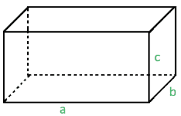
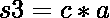
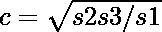

# 任意长方体所有 12 条边的长度之和

> 原文:[https://www . geeksforgeeks . org/任意长方体所有 12 条边的长度总和/](https://www.geeksforgeeks.org/sum-of-lengths-of-all-12-edges-of-any-rectangular-parallelepiped/)

给定具有公共顶点的矩形**平行六面体**的三个面的面积。我们的任务是找到这个平行六面体的所有 12 条边的长度之和**。
在几何学中，平行六面体是由六个平行四边形构成的三维图形。以此类推，它与平行四边形的关系就像立方体与正方形的关系或者长方体与长方形的关系一样。下图是一个长方体的图片。** 



**例:**

```
Input: 1 1 1 
Output: 12

Input: 20 10 50
Output: 68
```

**方法:**给定的区域是 s1、s2 和 s3。设 a、b 和 c 是有一个公共顶点的边的长度。其中、、。很容易找到脸面积的长度:、、。答案将是所有 4 条边的总和，有 4 条边的长度等于 a、b 和 c。
在第一个示例中，给定的面积 s1 = 1、s2 = 1 和 s3 = 1。所以用上面的方法，a，b，c 的值会变成 1。所以所有 12 条边的长度之和将是 4 * 3 = 12。
以下是上述方法的实施:

## C++

```
// C++ program to illustrate
// the above problem
#include <bits/stdc++.h>
using namespace std;

// function to find the sum of
// all the edges of parallelepiped
double findEdges(double s1, double s2, double s3)
{
    // to calculate the length of one edge
    double a = sqrt(s1 * s2 / s3);
    double b = sqrt(s3 * s1 / s2);
    double c = sqrt(s3 * s2 / s1);

    // sum of all the edges of one side
    double sum = a + b + c;

    // net sum will be equal to the
    // summation of edges of all the sides
    return 4 * sum;
}

// Driver code
int main()
{
    // initialize the area of three
    // faces which has a common vertex
    double s1, s2, s3;
    s1 = 65, s2 = 156, s3 = 60;

    cout << findEdges(s1, s2, s3);

    return 0;
}
```

## Java 语言(一种计算机语言，尤用于创建网站)

```
// Java program to illustrate
// the above problem

import java.io.*;

class GFG {

// function to find the sum of
// all the edges of parallelepiped
static double findEdges(double s1, double s2, double s3)
{
    // to calculate the length of one edge
    double a = Math.sqrt(s1 * s2 / s3);
    double b = Math.sqrt(s3 * s1 / s2);
    double c = Math.sqrt(s3 * s2 / s1);

    // sum of all the edges of one side
    double sum = a + b + c;

    // net sum will be equal to the
    // summation of edges of all the sides
    return 4 * sum;
}

       // Driver code

    public static void main (String[] args) {
            // initialize the area of three
    // faces which has a common vertex
    double s1, s2, s3;
    s1 = 65; s2 = 156; s3 = 60;

    System.out.print(findEdges(s1, s2, s3));
    }
}

// this code is contributed by anuj_67..
```

## 蟒蛇 3

```
import math

# Python3 program to illustrate
# the above problem

# function to find the sum of
# all the edges of parallelepiped
def findEdges(s1, s2, s3):

    # to calculate the length of one edge
    a = math.sqrt(s1 * s2 / s3)
    b = math.sqrt(s3 * s1 / s2)
    c = math.sqrt(s3 * s2 / s1)

    # sum of all the edges of one side
    sum = a + b + c

    # net sum will be equal to the
    # summation of edges of all the sides
    return 4 * sum

# Driver code
if __name__=='__main__':

# initialize the area of three
# faces which has a common vertex
    s1 = 65
    s2 = 156
    s3 = 60

    print(int(findEdges(s1, s2, s3)))

# This code is contributed by
# Shivi_Aggarwal
```

## C#

```
// C# program to illustrate
// the above problem
using System;

public class GFG{

// function to find the sum of
// all the edges of parallelepiped
static double findEdges(double s1, double s2, double s3)
{
    // to calculate the length of one edge
    double a = Math.Sqrt(s1 * s2 / s3);
    double b = Math.Sqrt(s3 * s1 / s2);
    double c = Math.Sqrt(s3 * s2 / s1);

    // sum of all the edges of one side
    double sum = a + b + c;

    // net sum will be equal to the
    // summation of edges of all the sides
    return 4 * sum;
}

// Driver code

    static public void Main (){
    // initialize the area of three
    // faces which has a common vertex
    double s1, s2, s3;
    s1 = 65; s2 = 156; s3 = 60;

    Console.WriteLine(findEdges(s1, s2, s3));
    }
}

// This code is contributed by anuj_67..
```

## 服务器端编程语言（Professional Hypertext Preprocessor 的缩写）

```
<?php
// PHP program to illustrate
// the above problem

// function to find the sum of
// all the edges of parallelepiped
function findEdges($s1, $s2, $s3)
{
    // to calculate the length of one edge
    $a = sqrt($s1 * $s2 / $s3);
    $b = sqrt($s3 * $s1 / $s2);
    $c = sqrt($s3 * $s2 / $s1);

    // sum of all the edges of one side
    $sum = $a + $b + $c;

    // net sum will be equal to the
    // summation of edges of all the sides
    return 4 * $sum;
}

// Driver code

// initialize the area of three
// faces which has a common vertex
$s1; $s2; $s3;
$s1 = 65; $s2 = 156; $s3 = 60;

echo findEdges($s1, $s2, $s3);

// This code is contributed by Shashank
?>
```

## java 描述语言

```
<script>
    // Javascript program to illustrate the above problem

    // function to find the sum of
    // all the edges of parallelepiped
    function findEdges(s1, s2, s3)
    {
        // to calculate the length of one edge
        let a = Math.sqrt(s1 * s2 / s3);
        let b = Math.sqrt(s3 * s1 / s2);
        let c = Math.sqrt(s3 * s2 / s1);

        // sum of all the edges of one side
        let sum = a + b + c;

        // net sum will be equal to the
        // summation of edges of all the sides
        return 4 * sum;
    }

    // initialize the area of three
    // faces which has a common vertex
    let s1, s2, s3;
    s1 = 65; s2 = 156; s3 = 60;

    document.write(findEdges(s1, s2, s3));

</script>
```

**Output:** 

```
120
```

**参考资料:**[https://en . Wikipedia . org/wiki/paralleled](https://en.wikipedia.org/wiki/Parallelepiped)