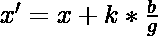
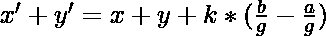

# 满足方程 ax +乘= c 的 x 和 y 的最小值之和

> 原文:[https://www . geesforgeks . org/x 和 y 的最小值之和-满足方程-ax-by-c/](https://www.geeksforgeeks.org/sum-of-minimum-value-of-x-and-y-satisfying-the-equation-ax-by-c/)

给定表示形式为 **ax + by = c** 的线性方程的三个整数 **a** 、 **b** 和 **c** ，任务是找到给定方程的解 **(x，y)** ，使得 **(x + y)** 最小化。如果上述方程不存在解，则打印**-1”**。
**注:** x 和 y 为非负整数。

**示例:**

> **输入:** a = 2，b = 2，c = 0
> **输出:** 0
> **说明:**
> 给定方程为 2x + 2y = 0。
> 因此，x = 0，y = 0 是最小值为(x + y)的所需解。
> 
> **输入:** a = 2，b = 2，c = 1
> **输出:** -1
> **说明:**
> 给定的方程是 2x + 2y = 1。
> 对于 x 和 y 的正值，给定方程不存在解。

**方法:**为了解决上述问题，找到给定的[线性丢番图方程](https://www.geeksforgeeks.org/linear-diophantine-equations/)的任意解 **(x，y)** ，然后相应地找到 x 的值并最小化和。
下面是给定方程的解**(x’，y’)**:

> [Tex]y ' = y–k * \ frac { a } { g }[/Tex]
> 
> 其中 g 是 gcd(a，b ), k 是任意整数。
> 
> [Tex]x '+y ' = x+y+k * \ frac { b-a } { g }[/Tex]

从上面的等式中，我们观察到:

1.  如果 a 小于 b，我们需要选择 k 的最小可能值。
2.  否则，如果 a 大于 b，我们需要选择 k 的最大可能值。
3.  如果 a = b，所有解将有相同的和 **(x + y)** 。

下面是上述方法的实现:

## C++

```
// C++ program for the above approach
#include <bits/stdc++.h>
using namespace std;

// Function to find the gcd of a & b
// by Euclid's method

// x and y store solution of
// equation ax + by = g
int gcd(int a, int b, int* x, int* y)
{

    if (b == 0) {
        *x = 1;
        *y = 0;
        return a;
    }
    int x1, y1;
    int store_gcd = gcd(b, a % b,
                        &x1, &y1);

    // Euclidean Algorithm
    *x = y1;
    *y = x1 - y1 * (a / b);

    // store_gcd returns
    // the gcd of a and b
    return store_gcd;
}

// Function to find any
// possible solution
int possible_solution(int a, int b,
                    int c, int* x0,
                    int* y0, int* g)
{
    *g = gcd(fabs(a), fabs(b), x0, y0);

    // Condition if solution
    // does not exists
    if (c % *g) {
        return 0;
    }

    *x0 *= c / *g;
    *y0 *= c / *g;

    // Adjusting the sign
    // of x0 and y0
    if (a < 0)
        *x0 *= -1;
    if (b < 0)
        *y0 *= -1;

    return 1;
}

// Function to shift solution
void shift_solution(int* x, int* y,
                    int a, int b,
                    int shift_var)
{

    // Shifting to obtain
    // another solution
    *x += shift_var * b;
    *y -= shift_var * a;
}

// Function to find minimum
// value of x and y
int find_min_sum(int a, int b, int c)
{
    int x, y, g;

    // g is the gcd of a and b
    if (!possible_solution(a, b, c,
                        &x, &y, &g))
        return -1;

    a /= g;
    b /= g;

    // Store sign of a and b
    int sign_a = a > 0 ? +1 : -1;
    int sign_b = b > 0 ? +1 : -1;

    shift_solution(&x, &y, a, b, -x / b);

    // If x is less than 0, then
    // shift solution
    if (x < 0)
        shift_solution(&x, &y, a, b, sign_b);

    int minx1 = x;

    shift_solution(&x, &y, a, b, y / a);

    // If y is less than 0, then
    // shift solution
    if (y < 0)
        shift_solution(&x, &y, a, b, -sign_a);

    int minx2 = x;

    if (minx2 > x)
        swap(minx2, x);
    int minx = max(minx1, minx2);

    // Find intersection such
    // that both x and y are positive

    if (minx > x)
        return -1;

    // miny is value of y
    // corresponding to minx
    int miny = (c - a * x) / b;

    // Returns minimum value of x+y
    return (miny + minx);
}

// Driver Code
int main()
{
    // Given a, b, and c
    int a = 2, b = 2, c = 0;

    // Function Call
    cout << find_min_sum(a, b, c)
        << "\n";

    return 0;
}
```

## Java 语言(一种计算机语言，尤用于创建网站)

```
// Java program for the above approach
import java.lang.*;
class GFG{

public static int x = 0, y = 0,
                 x1 = 0, y1 = 0;
public static int x0 = 0, y0 = 0,
                   g = 0;

// Function to find the gcd of a & b
// by Euclid's method

// x and y store solution of
// equation ax + by = g                 
public static int gcd(int a, int b)
{
    if (b == 0)
    {
        x = 1;
        y = 0;
        return a;
    }

    int store_gcd = gcd(b, a % b);

    // Euclidean Algorithm
    x = y1;
    y = x1 - y1 * (a / b);

    // store_gcd returns
    // the gcd of a and b
    return store_gcd;
}

// Function to find any
// possible solution
public static int possible_solution(int a, int b,
                                    int c)
{
    g = gcd(Math.abs(a), Math.abs(b));

    // Condition if solution
    // does not exists
    if (c % g != 0)
    {
        return 0;
    }

    x0 *= c / g;
    y0 *= c / g;

    // Adjusting the sign
    // of x0 and y0
    if (a < 0)
        x0 *= -1;
    if (b < 0)
        y0 *= -1;

    return 1;
}

// Function to shift solution
public static void shift_solution(int a, int b,
                                  int shift_var)
{

    // Shifting to obtain
    // another solution
    x += shift_var * b;
    y -= shift_var * a;
}

// Function to find minimum
// value of x and y
public static int find_min_sum(int a, int b,
                               int c)
{
    int x = 0, y = 0, g = 0;

    // g is the gcd of a and b
    if (possible_solution(a, b, c) == 0)
        return -1;

    if (g != 0)
    {
        a /= g;
        b /= g;
    }

    // Store sign of a and b
    int sign_a = a > 0 ? + 1 : -1;
    int sign_b = b > 0 ? + 1 : -1;

    shift_solution(a, b, -x / b);

    // If x is less than 0, then
    // shift solution
    if (x < 0)
        shift_solution(a, b, sign_b);

    int minx1 = x;

    shift_solution(a, b, y / a);

    // If y is less than 0, then
    // shift solution
    if (y < 0)
        shift_solution(a, b, -sign_a);

    int minx2 = x;

    if (minx2 > x)
    {
        int temp = minx2;
        minx2 = x;
        x = temp;
    }
    int minx = Math.max(minx1, minx2);

    // Find intersection such
    // that both x and y are positive

    if (minx > x)
        return -1;

    // miny is value of y
    // corresponding to minx
    int miny = (c - a * x) / b;

    // Returns minimum value of x+y
    return (miny + minx);
}

// Driver Code
public static void main(String[] args)
{

    // Given a, b, and c
    int a = 2, b = 2, c = 0;

    // Function call
    System.out.println(find_min_sum(a, b, c));
}
}

// This code is contributed by grand_master
```

## 蟒蛇 3

```
# Python3 program for the
# above approach

x, y, x1, y1 = 0, 0, 0, 0
x0, y0, g = 0, 0, 0

# Function to find the gcd
# of a & b by Euclid's method

# x and y store solution of
# equation ax + by = g
def gcd(a, b) :

    global x, y, x1, y1
    if (b == 0) :

        x = 1
        y = 0
        return a

    store_gcd = gcd(b, a % b)

    # Euclidean Algorithm
    x = y1
    y = x1 - y1 * (a // b)

    # store_gcd returns
    # the gcd of a and b
    return store_gcd

# Function to find any
# possible solution
def possible_solution(a, b, c) :

    global x0, y0, g
    g = gcd(abs(a), abs(b))

    # Condition if solution
    # does not exists
    if (c % g != 0) :

        return 0

    x0 *= c // g
    y0 *= c // g

    # Adjusting the sign
    # of x0 and y0
    if (a < 0) :
        x0 *= -1
    if (b < 0) :
        y0 *= -1
    return 1

# Function to shift solution
def shift_solution(a, b, shift_var) :

    global x, y
    # Shifting to obtain
    # another solution
    x += shift_var * b
    y -= shift_var * a

# Function to find minimum
# value of x and y
def find_min_sum(a, b, c) :
    global x, y, g
    x, y, g = 0, 0, 0

    # g is the gcd of a and b
    if (possible_solution(a, b, c) == 0) :
        return -1

    if (g != 0) :

        a //= g
        b //= g

    # Store sign of a and b
    if a > 0 :
        sign_a = 1
    else :
        sign_a = -1

    if b > 0 :
        sign_b = 1
    else :
        sign_b = -1

    shift_solution(a, b, -x // b)

    # If x is less than 0,
    # then shift solution
    if (x < 0) :
        shift_solution(a, b, sign_b)

    minx1 = x

    shift_solution(a, b, y // a)

    # If y is less than 0,
    # then shift solution
    if (y < 0) :
        shift_solution(a, b, -sign_a)

    minx2 = x

    if (minx2 > x) :

        temp = minx2
        minx2 = x
        x = temp

    minx = max(minx1, minx2)

    # Find intersection such
    # that both x and y are positive
    if (minx > x) :
        return -1

    # miny is value of y
    # corresponding to minx
    miny = (c - a * x) // b

    # Returns minimum value
    # of x + y
    return (miny + minx)

# Given a, b, and c
a, b, c = 2, 2, 0

# Function call
print(find_min_sum(a, b, c))

# This code is contributed by divyesh072019
```

## C#

```
// C# program for the
// above approach
using System;
class GFG{

public static int x = 0, y = 0,
                  x1 = 0, y1 = 0;
public static int x0 = 0, y0 = 0,
                  g = 0;

// Function to find the gcd
// of a & b by Euclid's method

// x and y store solution of
// equation ax + by = g
public static int gcd(int a, int b)
{
  if (b == 0)
  {
    x = 1;
    y = 0;
    return a;
  }

  int store_gcd = gcd(b,
                      a % b);

  // Euclidean Algorithm
  x = y1;
  y = x1 - y1 *
      (a / b);

  // store_gcd returns
  // the gcd of a and b
  return store_gcd;
}

// Function to find any
// possible solution
public static int possible_solution(int a,
                                    int b,
                                    int c)
{
  g = gcd(Math.Abs(a),
          Math.Abs(b));

  // Condition if solution
  // does not exists
  if (c % g != 0)
  {
    return 0;
  }

  x0 *= c / g;
  y0 *= c / g;

  // Adjusting the sign
  // of x0 and y0
  if (a < 0)
    x0 *= -1;
  if (b < 0)
    y0 *= -1;
  return 1;
}

// Function to shift solution
public static void shift_solution(int a, int b,
                                  int shift_var)
{
  // Shifting to obtain
  // another solution
  x += shift_var * b;
  y -= shift_var * a;
}

// Function to find minimum
// value of x and y
public static int find_min_sum(int a,
                               int b,
                               int c)
{
  int x = 0, y = 0, g = 0;

  // g is the gcd of a and b
  if (possible_solution(a, b,
                        c) == 0)
    return -1;

  if (g != 0)
  {
    a /= g;
    b /= g;
  }

  // Store sign of a and b
  int sign_a = a > 0 ?
               +1 : -1;
  int sign_b = b > 0 ?
               +1 : -1;

  shift_solution(a, b,
                 -x / b);

  // If x is less than 0,
  // then shift solution
  if (x < 0)
    shift_solution(a, b,
                   sign_b);

  int minx1 = x;

  shift_solution(a, b,
                 y / a);

  // If y is less than 0,
  // then shift solution
  if (y < 0)
    shift_solution(a, b,
                   -sign_a);

  int minx2 = x;

  if (minx2 > x)
  {
    int temp = minx2;
    minx2 = x;
    x = temp;
  }

  int minx = Math.Max(minx1,
                      minx2);

  // Find intersection such
  // that both x and y are positive
  if (minx > x)
    return -1;

  // miny is value of y
  // corresponding to minx
  int miny = (c - a *
              x) / b;

  // Returns minimum value
  // of x + y
  return (miny + minx);
}

// Driver Code
public static void Main(String[] args)
{
  // Given a, b, and c
  int a = 2, b = 2, c = 0;

  // Function call
  Console.Write(find_min_sum(a, b, c));
}
}

// This code is contributed by Chitranayal
```

## java 描述语言

```
<script>

    // Javascript program for the above approach

    let x = 0, y = 0, x1 = 0, y1 = 0;
    let x0 = 0, y0 = 0, g = 0;

    // Function to find the gcd
    // of a & b by Euclid's method

    // x and y store solution of
    // equation ax + by = g
    function gcd(a, b)
    {
      if (b == 0)
      {
        x = 1;
        y = 0;
        return a;
      }

      let store_gcd = gcd(b, a % b);

      // Euclidean Algorithm
      x = y1;
      y = x1 - y1 * parseInt(a / b, 10);

      // store_gcd returns
      // the gcd of a and b
      return store_gcd;
    }

    // Function to find any
    // possible solution
    function possible_solution(a, b, c)
    {
      g = gcd(Math.abs(a), Math.abs(b));

      // Condition if solution
      // does not exists
      if (c % g != 0)
      {
        return 0;
      }

      x0 *= parseInt(c / g, 10);
      y0 *= parseInt(c / g, 10);

      // Adjusting the sign
      // of x0 and y0
      if (a < 0)
        x0 *= -1;
      if (b < 0)
        y0 *= -1;
      return 1;
    }

    // Function to shift solution
    function shift_solution(a, b, shift_var)
    {
      // Shifting to obtain
      // another solution
      x += shift_var * b;
      y -= shift_var * a;
    }

    // Function to find minimum
    // value of x and y
    function find_min_sum(a, b, c)
    {
      let x = 0, y = 0, g = 0;

      // g is the gcd of a and b
      if (possible_solution(a, b, c) == 0)
        return -1;

      if (g != 0)
      {
        a = parseInt(a / g, 10);
        b = parseInt(b / g, 10);
      }

      // Store sign of a and b
      let sign_a = a > 0 ? +1 : -1;
      let sign_b = b > 0 ? +1 : -1;

      shift_solution(a, b, parseInt(-x / b, 10));

      // If x is less than 0,
      // then shift solution
      if (x < 0)
        shift_solution(a, b, sign_b);

      let minx1 = x;

      shift_solution(a, b, parseInt(y / a, 10));

      // If y is less than 0,
      // then shift solution
      if (y < 0)
        shift_solution(a, b, -sign_a);

      let minx2 = x;

      if (minx2 > x)
      {
        let temp = minx2;
        minx2 = x;
        x = temp;
      }

      let minx = Math.max(minx1, minx2);

      // Find intersection such
      // that both x and y are positive
      if (minx > x)
        return -1;

      // miny is value of y
      // corresponding to minx
      let miny = parseInt((c - a * x) / b, 10);

      // Returns minimum value
      // of x + y
      return (miny + minx);
    }

    // Given a, b, and c
    let a = 2, b = 2, c = 0;

    // Function call
    document.write(find_min_sum(a, b, c));

</script>
```

**Output:** 

```
0
```