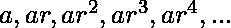
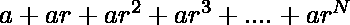
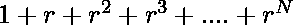
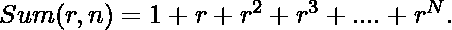
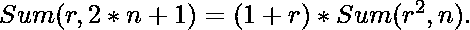
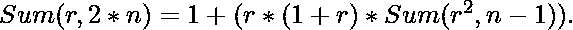

# N |集合 2 的较大值的几何级数的 N 项之和(使用递归)

> 原文:[https://www . geeksforgeeks . org/n 项之和-几何级数-较大值-n-集合-2-使用递归/](https://www.geeksforgeeks.org/sum-of-n-terms-of-geometric-progression-for-larger-values-of-n-set-2-using-recursion/)

几何级数是连续项之间具有恒定比率的级数。级数的第一项用 **a** 表示，公比用 **r** 表示。系列看起来是这样的:- 
任务是找到这样一个系列的和，mod **M** 。

**示例:**

```
Input:  a = 1, r = 2, N = 10000, M = 10000
Output:  8751

Input:  a = 1, r = 4, N = 10000, M = 100000
Output:  12501 
```

**进场:**

1.  求级数的和我们可以很容易地把 a 作为公因式，求的和，然后和 a 相乘。
2.  求上述级数和的步骤。
    *   这里可以解析为:
        ![[1 + r + r^2 + r^3 + . . . + r^(2*n+1)] = (1+r)*(1 + (r^2) + (r^2)^2 + (r^2)^3 + . . . + (r^2)^n)  ](img/17f97b33968ce03806357dc563d3343f.png "Rendered by QuickLaTeX.com")

> 如果我们表示，
> ，那么，
> 和，
> 
> 这将作为我们的递归情况。

*   基本情况是:

```
Sum(r, 0) = 1.
Sum(r, 1) = 1 + r.
```

下面是上述方法的实现。

## C++

```
// C++ implementation to
// illustrate the program
#include <iostream>
using namespace std;

// Function to calculate the sum
// recursively
int SumGPUtil(long long int r,
              long long int n,
              long long int m)
{

    // Base cases
    if (n == 0)
        return 1;
    if (n == 1)
        return (1 + r) % m;

    long long int ans;
    // If n is odd
    if (n % 2 == 1)
    {
        ans = (1 + r) *
              SumGPUtil((r * r) % m,
                        (n - 1) / 2, m);
    }
    else
    {

        // If n is even
        ans = 1 + (r * (1 + r) *
             SumGPUtil((r * r) % m,
                       (n / 2) - 1, m));
    }
    return (ans % m);
}

// Function to print the value of Sum
void SumGP(long long int a,
           long long int r,
           long long int N,
           long long int M)
{
    long long int answer;

    answer = a * SumGPUtil(r, N, M);
    answer = answer % M;

    cout << answer << endl;
}

// Driver Code
int main()
{

    // First element
    long long int a = 1;

    // Common difference
    long long int r = 4;

    // Number of elements
    long long int N = 10000;

    // Mod value
    long long int M = 100000;

    SumGP(a, r, N, M);

    return 0;
}

// This code is contributed by sanjoy_62
```

## Java 语言(一种计算机语言，尤用于创建网站)

```
// Java implementation to
// illustrate the program
import java.io.*;

class GFG{

// Function to calculate the sum
// recursively
static long SumGPUtil(long r, long n,
                      long m)
{

    // Base cases
    if (n == 0)
        return 1;
    if (n == 1)
        return (1 + r) % m;

    long ans;

    // If n is odd
    if (n % 2 == 1)
    {
        ans = (1 + r) *
              SumGPUtil((r * r) % m,
                        (n - 1) / 2, m);
    }
    else
    {
        // If n is even
        ans = 1 + (r * (1 + r) *
             SumGPUtil((r * r) % m,
                       (n / 2) - 1, m));
    }

    return (ans % m);
}

// Function to prlong the value of Sum
static void SumGP(long a, long r,
                  long N, long M)
{
    long answer;
    answer = a * SumGPUtil(r, N, M);
    answer = answer % M;

    System.out.println(answer);
}

// Driver Code
public static void main (String[] args)
{

    // First element
    long a = 1;

    // Common difference
    long r = 4;

    // Number of elements
    long N = 10000;

    // Mod value
    long M = 100000;

    SumGP(a, r, N, M);
}
}

// This code is contributed by sanjoy_62
```

## 蟒蛇 3

```
# Python3 implementation to illustrate the program

# Function to calculate the sum
# recursively
def SumGPUtil (r, n, m):

    # Base cases
    if n == 0: return 1
    if n == 1: return (1 + r) % m

    # If n is odd
    if n % 2 == 1:
        ans = (1 + r) * SumGPUtil(r * r % m,
                                  (n - 1)//2,
                                  m)
    else:
        #If n is even
        ans = 1 + r * (1 + r) * SumGPUtil(r * r % m,
                                          n//2 - 1,
                                          m)

    return ans % m

# Function to print the value of Sum
def SumGP (a, r, N, M):

    answer = a * SumGPUtil(r, N, M)
    answer = answer % M
    print(answer)

#Driver Program
if __name__== '__main__':

    a = 1 # first element
    r = 4 # common difference
    N = 10000 # Number of elements
    M = 100000 # Mod value

    SumGP(a, r, N, M)
```

## C#

```
// C# implementation to
// illustrate the program
using System;

class GFG{

// Function to calculate the sum
// recursively
static long SumGPUtil(long r, long n,
                      long m)
{

    // Base cases
    if (n == 0)
        return 1;
    if (n == 1)
        return (1 + r) % m;

    long ans;

    // If n is odd
    if (n % 2 == 1)
    {
        ans = (1 + r) *
              SumGPUtil((r * r) % m,
                        (n - 1) / 2, m);
    }
    else
    {

        // If n is even
        ans = 1 + (r * (1 + r) *
             SumGPUtil((r * r) % m,
                       (n / 2) - 1, m));
    }
    return (ans % m);
}

// Function to prlong the value of Sum
static void SumGP(long a, long r,
                  long N, long M)
{
    long answer;
    answer = a * SumGPUtil(r, N, M);
    answer = answer % M;

    Console.WriteLine(answer);
}

// Driver Code
public static void Main()
{

    // First element
    long a = 1;

    // Common difference
    long r = 4;

    // Number of elements
    long N = 10000;

    // Mod value
    long M = 100000;

    SumGP(a, r, N, M);
}
}

// This code is contributed by sanjoy_62
```

## java 描述语言

```
<script>

// Javascript implementation to
// illustrate the program

// Function to calculate the sum
// recursively
function SumGPUtil(r, n, m)
{

    // Base cases
    if (n == 0)
        return 1;
    if (n == 1)
        return (1 + r) % m;

    let ans;

    // If n is odd
    if (n % 2 == 1)
    {
        ans = (1 + r) *
              SumGPUtil((r * r) % m,
                        (n - 1) / 2, m);
    }
    else
    {
        // If n is even
        ans = 1 + (r * (1 + r) *
             SumGPUtil((r * r) % m,
                       (n / 2) - 1, m));
    }

    return (ans % m);
}

// Function to prlet the value of Sum
function SumGP(a, r, N, M)
{
    let answer;
    answer = a * SumGPUtil(r, N, M);
    answer = answer % M;

    document.write(answer);
}

// Driver Code

    // First element
    let a = 1;

    // Common difference
    let r = 4;

    // Number of elements
    let N = 10000;

    // Mod value
    let M = 100000;

    SumGP(a, r, N, M);

</script>
```

**Output:** 

```
12501
```

**时间复杂度:** O(对数 N)

**辅助空间:** O(1)